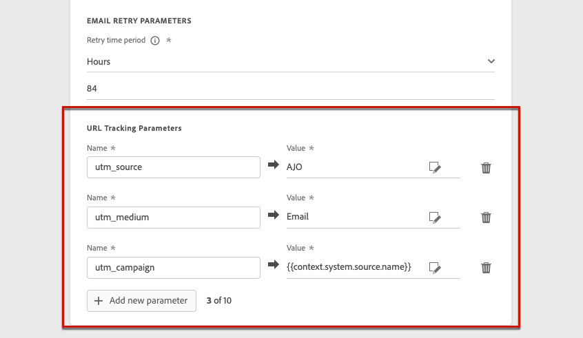

# 建立訊息預設集 {#message-presets-creation}

與 [!DNL Journey Optimizer]，您可以設定消息預設，這些預設定義電子郵件和推送通知消息所需的所有技術參數：電子郵件類型、發件人電子郵件和姓名、移動應用等。

>[!CAUTION]
>
> * 消息預設配置限制為 [旅程管理員](../administration/ootb-product-profiles.md#journey-administrator)。 要建立、編輯和刪除消息預設，必須具有 [管理郵件預設](../administration/high-low-permissions.md#manage-message-presets)。
>
> * 必須執行 [電子郵件配置](#configure-email-settings) 和 [推送配置](../configuration/push-configuration.md) 建立消息預設之前的步驟。

一旦配置了消息預設，您將能夠在從 **[!UICONTROL Presets]** 清單框。

➡️ [瞭解如何在此視頻中建立和使用電子郵件預設](#video-presets)

## 建立消息預設 {#create-message-preset}

要建立消息預設，請執行以下步驟：

1. 訪問 **[!UICONTROL Channels]** > **[!UICONTROL Branding]** > **[!UICONTROL Message presets]** 菜單，然後按一下 **[!UICONTROL Create Message preset]**。

   

1. 輸入預設的名稱和說明（可選），然後選擇要配置的通道。

   

   >[!NOTE]
   >
   > 名稱必須以字母(A-Z)開頭。 它只能包含字母數字字元。 您還可以使用下划線 `_`，點`.` 連字元 `-` 字元。

1. 配置 **電子郵件** 的子菜單。 [了解更多](#configure-email-settings)

1. 配置 **推送通知** 的子菜單。 [了解更多](#configure-push-settings)

   <!--Configure SMS settings. [Learn more](#configure-sms-settings) -->

1. 配置完所有參數後，按一下 **[!UICONTROL Submit]** 確認。 您也可以將消息預設保存為草稿，並稍後恢復其配置。

   

1. 建立消息預設後，它將顯示在清單中 **[!UICONTROL Processing]** 狀態。

   在此步驟中，將執行多項檢查，以驗證是否已正確配置了該步驟。 處理時間在 **48小時–72小時**，並且 **7-10個工作日**。

   這些檢查包括由Adobe團隊執行的配置和技術test:

   * SPF驗證
   * DKIM驗證
   * MX記錄驗證
   * 檢查IP密碼清單
   * Helo主機檢查
   * IP池驗證
   * A/PTR記錄， t/m/res子域驗證

   >[!NOTE]
   >
   >如果檢查不成功，請詳細瞭解中可能的失敗原因 [此部分](#monitor-message-presets)。

1. 檢查成功後，消息預設將獲取 **[!UICONTROL Active]** 狀態。 它已準備好用於傳遞消息。

   

## 配置電子郵件設定 {#configure-email-settings}

電子郵件設定在消息預設配置的專用部分中定義。

按如下所述配置設定。

### 電子郵件類型{#email-type}

在 **電子郵件類型** 部分，選擇將使用預設發送的消息類型： **營銷** 或 **事務性**。

* 選擇 **營銷** 對於促銷消息：這些消息需要用戶同意。

* 選擇 **事務性** 非商業消息（例如，訂單確認、密碼重置通知或傳遞資訊）。

當 [建立消息](../messages/get-started-content.md#create-new-message)，必須為所選類別和頻道選擇有效的消息預設。

>[!CAUTION]
>
>**事務性** 消息可以發送到從營銷通信中取消訂閱的配置檔案。 這些消息只能在特定上下文中發送。

### 子域和IP池 {#subdomains-and-ip-pools}

在 **子域和IP池詳細資訊** ，您必須：

1. 選擇要用於發送電子郵件的子域。 [了解更多](about-subdomain-delegation.md)

1. 選擇要與預設關聯的IP池。 [了解更多](ip-pools.md)

### 清單 — 取消訂閱 {#list-unsubscribe}

在 [選擇子域](#subdomains-and-ip-pools) 清單中， **[!UICONTROL Enable List-Unsubscribe]** 按鈕。

依預設，會啟用此選項。

如果保持啟用狀態，則取消訂閱連結將自動包含在電子郵件標題中，例如：

如果禁用此選項，則電子郵件標題中不會顯示取消訂閱連結。

取消訂閱連結包含兩個元素：

* 安 **取消訂閱電子郵件地址**，所有取消訂閱請求都發送到。

   在 [!DNL Journey Optimizer]，取消訂閱電子郵件地址是 **[!UICONTROL Mailto (unsubscribe)]** 在消息預設中顯示的地址，基於 [選定子域](#subdomains-and-ip-pools)。

   

* 的 **取消訂閱URL**，即登錄頁的URL，在取消訂閱後將重定向用戶。

   如果添加 [按一下選擇退出連結](../messages/consent.md#one-click-opt-out) 對於使用此預設建立的消息，取消訂閱URL將是為一次按一下選擇退出連結定義的URL。

   

   >[!NOTE]
   >
   >如果您不在消息內容中添加一鍵退出選項連結，則不會向用戶顯示登錄頁。

瞭解有關將標題取消訂閱連結添加到郵件的詳細資訊 [此部分](../messages/consent.md#unsubscribe-header)。

<!--Select the **[!UICONTROL Custom List-Unsubscribe]** option to enter your own Unsubscribe URL and/or your own Unsubscribe email address.(to add later)-->

### URL跟蹤{#url-tracking}

要確定人員按一下連結的位置和原因，可以在中添加UTM參數以跟蹤URL  **[!UICONTROL URL TRACKING CONFIGURATION (web analytics)]** 的子菜單。

根據您定義的參數，UTM代碼將應用到消息內容中包含的URL的末尾。 然後，您將能夠在Web分析工具(如Google Analytics)中比較結果。

預設情況下，有三個UTM參數可用。 最多可以添加10個跟蹤參數。 要添加UTM參數，請選擇 **[!UICONTROL Add new UTM param]** 按鈕

要配置UTM參數，可以在 **[!UICONTROL Name]** 和 **[!UICONTROL Value]** ，或導航到以下對象從預定義值清單中進行選擇：

* 行程屬性：源ID、源名稱、源版本ID
* 消息屬性：操作ID，操作名稱
* Offer decisioning屬性：優惠ID，優惠名稱

>[!CAUTION]
>
>不選擇資料夾：確保瀏覽到必要的資料夾，並選擇要用作UTM值的配置檔案屬性。

### 標題參數{#email-header}

在 **[!UICONTROL HEADER PARAMETERS]** 部分，輸入與使用該預設發送的郵件類型關聯的發件人姓名和電子郵件地址。

>[!CAUTION]
>
>電子郵件地址必須使用當前選定的 [委託子域](about-subdomain-delegation.md)。

* **[!UICONTROL Sender name]**:發件人的名稱，如您的品牌名稱。

* **[!UICONTROL Sender email]**:要用於通信的電子郵件地址。 例如，如果委派的子域是 *營銷.luma.com*，您可以使用 *contact@marketing.luma.com*。

* **[!UICONTROL Reply to (name)]**:收件人按一下 **答復** 按鈕。

* **[!UICONTROL Reply to (email)]**:收件人按一下 **答復** 按鈕。 必須使用在委派子域上定義的地址(例如， *reply@marketing.luma.com*)，否則將刪除電子郵件。

* **[!UICONTROL Error email]**:ISP在發送數天郵件（非同步綁定）後生成的所有錯誤都會在此地址上接收。

>[!NOTE]
>
>地址必須以字母(A-Z)開頭，並且只能包含字母數字字元。 您還可以使用下划線 `_`，點`.` 連字元 `-` 字元。

### 電子郵件重試參數{#email-retry}

您可以配置 **電子郵件重試參數**。

預設情況下， [重試時間](retries.md#retry-duration) 設定為84小時，但您可以調整此設定以更好地滿足您的需要。

必須在以下範圍內輸入整數值（以小時或分鐘為單位）:

* 對於市場營銷電子郵件，最短重試時間為6小時。
* 對於事務性電子郵件，最短重試時間為10分鐘。
* 對於這兩種電子郵件類型，最大重試時間為84小時（或5040分鐘）。

## 配置推送設定 {#configure-push-settings}

推送設定在消息預設配置的專用部分中定義。

要定義與消息預設關聯的推送設定，請執行以下步驟：

1. 至少選擇一個平台： **iOS** 和/或 **安卓**。

1. 選擇要用於每個平台的移動應用程式。

有關如何配置環境以發送推送通知的詳細資訊，請參閱 [此部分](../configuration/push-gs.md)。

<!--
## Configure SMS settings {#configure-sms-settings}

1. Select the **[!UICONTROL SMS Type]** that will be sent with the preset: **[!UICONTROL Transactional]** or **[!UICONTROL Marketing]**.

    
    
1. Select the **[!UICONTROL SMS configuration]** to associate with the preset.
        
    For more on how to configure your environment to send SMS messages, refer to [this section](sms-configuration.md).

1. Enter the **[!UICONTROL Sender number]** ​you want to use for your communications.
-->

## 監視消息預設 {#monitor-message-presets}

所有郵件預設都顯示在 **[!UICONTROL Channels]** > **[!UICONTROL Message presets]** 的子菜單。 篩選器可幫助您瀏覽清單（通道類型、用戶、狀態）。

建立消息預設後，可以具有以下狀態：

* **[!UICONTROL Draft]**:消息預設已保存為草稿，但尚未提交。 開啟它以恢復配置。
* **[!UICONTROL Processing]**:消息預設已提交，正在執行幾個驗證步驟。
* **[!UICONTROL Active]**:已驗證消息預設，可以選擇該預設以建立消息。
* **[!UICONTROL Failed]**:在消息預設驗證期間，一個或多個檢查失敗。
* **[!UICONTROL Deactivated]**:消息預設被停用。 不能用於建立新郵件。

如果消息預設建立失敗，則下面將介紹每種可能失敗原因的詳細資訊。

如果出現其中一個錯誤，請與 [Adobe客戶關懷](https://helpx.adobe.com/tw/enterprise/admin-guide.html/enterprise/using/support-for-experience-cloud.ug.html){target=&quot;_blank&quot;}以獲取幫助。

* **SPF驗證失敗**:SPF（發件人策略框架）是一種電子郵件身份驗證協定，它允許指定可從給定子域發送電子郵件的授權IP。 SPF驗證失敗意味著SPF記錄中的IP地址與用於向郵箱提供程式發送電子郵件的IP地址不匹配。

* **DKIM驗證失敗**:DKIM(DomainKeys Indifed Mail)允許收件人伺服器驗證所接收的郵件是否由關聯域的正版發件人發送，並且原始郵件的內容在發送過程中未被更改。 DKIM驗證失敗意味著接收郵件伺服器無法驗證郵件內容的真實性及其與發送域的關聯：

* **MX記錄驗證失敗**:MX(Mail eXchange)記錄驗證失敗意味著負責代表給定子域接受入站電子郵件的郵件伺服器配置不正確。

* **可交付性配置失敗**:可交付性配置可能會因以下原因而失敗：
   * 已分配IP的阻止清單
   * 無效 `helo` 名稱
   * 從IP發送的電子郵件，而不是在相應預設的IP池中指定的電子郵件
   * 無法將電子郵件發送到Gmail和Yahoo等主要ISP的收件箱

## 編輯消息預設 {#edit-message-preset}

要編輯消息預設，請執行以下步驟。

>[!NOTE]
>
>無法編輯 **[!UICONTROL Push notification settings]**。 如果僅為推送通知通道配置了消息預設，則不可編輯。

1. 從清單中，按一下消息預設名稱以將其開啟。

   

1. 根據需要編輯其屬性。

   >[!NOTE]
   >
   >如果消息預設具有 **[!UICONTROL Active]** 狀態， **[!UICONTROL Name]**。 **[!UICONTROL Select channel]** 和 **[!UICONTROL Subdomain]** 欄位呈灰色，無法編輯。

1. 按一下 **[!UICONTROL Submit]** 確認更改。

   

   >[!NOTE]
   >
   >您還可以將消息預設保存為草稿，稍後繼續更新。

提交更改後，消息預設將經過與當時的驗證週期類似的驗證週期 [建立預設](#create-message-preset)。

>[!NOTE]
>
>如果僅編輯 **[!UICONTROL Description]**。 **[!UICONTROL Email type]** 和/或 **[!UICONTROL Email retry parameters]** 欄位，更新是即時的。

對於具有 **[!UICONTROL Active]** 狀態，您可以檢查更新的詳細資訊。 若要這麼做：

* 按一下 **[!UICONTROL Recent update]** 表徵圖。

   

* 您還可以在進行更新時從活動消息預設訪問更新詳細資訊。

   

在 **[!UICONTROL Recent update]** 螢幕中，您可以查看更新狀態和請求的更改清單等資訊。

### 更新狀態 {#update-statuses}

消息預設更新可具有以下狀態：

* **[!UICONTROL Processing]**:消息預設更新已提交，正在執行幾個驗證步驟。
* **[!UICONTROL Success]**:已驗證更新的消息預設，並且可以選擇該預設來建立消息。
* **[!UICONTROL Failed]**:在消息預設更新驗證期間，一個或多個檢查失敗。

每種狀態詳見下文。

### 正在處理

將執行多次可傳送性檢查，以驗證預設是否已正確更新。

>[!NOTE]
>
>如果僅編輯 **[!UICONTROL Description]**。 **[!UICONTROL Email type]** 和/或 **[!UICONTROL Email retry parameters]** 欄位，更新是即時的。

處理時間在 **48小時–72小時**，並且 **7-10個工作日**。 瞭解有關在驗證週期中執行的檢查的詳細資訊，請參閱 [此部分](#create-message-preset)。

如果編輯已處於活動狀態的預設：

* 其地位仍然 **[!UICONTROL Active]** 正在驗證進程。

* 的 **[!UICONTROL Recent update]** 表徵圖顯示在消息預設清單中預設的名稱旁邊。

* 在驗證過程中，使用此預設配置的消息仍在使用該預設的舊版本。

>[!NOTE]
>
>更新正在進行時，無法修改消息預設。 您仍然可以按一下其名稱，但所有欄位都呈灰色顯示。 在更新成功之前，不會反映更改。

### 成功 {#success}

驗證過程成功後，使用此預設的所有消息中將自動使用新版本的預設。 但是，您可能必須等待：
* 在被統一消息消耗前幾分鐘，
* 直到預設在批消息中生效的下一個批。

### 已失敗 {#failed}

如果驗證過程失敗，則仍將使用預設的舊版本。

瞭解有關中可能的失敗原因的詳細資訊 [此部分](#monitor-message-presets)。

更新失敗時，預設將再次變為可編輯。 您可以按一下其名稱並更新需要修復的設定。

## 停用消息預設 {#deactivate-preset}

要生成 **[!UICONTROL Active]** 消息預設不可用於建立新消息，您可以停用它。 但是，使用此預設的已發佈消息將不受影響，並將繼續工作。

>[!NOTE]
>
>無法在更新正在處理時停用消息預設。 必須等待更新成功或失敗。 瞭解更多 [編輯郵件預設](#edit-message-preset) 在 [更新狀態](#update-statuses)。

1. 訪問消息預設清單。

1. 對於所選的活動預設，按一下 **[!UICONTROL More actions]** 按鈕

1. 選擇「**[!UICONTROL Deactivate]**」。

   

>[!NOTE]
>
>無法刪除停用的郵件預設以避免使用這些預設來發送郵件的行程中的任何問題。

不能直接編輯已停用的消息預設。 但是，您可以複製該副本並編輯該副本，以建立將用於建立新郵件的新版本。 您也可以再次激活它，並等待更新成功編輯它。

## How-to視頻{#video-presets}

瞭解如何建立消息預設、如何使用這些預設以及如何委託子域和建立IP池。

>[!VIDEO](https://video.tv.adobe.com/v/334343?quality=12)
