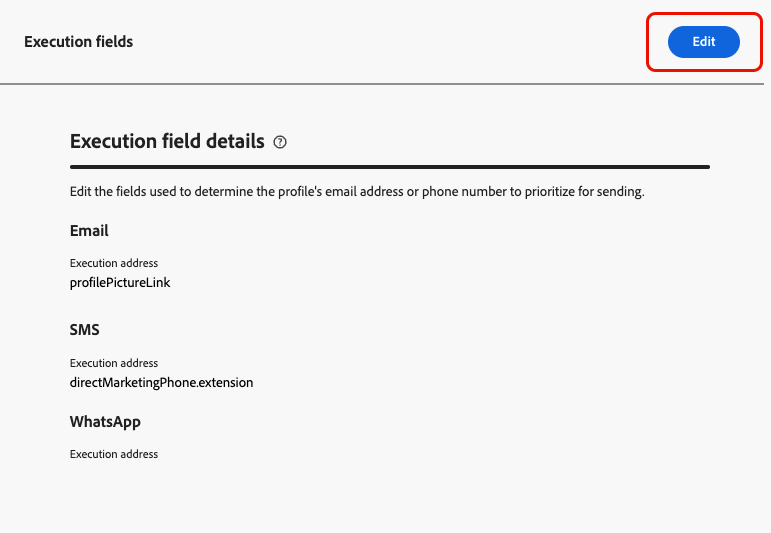
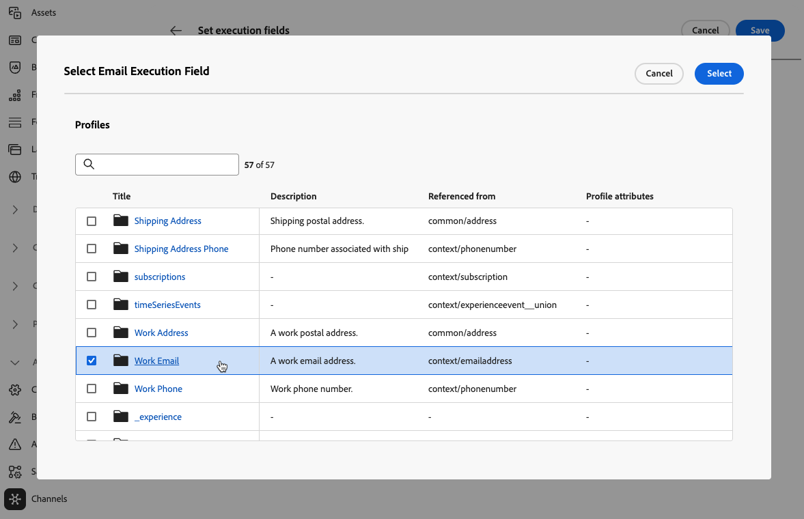
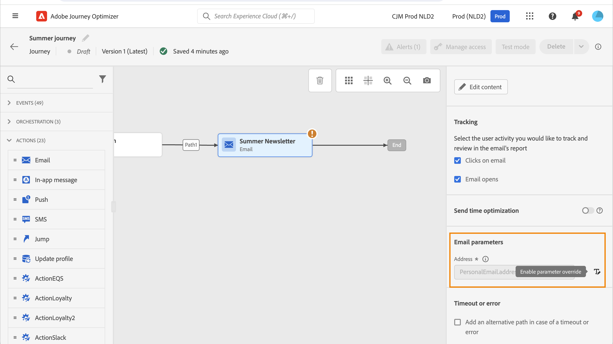
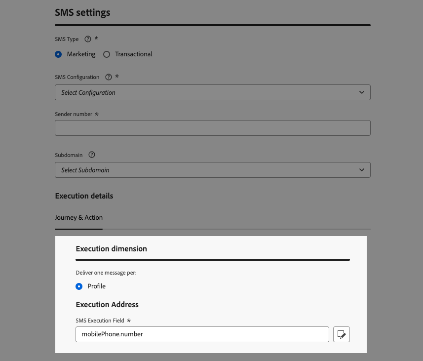
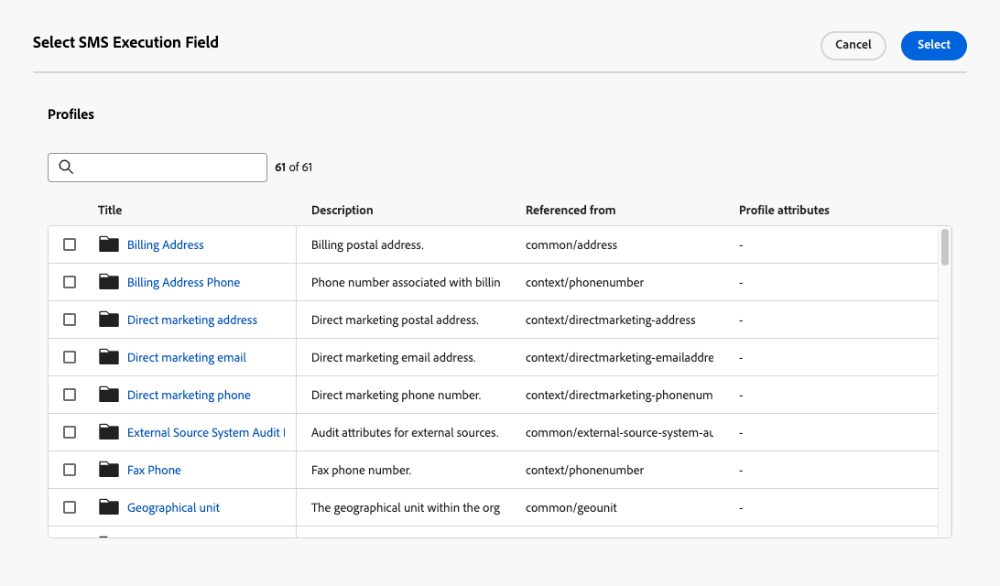

# 管理預設執行欄位 {#change-primary-email}

>[!CONTEXTUALHELP]
>id="ajo_admin_execution_address"
>title="定義要使用的地址"
>abstract="當資料庫 (個人、專業等) 中有多個電子郵件地址或電話號碼時，您可以選擇優先傳送哪一個。"

>[!CONTEXTUALHELP]
>id="ajo_admin_execution_address_header"
>title="定義要使用的地址"
>abstract="編輯用於確定設定檔的電子郵件地址或電話號碼的欄位以優先傳送。"

當您定位設定檔時，資料庫中可能會提供數個電子郵件地址或電話號碼（專業電子郵件地址、個人電話號碼等）。

在這種情況下，[!DNL Journey Optimizer]會使用&#x200B;**[!UICONTROL 執行欄位]**&#x200B;來決定要優先使用設定檔服務中的電子郵件地址或電話號碼。

若要檢查目前預設使用的欄位，請存取&#x200B;**[!UICONTROL 管理]** > **[!UICONTROL 管道]** > **[!UICONTROL 一般設定]** > **[!UICONTROL 執行欄位]**選單。

{width=90%}

>[!NOTE]
>
>電子郵件、簡訊和WhatsApp通道有可用的執行欄位。

目前的值會用於沙箱層級的所有傳送。 您可以視需要更新這些欄位。

在大多數情況下，您將會全域變更執行欄位，並定義用於所有電子郵件、簡訊或WhatsApp訊息的值。

## 更新管理設定 {#admin-settings}

若要在沙箱層級全域變更執行欄位，請遵循下列步驟。

1. 存取&#x200B;**[!UICONTROL 管道]** > **[!UICONTROL 一般設定]** > **[!UICONTROL 執行欄位]**&#x200B;功能表。

1. 按一下&#x200B;**[!UICONTROL 編輯]**&#x200B;以變更預設值。

   {width=70%}

1. 按一下您選取的目前欄位或編輯圖示以選取新欄位。

   {width=70%}

1. 可用的電子郵件型別XDM欄位清單隨即顯示。 選取要使用的欄位。

   {width=90%}

1. 按一下&#x200B;**[!UICONTROL 儲存]**&#x200B;以確認您的選擇。

執行欄位已更新，現在會作為主要地址使用。

<!--1. You can also select an additional field to use as secondary email address. This allows you to determine which field to use if the primary field is empty for a profile. -->

## 覆寫歷程引數中的預設執行欄位 {#override-execution-address-journey}

>[!CONTEXTUALHELP]
>id="ajo_journey_execution_address"
>title="定義自訂值"
>abstract="在某些特定情況下，您可以覆寫預設的執行欄位值。 使用此欄位右側的&#x200B;**啟用引數覆寫**&#x200B;圖示，定義自訂電子郵件地址或電話號碼以排定傳送的優先順序。"

對於特定使用案例，您可以全域覆寫執行欄位設定並在歷程層級定義不同的值。

覆寫此值可能很實用，例如：

* 測試您的傳遞。 您可以新增自己的電子郵件地址或電話號碼：在您發佈歷程後，會傳送電子郵件、簡訊或WhatsApp訊息給您。
* 傳送訊息給清單的訂閱者。 在[此使用案例](../building-journeys/message-to-subscribers-uc.md)中了解更多。

將&#x200B;**[!UICONTROL 電子郵件]**、**[!UICONTROL 簡訊]**&#x200B;或&#x200B;**[!UICONTROL WhatsApp]**&#x200B;動作新增至[歷程](../email/create-email.md#create-email)時，主要電子郵件地址或電話號碼會顯示在歷程進階引數下。

使用欄位右側的&#x200B;**[!UICONTROL 啟用引數覆寫]**&#x200B;圖示覆寫此值。

{width=85%}

>[!CAUTION]
>
>電子郵件地址或電話號碼覆寫僅應用於特定使用案例。 在大多數情況下，您不需要變更它，因為在沙箱層級的&#x200B;**[!UICONTROL 執行欄位]**&#x200B;中定義為主要欄位的值才是應該使用的值。 [了解更多](#change-primary-email)

## 覆寫通道設定中的預設執行欄位 {#override-execution-address-channel-config}

>[!CONTEXTUALHELP]
>id="ajo_email_config_execution_address"
>title="覆寫要使用的預設執行地址"
>abstract="當資料庫中有數個電子郵件地址或電話號碼（個人、專業人員等）時，您可以選擇優先傳送哪一個。 主要地址是在沙箱層級定義，但您可以在此處覆寫此特定通道設定的預設設定。"

您可以變更特定電子郵件、簡訊或WhatsApp [頻道設定](channel-surfaces.md)的預設執行位址。

若要這麼做，請移至&#x200B;**[!UICONTROL 執行維度]**&#x200B;區段，並編輯&#x200B;**[!UICONTROL 執行位址]**&#x200B;下的專用欄位。

>[!NOTE]
>
>對於[WhatsApp管道](../whatsapp/whatsapp-configuration.md#whatsapp-configuration)，**[!UICONTROL WhatsApp執行欄位]**&#x200B;位於&#x200B;**[!UICONTROL WhatsApp設定]**&#x200B;區段下。

{width=85%}

然後，從可用電子郵件型別XDM欄位清單中選取專案。

執行欄位會更新，然後用作使用此管道設定的行銷活動或歷程的主要地址。 它會覆寫在沙箱層級定義的[一般設定](#admin-settings)。

<!--[Learn more on the execution address in the email configuration ](../email/email-settings.md#execution-address)-->
