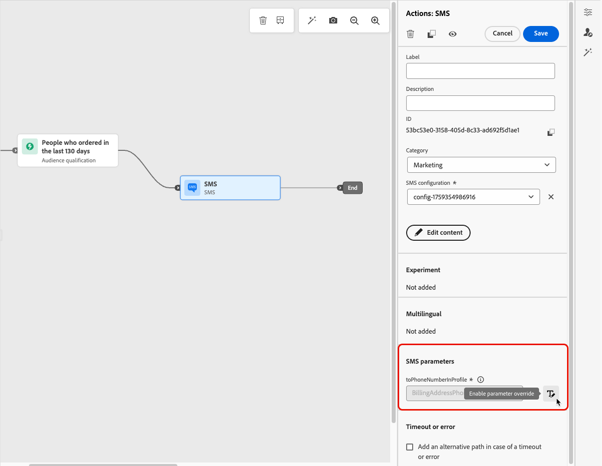

# 更改執行地址 {#change-primary-email}

>[!CONTEXTUALHELP]
>id="ajo_admin_execution_address"
>title="定義要使用的地址"
>abstract="當資料庫 (個人、專業等) 中有多個電子郵件地址或電話號碼時，您可以選擇優先傳送哪一個。"

>[!CONTEXTUALHELP]
>id="ajo_admin_execution_address_header"
>title="定義要使用的地址"
>abstract="編輯用於確定設定檔的電子郵件地址或電話號碼的欄位以優先傳送。"

當您針對配置檔案時，資料庫中可能會有幾個電子郵件地址或電話號碼（專業電子郵件地址、個人電話號碼等）。

那樣的話， [!DNL Journey Optimizer] 使用 **[!UICONTROL 執行欄位]** 確定優先使用配置檔案服務中的電子郵件地址或電話號碼。

要檢查預設情況下當前使用的欄位，請訪問 **[!UICONTROL 管理]** > **[!UICONTROL 頻道]** > **[!UICONTROL 常規]** > **[!UICONTROL 執行欄位]** 的子菜單。

當前值用於沙盒級別上的所有交貨。 如果需要，可以更新這些欄位。

在大多數情況下，您將全局更改執行欄位，並定義應用於所有電子郵件或SMS消息的值。 <!--[Learn how](#admin-settings)-->

<!--In some specific use cases only, you can override the value set globally and define a different value at the journey level. [Learn more](#journey-parameters)-->

## 更新管理設定 {#admin-settings}

要在沙盒級別全局更改執行欄位，請執行以下步驟。

1. 訪問  **[!UICONTROL 頻道]** > **[!UICONTROL 常規]** > **[!UICONTROL 執行欄位]** 的子菜單。

1. 按一下 **[!UICONTROL 編輯]** 的子菜單。

   

1. 按一下所選的當前欄位或編輯表徵圖以選擇新欄位。

   

1. 將顯示可用電子郵件類型XDM欄位的清單。 選擇要使用的欄位。

   

1. 按一下 **[!UICONTROL 保存]** 確認你的選擇。

執行欄位已更新，現在將用作主地址。

<!--1. You can also select an additional field to use as secondary email address. This allows you to determine which field to use if the primary field is empty for a profile. -->

## 覆蓋行程參數中的值 {#journey-parameters}

僅對於特定的使用情形，您可以全局覆蓋執行欄位集並在行程級別定義不同的值，尤其是對於電子郵件通道。

添加 **[!UICONTROL 電子郵件]** 操作 [旅程](../email/create-email.md#create-email-journey-campaign)，主電子郵件地址顯示在行程高級參數下。

在某些特定上下文中，可以使用 **[!UICONTROL 啟用參數覆蓋]** 表徵圖 **[!UICONTROL 地址]** 的子菜單。

>[!CAUTION]
>
>電子郵件地址覆寫僅用於特定使用案例。 在大多數情況下，您不需要變更電子郵件地址，因為&#x200B;**[!UICONTROL 執行欄位]**&#x200B;中定義為主要電子郵件的值才是應該使用的值。 

覆蓋此值可能對以下項目非常有用：

* 測試電子郵件。 您可以添加您自己的電子郵件地址：在您發佈了該旅程後，會向您發送電子郵件。
* 向清單的訂閱者發送電子郵件。 在[此使用案例](../building-journeys/message-to-subscribers-uc.md)中了解更多。
