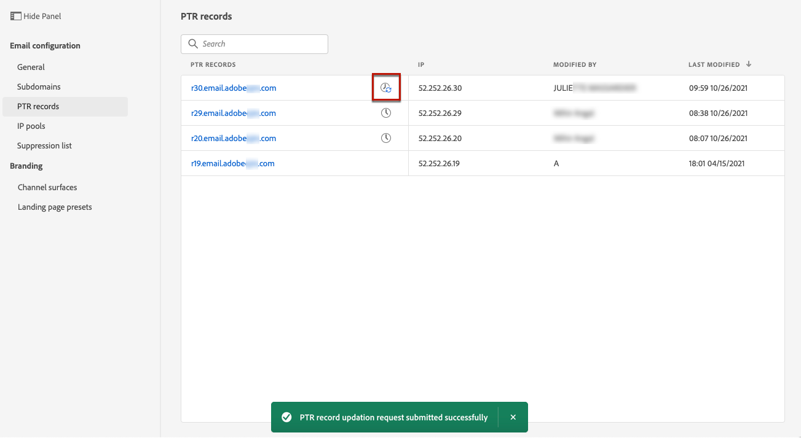

# PTR記錄 {#ptr-records}

>[!CONTEXTUALHELP]
>id="ajo_admin_ptr_record"
>title="子域的PTR記錄"
>abstract="指針記錄(PTR)是一種DNS記錄，它提供連結到IP地址的域名，這有助於接收郵件伺服器驗證發件人的IP地址。 只有在與您的傳遞能力專家進行適當考慮和討論後才編輯PTR記錄。"

>[!CONTEXTUALHELP]
>id="ajo_admin_ptr_record_header"
>title="子域的PTR記錄"
>abstract="將子網域委派給Journey Optimizer中的Adobe後，就會自動建立PTR記錄並與此子網域相關聯。"

## 關於PTR記錄 {#about-ptr-records}

指針記錄(PTR)是一種域名系統(DNS)記錄，它提供連結到IP地址的域名。

使用PTR記錄，接收郵件伺服器可以通過確定其IP地址是否與伺服器所連接的名稱相對應來檢查發送郵件伺服器的真實性。

## 訪問子網域的PTR記錄 {#access-ptr-records}

一次 [委派子網域](delegate-subdomain.md) 在Adobe Journey Optimizer中，會自動建立PTR記錄並與此子網域相關聯。 您可以從 **[!UICONTROL 管理]** > **[!UICONTROL 管道]** > **[!UICONTROL 電子郵件設定]** > **[!UICONTROL PTR記錄]** 功能表。

該清單使用以下語法顯示為每個委派子域生成的PTR記錄：

* 「r」表示記錄，
* 「xx」表示IP地址的最後兩個數字，
* 子網域名稱。

您可以從清單中開啟PTR記錄，以顯示關聯的子域名和IP地址。

## 編輯PTR記錄 {#edit-ptr-record}

您可以修改PTR記錄以編輯與IP地址關聯的子域。

>[!CAUTION]
>
>PTR記錄對所有環境都是常見的。 因此，對PTR記錄的任何修改也會影響生產沙箱。
>
>編輯PTR記錄時請格外小心。 如有疑問，請聯絡傳遞能力專家。

### 完全委派的子網域 {#fully-delegated-subdomains}

要編輯具有以下子域的PTR記錄： [完全授權](delegate-subdomain.md#full-subdomain-delegation) 若要Adobe，請遵循下列步驟。

1. 從清單中，按一下PTR記錄名以開啟它。

   

1. 選取子網域 [完全授權](delegate-subdomain.md#full-subdomain-delegation) Adobe。

   

1. 按一下 **[!UICONTROL 儲存]** 確認變更。

>[!NOTE]
>
>您無法修改 **[!UICONTROL IP]** 和 **[!UICONTROL PTR記錄]** 欄位。

### 使用CNAME方法委派的子網域 {#edit-ptr-subdomains-cname}

要使用委派給Adobe的子域編輯PTR記錄，請使用 [CNAME方法](delegate-subdomain.md#cname-subdomain-delegation)，請遵循下列步驟。

1. 從清單中，按一下PTR記錄名以開啟它。

   

1. 選取委派給Adobe的子網域，使用 [CNAME方法](delegate-subdomain.md#cname-subdomain-delegation) 從清單中。

   

1. 您需要在托管平台上建立新的轉送DNS記錄。 要執行此操作，請複製由Adobe產生的記錄。 完成後，核取「I confirm...」方塊。

   

   >[!NOTE]
   >
   >如果您收到以下訊息：「請先建立轉發DNS，然後重試」，請執行以下步驟：
   >   * 如果已成功建立轉發DNS記錄，請檢查DNS提供程式。
   >   * 跨DNS的記錄可能不會立即同步。 請等待幾分鐘，然後重試。

1. 按一下 **[!UICONTROL 儲存]** 確認變更。

>[!NOTE]
>
>您無法修改 **[!UICONTROL IP]** 和 **[!UICONTROL PTR記錄]** 欄位。

## 檢查PTR記錄更新詳細資訊 {#check-ptr-record-update}

確認PTR記錄編輯後， **[!UICONTROL 處理]** 表徵圖顯示在清單中PTR記錄的名稱旁。

>[!NOTE]
>
>此 [更新處理](#processing) 最多需要3小時。

要檢查PTR記錄更新詳細資訊，請按一下其旁邊的表徵圖。 深入了解與 [本節](#ptr-record-update-statuses).

您可以查看更新狀態和請求的更改等資訊。

## PTR記錄更新狀態 {#ptr-record-update-statuses}

PTR記錄更新可以具有以下狀態：

*  **[!UICONTROL 處理]**:PTR記錄更新已提交，正在進行驗證過程。
*  **[!UICONTROL 成功]**:已驗證更新的PTR記錄，並且新子域現在與IP地址關聯。
*  **[!UICONTROL 失敗]**:在PTR記錄更新驗證期間，一個或多個檢查失敗。

### 正在處理 {#processing}

將執行數項傳遞能力檢查，以確認要與IP位址關聯的新子網域是否有效。 最多需要3小時。

>[!NOTE]
>
>在進行更新時無法修改PTR記錄。 您仍可按一下其名稱，但 **[!UICONTROL 子網域]** 欄位會呈現灰色。 更新成功前，不會反映變更。

在驗證程式期間，舊的子網域仍與IP位址相關聯。

### 成功 {#success}

驗證程式一旦成功，新子網域就會自動與IP位址相關聯。

### 已失敗 {#failes}

如果驗證過程失敗，則顯示較舊的PTR記錄。 先前與IP位址相關聯的有效子網域維持不變。

可能的更新錯誤類型如下：
* 無法為PTR記錄建立新的轉發DNS
* 無法更新記錄
* 無法重新將相關性上線

更新失敗時，PTR記錄將重新變為可編輯。 您可以按一下其名稱，然後再次更新子網域。
