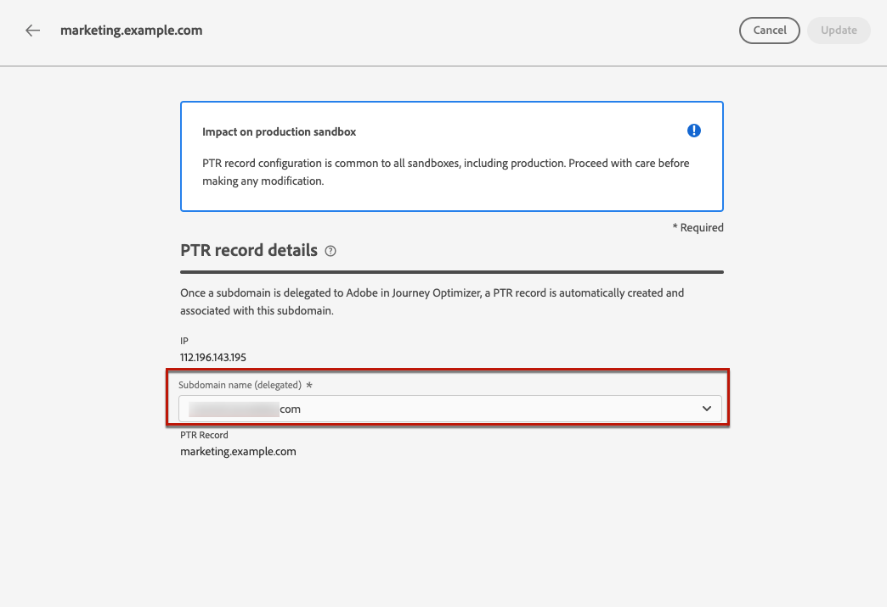

# 建立並編輯 PTR 記錄 {#ptr-records}

>[!CONTEXTUALHELP]
>id="ajo_admin_ptr_record"
>title="子網域的 PTR 記錄"
>abstract="指標記錄 (PTR) 是一種 DNS 記錄，會提供連結至 IP 位址的域名，可協助接收郵件伺服器驗證寄件者的 IP 位址。只有在和您的傳遞能力專家完成適當考量和討論後，才能編輯 PTR 記錄。"

>[!CONTEXTUALHELP]
>id="ajo_admin_ptr_record_header"
>title="子網域的 PTR 記錄"
>abstract="在 Journey Optimizer 中將第一個子網域委派給 Adobe 後，系統會自動建立 PTR 記錄。"

## 關於 PTR 記錄 {#about-ptr-records}

指標記錄 (PTR) 是一種網域名稱系統 (DNS) 記錄，其提供連結至 IP 位址的網域名稱。

透過 PTR 記錄，接收郵件伺服器可透過識別其 IP 位址是否與伺服器連線的名稱相對應，來檢查傳送郵件伺服器的真確性。

## 存取子網域的 PTR 記錄 {#access-ptr-records}

在您[委派](delegate-subdomain.md)您的第一個子網域至[!DNL Journey Optimizer]中的Adobe後，系統就會自動為您的IP建立PTR記錄。 您可以從&#x200B;**[!UICONTROL 管理]** > **[!UICONTROL 管道]** > **[!UICONTROL 電子郵件設定]** > **[!UICONTROL PTR記錄]**&#x200B;功能表存取它們。

此清單顯示使用下列語法產生的PTR記錄：

* 「r」代表記錄，
* 「xx」代表 IP 位址的最後兩個數字，
* 子網域名稱。

您可以開啟清單中的 PTR 記錄，以顯示相關聯的子網域名稱和 IP 位址。

## 編輯 PTR 記錄 {#edit-ptr-record}

在[!DNL Journey Optimizer]中，您無法手動建立PTR記錄。 而是在您[委派](delegate-subdomain.md)您的第一個子網域至Adobe後，系統就會自動為您的IP建立PTR記錄。

您的每個IP都會接收單一PTR記錄。 所有PTR記錄都有以下格式： &#39;rxx.subdomain&#39;，其中&#39;subdomain&#39;是您在[!DNL Journey Optimizer]中委派的第一個子網域。

當您建立其他子網域時，需要修改一或多個PTR記錄，並將新子網域指派給它們。 若要執行此操作，請遵循下列步驟。

>[!CAUTION]
>
>PTR 記錄在所有環境中都是通用的。 因此，對 PTR 記錄所做的任何修改也會影響生產沙箱。
>
>編輯 PTR 記錄時請格外小心。 如有疑問，請聯絡傳遞能力專家。

### 完全委派的子網域 {#fully-delegated-subdomains}

若要編輯子網域[已完全委派](delegate-subdomain.md#set-up-subdomain)給 Adobe 的 PTR 記錄，請依照下列步驟操作。

1. 按一下清單中的 PTR 記錄名稱來加以開啟。

   

1. 從清單中選取[已完全委派](delegate-subdomain.md#set-up-subdomain)給 Adobe 的子網域。

   

1. 按一下&#x200B;**[!UICONTROL 儲存]**，以確認您所做的變更。

>[!NOTE]
>
>您無法修改 **[!UICONTROL IP]** 和 **[!UICONTROL PTR 記錄]**&#x200B;欄位。

### 使用 CNAME 方法委派的子網域 {#edit-ptr-subdomains-cname}

若要使用 [CNAME 方法](delegate-subdomain.md#cname-subdomain-setup)，編輯子網域已委派給 Adobe 的 PTR 記錄，請依照下列步驟操作。

1. 按一下清單中的 PTR 記錄名稱來加以開啟。

   

1. 使用 [CNAME 方法](delegate-subdomain.md#cname-subdomain-setup)，從清單中選取已委派給 Adobe 的子網域。

   

1. 您需要在託管平台上建立新的轉寄 DNS 記錄。 若要執行此操作，請複製 Adobe 產生的記錄。 完成後，核取「我確認...」方塊。

   

   >[!NOTE]
   >
   >如果您收到下列訊息：「請先建立轉寄 DNS，然後再試一次」，請依照下列步驟操作：
   >   * 如果成功建立轉寄 DNS 記錄，請檢查 DNS 提供者。
   >   * 跨 DNS 的記錄可能不會立即同步。 請等待幾分鐘，然後再試一次。

1. 按一下&#x200B;**[!UICONTROL 儲存]**，以確認您所做的變更。

>[!NOTE]
>
>您無法修改 **[!UICONTROL IP]** 和 **[!UICONTROL PTR 記錄]**&#x200B;欄位。

## 檢查 PTR 記錄更新詳細資料 {#check-ptr-record-update}

確認 PTR 記錄編輯後，**[!UICONTROL 正在處理]**&#x200B;圖示會顯示在清單中 PTR 記錄的名稱旁。

>[!NOTE]
>
>此[更新處理](#processing)最多可能需要 3 小時的時間。

若要檢查 PTR 記錄更新詳細資料，請按一下其旁邊的圖示。 在[本節](#ptr-record-update-statuses)中進一步瞭解與不同圖示相關聯的狀態。

您可以查看更新狀態和請求的變更等資訊。

## PTR 記錄更新狀態 {#ptr-record-update-statuses}

PTR 記錄更新可以有下列狀態：

*  **[!UICONTROL 正在處理]**：PTR 記錄更新已提交，並正在進行驗證程序。
*  **[!UICONTROL 成功]**：更新的 PTR 記錄已經過驗證，新的子網域現已與 IP 位址相關聯。
*  **[!UICONTROL 失敗]**：在 PTR 記錄更新驗證期間，有一或多個檢查失敗。

### 正在處理 {#processing}

系統將會執行數個傳遞能力檢查，以確認要與 IP 位址建立關聯的新子網域是否有效。 這最多可能需要 3 小時的時間。

>[!NOTE]
>
>進行更新時，您無法修改 PTR 記錄。 您仍然可以按一下其名稱，但是&#x200B;**[!UICONTROL 子網域]**&#x200B;欄位會呈現灰色。 更新成功後才會反映變更。

在驗證程序期間，舊的子網域仍會與 IP 位址相關聯。

### 成功 {#success}

驗證程序成功後，新的子網域會自動與 IP 位址建立關聯。

### 失敗 {#failes}

如果驗證程序失敗，則會顯示舊的 PTR 記錄。 先前與 IP 位址相關聯的有效子網域則維持不變。

可能的更新錯誤類型如下：

* 無法為 PTR 記錄建立新的轉寄 DNS
* 無法更新記錄
* 相似性無法重新上線

更新失敗時，PTR 記錄會再次變為可編輯。 您可以按一下其名稱，然後再次更新子網域。
