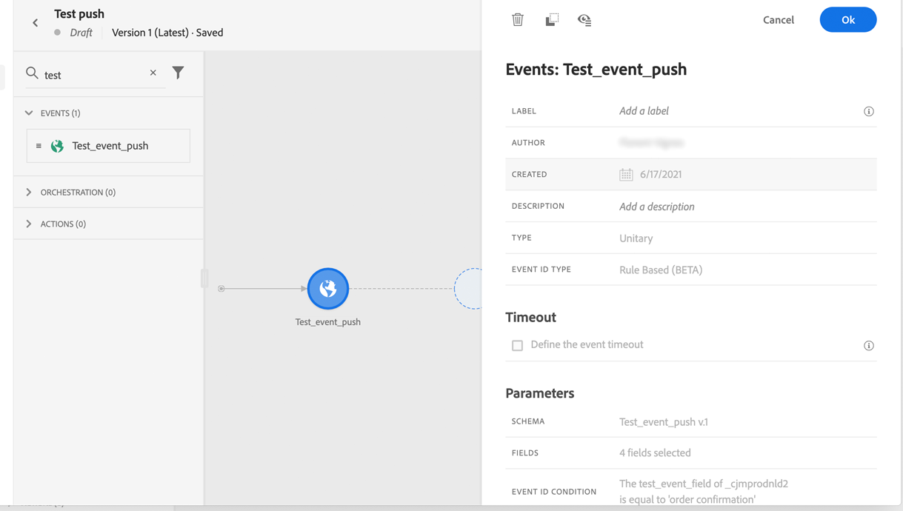
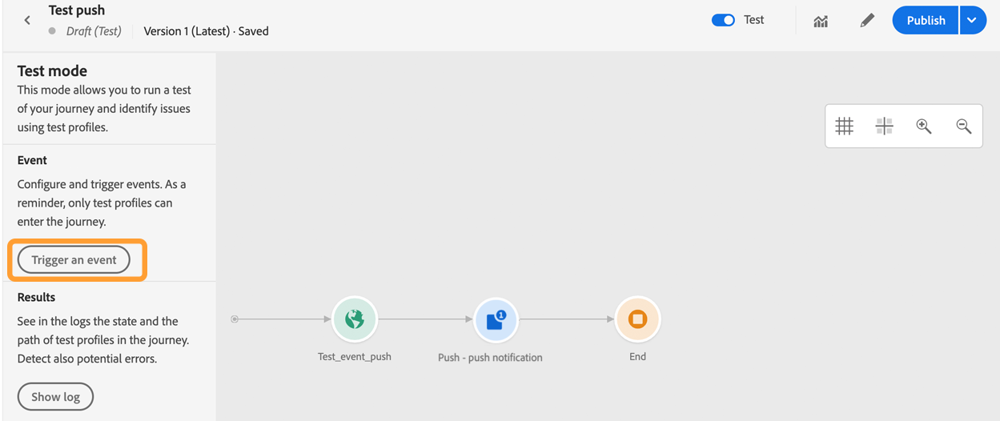

# 設定推播通知頻道 {#push-notification-configuration}

[!DNL Journey Optimizer] 允許您建立行程並向目標受眾發送消息。 開始發送推送通知之前 [!DNL Journey Optimizer]您需要確保移動應用上和Adobe Experience Platform的標籤上有配置和整合。 要瞭解中的推送通知資料流 [!DNL Adobe Journey Optimizer] 請參閱 [此頁](push-gs.md)。

## 開始之前 {#before-starting}

<!--
### Check provisioning

Your Adobe Experience Platform account must be provisioned to contain following schemas and datasets for push notification data flow to function correctly:

| Schema <br>Dataset                                                                       | Group of fields                                                                                                                                                                         | Operation                                                |
| -------------------------------------------------------------------------------------- | --------------------------------------------------------------------------------------------------------------------------------------------------------------------------------------- | -------------------------------------------------------- |
| CJM Push Profile Schema <br>CJM Push Profile Dataset                                     | Push Notification Details<br>Adobe CJM ExperienceEvent - Message Profile Details<br>Adobe CJM ExperienceEvent - Message Execution Details<br>Application Details<br>Environment Details | Register Push Token                                      |
| CJM Push Tracking Experience Event Schema<br>CJM Push Tracking Experience Event Dataset | Push Notification Tracking                                                                                                                                                              | Track interactions and provide data for the reporting UI |
-->

### 設定權限 {#setup-permissions}

在建立移動應用程式之前，首先需要確保您在Adobe Experience Platform擁有或分配了正確的標籤用戶權限。 瞭解詳情 [標籤文檔](https://experienceleague.adobe.com/docs/experience-platform/tags/admin/user-permissions.html){target=&quot;_blank&quot;}。

>[!CAUTION]
>
>推送配置必須由專家用戶執行。 根據您的實施模式和參與此實施的人員，您可能需要將完整權限集分配給單個產品配置檔案，或在應用程式開發人員與 **Adobe Journey Optimizer** 管理員。 瞭解有關 **標籤** 權限 [本文檔](https://experienceleague.adobe.com/docs/experience-platform/tags/admin/user-permissions.html#platform-launch-permissions){target=&quot;_blank&quot;}。

<!--ou need to your have access to perform following roles :

* Manage Datastreams
* Manage Client-side Properties
* Manage App Configurations
-->

分配 **屬性** 和 **公司** ，請執行以下步驟：

1. 訪問 **[!DNL Admin Console]**。

1. 從 **[!UICONTROL Products]** 頁籤 **[!UICONTROL Adobe Experience Platform Launch]** 卡。

   

1. 選擇現有 **[!UICONTROL Product Profile]** 或用 **[!UICONTROL New profile]** 按鈕 瞭解如何建立新 **[!UICONTROL New profile]** 的 [管理控制台文檔](https://experienceleague.adobe.com/docs/experience-platform/access-control/ui/create-profile.html#ui){target=&quot;_blank&quot;}。

1. 在&#x200B;**[!UICONTROL Permissions]**&#x200B;索引標籤中，選取&#x200B;**[!UICONTROL Property rights]**。

   

1. 按一下「**[!UICONTROL Add all]**」。這將在您的產品配置檔案中添加以下權限：
   * **[!UICONTROL Approve]**
   * **[!UICONTROL Develop]**
   * **[!UICONTROL Manage Environments]**
   * **[!UICONTROL Manage Extensions]**
   * **[!UICONTROL Publish]**

   安裝和發佈Adobe Journey Optimizer擴展以及在Adobe Experience Platform移動SDK中發佈應用屬性需要這些權限。

1. 然後，選擇 **[!UICONTROL Company rights]** 的上界。

   

1. 添加以下權限：

   * **[!UICONTROL Manage App Configurations]**
   * **[!UICONTROL Manage Properties]**

   這些權限是移動應用程式開發人員在中設定推送憑據所必需的 **Adobe體驗啟動** 並在中定義「推送通知」通道曲面（即消息預設） **Adobe Journey Optimizer**。

   

1. 按一下「**[!UICONTROL Save]**」。

分配此 **[!UICONTROL Product profile]** 對於用戶，請執行以下步驟：

1. 訪問 **[!DNL Admin Console]**。

1. 從 **[!UICONTROL Products]** 頁籤 **[!UICONTROL Adobe Experience Platform Launch]** 卡。

1. 選取您先前設定的&#x200B;**[!UICONTROL Product profile]**。

1. 在 **[!UICONTROL Users]** 索引標籤中，按一下 **[!UICONTROL Add user]**。

   

1. 鍵入用戶名或電子郵件地址並選擇用戶。 然後，按一下 **[!UICONTROL Save]**。

   >[!NOTE]
   >
   >如果用戶以前未在管理控制台中建立，請參閱 [添加用戶文檔](https://helpx.adobe.com/enterprise/admin-guide.html/enterprise/using/manage-users-individually.ug.html#add-users)。

   

### 配置你的應用 {#configure-app}

技術設定涉及應用程式開發人員與業務管理員之間的密切合作。 開始發送推送通知之前 [!DNL Journey Optimizer]，您需要在 [!DNL Adobe Experience Platform Data Collection] 並將您的移動應用與Adobe Experience Platform移動軟體開發工具包整合。

按照以下連結中詳述的實施步驟操作：

* 對於 **AppleiOS**:瞭解如何在中的APN中註冊您的應用 [Apple文檔](https://developer.apple.com/documentation/usernotifications/registering_your_app_with_apns){target=&quot;_blank&quot;
* 對於 **Google安卓**:瞭解如何在Android中設定Firebase雲消息客戶端應用 [Google文檔](https://firebase.google.com/docs/cloud-messaging/android/client){target=&quot;_blank&quot;

### 將您的移動應用與Adobe Experience PlatformSDK整合 {#integrate-mobile-app}

Adobe Experience Platform移動SDK通過Android和iOS相容的SDK為您的手機提供客戶端整合API。 關注 [Adobe Experience Platform移動SDK文檔](https://aep-sdks.gitbook.io/docs/getting-started/overview){target=&quot;_blank&quot;}，以在應用中使用Adobe Experience Platform移動SDK進行安裝。

到此結束時，您還應在 [!DNL Adobe Experience Platform Data Collection]。 通常，您會為要管理的每個移動應用程式建立一個移動屬性。 瞭解如何在中建立和配置移動屬性 [Adobe Experience Platform移動SDK文檔](https://aep-sdks.gitbook.io/docs/getting-started/create-a-mobile-property){target=&quot;_blank&quot;}。


## 步驟1:在Adobe Experience Platform資料收集中添加應用推送憑據 {#push-credentials-launch}

授予正確的用戶權限後，您現在需要在 [!DNL Adobe Experience Platform Data Collection]。

需要移動應用推送憑據註冊才能授權Adobe代表您發送推送通知。 請參閱以下詳細步驟：

1. 從 [!DNL Adobe Experience Platform Data Collection]，選擇 **[!UICONTROL App Surfaces]** 的下界。

1. 按一下 **[!UICONTROL Create App Surface]** 的子菜單。

   

1. 輸入 **[!UICONTROL Name]** 的子菜單。

1. 從 **[!UICONTROL Mobile Application Configuration]**，選擇作業系統：

   * **為iOS**

      

      1. 輸入移動應用 **捆綁包ID** 的 **[!UICONTROL App ID (iOS Bundle ID)]** 的子菜單。 在 **常規** 中的 **XCode**。

      1. 開啟 **[!UICONTROL Push Credentials]** 按鈕來添加憑據。

      1. 拖放.p8Apple推送通知身份驗證密鑰檔案。 可以從 **證書**。 **標識符** 和 **配置檔案** 的子菜單。

      1. 提供 **密鑰ID**。 這是在建立p8身份驗證密鑰期間分配的10個字串。 可在 **鍵** 頁籤 **證書**。 **標識符** 和 **配置檔案** 的子菜單。

      1. 提供 **團隊ID**。 這是一個字串值，可在「成員資格」頁籤下找到。
   * **對於Android**

      

      1. 提供 **[!UICONTROL App ID (Android package name)]**:通常包名稱是您的應用程式ID `build.gradle` 的子菜單。

      1. 開啟 **[!UICONTROL Push Credentials]** 按鈕來添加憑據。

      1. 拖放FCM推送憑據。 有關如何獲取推送憑據的詳細資訊，請參閱 [Google文檔](https://firebase.google.com/docs/admin/setup#initialize-sdk){target=&quot;_blank&quot;}。


1. 按一下 **[!UICONTROL Save]** 建立應用配置。

<!--
## Step 2: Set up a mobile property in Adobe Experience Platform Launch {#launch-property}

Setting up a mobile property allows the mobile app developer or marketer to configure the mobile SDKs attributes such as Session Timeouts, the [!DNL Adobe Experience Platform] sandbox to be targeted and the **[!UICONTROL Adobe Experience Platform Datasets]** to be used for mobile SDK to send data to.

For further details and procedures on how to set up a **[!UICONTROL Platform Launch property]**, refer to the steps detailed in [Adobe Experience Platform Mobile SDK documentation](https://aep-sdks.gitbook.io/docs/getting-started/create-a-mobile-property#create-a-mobile-property).


To get the SDKs needed for push notification to work you will need the following SDK extensions, for both Android and iOS:

* **[!UICONTROL Mobile Core]** (installed automatically)
* **[!UICONTROL Profile]** (installed automatically)
* **[!UICONTROL Adobe Experience Platform Edge]**
* **[!UICONTROL Adobe Experience Platform Assurance]**, optional but recommended to debug the mobile implementation.

Learn more about [!DNL Adobe Experience Platform Launch] extensions in [Adobe Experience Platform Launch documentation](https://experienceleague.adobe.com/docs/launch-learn/implementing-in-mobile-android-apps-with-launch/configure-launch/launch-add-extensions.html).
-->

## 步驟2:在移動屬性中配置Adobe Journey Optimizer分機 {#configure-journey-optimizer-extension}

的 **Adobe Journey Optimizer擴展** 對於Adobe Experience Platform移動軟體開發工具包，它可為您的移動應用提供推送通知功能，並幫助您收集用戶推送令牌並管理與Adobe Experience Platform服務的交互測量。

瞭解如何在中設定Journey Optimizer擴展 [Adobe Experience Platform移動SDK文檔](https://aep-sdks.gitbook.io/docs/using-mobile-extensions/adobe-journey-optimizer){target=&quot;_blank&quot;}。


<!-- 
**[!UICONTROL Edge configuration]** is used by **[!UICONTROL Edge]** extension to send custom data from mobile device to [!DNL Adobe Experience Platform]. 
To configure [!DNL Adobe Experience Platform], you must provide the **[!UICONTROL Sandbox]** name and **[!UICONTROL Event Dataset]**.

For further details and procedures on how to create **[!UICONTROL Edge configuration]**, refer to the steps detailed in [Adobe Experience Platform Mobile SDK documentation](https://aep-sdks.gitbook.io/docs/getting-started/configure-datastreams).

1. From [!DNL Adobe Experience Platform Launch], select the **[!UICONTROL Edge Configurations]** tab and click **[!UICONTROL Edge Configurations]**.
    
1. Select **[!UICONTROL New Edge Configuration]** to add a new **[!UICONTROL Edge Configuration]**.
1. Enter a **[!UICONTROL Name]** and click **[!UICONTROL Save]**

1. Click the **[!UICONTROL Adobe Experience Platform]** toggle to enable it.

1. Fill in the **[!UICONTROL Sandbox]**, **[!UICONTROL Event dataset]** and **[!UICONTROL Profile Dataset]** fields. Then, click **[!UICONTROL Save]**.
    
    


1. From [!DNL Adobe Experience Platform Launch], ensure that **[!UICONTROL Client Side]** is selected in the drop-down menu.

1. select the **[!UICONTROL Properties]** tab and click **[!UICONTROL New Property]**.

    

1. Enter a **[!UICONTROL Name]** for your new property.

1. Select **[!UICONTROL Mobile]** as **[!UICONTROL Platform]**.

    

1. Click **[!UICONTROL Save]** to create your new property.

To configure **[!UICONTROL Adobe Experience Platform Edge Extension]** to send custom data from mobile devices to [!DNL Adobe Experience Platform].

1. Select your previously created property and select the **[!UICONTROL Extensions]** tab to view the extensions for this property.

    

1. Click **[!UICONTROL Configure]** under the **[!UICONTROL Adobe Experience Platform Edge]** Network' extension.

1. From the **[!UICONTROL Edge Configuration]** drop-down list, select the **[!UICONTROL Edge Configuration]** created in the previous steps. For more information on **[!UICONTROL Edge Configuration]**, refer to this [section](#edge-configuration).

1. Click **[!UICONTROL Save]**.

To configure **[!UICONTROL Adobe Experience Platform Messaging]** extension to send push profile and push interactions to the correct datasets, follow the same steps as above. Use **[!UICONTROL Sandbox]**, **[!UICONTROL Event dataset]** and **[!UICONTROL Profile Dataset]** created in the [Adobe Experience Platform setup](#edge-configuration).
-->

<!--
## Step 4: Publish the Property {#publish-property}

You now need to publish the property to integrate your configuration and to use it in the mobile app. 

To publish your property, refer to the steps detailed in [Adobe Experience Platform Mobile SDK documentation](https://aep-sdks.gitbook.io/docs/getting-started/create-a-mobile-property#publish-the-configuration)

## Step 5: Configure the ProfileDataSource {#configure-profiledatasource}

To configure the `ProfileDataSource`, use the `ProfileDCInletURL` from [!DNL Adobe Experience Platform] setup and add the following in the mobile app:

```
    MobileCore.updateConfiguration(
    mutableMapOf("messaging.dccs" to <ProfileDCSInletURL>)
```

-->

## 第3步：Test您的移動應用與活動 {#mobile-app-test}

在Adobe Experience Platform和 [!DNL Adobe Experience Platform Data Collection]，您現在可以在將推送通知發送到您的配置檔案之前test它。 在此使用情形中，我們建立一個行程，以我們的移動應用為目標，並設定觸發推送通知的事件。

<!--
You can use a test mobile app for this use case. For more on this, refer to this [page](https://wiki.corp.adobe.com/pages/viewpage.action?spaceKey=CJM&title=Details+of+setting+the+mobile+test+app) (internal use only).
-->

要完成此工作過程，您需要建立XDM架構。 有關詳細資訊，請參閱 [XDM文檔](https://experienceleague.adobe.com/docs/experience-platform/xdm/schema/composition.html#schemas-and-data-ingestion){target=&quot;_blank&quot;}。

1. 在左菜單中，瀏覽到 **[!UICONTROL Schemas]**。

1. 按一下 **[!UICONTROL Create schema]** 選擇 **[!UICONTROL XDM ExperienceEvent]**。

   

1. 選擇「**[!UICONTROL Create a new field group]**」。

1. 輸入 **[!UICONTROL Display Name]** 和 **[!UICONTROL Description]**。 完成時，按一下 **[!UICONTROL Add field groups]**。有關如何建立欄位組的詳細資訊，請參閱 [XDM系統文檔](https://experienceleague.adobe.com/docs/experience-platform/xdm/tutorials/create-schema-ui.html?lang=zh-Hant){target=&quot;_blank&quot;}。


   

1. 在左側，選擇架構。 在右窗格中，輸入方案名稱和說明。 為啟用此架構 **[!UICONTROL Profile]**。

   


1. 在左側，選擇欄位組，然後按一下+表徵圖以建立新欄位。 在 **[!UICONTROL Field groups properties]**，在右側鍵入 **[!UICONTROL Field name]**。 **[!UICONTROL Display name]** 選擇 **[!UICONTROL String]** 如 **[!UICONTROL Type]**。

   

1. 檢查 **[!UICONTROL Required]** 按一下 **[!UICONTROL Apply]**。

1. 按一下「**[!UICONTROL Save]**」。您的架構現在已建立，可用於事件。

然後你需要設定一個活動。

1. 從首頁的左菜單的「管理」下，選擇 **[!UICONTROL Configurations]**。 按一下 **[!UICONTROL Manage]** 的 **[!UICONTROL Events]** 的子菜單。

1. 按一下 **[!UICONTROL Create Event]**，事件配置窗格將在螢幕右側開啟。

   

1. 輸入事件名稱。 也可以添加說明。

1. 在 **[!UICONTROL Event ID type]** 欄位中，選取 **[!UICONTROL Rule Based]**。

1. 在 **[!UICONTROL Parameters]**，選擇以前建立的架構。

   

1. 在欄位清單中，檢查是否選擇了在架構欄位組中建立的欄位。

   

1. 按一下 **[!UICONTROL Edit]** 的 **[!UICONTROL Event ID condition]** 的子菜單。 拖放先前添加的欄位以定義系統將用於標識觸發行程的事件的條件。

   

1. 在本示例中，鍵入在test應用中觸發推送通知所需的語法 **訂單確認**。

   

1. 選擇 **[!UICONTROL ECID]** 作為 **[!UICONTROL Namespace]**。

1. 按一下 **[!UICONTROL Ok]**，之後 **[!UICONTROL Save]**。

您的活動現在已建立，現在可以在旅途中使用。

1. 在左菜單中，按一下 **[!UICONTROL Journeys]**。

1. 按一下 **[!UICONTROL Create Journey]** 創造新的旅程。

1. 在右側顯示的設定窗格中，編輯歷程的屬性。瞭解更多資訊 [節](../building-journeys/journey-gs.md#change-properties)。

1. 從中拖放在前面步驟中建立的事件開始 **[!UICONTROL Events]** 下拉。

   

1. 從 **[!UICONTROL Actions]** 拖放 **[!UICONTROL Push]** 你旅途的活動。

1. 配置推送通知。 有關如何建立推送通知的詳細資訊，請參閱此 [頁](../messages/get-started-content.md)。

1. 按一下 **[!UICONTROL Test]** 切換以開始測試推送通知，然後按一下 **[!UICONTROL Trigger an event]**。

   

1. 在 **[!UICONTROL Key]** 欄位，然後鍵入 **訂單確認** 的下界。

   

1. 按一下「**[!UICONTROL Send]**」。

您的事件將被觸發，您將收到您的移動應用推送通知。

## 第4步：建立用於推的通道曲面{#message-preset}

在中設定你的移動應用後 [!DNL Adobe Experience Platform Data Collection]，您需要建立一個表面，以便能夠從 **[!DNL Journey Optimizer]**。

瞭解如何在中建立和配置通道曲面 [此部分](../configuration/channel-surfaces.md)。

您現在已準備好向Journey Optimizer發送推送通知。

* 瞭解如何在中建立推送消息 [此頁](../messages/create-push.md)。
* 瞭解如何將消息添加到行程 [此部分](../building-journeys/journeys-message.md)。
