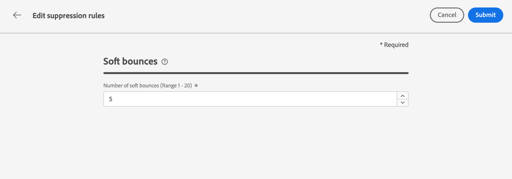

# 重試次數 {#retries}

當電子郵件訊息因指定位址的暫時&#x200B;**軟退信**&#x200B;錯誤而失敗時，會執行多次重試。 每個錯誤都會增加錯誤計數器。 當此計數器達到限制臨界值時，電子郵件地址會新增到隱藏清單中。

>[!NOTE]
>
>深入瞭解[傳遞失敗型別](../reports/suppression-list.md#delivery-failures)區段中的錯誤型別。

在預設設定中，臨界值會設為5個錯誤。

* 對於相同的傳遞，在[重試時段](#retry-duration)內遇到第五個錯誤，會隱藏該位址。

* 如果有不同的傳送，且至少相隔24小時發生兩個錯誤，則每個錯誤都會增加錯誤計數器，並且在第五次嘗試時也會隱藏地址。 每個地址的錯誤都是累積的。

如果重試後傳送成功，位址的錯誤計數器會重新初始化。

例如：

* 您會在星期一傳送一封電子郵件，其重試時段設定為24小時。 無法傳遞`emma.jones@mail.com`位址。 電子郵件最多會重試三次，並在達到24小時的重試期間時停止重試。

* 您會在星期三傳送另一封電子郵件。 已有三次錯誤計數的`emma.jones@mail.com`也已定位，並再次無法傳遞 — 兩次。 另外兩個錯誤已說明原因。

如果未嘗試其他傳遞，且在這兩封電子郵件之間傳遞成功，則會將`emma.jones@mail.com`位址新增至隱藏清單，因為3 + 2個錯誤的累積影響。

## 重試閾值版本 {#edit-retry-threshold}

>[!CONTEXTUALHELP]
>id="ajo_admin_suppression_list_bounces"
>title="更新重試臨界值"
>abstract="如果預設值不適合您的需求，您可以修改連續軟退信的允許次數。當重試計數器達到特定電子郵件地址的錯誤臨界值時，會將該地址加入禁止名單中。"
<!--
>additional-url="https://experienceleague.adobe.com/docs/journey-optimizer/using/reporting/deliverability/suppression-list.html" text="Understand the suppresion list"-->

如果預設值5不符合您的需求，您可以按照以下步驟修改錯誤臨界值。

1. 移至&#x200B;**[!UICONTROL 管道]** > **[!UICONTROL 電子郵件設定]** > **[!UICONTROL 隱藏清單]**。

1. 選取&#x200B;**[!UICONTROL 編輯隱藏規則]**&#x200B;按鈕。

   

1. 根據您的需求，編輯允許的連續軟退信數。

   

   您必須輸入介於1到20之間的整數值，表示最小重試次數為1，最大重試次數為20。

   >[!CAUTION]
   >
   >大於10的值可能會導致傳遞能力聲譽問題，並遭到ISP施加IP節流或加入封鎖清單。 [進一步瞭解傳遞能力](../reports/deliverability.md)

## 重試時段 {#retry-duration}

**重試時段**&#x200B;是任何傳遞的電子郵件訊息（發生暫時性錯誤或軟退信）將重試的時間範圍。

預設會從郵件新增至電子郵件佇列的時間開始，執行&#x200B;**3.5天** （或&#x200B;**84小時**）的重試。

不過，為了確保當不再需要重試時不再執行，您可以在建立或編輯套用至電子郵件通道的[通道設定](channel-surfaces.md)時，根據您的需求變更此設定。

例如，對於與密碼重設相關的交易式電子郵件，您可以將重試期間設為24小時，其中包含僅一天有效的連結。 同樣地，對於午夜銷售，您可能想要定義6小時的重試期間。

>[!NOTE]
>
>重試期間不能超過84小時。 行銷電子郵件的最小重試期間為6小時，交易電子郵件的最小重試期間為10分鐘。

瞭解如何在[本節](../email/email-settings.md#email-retry)中建立頻道設定時調整電子郵件重試引數。

