# 使用規則集 {#rule-sets}

>[!CONTEXTUALHELP]
>id="ajo_business_rules_rule_sets"
>title="規則集"
>abstract="使用規則集將頻率上限套用至不同類型的行銷傳播。您也可以建立規則集，以根據頻率上限規則排除部分對象的歷程。"

>[!AVAILABILITY]
>
>規則集目前可在「有限可用性」中提供給選定的客戶群組。 請注意，此功能將在未來逐步向更多使用者推出。 如果您有興趣加入輪候表，請洽詢您的客戶團隊。

## 開始使用規則集 {#gs}

### 什麼是規則集？ {#what}

除了限制使用者透過一或多個通道接收訊息次數的全球商業規則之外，規則集還可讓您&#x200B;**將多個規則分組為規則集**，並將這些規則套用至您選擇的行銷活動。 這提供了更精細的精細度，可依通訊型別控制使用者接收訊息的頻率。

例如，您可以建立規則集以限制傳送給客戶的&#x200B;**促銷通訊**&#x200B;數目，以及建立另一個規則集以限制傳送給客戶的&#x200B;**電子報**&#x200B;數目。 視您建立的促銷活動型別而定，您可以選擇套用促銷通訊或電子報規則集。

➡️ [在影片中探索此功能](#video)

### 全域和自訂規則集 {#global-custom}

第一次從&#x200B;**[!UICONTROL 管理]** > **[!UICONTROL 商業規則(Beta)]**&#x200B;功能表存取規則集時，預設規則集已預先建立且作用中： **全域預設規則集**。

此規則集包含您可以套用的全域規則，以控制使用者跨一或多個管道接收訊息的頻率，類似於目前商業規則的運作方式。 此規則集中定義的所有規則都適用於所有選取的管道，不論通訊是從歷程或行銷活動傳送。 [瞭解如何使用商業規則](frequency-rules.md)

除了此「全域預設規則集」規則集外，您還可以建立可套用至任何促銷活動的&#x200B;**自訂規則集**，以限制在該促銷活動中傳送的訊息數目。 [瞭解如何建立自訂規則集](#create)

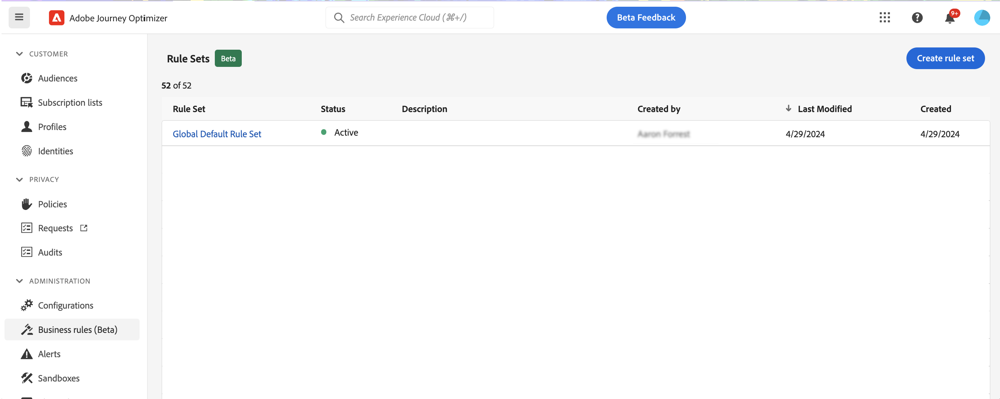

### 管道和歷程上限規則 {#domain}

>[!CONTEXTUALHELP]
>id="ajo_rule_set_domain"
>title="規則集網域"
>abstract="建立規則集時，您需要指定規則集中的規則是否將強制執行通訊通道或歷程專用的上限規則。"

建立規則集時，您需要指定規則集中的規則是否將強制執行通訊通道或歷程專用的上限規則。 若要這麼做，請在建立規則集時，為規則集選取管道或歷程網域。 [瞭解如何建立規則集](#create)

* **管道**&#x200B;網域：為通訊管道套用上限規則。 例如，每天傳送的電子郵件或簡訊請勿超過1個。
* **歷程**&#x200B;網域：將專案與並行上限規則套用至歷程。 例如，請勿同時在多個歷程中輸入設定檔。

## 建立您的第一個自訂規則集 {#create-rule-set}

### 建立規則集並選取其網域 {#create}

若要建立規則集，請遵循下列步驟。

>[!NOTE]
>
>您最多可以建立3個自訂規則集。

1. 存取&#x200B;**[!UICONTROL 規則集]**&#x200B;清單，然後按一下&#x200B;**[!UICONTROL 建立規則集]**。

   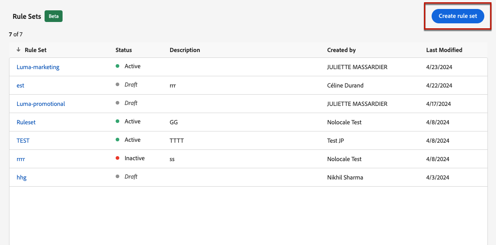

1. 為規則集定義唯一名稱並新增說明。

1. 選取規則集的網域。 網域可讓您指定規則集是否包含通訊通道或歷程專用的上限規則。 [進一步瞭解頻道和歷程上限規則](#domain)

   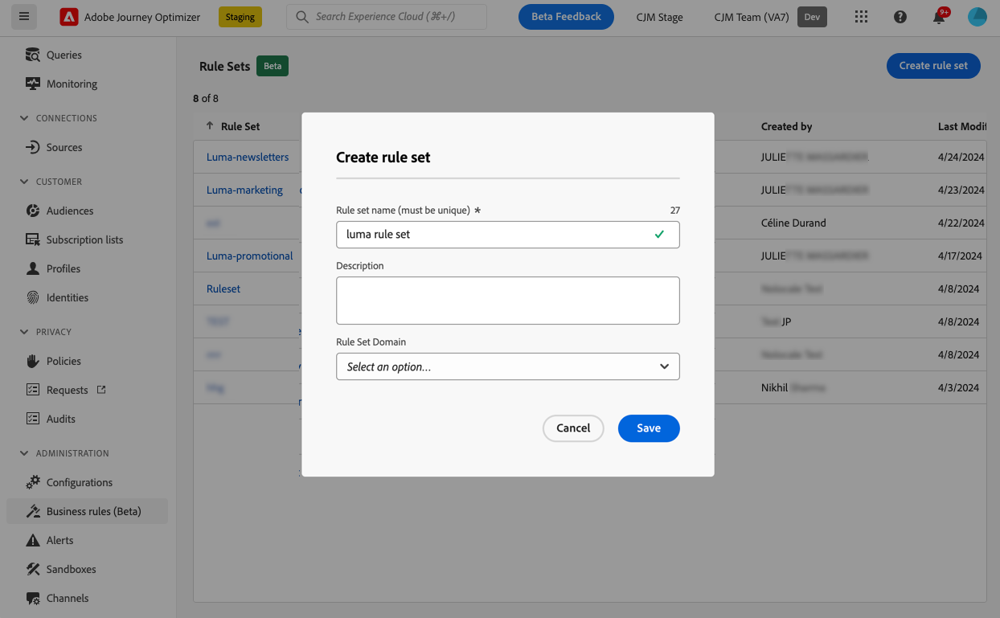

1. 按一下&#x200B;**[!UICONTROL 儲存]**。

1. 現在您可以[定義要新增至此規則集的規則](#create-new-rule)。

### 新增規則到規則集 {#create-new-rule}

>[!CONTEXTUALHELP]
>id="ajo_rule_sets_category"
>title="選取訊息規則類別"
>abstract="啟動並套用至訊息時，和所選類別相符的所有頻率規則會自動應用至該訊息。目前只有行銷類別可用。"

<!--NOT USED?
[!CONTEXTUALHELP]
>id="ajo_rule_sets_capping"
>title="Set the capping for your rule"
>abstract="Specify the maximum number of messages sent to a customer profile within the chosen time frame. The frequency cap will be based on the selected calendar period and will be reset at the beginning of the corresponding time frame."-->

>[!CONTEXTUALHELP]
>id="ajo_rule_sets_channel"
>title="定義套用規則的管道"
>abstract="選取至少一個管道。上限會以總計數套用在所有管道上。"

>[!CONTEXTUALHELP]
>id="ajo_rule_sets_duration"
>title="選取訊息規則類別"
>abstract="啟動並套用至訊息時，和所選類別相符的所有頻率規則會自動應用至該訊息。目前只有行銷類別可用。"

>[!CONTEXTUALHELP]
>id="ajo_rule_set_rule_capping"
>title="規則上限"
>abstract="設定規則的上限。 根據規則集網域和「規則型別」欄位中的選擇，此欄位可定義可傳送到設定檔的最大訊息數量，或設定檔可同時輸入或註冊的最大歷程數量。"

若要將規則新增至規則集，請存取規則集並按一下[新增規則]。****

規則可用的引數取決於建立時選取的規則集網域。

+++設定頻道上限規則（**頻道**&#x200B;網域）

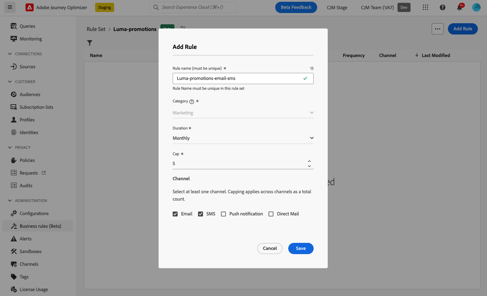

1. 為規則定義唯一名稱。

1. **類別**&#x200B;欄位指定規則套用的訊息類別。 目前，此欄位是唯讀的，因為只有&#x200B;**[!UICONTROL 行銷]**&#x200B;類別可用。

1. 從&#x200B;**[!UICONTROL 持續時間]**&#x200B;下拉式清單中，選取是否要每月、每週或每日套用上限。 頻率上限是根據所選的日曆期間。 它會在對應的時間範圍開始時重設。

   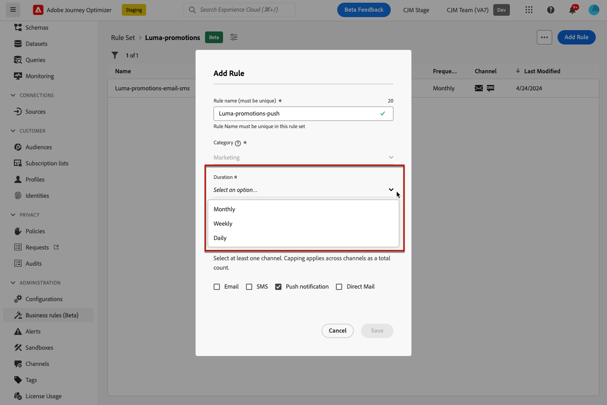

   每個期間的計數器到期日如下：

   * **[!UICONTROL 每月]**：頻率上限在每月最後一天23:59:59 UTC之前有效。 例如，1月的每月到期日為01-31 23:59:59 UTC。

   * **[!UICONTROL 每週]**：當行事曆周從星期日開始時，頻率上限將持續到星期六23:59:59 UTC。 無論規則建立與否，有效期都相同。 例如，如果規則是在星期四建立，則此規則的有效期直到星期六的23:59:59。

   * **[!UICONTROL 每日]**：每日頻率上限在23:59:59 UTC之前的當天有效，並在隔天的開頭重設為0。

     >[!CAUTION]
     >
     >為確保每日頻率上限規則的正確性，必須使用[串流分段](https://experienceleague.adobe.com/docs/experience-platform/segmentation/ui/streaming-segmentation.html){target="_blank"}。 在[本節](../audience/about-audiences.md#evaluation-method-in-journey-optimizer)中進一步瞭解對象評估方法。

   請注意，一旦傳遞通訊，設定檔計數器值就會更新。 當您傳送大量通訊時，請注意這一點，因為輸送量可能導致收件者在啟動通訊後數分鐘甚至數小時收到電子郵件（若您同時傳送數百萬封通訊）。

   如果收件者收到兩則緊密相連的通訊，則這一點很重要。 我們建議將通訊間隔至少二小時，讓收件者有充足的時間接收通訊，並相應地更新計數器值。

1. 設定規則的上限，代表根據您上述選擇，每個月、每週或每天可傳送至個別使用者設定檔的最大訊息數量。

1. 選取您要用於此規則的頻道： **[!UICONTROL 電子郵件]**、**[!UICONTROL 簡訊]**、**[!UICONTROL 推播通知]**&#x200B;或&#x200B;**[!UICONTROL 直接郵件]**。

   >[!NOTE]
   >
   >您必須至少選取一個管道才能建立規則。

1. 如果您要將上限套用至所有選取的色版總數，請選取數個色版。

   例如，將上限設為5，然後選取電子郵件和簡訊頻道。 如果設定檔在選定期間內已收到3封行銷電子郵件和2封行銷簡訊，則會在下次傳送行銷電子郵件或簡訊時排除此設定檔。

+++

+++設定歷程上限規則（**歷程**&#x200B;網域）

1. 為規則提供唯一名稱。

1. 在&#x200B;**[!UICONTROL 規則型別]**&#x200B;下拉式清單中，指定規則的上限型別。

   * **[!UICONTROL 歷程專案上限]**：限制設定檔在指定期間內進入歷程的專案數。
   * **[!UICONTROL 歷程並行上限]**：限制設定檔可同時註冊的歷程數。

1. 有關如何設定歷程上限規則的詳細資訊，請參閱[歷程上限和仲裁](../conflict-prioritization/journey-capping.md)區段。

+++

1. 按一下&#x200B;**[!UICONTROL 儲存]**&#x200B;以確認建立規則。 您的訊息已新增至規則集，狀態為&#x200B;**[!UICONTROL 草稿]**。

   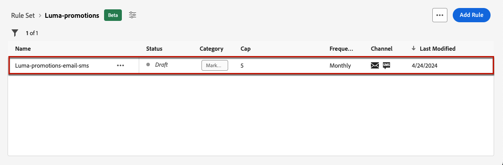

1. 重複上述步驟，視需求將任意數量的規則新增至規則集。

現在，您必須先啟用每個規則，才能將其套用至任何訊息。 [了解更多](#activate-rule)

### 啟動規則和規則集 {#activate-rule}

建立時，規則具有&#x200B;**[!UICONTROL 草稿]**&#x200B;狀態，尚未影響任何訊息。 若要啟用此功能，請按一下規則旁的&#x200B;**[!UICONTROL 其他動作]**&#x200B;按鈕，然後選取&#x200B;**[!UICONTROL 啟用]**。

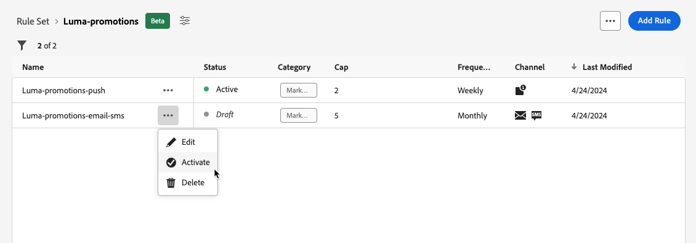

您也必須啟用規則集，才能在行銷活動/歷程中存取它，並將其套用至您的訊息。

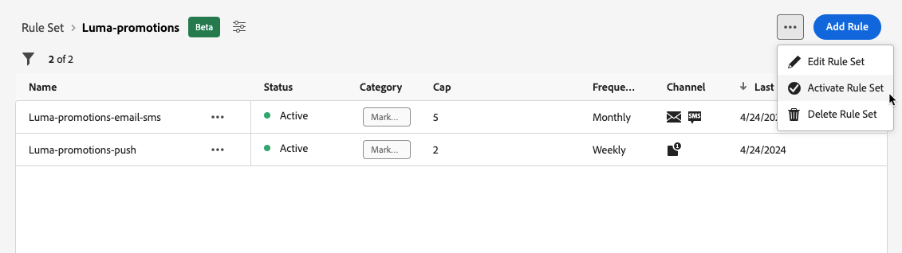

>[!NOTE]
>
>完全啟用規則或規則集最多可能需要10分鐘。 您不需要修改訊息或重新發佈歷程，規則就能生效。

<!--Currently, once a rule set is activated, no more rules can be added to that rule set.-->

若要停用規則或規則集，請按一下所要專案旁的&#x200B;**[!UICONTROL 更多動作]**&#x200B;按鈕，並選取&#x200B;**[!UICONTROL 停用]**。

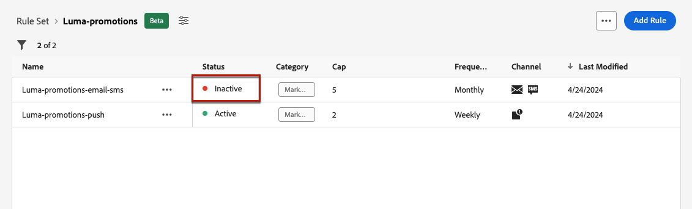

其狀態將變更為&#x200B;**[!UICONTROL 非使用中]**，而且此規則將不會套用至未來的訊息執行。 目前執行中的任何訊息都不會受到影響。

>[!NOTE]
>
>停用規則或規則集不會影響或重設個別設定檔的任何計數。

## 存取及管理規則集 {#access-rule-sets}

所有建立的規則集都會顯示在&#x200B;**[!UICONTROL 管理]** > **[!UICONTROL 商業規則(Beta)]**&#x200B;功能表中。 它們會依上次修改日期排序。

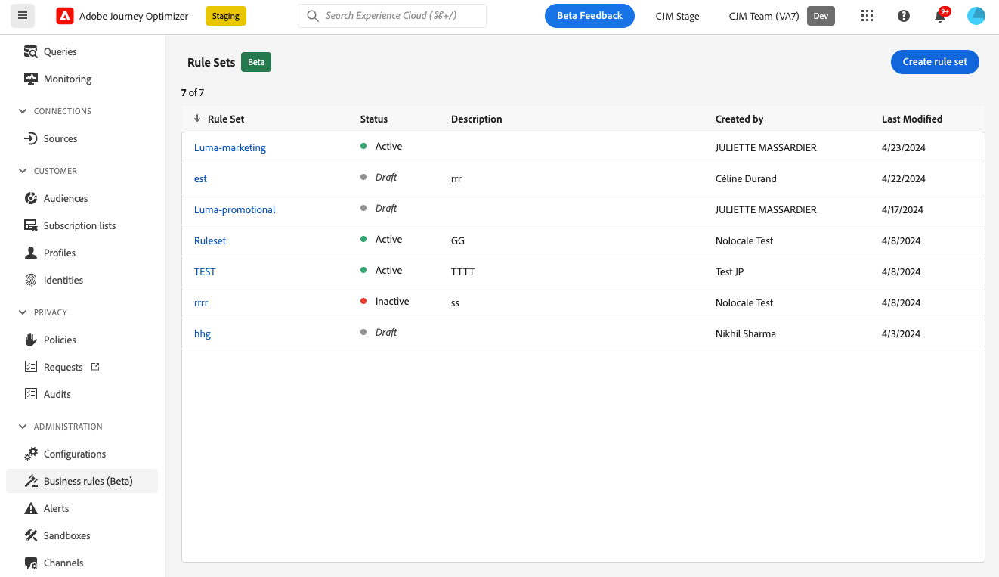

按一下規則集名稱，即可檢視及編輯其內容。 該規則集中包含的所有規則都會列出。 右上方的內容功能表可讓您：

* 編輯規則集的名稱和說明
* 啟動規則集 — [深入瞭解](#activate-rule)
* 刪除規則集

對於規則集中的每個規則，**[!UICONTROL 其他動作]**&#x200B;按鈕可讓您：

* 編輯規則
* 啟用規則[深入瞭解](#activate-rule)
* 刪除規則

<!--### Permissions{#permissions-frequency-rules}

To access, create, edit or delete message frequency rules, you must have the **[!UICONTROL Manage frequency rules]** permission. 

Users with the **[!UICONTROL View frequency rules]** permission are able to view rules, but not to modify or delete them.

Learn more about permissions in [this section](../administration/high-low-permissions.md).-->

## 將規則集套用至訊息或歷程 {#apply-frequency-rule}

您可以根據建立規則集時選取的網域，將規則集套用至訊息或歷程。 請展開下列各節以取得詳細資訊。

+++ 將規則集套用至訊息

1. 建立[行銷活動](../campaigns/create-campaign.md)時，請選取您為規則集定義的其中一個管道，並編輯訊息的內容。

1. 在內容版本畫面中，按一下&#x200B;**[!UICONTROL 新增商業規則]**&#x200B;按鈕。

1. 選取您建立的[規則集](#create-rule-set)。

   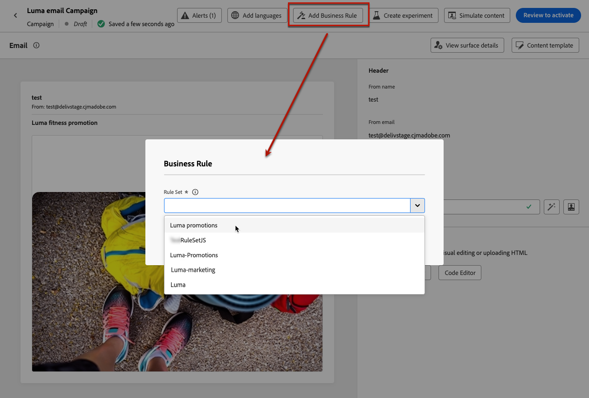

   >[!NOTE]
   >
   >只有[個已啟動](#activate-rule)的規則集會顯示在清單中。

   <!--Messages where the category selected is **[!UICONTROL Transactional]** will not be evaluated against business rules.-->

1. 在啟用行銷活動之前，請務必將其排程在日後至少10分鐘執行。

   這樣就有足夠的時間在您選取之商業規則的設定檔上填入計數器值。 如果您立即啟用行銷活動，規則集計數器值將不會填入收件者的設定檔中，且訊息將不會計入其自訂規則集的頻率限定規則中。

   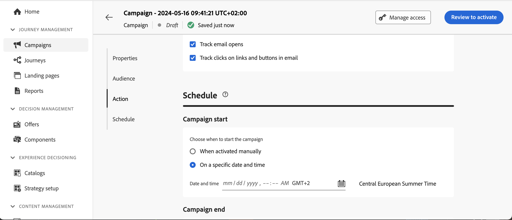

1. 您可以在[Customer Journey Analytics報告](../reports/report-gs-cja.md)和[即時報告](../reports/live-report.md)中檢視從傳送中排除的設定檔數目，其中頻率規則會列為使用者從傳送中排除的可能原因。

>[!NOTE]
>
>數個規則可套用至相同的管道，但一旦達到較低上限，設定檔將從下一次傳送中排除。

<!--
## Example: combine several rules {#frequency-rule-example}

You can combine several message frequency rules, such as described in the example below.

1. [Create a rule](#create-new-rule) called *Overall Marketing Capping*:

   * Select all channels.
   * Set capping to 12 monthly.

   

1. To further restrict the number of marketing-based push notifications that a user is sent, create a second rule called *Push Marketing Cap*:

   * Select Push channel.
   * Set capping to 4 monthly.

   

1. Save and [activate](#activate-rule) the rule.

1. [Create a message](../building-journeys/journeys-message.md) for every channel you want to communicate through and select the **[!UICONTROL Marketing]** category for each message. [Learn how to apply a frequency rule](#apply-frequency-rule)

   

In this scenario, an individual profile:
* can receive up to 12 marketing messages per month;
* but will be excluded from marketing push notifications after they have received 4 push notifications.-->

測試頻率規則時，建議使用新建立的[測試設定檔](../audience/creating-test-profiles.md)，因為一旦達到設定檔的頻率上限，就無法在下一個期間之前重設計數器。 停用規則將允許限定設定檔接收訊息，但不會移除或刪除任何計數器增量。

+++

+++ 將規則集套用至歷程

若要將上限規則套用至歷程，請存取歷程並開啟其屬性。 在&#x200B;**[!UICONTROL 上限規則]**&#x200B;下拉式清單中，選取相關的規則集。

>[!IMPORTANT]
>
>如果立即啟動歷程，系統最多可能需要15分鐘才能開始抑制客戶。 為了防止這種可能性，您可以將歷程排程為至少15分鐘後再開始。

+++

## 操作說明影片 {#video}

>[!VIDEO](https://video.tv.adobe.com/v/3435531?quality=12)
