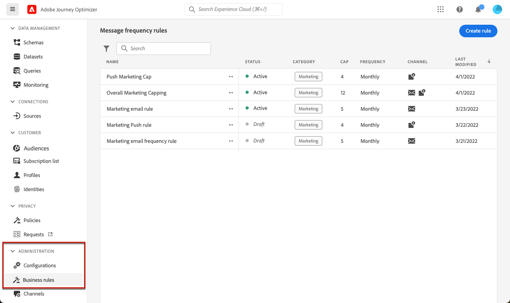

# 使用規則集 {#rule-sets}

>[!CONTEXTUALHELP]
>id="ajo_business_rules_rule_sets"
>title="規則集"
>abstract="使用規則集將頻率上限套用至不同型別的行銷通訊。 例如，您可以建立規則集以限制 **促銷通訊** 傳送給您的客戶，並建立另一個規則集以限制 **電子報** 已傳送給他們。 規則集目前僅供選取使用者使用，做為Beta版提供。"

>[!AVAILABILITY]
>
>規則集目前僅供選定使用者使用，做為Beta版。 請洽詢您的Adobe代表以加入測試版。

## 什麼是規則集？ {#what}

除了限制使用者跨一或多個通道接收訊息次數的全球商業規則外，規則集也可讓您 **將多個規則分組為規則集** 並將其套用至您選擇的行銷活動。 這提供了更精細的精細度，可依通訊型別控制使用者接收訊息的頻率。

例如，您可以建立規則集以限制 **促銷通訊** 傳送給您的客戶，以及另一個規則集，用來限制 **電子報** 已傳送給他們。 視您建立的促銷活動型別而定，您可以選擇套用促銷通訊或電子報規則集。

## 全域和自訂規則集 {#global-custom}

第一次從存取規則集時 **[!UICONTROL 管理]** > **[!UICONTROL 商業規則（測試版）]** 選單中，預設規則集為預先建立且作用中： **全域預設規則集**.

此規則集包含您可以套用的全域規則，以控制使用者跨一或多個管道接收訊息的頻率，類似於目前商業規則的運作方式。 此規則集中定義的所有規則都適用於所有選取的管道，不論通訊是從歷程或行銷活動傳送。 [瞭解如何使用商業規則](frequency-rules.md)

除了此「全域預設規則集」規則集外，您還可以建立 **自訂規則** 可套用至任何行銷活動的設定，以限制該行銷活動內傳送的訊息數。 [瞭解如何建立自訂規則集](#create)

>[!IMPORTANT]
>
>目前，自訂規則集可套用至 **行銷活動** 僅限。 只有「全域預設規則集」規則集中定義的規則適用於歷程和行銷活動通訊。

## 建立您的第一個自訂規則集 {#create-rule-set}

### 建立規則集 {#create}

若要建立規則集，請遵循下列步驟。

>[!NOTE]
>
>您最多可以建立3個自訂規則集。

1. 存取 **[!UICONTROL 規則集]** 清單，然後按一下 **[!UICONTROL 建立規則集]**.

   

1. 定義規則集名稱，視需要新增說明，然後按一下 **[!UICONTROL 儲存]**.

   

   >[!NOTE]
   >
   >規則集名稱必須是唯一的。

1. 現在您可以 [定義規則](#create-new-rule) 您想要新增至此規則集。

### 將規則新增至規則集 {#create-new-rule}

>[!CONTEXTUALHELP]
>id="ajo_rule_sets_category"
>title="選取訊息規則類別"
>abstract="啟動並套用至訊息時，和所選類別相符的所有頻率規則會自動應用至該訊息。目前只有行銷類別可用。"

>[!CONTEXTUALHELP]
>id="ajo_rule_sets_capping"
>title="設定規則的上限"
>abstract="指定在所選時間範圍內傳送至客戶設定檔的最大訊息數量。頻率上限會以所選的行事曆期間為基礎，並會在對應的時間段開始時重設。 "

>[!CONTEXTUALHELP]
>id="ajo_rule_sets_channel"
>title="定義套用規則的管道"
>abstract="選取至少一個管道。上限會以總計數套用在所有管道上。"

>[!CONTEXTUALHELP]
>id="ajo_rule_sets_duration"
>title="選取訊息規則類別"
>abstract="啟動並套用至訊息時，和所選類別相符的所有頻率規則會自動應用至該訊息。目前只有行銷類別可用。"

若要將規則新增至規則集，請遵循下列步驟。

1. 從您剛建立的規則集中，按一下 **[!UICONTROL 新增規則]**.

   

1. 定義唯一 **規則名稱**.

1. 此 **類別** 欄位會指定規則套用的訊息類別。 就目前而言，此欄位是唯讀的，因為 **[!UICONTROL 行銷]** 類別可供使用。

1. 從 **[!UICONTROL 持續時間]** 下拉式清單，選取是否要每月、每週或每日套用上限。 頻率上限是根據所選的日曆期間。 它會在對應的時間範圍開始時重設。

   

   每個期間的計數器到期日如下：

   * **[!UICONTROL 每月]**：頻率上限有效期至當月最後一天23:59:59 UTC. 例如，1月的每月到期日為01-31 23:59:59 UTC.

   * **[!UICONTROL 每週]**：頻率上限有效期到星期六23日:59:當週的59 UTC作為行事曆周從星期日開始。 無論規則建立與否，有效期都相同。 例如，如果規則是在星期四建立，則此規則有效期至星期六的23日:59:59.

   * **[!UICONTROL 每日]**：每日頻率上限對該日有效，直到23:59:59 UTC並在第二天開始時重設為0。

     >[!CAUTION]
     >
     >為確保每日頻率限定規則的準確性，請使用 [串流細分](https://experienceleague.adobe.com/docs/experience-platform/segmentation/ui/streaming-segmentation.html){target="_blank"} 為必填欄位。 進一步瞭解中的對象評估方法 [本節](../audience/about-audiences.md#evaluation-method-in-journey-optimizer).

   請注意，一旦傳遞通訊，設定檔計數器值就會更新。 當您傳送大量通訊時，請注意這一點，因為輸送量可能導致收件者在啟動通訊後數分鐘甚至數小時收到電子郵件（若您同時傳送數百萬封通訊）。

   如果收件者收到兩則緊密相連的通訊，則這一點很重要。 我們建議將通訊間隔至少二小時，讓收件者有充足的時間接收通訊，並相應地更新計數器值。

1. 設定規則的上限，代表根據您上述選擇，每個月、每週或每天可傳送至個別使用者設定檔的最大訊息數量。

1. 選取您要用於此規則的管道： **[!UICONTROL 電子郵件]**， **[!UICONTROL 簡訊]**， **[!UICONTROL 推播通知]** 或 **[!UICONTROL 直接郵件]**.

   

   >[!NOTE]
   >
   >您必須至少選取一個管道才能建立規則。

1. 如果您要將上限套用至所有選取的色版總數，請選取數個色版。

   例如，將上限設為5，然後選取電子郵件和簡訊頻道。 如果設定檔在選定期間內已收到3封行銷電子郵件和2封行銷簡訊，則會在下次傳送行銷電子郵件或簡訊時排除此設定檔。

1. 按一下 **[!UICONTROL 儲存]** 以確認建立規則。 您的訊息將新增至規則集，並使用 **[!UICONTROL 草稿]** 狀態。

   

1. 重複上述步驟，視需求將任意數量的規則新增至規則集。

現在，您必須先啟用每個規則，才能將其套用至任何訊息。 [了解更多](#activate-rule)

### 啟動規則和規則集 {#activate-rule}

建立時，規則具有 **[!UICONTROL 草稿]** 狀態，且尚未影響任何訊息。 若要啟用此功能，請按一下 **[!UICONTROL 更多動作]** 按鈕並選取 **[!UICONTROL 啟動]**.

您也必須啟用規則集，才能在行銷活動/歷程中存取它，並將其套用至您的訊息。

>[!NOTE]
>
>完全啟用規則或規則集最多可能需要10分鐘。 您不需要修改訊息或重新發佈歷程，規則就能生效。

<!--Currently, once a rule set is activated, no more rules can be added to that rule set.-->

若要停用規則或規則集，請按一下 **[!UICONTROL 更多動作]** 按鈕並選取 **[!UICONTROL 停用]**.

其狀態將變更為 **[!UICONTROL 非使用中]** 而且規則不會套用於未來的訊息執行。 目前執行中的任何訊息都不會受到影響。

>[!NOTE]
>
>停用規則或規則集不會影響或重設個別設定檔的任何計數。

## 存取及管理規則集 {#access-rule-sets}

所有建立的規則集都會顯示在 **[!UICONTROL 管理]** > **[!UICONTROL 商業規則（測試版）]** 功能表。 它們會依上次修改日期排序。

按一下規則集名稱，即可檢視及編輯其內容。 該規則集中包含的所有規則都會列出。 右上方的內容功能表可讓您：

* 編輯規則集的名稱和說明
* 啟動規則集 —  [瞭解更多](#activate-rule)
* 刪除規則集

對於規則集中的每個規則， **[!UICONTROL 更多動作]** 按鈕可讓您：

* 編輯規則
* 啟用規則 [瞭解更多](#activate-rule)
* 刪除規則

<!--### Permissions{#permissions-frequency-rules}

To access, create, edit or delete message frequency rules, you must have the **[!UICONTROL Manage frequency rules]** permission. 

Users with the **[!UICONTROL View frequency rules]** permission are able to view rules, but not to modify or delete them.

Learn more about permissions in [this section](../administration/high-low-permissions.md).-->

## 將規則集套用至訊息 {#apply-frequency-rule}

若要將商業規則套用至訊息，請遵循下列步驟。

1. 建立 [行銷活動](../campaigns/create-campaign.md)，選取您為規則集定義的其中一個管道，並編輯訊息內容。

1. 在內容版本畫面中，按一下 **[!UICONTROL 新增商業規則]** 按鈕。

1. 選取 [您已建立的規則集](#create-rule-set).

   

   >[!NOTE]
   >
   >僅限 [已啟用](#activate-rule) 規則集會顯示在清單中。

   <!--Messages where the category selected is **[!UICONTROL Transactional]** will not be evaluated against business rules.-->

1. 在啟用行銷活動之前，請務必將其排程在日後至少10分鐘執行。

   這樣就有足夠的時間在您選取之商業規則的設定檔上填入計數器值。 如果您立即啟用行銷活動，規則集計數器值將不會填入收件者的設定檔中，且訊息將不會計入其自訂規則集的頻率限定規則中。

   

1. 您可以在以下位置檢視從傳送中排除的設定檔數： [全域報告](../reports/global-report.md)，以及 [即時報告](../reports/live-report.md)，其中會列出頻率規則，作為使用者從傳送中排除的可能原因。

>[!NOTE]
>
>數個規則可套用至相同的管道，但一旦達到較低上限，設定檔將從下一次傳送中排除。

<!--
## Example: combine several rules {#frequency-rule-example}

You can combine several message frequency rules, such as described in the example below.

1. [Create a rule](#create-new-rule) called *Overall Marketing Capping*:

   * Select all channels.
   * Set capping to 12 monthly.

   

1. To further restrict the number of marketing-based push notifications that a user is sent, create a second rule called *Push Marketing Cap*:

   * Select Push channel.
   * Set capping to 4 monthly.

   

1. Save and [activate](#activate-rule) the rule.

1. [Create a message](../building-journeys/journeys-message.md) for every channel you want to communicate through and select the **[!UICONTROL Marketing]** category for each message. [Learn how to apply a frequency rule](#apply-frequency-rule)

   

In this scenario, an individual profile:
* can receive up to 12 marketing messages per month;
* but will be excluded from marketing push notifications after they have received 4 push notifications.-->

測試頻率規則時，建議使用新建立的 [測試設定檔](../audience/creating-test-profiles.md)，因為一旦達到設定檔的頻率上限，就無法在下一個週期前重設計數器。 停用規則將允許限定設定檔接收訊息，但不會移除或刪除任何計數器增量。
