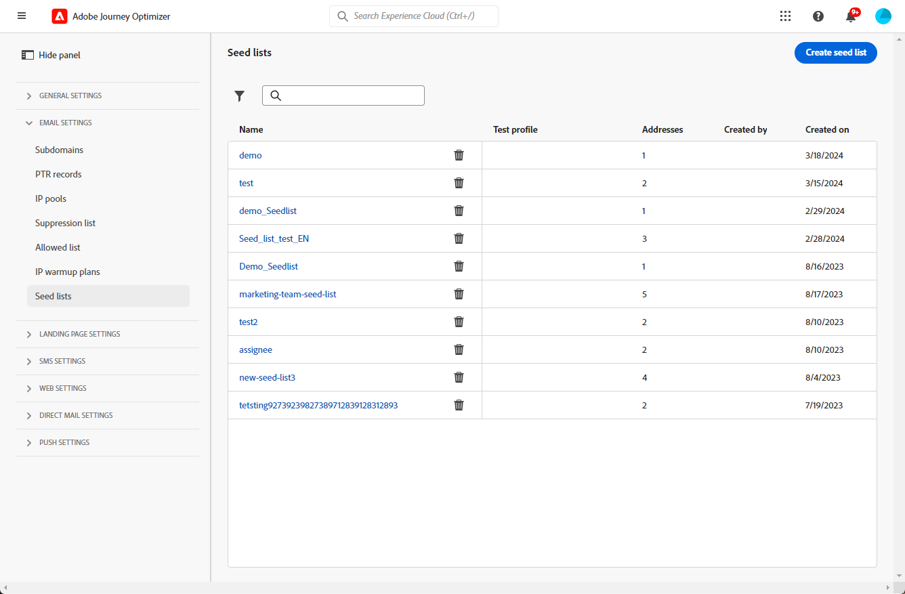
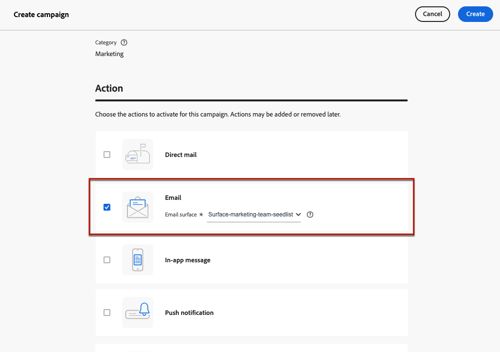

# 使用種子清單 {#seed-lists}

中的種子清單 [!DNL Journey Optimizer] 可讓您在傳送中自動包含特定的種子地址。

>[!CAUTION]
>
>此功能目前僅適用於電子郵件頻道。
>
>目前不支援變體。 如同來自目標對象的每個設定檔，種子地址會收到訊息的單一副本，而非所有變體(例如， [內容實驗](../campaigns/get-started-experiment.md))。

種子地址用於鎖定不符合所定義的目標準則的收件者。如此一來，不在傳遞範圍的收件者可以像任何其他目標收件者一樣接收傳遞。

種子地址不是真正的設定檔，也不會測試設定檔，因為它們不包含任何設定檔詳細資料。 他們只是儲存在系統中的內部利害關係人的收件者。 在特定行銷活動或歷程中選取它們時，它們會包含在傳送執行時間，這表示出於保證目的會收到傳送的復本。

* 種子清單可在與客戶相同的時間以相同條件接收傳遞，可讓您監視傳送的電子郵件復本，以確保所有顯示格式、影像和連結正確無誤，並追蹤傳送給收件者的實際訊息。

  例如：

+++ 如果您是行銷經理：

  您希望所有團隊成員都能與客戶同時收到已傳送訊息的復本。 如此一來，您的團隊就可以確保訊息會以預期的版面配置、作用中URL、正確的文字和影像傳送 — 在執行前都按計畫進行。

+++

+++ 如果您是產品所有者：

  您需要追蹤傳送給客戶的實際訊息。 事實上，您的團隊和領導層可能會對某些行銷活動感興趣，並且需要在傳送時臨時新增以接收訊息副本。

+++

* 使用種子清單的另一個原因是您的郵寄清單保護。 將種子地址插入您的郵寄清單中可讓您注意到，它是否由第三方使用，因為它包含的種子地址將接收傳送至您的郵寄清單的傳遞。

## 存取種子清單 {#access-seed-lists}

若要存取已建立的種子清單，請前往 **[!UICONTROL 管理]** > **[!UICONTROL 頻道]** > **[!UICONTROL 電子郵件設定]**，並選取 **[!UICONTROL 種子清單]**.

<!--
>[!CAUTION]
>
>Permissions to view, export and manage the seed lists are restricted to [Journey Administrators](../administration/ootb-product-profiles.md#journey-administrator). Learn more on managing [!DNL Journey Optimizer] users' access rights in [this section](../administration/permissions-overview.md).-->

>[!CAUTION]
>
>若要能夠檢視、編輯和管理種子清單，您必須擁有 **[!UICONTROL 管理種子清單]** 許可權。

您可以依名稱搜尋種子清單，和/或篩選建立清單的使用者或建立日期。 選取後，您可以清除顯示在清單頂端的篩選器。

使用 **[!UICONTROL 刪除]** 按鈕以永久移除專案。

>[!CAUTION]
>
>無法刪除使用中的種子清單 [行銷活動](../campaigns/review-activate-campaign.md) 或 [歷程](../building-journeys/publishing-the-journey.md). 您需要停用行銷活動/歷程，或編輯行銷活動，以使用尚未選取種子清單的另一個表面。 [進一步瞭解使用種子清單](#use-seed-list)

您可以按一下種子清單名稱來進行編輯。 <!--Use the **[!UICONTROL Edit]** button to edit a seed list.-->

## 建立種子清單 {#create-seed-list}

>[!CONTEXTUALHELP]
>id="ajo_seed_list_details"
>title="定義種子清單"
>abstract="使用種子清單來自動將特定內部地址新增至您的傳送對象，以利保證。 種子清單可讓您監視所傳送的訊息復本，以確保所有顯示元素正確無誤，並保護您的郵寄清單。 此功能目前僅適用於電子郵件頻道。"
>additional-url="https://experienceleague.adobe.com/docs/journey-optimizer/using/configuration/seed-lists.html#use-seed-list" text="什麼是種子清單？"

>[!CONTEXTUALHELP]
>id="ajo_seed_addresses"
>title="填入種子清單"
>abstract="選取將在傳送執行時包含的地址，這些地址將收到您訊息的精確副本。 您可以匯入CSV檔案或手動輸入電子郵件地址。"

若要建立種子清單，請遵循下列步驟。

1. 存取 **[!UICONTROL 管理]** > **[!UICONTROL 頻道]** > **[!UICONTROL 電子郵件設定]** > **[!UICONTROL 種子清單]** 功能表。

1. 選取 **[!UICONTROL 建立種子清單]** 按鈕。

   

1. 填寫詳細資訊。 從新增名稱開始。

   

   >[!NOTE]
   >
   >名稱必須以字母(A-Z)開頭，且僅包含英數字元或特殊字元( _、.、-)。

1. 選取頻道。 目前僅電子郵件通道可用。

1. 選取測試設定檔。 由於種子地址不包含設定檔詳細資料，此測試設定檔將僅用於顯示傳送至種子地址的訊息中的個人化資料。

   >[!NOTE]
   >
   >一次只能選取一個測試設定檔。

1. 新增您要傳送傳遞的目的地種子地址。 您可以匯入CSV檔案或手動輸入電子郵件地址。

   

   >[!NOTE]
   >
   >您可以合併兩個選項，但種子清單中的地址總數不能超過50。

1. 按一下 **[!UICONTROL 建立]** 以確認。 新建立的種子清單會顯示在 [種子清單畫面](#access-seed-lists).

## 在行銷活動或歷程中使用種子清單 {#use-seed-list}

現在您的種子清單已建立，您可以將其用於任何促銷活動或歷程，以在傳送中包含對應的種子地址。 若要執行此操作，請遵循下列步驟。

>[!CAUTION]
>
>傳送至種子地址的訊息不包含在報表中。

1. 建立曲面並選取 **[!UICONTROL 電子郵件]** 頻道。 [了解更多](../email/email-settings.md)

1. 選取您所選專案的種子清單，位於 [對應區段](../email/email-settings.md#seed-list).

   >[!NOTE]
   >
   >一次只能選取一個種子清單。

   

1. 提交表面。

1. 建立 [行銷活動](../campaigns/create-campaign.md) 或 [歷程](../building-journeys/journey-gs.md).

1. 選取 **[!UICONTROL 電子郵件]** 動作並選取 [表面](channel-surfaces.md) 包含與您相關的種子清單。

   

1. 啟用您的 [行銷活動](../campaigns/review-activate-campaign.md) 或發佈您的 [歷程](../building-journeys/publishing-the-journey.md).

現在，每次透過該促銷活動或歷程將電子郵件訊息傳送給客戶時，所選種子清單上的電子郵件地址也將以相同的條件收到訊息，同時具有與目標收件者相同的內容。

>[!NOTE]
>
>對於歷程，電子郵件傳送僅會於歷程首次執行時傳送至種子地址。

