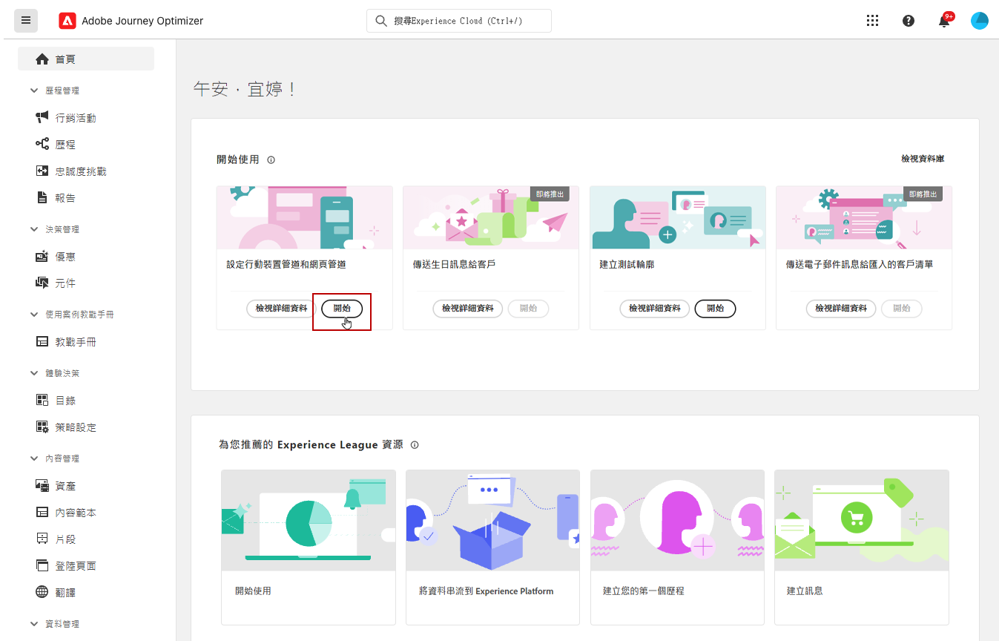

# 設定Android行動設定 {#set-mobile-android}

>[!IMPORTANT]
>
>為確保相容性和最佳效能，請務必使用下列SDK版本：
>
> * Core 3.1.0或更新版本
> * Messaging 3.1.0或更新版本

此Android設定可簡化行銷管道的快速設定，確保所有必要資源都可在Experience Platform、Journey Optimizer和資料收集應用程式中輕鬆存取。 這可讓您的行銷團隊迅速開始建立行銷活動和歷程。

## 建立新的Android設定 {#new-setup-android}

1. 從Journey Optimizer首頁，從&#x200B;**[!UICONTROL 設定行動與網路頻道]**&#x200B;卡片按一下&#x200B;**[!UICONTROL 開始]**。

   

1. 建立&#x200B;**[!UICONTROL 新]**&#x200B;設定。

   如果您已有現有的組態，您可以選擇選取一個組態，或建立新的組態。

   

1. 輸入新組態的&#x200B;**[!UICONTROL 名稱]**，然後選取或建立您的&#x200B;**[!UICONTROL 資料流]**。 此&#x200B;**[!UICONTROL 名稱]**&#x200B;將用於每個自動建立的資源。

1. 如果您的組織有多個資料流，請從現有選項中選取一個資料流。 如果您沒有資料流，系統會自動為您建立一個資料流。

1. 選取您要設定的Android平台，然後按一下&#x200B;**[!UICONTROL 自動建立資源]**。

   

1. 為了簡化設定程式，系統會自動建立必要資源來協助您開始使用。 這包括建立新的&#x200B;**[!UICONTROL 行動標籤屬性]**&#x200B;以及安裝擴充功能。

   以下是自動產生之所有資源的完整清單：

+++ 已建立的資源

   <table>
    <thead>
    <tr>
    <th><strong>解決方案</strong></th>
    <th><strong>自動建立的資源</strong></th>
    </tr>
    </thead>
    <tbody>
    <tr>
    <td>
    
Journey Optimizer

    </td>
    <td>
    <ul>
    <li>頻道設定</li>
    <li>推送認證（僅限行動推送訊息）</li>
    </ul>
    </td>
    </tr>
    <tr>
    <td>
    
標記

    </td>
    <td>
    <ul>
    <li>行動標籤屬性</li>
    <li>規則</li>
    <li>資料元素</li>
    <li>資料庫</li>
    <li>環境（測試、生產、開發）</li>
    </ul>
    </td>
    </tr>
    <tr>
    <td>
    
標籤擴充功能

    </td>
    <td>
    <ul>
    <li>Adobe Experience PlatformEdge Network</li>
    <li>Adobe Journey Optimizer</li>
    <li>AEP保證</li>
    <li>同意（已啟用預設同意政策）</li>
    <li>身分（使用預設ECID，使用預設拼接規則）</li>
    <li>行動核心</li>
    </ul>
    </td>
    </tr>
    <tr>
    <td>
    
Assurance

    </td>
    <td>
    
保證工作階段

    </td>
    </tr>
    <tr>
    <td>
    
資料流

    </td>
    <td>
    
使用服務的資料流

    </td>
    </tr>
    <tr>
    <td>
    
Experience Platform

    </td>
    <td>
    <ul>
    <li>資料集</li>
    <li>綱要</li>
    </ul>
    </td>
    </tr>
    </tbody>
    </table>

+++

1. 資源產生完成後，按一下&#x200B;**[!UICONTROL 設定]**&#x200B;以開始設定您的SDK。

   

1. 您首先需要依照使用者介面中的說明新增及匯入相依性。 [了解更多](https://experienceleague.adobe.com/en/docs/platform-learn/implement-mobile-sdk/app-implementation/install-sdks)。

1. 將下列程式碼複製並貼到應用程式的onCreate()方法中。

1. 若要直接在您的行動應用程式上驗證您的SDK，只要開啟您的行動應用程式並允許存取[Adobe保證](https://experienceleague.adobe.com/en/docs/experience-platform/assurance/home)即可。 「保證」是一款功能強大的工具，可讓您徹底測試及驗證實作，確保一切都正常運作。

   連線之後，系統會自動偵測您的裝置，並列在&#x200B;**[!UICONTROL 可用裝置]**&#x200B;下拉式功能表中，讓您能夠順暢地即時監視及疑難排解您的設定。

   

1. 按一下&#x200B;**[!UICONTROL 連線]**。

1. 您現在可以設定您的[應用程式內](#inapp-channel)及/或[推播](#push-channel)頻道。

1. 完成設定後，請將自動產生的&#x200B;**[!UICONTROL 頻道設定]**&#x200B;與負責建立歷程與行銷活動的團隊成員共用。

   **[!UICONTROL 管道設定]**&#x200B;應在「行銷活動」或「歷程」介面中參考，以便在您的設定與針對您的對象執行目標歷程和行銷活動之間提供順暢的連線。

   

## 修改現有設定 {#reconnect}

建立設定後，您可以隨時輕鬆重新造訪以新增其他管道或進一步調整以符合您的需求

1. 從Journey Optimizer首頁，從&#x200B;**[!UICONTROL 設定行動與網路頻道]**&#x200B;卡片按一下&#x200B;**[!UICONTROL 開始]**。

   

1. 選取&#x200B;**[!UICONTROL Existing]**，然後從下拉式清單中選擇您現有的&#x200B;**[!UICONTROL 標籤屬性]**。

   

1. 存取現有設定時，您需要重新連線至Adobe保證。 從SDK設定功能表，按一下&#x200B;**[!UICONTROL 重新連線]**。

1. 從&#x200B;**[!UICONTROL 可用的裝置]**&#x200B;下拉式清單中選取您的裝置，然後按一下&#x200B;**[!UICONTROL 連線]**。

1. 您現在可以根據需要更新設定。

## 設定應用程式內頻道 {#inapp-channel}

<!--
>[!CONTEXTUALHELP]
>id="ajo_mobile_web_setup_inapp_tag_property"
>title="Choose your tag property"
>abstract="TBC"
-->

應用程式內頻道不需要額外設定。 為了驗證您的設定是否正確，您可以使用「保證」功能輕鬆傳送測試訊息。 這會立即提供系統整備程度的回饋，以便有效傳送應用程式內訊息。

若要這麼做，只要按一下&#x200B;**[!UICONTROL 顯示應用程式內訊息]**&#x200B;即可。

為了簡化設定程式，系統會自動建立必要資源來協助您開始使用。 這包括建立管道設定。

您現在可以使用先前設定的&#x200B;**[!UICONTROL 通道設定]**&#x200B;來傳送應用程式內訊息。 [瞭解如何建立應用程式內訊息](../in-app/create-in-app.md)

## 設定推播頻道 {#push-channel}

>[!CONTEXTUALHELP]
>id="ajo_mobile_web_setup_push_token"
>title="獲取裝置語彙基元"
>abstract="為確保裝置的推送代號正確與您的Adobe Experience Platform設定檔同步，您必須將下列程式碼整合至您的應用程式。 這項整合對於維持最新的通訊功能並確保順暢的使用者體驗至關重要。"

>[!CONTEXTUALHELP]
>id="ajo_mobile_web_setup_push_xcode"
>title="從 Xcode 啟動應用程式"
>abstract="若要取得推播權杖，請先使用Xcode啟動您的應用程式。 應用程式啟動後，請重新啟動應用程式，以確保驗證程式已完成。 Adobe接著會提供您的推播權杖作為驗證結果的一部分。 此代號是啟用推播通知的必要專案，一旦安裝程式成功驗證後，就會顯示。"

>[!CONTEXTUALHELP]
>id="ajo_mobile_web_push_certificate_fcm"
>title="提供推播憑證"
>abstract="拖放您的.json私密金鑰檔案。 此檔案包含應用程式與伺服器之間安全整合及通訊所需的驗證資訊。"

1. 設定您的行動SDK後，從推播通知卡按一下&#x200B;**[!UICONTROL 新增]**。

1. 在使用者介面的`FireBaseMessaging.getInstance.getToken ()`回呼函式中插入提供的程式碼以擷取裝置Token。

1. 將使用者介面中提供的程式碼新增至您的`AndroidManifest.xml`檔案，以註冊傳訊服務。

1. 拖放您的.json私密金鑰檔案。

1. 為了驗證您的設定是否正確，您可以使用「保證」功能輕鬆傳送測試訊息。 這會立即提供系統整備程度的回饋，以便有效傳送推播通知。

   若要這麼做，只要按一下&#x200B;**[!UICONTROL 傳送推送訊息]**&#x200B;即可。

為了簡化設定程式，系統會自動建立必要資源來協助您開始使用。 這包括建立&#x200B;**[!UICONTROL 通道設定]**&#x200B;和&#x200B;**[!UICONTROL 推送認證]**。

您現在可以使用先前設定的&#x200B;**[!UICONTROL 頻道設定]**&#x200B;來傳送推播通知。 [瞭解如何建立推播通知](../push/create-push.md)
