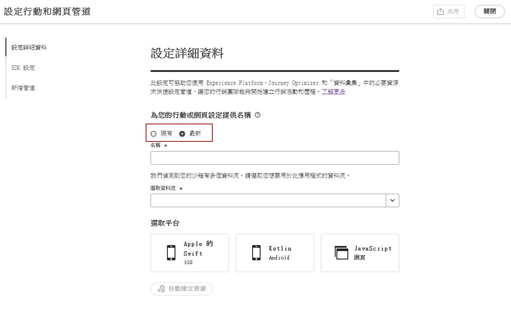

# 設定Web設定 {#set-mobile-web}

>[!CONTEXTUALHELP]
>id="ajo_mobile_web_setup_javascript_code"
>title="Javascript 程式碼"
>abstract="待定"

>[!CONTEXTUALHELP]
>id="ajo_mobile_web_setup_javascript_site"
>title="啟動網站並驗證"
>abstract="待定"

此設定有助於快速設定行銷管道，確保所有必要資源都能隨時在Experience Platform、Journey Optimizer和資料收集中取得。 這可讓您的行銷團隊立即開始行銷活動和歷程建立。

## 建立新的網頁設定 {#new-setup}

1. 從Journey Optimizer首頁，從&#x200B;**[!UICONTROL 設定行動與網路頻道]**&#x200B;卡片按一下&#x200B;**[!UICONTROL 開始]**。

   

1. 建立&#x200B;**[!UICONTROL 新]**&#x200B;設定。

   如果您已有現有的組態，您可以選擇選取一個組態，或建立新的組態。

   

1. 輸入新組態的&#x200B;**[!UICONTROL 名稱]**，然後選取或建立您的&#x200B;**[!UICONTROL 資料流]**。 此&#x200B;**[!UICONTROL 名稱]**&#x200B;將用於每個自動建立的資源。

1. 如果您的組織有多個資料流，請從現有選項中選取一個資料流。 如果您沒有資料流，系統會自動為您建立一個資料流。

1. 選取Web平台並按一下&#x200B;**[!UICONTROL 自動建立資源]**。

   

1. 為了簡化設定程式，系統會自動建立必要資源來協助您開始使用。

   以下是自動產生之所有資源的完整清單：

+++ 已建立的資源

   <table>
    <thead>
    <tr>
    <th><strong>解決方案</strong></th>
    <th><strong>自動建立的資源</strong></th>
    </tr>
    </thead>
    <tbody>
    <tr>
    </tr>
    <tr>
    <td>
    
標記

    </td>
    <td>
    <ul>
    <li>行動標籤屬性</li>
    <li>規則</li>
    <li>資料元素</li>
    <li>資料庫</li>
    <li>環境（測試、生產、開發）</li>
    </ul>
    </td>
    </tr>
    <tr>
    <td>
    
標籤擴充功能

    </td>
    <td>
    <ul>
    <li>Adobe Experience PlatformEdge Network</li>
    <li>Adobe Journey Optimizer</li>
    <li>AEP保證</li>
    <li>同意（已啟用預設同意政策）</li>
    <li>身分（使用預設ECID，使用預設拼接規則）</li>
    <li>行動核心</li>
    </ul>
    </td>
    </tr>
    <tr>
    <td>
    
Assurance

    </td>
    <td>
    
保證工作階段

    </td>
    </tr>
    <tr>
    <td>
    
資料流

    </td>
    <td>
    
使用服務的資料流

    </td>
    </tr>
    <tr>
    <td>
    
Experience Platform

    </td>
    <td>
    <ul>
    <li>資料集</li>
    <li>綱要</li>
    </ul>
    </td>
    </tr>
    </tbody>
    </table>

+++

1. 資源產生完成後，按一下&#x200B;**[!UICONTROL 設定]**&#x200B;以開始設定您的SDK。

   

1. 將熒幕上顯示的程式碼貼到檔案的`<head>`標籤中。

   {zoomable="yes"}

1. 若要直接在行動應用程式上驗證您的SDK，只需貼上您的基礎URL即可。

   {zoomable="yes"}

1. 選取&#x200B;**[!UICONTROL 啟動網站並驗證]**&#x200B;以連線您的網站。

   {zoomable="yes"}

1. 完成設定後，請將自動產生的&#x200B;**[!UICONTROL 行動網站屬性]**&#x200B;與負責建立歷程與行銷活動的團隊成員共用。

   **[!UICONTROL 行動Web屬性]**&#x200B;應在「行銷活動」或「歷程」介面中參考，以便您的設定與針對對象執行目標歷程和行銷活動之間無縫連線。

   

您現在可以使用先前設定的&#x200B;**[!UICONTROL 行動網站屬性]**&#x200B;來建立網頁。 [瞭解如何建立網頁](../web/create-web.md)

## 修改現有設定 {#reconnect}

建立設定後，您可以隨時輕鬆重新造訪以新增其他管道或進一步調整以符合您的需求

1. 從Journey Optimizer首頁，從&#x200B;**[!UICONTROL 設定行動與網路頻道]**&#x200B;卡片按一下&#x200B;**[!UICONTROL 開始]**。

   

1. 選取&#x200B;**[!UICONTROL Existing]**，然後從下拉式清單中選擇您現有的&#x200B;**[!UICONTROL 標籤屬性]**。

   

1. 您現在可以根據需要更新設定。
