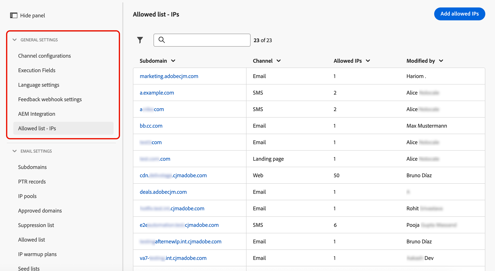

# 管理允許的 IP {#waf-ip-allowlist}

>[!CONTEXTUALHELP]
>id="ajo_waf_allowed_ips"
>title="輸入所選子網域允許的 IP"
>abstract="選取委派的子網域，並輸入網頁應用程式防火牆的公用輸出 IP。 儲存後，[!DNL Journey Optimizer] 便會拒絕任何並非來自其中一個宣告 IP 的子網域傳入要求。 儲存之前，請務必向您的安全團隊確認輸出 IP 準確。"

>[!BEGINSHADEBOX]

**在此頁面上：**&#x200B;直接在[!DNL Journey Optimizer]中新增和管理每個委派子網域的Web應用程式防火牆(WAF)輸出IP，以便只有路由通過防火牆的流量才能連線到您的[!DNL Journey Optimizer]託管連結。

>[!ENDSHADEBOX]

具有嚴格網路安全性要求的組織（例如金融部門的組織）可以強制要求對[!DNL Adobe Journey Optimizer]所託管連結的所有要求都必須通過客戶管理的&#x200B;**Web應用程式防火牆** (WAF)，才能連線到Adobe網路。 任何繞過防火牆的請求都必須被拒絕。

[!DNL Journey Optimizer]可讓系統管理員根據委派的子網域設定其WAF的公開輸出IP。 設定後，只有來自這些IP的流量可以到達對應的子網域。 所有其他傳入請求（包括略過防火牆的直接請求）都會遭到拒絕。

## 運作方式 {#waf-ip-allowlist-how-it-works}

為子網域啟用僅限WAF的路由需要兩個步驟，如下所述。

1. **DNS重新指向**：子網域的DNS記錄必須更新，以將流量路由到您組織的WAF，而不是直接路由到Adobe的網路邊緣。
1. **WAF輸出IP宣告**：您的組織在[!DNL Journey Optimizer]中提供您WAF的公開輸出IP。 這些是防火牆傳送請求給Adobe的IP。

兩者都就緒後，流量流量就會依照以下方式運作：

1. 收件者按一下[!DNL Adobe Journey Optimizer]通訊中的連結。
1. 請求會傳送到您組織的WAF，會根據您的安全性原則對其進行檢查和篩選。
1. WAF會從其中一個宣告的輸出IP轉送要求給Adobe的網路邊緣。
1. [!DNL Journey Optimizer]會根據子網域的允許清單檢查傳入要求的來源IP。
   - 當要求透過WAF正常處理→，**IP符合**→
   - **IP不符合** →略過WAF的要求→**拒絕並出現403禁止錯誤**。 收件者看到中斷的連結。

未設定允許的IP之子網域的請求不受影響，並仍可繼續如前運作。

## 護欄和限制 {#waf-ip-allowlist-guardrails}

| 控制 | 詳細資料 |
| --- | --- |
| **IP格式** | 已接受IPv4、IPv6和CIDR範圍。 在儲存前，系統會內嵌拒絕格式錯誤的值。 |
| **防止重複** | 相同子網域內沒有重複的IP。 相同的IP可用於不同的子網域。 |
| **保留範圍警告** | 當輸入私人/保留範圍時，會顯示非封鎖警告（WAF輸出IP通常是公用的）。 |
| **僅委派子網域** | 只能選取委派和已驗證的子網域。 |
| **每個子網域上限** | 每個子網域最多&#x200B;**50個IP專案**。 |
| **鎖定保護裝置** | 完全移除時的確認型別；每當動作重新開啟子網域以傳送給所有流量時，都會顯示明確警告。 |

>[!CAUTION]
>
>設定錯誤會立即中斷受影響子網域上的所有連結。

如果儲存不正確的WAF輸出IP，[!DNL Journey Optimizer]將會拒絕該子網域的每個傳入要求 — 包括來自按一下通訊中連結之真正收件者的合法要求，這些收件者將會收到403錯誤頁面。

儲存之前，請務必與您的安全性團隊確認確切的輸出IP，並儘可能先在非生產子網域上測試。

## 存取及管理允許的IP {#waf-ip-allowlist-access}

>[!NOTE]
>
>若要存取和管理IP允許清單，您必須擁有&#x200B;**[!UICONTROL 檢視允許的IP]**&#x200B;和&#x200B;**[!UICONTROL 管理允許的IP]**&#x200B;許可權。 [了解更多](../administration/ootb-permissions.md)

若要存取您已允許Web應用程式防火牆IP的子網域清單，請移至&#x200B;**[!UICONTROL 管理]** > **[!UICONTROL 管道]** > **[!UICONTROL 一般設定]**，然後選取&#x200B;**[!UICONTROL 允許清單 — IP]**。

{width="90%"}

詳細目錄頁面會列出所有管道型別（電子郵件、登陸頁面、簡訊、網頁）中至少允許一個IP的所有子網域。 在[本節](about-subdomain-delegation.md)中進一步瞭解子網域。

此清單會顯示每個子網域允許的IP數量，以及上次修改的作者。

您可以依管道型別篩選詳細目錄，並依子網域名稱搜尋。

## 將IP新增至允許清單 {#waf-ip-allowlist-add}

若要將IP新增至指定子網域的允許清單，請遵循下列步驟。

1. 從&#x200B;**[!UICONTROL 允許清單 — IP]**&#x200B;詳細目錄，按一下&#x200B;**[!UICONTROL 新增允許的IP]**&#x200B;按鈕。

1. 從&#x200B;**[!UICONTROL 子網域]**&#x200B;下拉式清單中選取目標子網域。 在所有支援的管道型別中，僅列出[委派的子網域](delegate-subdomain.md)：電子郵件、登陸頁面、簡訊和網頁。

1. 在&#x200B;**[!UICONTROL IP位址]**&#x200B;欄位中，輸入WAF的公用輸出IP。 支援IPv4、IPv6和CIDR範圍（例如，`203.0.113.42`、`2001:db8::1`、`203.0.113.0/24`）。

   每個有效的非重複專案在新增之前都會內嵌驗證。 每個子網域&#x200B;**最多可新增** 50個IP專案。

   

   >[!IMPORTANT]
   >
   >當輸入私用或保留的IP範圍（RFC 1918、回送、連結 — 本機）時，會顯示警告。 WAF輸出IP通常是公用位址。

1. 如有需要，您可以按一下晶片上的&#x200B;**✕**&#x200B;圖示，從清單中移除IP。

1. 按一下「**[!UICONTROL 儲存]**」。 允許清單會套用並傳播至邊緣。 子網域會出現在詳細目錄中，其IP會立即執行。

現在，系統會拒絕任何不在清單中的IP對此子網域提出的任何請求。

>[!CAUTION]
>
>請務必向安全性團隊確認這些IP — 不正確的值將會破壞此子網域上的所有連結。

## 編輯允許的IP {#waf-ip-allowlist-edit}

若要更新現有子網域允許的IP，請按一下詳細目錄中的子網域名稱。

**[!UICONTROL 子網域]**&#x200B;欄位是唯讀的<!--as well as the Channel field--> — 建立後即無法變更。

使用輸入欄位新增IP，或按一下每個晶片上的&#x200B;**✕**&#x200B;圖示移除現有的IP。

>[!IMPORTANT]
>
>從子網域移除最後一個IP會對所有傳入流量重新開啟它。

## 移除允許的IP {#waf-ip-allowlist-remove}

若要從子網域的允許清單中移除所有IP，請使用詳細目錄中&#x200B;**[!UICONTROL 動作]**&#x200B;欄的&#x200B;**刪除**&#x200B;圖示。 如此將可完全解除該子網域的WAF限制。

![刪除允許IP清單的[動作]欄中的圖示](assets/waf-ip-allowlist-delete-icon.png)

確認快顯視窗隨即開啟。 請輸入要確認的確切子網域名稱，然後按一下[移除]。****

{width="80%"}

>[!WARNING]
>
>確認後，此動作會移除您輸入之子網域的所有允許IP。 將再次接受來自任何來源的輸入流量，包括略過網頁應用程式防火牆的請求。 此動作無法復原 — 必須重新輸入IP才能還原限制。

移除所有IP後，子網域不再出現在詳細目錄中。 您可以隨時透過為此子網域再次新增IP來重新設定它。
