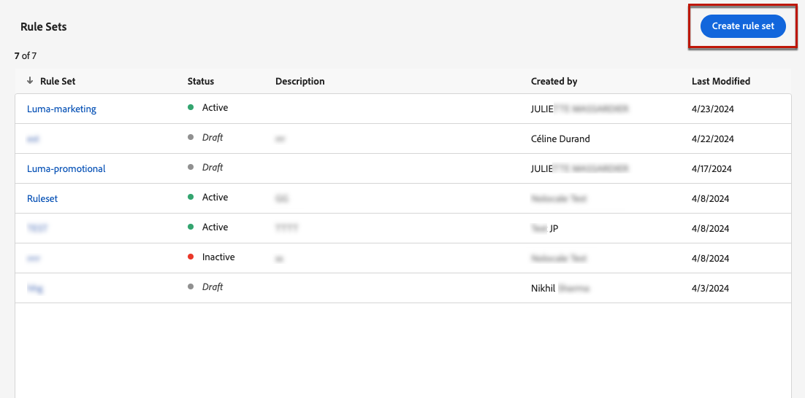
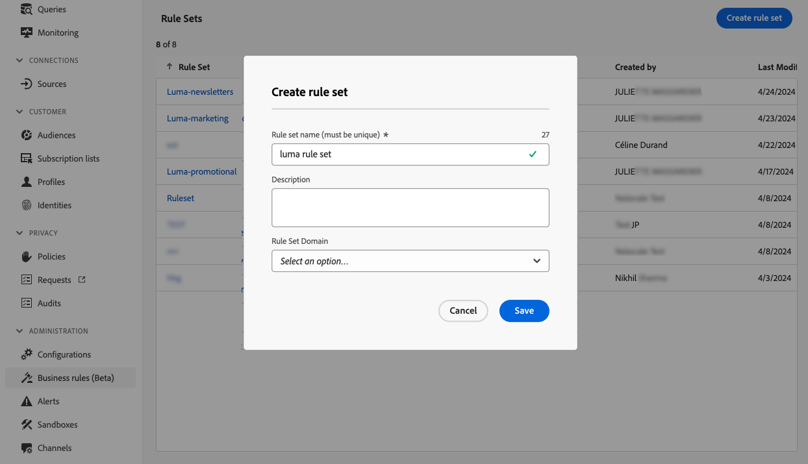
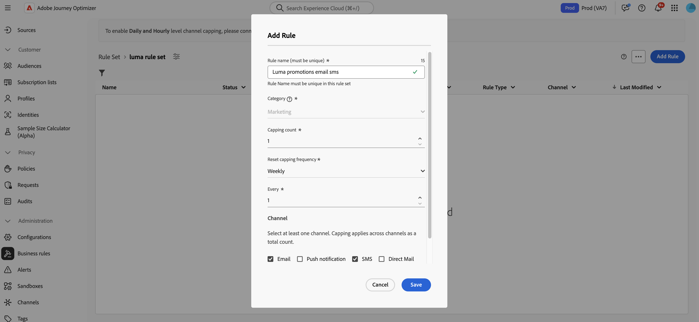
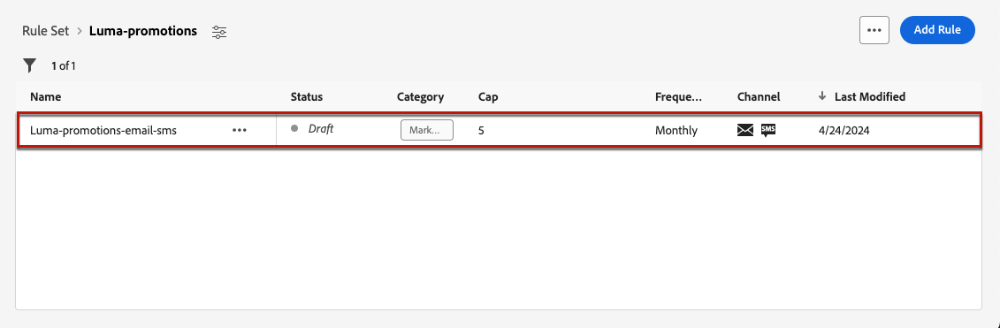
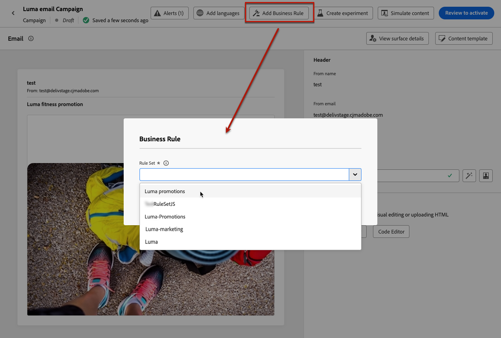

# 依據頻道、通訊類型，設定頻率上限 {#rule-sets}

**管道**&#x200B;規則集套用上限規則至通訊管道。 例如，每天傳送的電子郵件或簡訊請勿超過1個。

運用管道規則集，可讓您根據通訊型別設定頻率上限，以防止訊息相似的客戶超載。 例如，您可以建立規則集以限制傳送給客戶的&#x200B;**促銷通訊**&#x200B;數目，以及建立另一個規則集以限制傳送給客戶的&#x200B;**電子報**&#x200B;數目。 視您建立的促銷活動型別而定，您可以選擇套用促銷通訊或電子報規則集。

>[!IMPORTANT]
>
>為確保管道層級上限能正常運作，在製作行銷活動或歷程時，請務必選擇最高優先順序的名稱空間。 在[平台身分識別服務指南](https://experienceleague.adobe.com/zh-hant/docs/experience-platform/identity/features/identity-graph-linking-rules/namespace-priority){target="_blank"}之中進一步了解命名空間優先順序

## 建立管道頻率上限規則

>[!CONTEXTUALHELP]
>id="ajo_rule_sets_channel"
>title="定義套用規則的管道"
>abstract="選取至少一個管道。上限會以總計數套用在所有管道上。"

若要建立管道規則集，請遵循下列步驟：

>[!NOTE]
>
>您可以為每個管道網域和歷程網域建立最多10個作用中本機規則集。

1. 存取&#x200B;**[!UICONTROL 規則集]**&#x200B;清單，然後按一下&#x200B;**[!UICONTROL 建立規則集]**。

   

1. 選取您要新增上限規則的規則集，或建立新規則集：

   * 若要使用現有的規則集，請從清單中選取它。 管道上限規則只能新增到具有「管道」網域的規則集。 您可以在&#x200B;**[!UICONTROL 網域]**&#x200B;欄的規則集清單中檢查此資訊。

     

   * 若要在新規則集內建立上限規則，請按一下[建立規則集] ****，指定規則集的唯一名稱，並從[規則集網域] **[!UICONTROL 下拉式清單中選取[管道]，然後按一下[儲存]]**。****

     

1. 在規則集畫面中，按一下&#x200B;**[!UICONTROL 新增規則]**&#x200B;按鈕，並為規則定義唯一名稱。

1. **類別**&#x200B;欄位指定規則套用的訊息類別。 目前，此欄位是唯讀的，因為只有&#x200B;**[!UICONTROL 行銷]**&#x200B;類別可用。

   

1. 在&#x200B;**[!UICONTROL 上限計數]**&#x200B;欄位中，根據您在下列欄位中的選擇，設定規則的上限，也就是每個月、每週、每天或每小時可傳送給個別使用者設定檔的訊息數上限。

1. 從&#x200B;**[!UICONTROL 重設上限頻率]**&#x200B;下拉式清單中，選取是否要每小時、每日、每週或每月套用上限。 頻率上限是根據所選的日曆期間。 它會在對應的時間範圍開始時重設。

   每個期間的計數器到期日如下：

   * **[!UICONTROL 小時]** — 頻率上限對所選小時數有效。 計數器會在每個時間範圍的開頭自動重設。 對於1小時的頻率上限，它每小時會重設一次，與UTC一小時的結尾重合。
   * **[!UICONTROL 每日]** — 每日頻率上限在23:59:59 UTC之前的該日有效，並在隔天的開頭重設為0。
   * **[!UICONTROL 每週]** — 頻率上限有效至該周星期六23:59:59 UTC。 無論規則是在何時建立，有效期都適用。 例如，如果規則是在星期四建立，則此規則的有效期直到星期六的23:59:59。
   * **[!UICONTROL 每月]** — 頻率上限在每月最後一天23:59:59 UTC之前有效。 例如，1月的每月到期日為01-31 23:59:59 UTC。

   >[!IMPORTANT]
   >
   >* 為確保準確性，請確保在編寫行銷活動或歷程時選擇最高優先順序的名稱空間。 在[平台身分識別服務指南](https://experienceleague.adobe.com/zh-hant/docs/experience-platform/identity/features/identity-graph-linking-rules/namespace-priority){target="_blank"} 之中進一步了解命名空間優先順序
   >
   >* 一旦傳遞通訊後，設定檔計數器值就會更新。 當您傳送大量通訊時，請注意這一點，因為輸送量可能導致收件者在啟動通訊後數分鐘甚至數小時收到電子郵件（若您同時傳送數百萬封通訊）。 如果收件者收到兩則緊密相連的通訊，則這一點很重要。 我們建議將通訊間隔至少兩小時，讓收件者有充足的時間接收通訊，並相應地更新計數器值。

1. **[!UICONTROL Every]**&#x200B;欄位可讓您根據指定的持續時間，重複數小時、數天、數週或數月的頻率限定規則。 範例：套用頻率限定規則2週。

   請務必輸入符合所選期間型別的值：每小時1-23、每日1-30、每週1-4及每月1-3。

   當新的時間範圍開始時，計數器會自動重設為0。 對於2天的頻率上限，此重設會每兩天的UTC午夜發生。

1. 選取您要用於此規則的頻道： **[!UICONTROL 電子郵件]**、**[!UICONTROL 簡訊]**、**[!UICONTROL 推播通知]**&#x200B;或&#x200B;**[!UICONTROL 直接郵件]**。

1. 如果您要將上限套用至所有選取的色版總數，請選取數個色版。

   例如，將上限設為5，然後選取電子郵件和簡訊頻道。 如果設定檔在選定期間內已收到3封行銷電子郵件和2封行銷簡訊，則會在下次傳送行銷電子郵件或簡訊時排除此設定檔。

1. 按一下&#x200B;**[!UICONTROL 儲存]**&#x200B;以確認建立規則。 您的訊息已新增至規則集，狀態為&#x200B;**[!UICONTROL 草稿]**。

   

1. 重複上述步驟，視需求將任意數量的規則新增至規則集。

1. 當上限規則已準備好套用至訊息時，請啟動規則集及其加入所在的規則。 [瞭解如何啟用規則集](../conflict-prioritization/rule-sets.md#Create)

## 套用規則集至訊息 {#apply-frequency-rule}

若要將規則集套用至訊息，請遵循下列步驟：

1. 建立歷程或行銷活動訊息時，選取您為規則集定義的其中一個管道，並編輯訊息的內容

1. 在內容版本畫面中，按一下&#x200B;**[!UICONTROL 新增商業規則]**&#x200B;按鈕。

1. 選取您建立的規則集。

   

   >[!NOTE]
   >
   >只有[個已啟動](#activate-rule)的規則集會顯示在清單中。

   <!--Messages where the category selected is **[!UICONTROL Transactional]** will not be evaluated against business rules.-->

1. 在啟用您的歷程或行銷活動之前，請務必將其排程在日後至少10分鐘執行。

   這樣就有足夠的時間在您選取之商業規則的設定檔上填入計數器值。 如果您立即啟用行銷活動，規則集計數器值將不會填入收件者的設定檔中，且訊息將不會計入其自訂規則集的頻率限定規則中。 此外，上限可能無法正確用於立即啟用的歷程和行銷活動以及API觸發的行銷活動。

   

1. 您可以在[Customer Journey Analytics報告](../reports/report-gs-cja.md)和[即時報告](../reports/live-report.md)中檢視從傳送中排除的設定檔數目，其中頻率規則會列為使用者從傳送中排除的可能原因。

>[!NOTE]
>
>數個規則可套用至相同的管道，但一旦達到較低上限，設定檔將從下一次傳送中排除。

測試頻率規則時，建議使用新建立的[測試設定檔](../audience/creating-test-profiles.md)，因為一旦達到設定檔的頻率上限，就無法在下一個期間之前重設計數器。 停用規則將允許限定設定檔接收訊息，但不會移除或刪除任何計數器增量。

<!--add a new section for default priority namespace.-->

<!--
## Example: combine several rules {#frequency-rule-example}

You can combine several message frequency rules, such as described in the example below.

1. [Create a rule](#create-new-rule) called *Overall Marketing Capping*:

   * Select all channels.
   * Set capping to 12 monthly.

   

1. To further restrict the number of marketing-based push notifications that a user is sent, create a second rule called *Push Marketing Cap*:

   * Select Push channel.
   * Set capping to 4 monthly.

   

1. Save and [activate](#activate-rule) the rule.

1. [Create a message](../building-journeys/journeys-message.md) for every channel you want to communicate through and select the **[!UICONTROL Marketing]** category for each message. [Learn how to apply a frequency rule](#apply-frequency-rule)

   

In this scenario, an individual profile:
* can receive up to 12 marketing messages per month;
* but will be excluded from marketing push notifications after they have received 4 push notifications.-->

## 作法影片 {#video}

>[!VIDEO](https://video.tv.adobe.com/v/3435531?quality=12)
