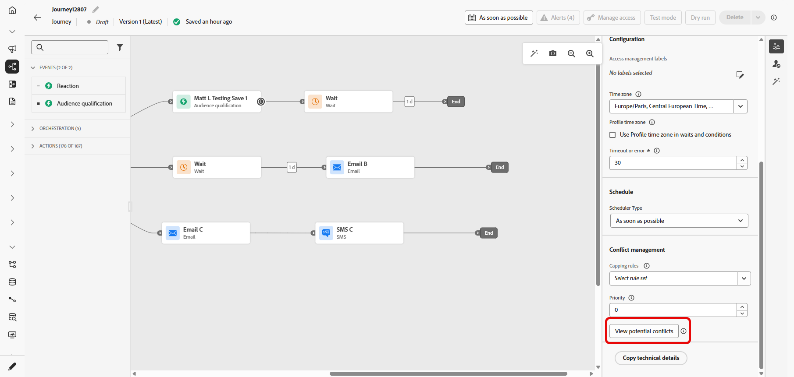
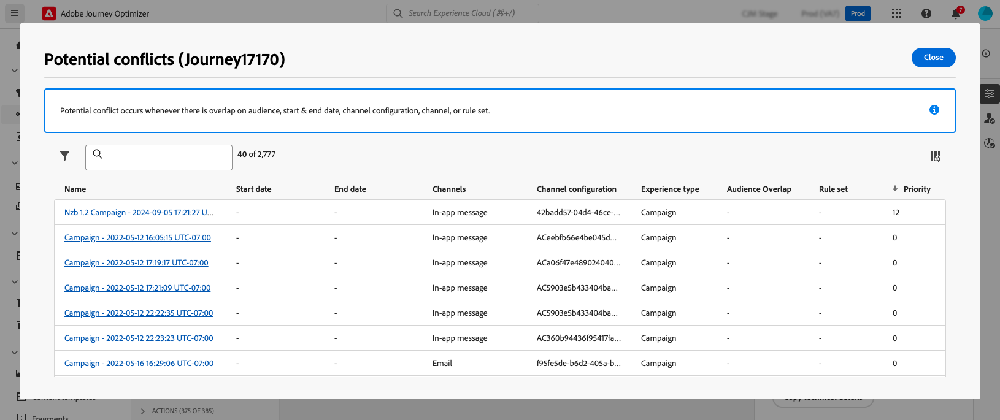

# 偵測歷程與行銷活動中的潛在衝突 {#conflict}

隨著行銷人員在Journey Optimizer中增加行銷活動和歷程的數量，行銷人員越來越難以知道他們是否透過過多的行銷互動轟炸其客戶。 因此，必須輕鬆識別何時有重疊的行銷活動和歷程，以確保在行銷通訊之間取得正確的平衡，同時降低客戶疲勞的風險。

要監控潛在重疊的主要區域包括：

* **時間表** （開始和結束日期）：同時執行過多歷程嗎？
* **對象**：我的歷程對象中有多少百分比同時屬於其他歷程？
* **頻道**：是否有其他通訊已排程為相同的時間範圍，如果是，有多少通訊？
* **上限規則集**：我為哪些型別的歷程設定上限，而且這些歷程中有重疊？
* **頻道設定**：是否有其他歷程或行銷活動使用同一歷程或行銷活動中使用的任何頻道設定，以防止向一般使用者顯示歷程或行銷活動？

➡️ [在影片中探索此功能](#video)

## Journey Optimizer如何偵測衝突 {#detection}

以下為Journey Optimizer識別歷程與行銷活動潛在衝突的方式摘要：

* **衝突識別範圍**：僅針對即時或排程的行銷活動和歷程顯示衝突。
* **單一歷程**：如果選取的歷程是單一的，則會顯示以相同事件開始的其他歷程，因為此事件將會觸發所有此類歷程。
* **對象資格和讀取對象/商業事件**&#x200B;歷程：如果選取的歷程是對象資格或讀取對象/商業事件歷程，則會顯示具有有效對象的所有相同型別歷程資料，因為對象之間可能會重疊。
* **行銷活動**：由於所有行銷活動都是以對象為目標，而且沒有事件的概念，因此所有行銷活動都可能與區段觸發的歷程衝突（從讀取對象活動開始）。
* **即時/排程行銷活動**：即時/排程行銷活動可能會因為可能的對象重疊而互相衝突。 對於任何特定行銷活動，所有即時或排程的行銷活動都會列在衝突檢視器中。

## 檢視特定歷程或行銷活動的已識別衝突 {#view}

>[!CONTEXTUALHELP]
>id="ajo_campaigns_campaign_conflict"
>title="檢視潛在衝突"
>abstract="有可能與其他行銷活動重疊時，皆要進行檢查。僅會呈現即時和已排程行銷活動的衝突。請注意，只要您指派以下任何一項設定，即可使用該按鈕：「**[!UICONTROL 開始/結束日期]**」、「**[!UICONTROL 客群]**」、「**[!UICONTROL 管道]**」、「**[!UICONTROL 管道設定]**」或「**[!UICONTROL 規則集]**」。"

>[!CONTEXTUALHELP]
>id="ajo_journey_conflict"
>title="檢視潛在衝突"
>abstract="有可能與其他歷程重疊時，皆要進行檢查。僅會呈現即時和已排程歷程的衝突。請注意，只要您指派以下任何一項設定，即可使用該按鈕：「**[!UICONTROL 開始/結束日期]**」、「**[!UICONTROL 客群]**」、「**[!UICONTROL 管道]**」、「**[!UICONTROL 管道設定]**」，或「**[!UICONTROL 規則集]**」。"

製作歷程或行銷活動時，Journey Optimizer可讓您檢查與其他歷程或行銷活動重疊的可能性。 要執行此操作，請依照下列步驟執行：

1. 在編寫歷程或行銷活動時，按一下歷程或行銷活動屬性中的&#x200B;**[!UICONTROL 檢視潛在衝突]**&#x200B;按鈕。

   

   >[!NOTE]
   >
   >當您指派下列任何設定時，**[!UICONTROL 檢視潛在衝突]**&#x200B;按鈕就會可供選取： **[!UICONTROL 開始/結束日期]**、**[!UICONTROL 對象]**、**[!UICONTROL 頻道]**、**[!UICONTROL 頻道設定]**&#x200B;以及&#x200B;**[!UICONTROL 規則集]**。 請確定您在指派這些設定後選取&#x200B;**[!UICONTROL 儲存]**，因為除非儲存變更，否則按鈕無法選取。

1. 會開啟&#x200B;**[!UICONTROL 潛在衝突]**&#x200B;視窗，讓您以視覺效果呈現與目前歷程/行銷活動重疊的所有元素。

   您可以選取名稱，從此畫面直接開啟重疊歷程或行銷活動。

   

   >[!NOTE]
   >
   >由於已實作快取，新發佈的歷程和行銷活動最長可能需要3-7分鐘才會顯示在衝突檢視器中。

若要進一步縮小潛在重疊的搜尋範圍，您可以根據相關的欄位來篩選行銷活動和歷程清單。 若要這麼做，請在詳細目錄檢視中選取篩選器圖示。 [瞭解如何使用篩選器](../start/search-filter-categorize.md#filter-lists)

## 解決衝突 {#resolve}

以下是識別潛在衝突後減少這些衝突的一些秘訣：

* 調整&#x200B;**開始/結束日期**，以避免行銷活動或歷程重疊。
* 調整&#x200B;**對象目標定位**&#x200B;以最小化歷程之間的重疊。
* 實作&#x200B;**頻率上限**&#x200B;以防止客戶接收太多通訊。
* 減少&#x200B;**作用中歷程**&#x200B;的數量，以更有效地管理客戶體驗。
* 設定傳入動作的&#x200B;**優先順序**，以確保向客戶顯示最重要的動作。

運用這些功能，您就能確保行銷努力一致，並在溝通策略中維持正確的平衡。

## 作法影片 {#video}

>[!VIDEO](https://video.tv.adobe.com/v/3435528?quality=12)
