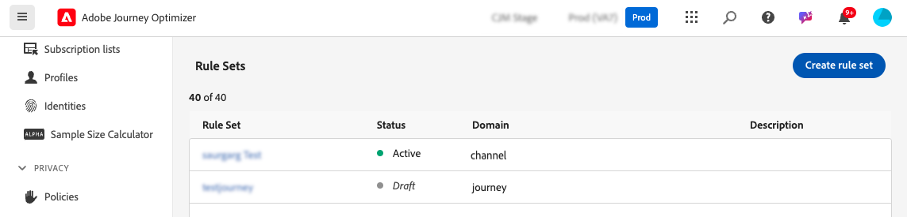
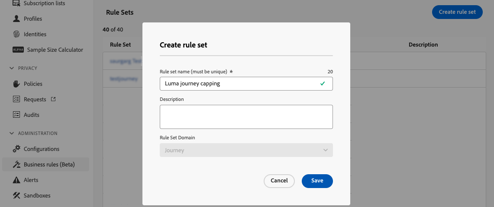
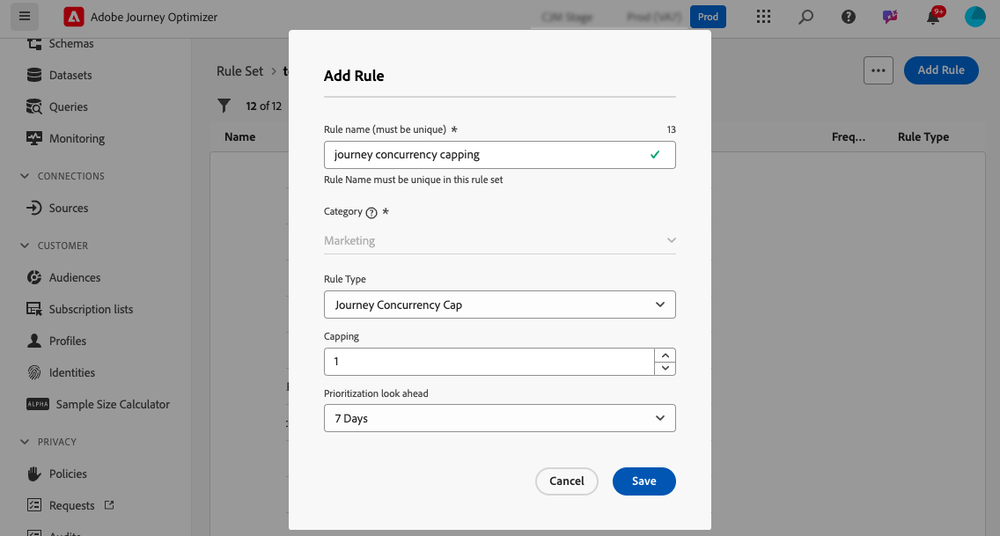
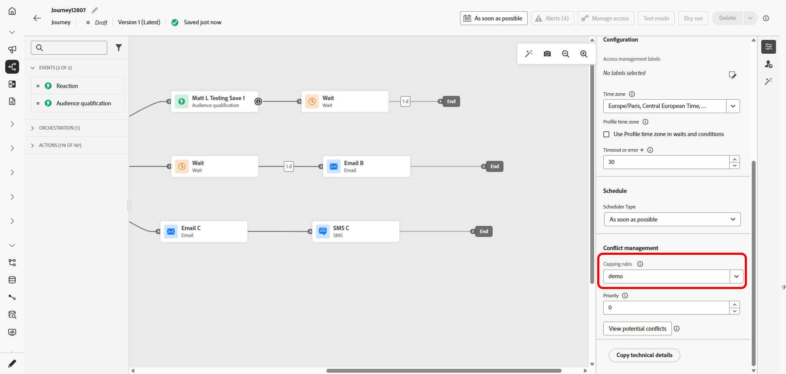
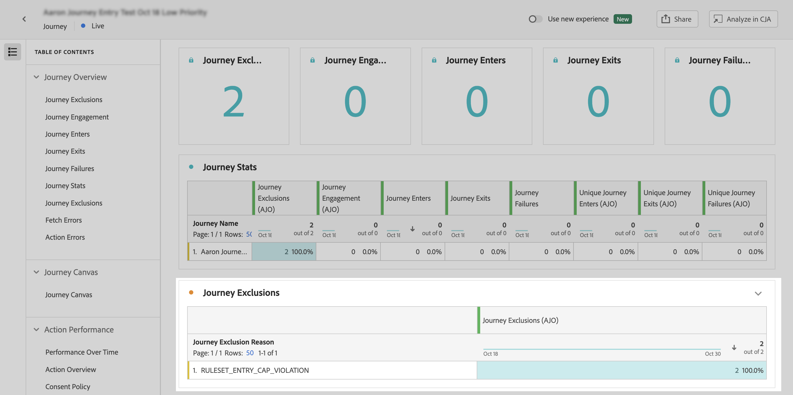

# 歷程上限與仲裁 {#journey-capping}

歷程上限可幫助您限制設定檔可註冊的歷程次數，防止通訊過載。 在Journey Optimizer中，您可以設定兩種型別的上限規則：

* **專案上限**&#x200B;會限制設定檔在指定期間內的歷程專案數。
* **並行上限**&#x200B;會限制設定檔可同時註冊的歷程數。

這兩種型別的歷程上限都利用優先順序分數來仲裁專案。

➡️ [在影片中探索此功能](#video)

## 建立歷程頻率上限規則 {#create-rule}

>[!CONTEXTUALHELP]
>id="ajo_rule_set_concurrency_prioritization"
>title="優先檢視"
>abstract=" 如果優先順序較高的歷程被安排在此指定時段，則客戶就會禁止進入此歷程。若您希望進入先到先接待的歷程情況，我們建議您先選擇每日優先檢視期間，確保當天任何其他歷程的優先順序分數一定會小於歷程的優先順序分數。給歷程的優先順序評分 100 分，也可確保已進入相同歷程。"

>[!CONTEXTUALHELP]
>id="ajo_rule_set_rule_type"
>title="規則類型"
>abstract="指定規則的頻率上限類型。「**[!UICONTROL 歷程進入頻率上限]**」會限制設定檔在特定期間內進入歷程的數量，而「**[!UICONTROL 歷程並行頻率上限]**」則是限制設定檔能夠同時註冊的歷程數量。"

若要建立歷程上限規則，請遵循下列步驟：

1. 導覽至&#x200B;**[!UICONTROL 商業規則]**&#x200B;功能表以存取規則集詳細目錄。

1. 選取您要新增上限規則的規則集，或建立新規則集：

   * 若要使用現有的規則集，請從清單中選取它。 歷程上限規則只能新增到具有「歷程」網域的規則集。 您可以在&#x200B;**[!UICONTROL 網域]**&#x200B;欄的規則集清單中檢查此資訊。

     

   * 若要在新規則集內建立上限規則，請按一下&#x200B;**[!UICONTROL 建立規則集]**，指定規則集的唯一名稱，並從&#x200B;**[!UICONTROL 規則集網域]**&#x200B;下拉式清單中選取「歷程」，然後按一下&#x200B;**[!UICONTROL 儲存]**。

     

1. 在規則集畫面中，按一下&#x200B;**[!UICONTROL 新增規則]**&#x200B;按鈕，然後提供規則的唯一名稱。

1. 在&#x200B;**[!UICONTROL 規則型別]**&#x200B;下拉式清單中，指定規則的上限型別。

   * **[!UICONTROL 歷程專案上限]**：限制設定檔在指定期間內進入歷程的專案數。
   * **[!UICONTROL 歷程並行上限]**：限制設定檔可同時註冊的歷程數。

   

1. 展開下列各節以瞭解如何設定每種型別的上限：

   +++設定歷程專案上限規則

   1. 在&#x200B;**[!UICONTROL 上限]**&#x200B;欄位中，設定設定檔可輸入的歷程數目上限。
   1. 在&#x200B;**[!UICONTROL 期間]**&#x200B;欄位中，定義要考慮的時間段。 請注意，持續時間是根據UTC時區。 例如，每日上限將在UTC午夜重設。

   在此範例中，我們要限制設定檔在一個月內輸入超過「5」個歷程。

   

   >[!NOTE]
   >
   >系統會考量套用此相同規則之即將排程歷程的優先順序。
   >
   >在此範例中，如果行銷人員已輸入4個歷程，而本月有另一個具有較高優先順序的即將排程歷程，則會抑制客戶進入較低優先順序的歷程。

   +++

   +++設定歷程並行上限規則 

   1. 在&#x200B;**[!UICONTROL 上限]**&#x200B;欄位中，設定設定檔可同時註冊的歷程數上限。

   1. 使用&#x200B;**[!UICONTROL 優先順序檢視]**&#x200B;欄位，根據所選期間（例如1天、7天、30天）的優先順序分數仲裁歷程專案。

      此選項會掃描一週剩餘時間中即將排程的讀取對象歷程，以判斷是否應由於較高優先順序的歷程出現而抑制設定檔進入歷程。 如果設定檔符合多個歷程的資格，這有助於排定進入較高價值歷程的優先順序。

   在此範例中，如果設定檔已註冊到包含相同規則集的另一個歷程，我們會限制設定檔進入歷程。 如果未來7天內的另一個歷程有較高的優先順序分數，則設定檔不會進入此歷程。

   {width="50%" zommable="yes"}

   +++

1. 重複上述步驟，視需求將任意數量的規則新增至規則集。

1. 當上限規則準備好套用至歷程時，請啟動已新增該規則的規則和規則集。 [瞭解如何啟用規則集](../conflict-prioritization/rule-sets.md#create)

## 將頻率上限規則套用至歷程 {#apply-capping}

>[!CONTEXTUALHELP]
>id="ajo_journey_capping_rule"
>title="將規則集套用至歷程"
>abstract="依頻率上限規則規定，套用規則設定，即可針對部分對象，排除此歷程。"

若要將上限規則套用至歷程，請存取歷程並開啟其屬性。 在&#x200B;**[!UICONTROL 上限規則]**&#x200B;下拉式清單中，選取相關的規則集。 一旦啟動歷程，規則集中定義的上限規則將生效。

>[!NOTE]
>
>如果立即啟動歷程，系統最多可能需要10分鐘才能開始抑制客戶。 因此，如果您嘗試發佈開始時間少於10分鐘的歷程，則會顯示訊息。

## 監視規則集排除 {#monitor}

歷程上線後，如果規則集導致在&#x200B;**[!UICONTROL 歷程排除]**&#x200B;表格中從歷程排除任何專案，您可以簽入歷程報告。 「歷程排除專案」表格包含依規則集和規則名稱的排除專案詳細劃分，深入分析設定檔遭到捨棄的原因。 [瞭解如何使用歷程報告](../reports/journey-global-report-cja.md)

此外，您可以使用[Adobe Experience Platform查詢服務](https://experienceleague.adobe.com/docs/experience-platform/query/api/getting-started.html?lang=zh-Hant){target="_blank"}來建立查詢，以識別導致設定檔無法進入指定歷程的規則。 [此區段](../reports/query-examples.md#common-queries)中有查詢範例。

## 作法影片 {#video}

>[!VIDEO](https://video.tv.adobe.com/v/3447626?quality=12&captions=chi_hant)
