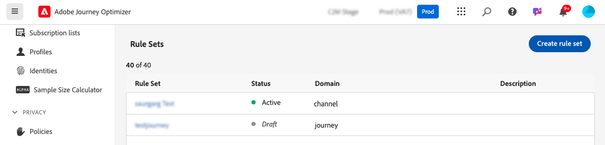
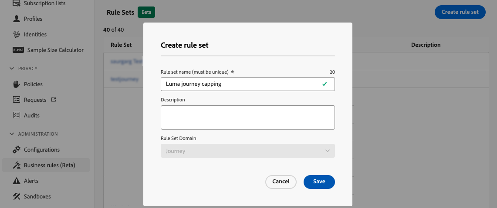
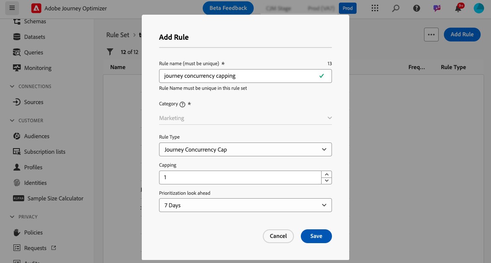
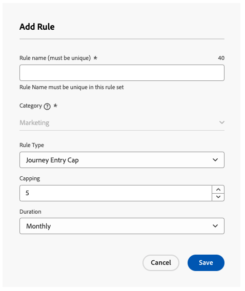
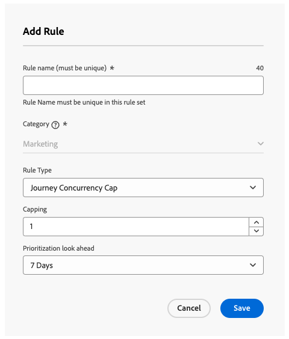
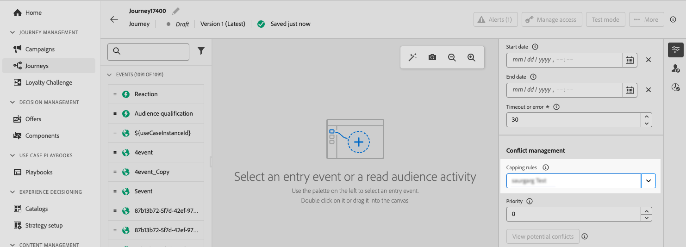
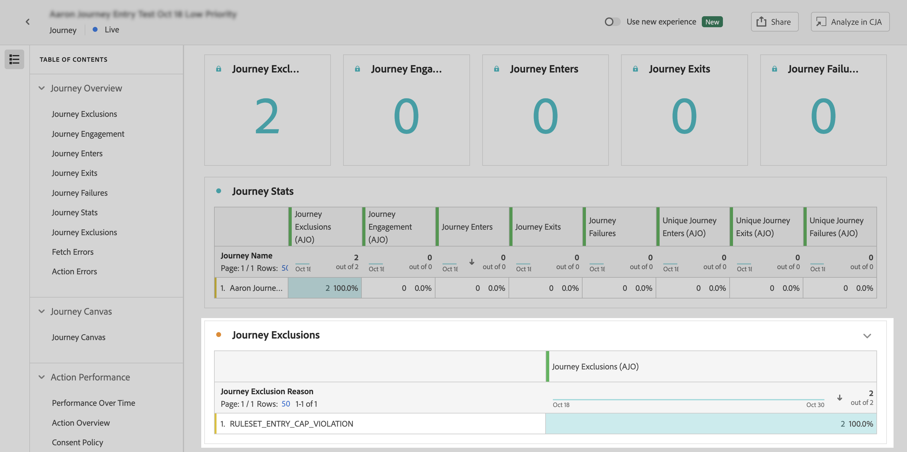

# 歷程上限與仲裁 {#journey-capping}

歷程上限可幫助您限制設定檔可註冊的歷程次數，防止通訊過載。 在Journey Optimizer，可以設定兩種類型的封閉規則：

* **條目上限**&#x200B;限制配置檔案給定時段內的行程條目數。
* **併發上限設定**&#x200B;限制可同時註冊配置檔案的次數。

這兩種類型的行程上限都利用優先順序分數來仲裁條目。

➡️ [在影片中探索此功能](#video)

## 建立歷程頻率上限規則 {#create-rule}

>[!CONTEXTUALHELP]
>id="ajo_rule_set_concurrency_prioritization"
>title="優先檢視"
>abstract=" 如果優先順序較高的歷程被安排在此指定時段，則客戶就會禁止進入此歷程。若您希望進入先到先接待的歷程情況，我們建議您先選擇每日優先檢視期間，確保當天任何其他歷程的優先順序分數一定會小於歷程的優先順序分數。給歷程的優先順序評分 100 分，也可確保已進入相同歷程。"

>[!CONTEXTUALHELP]
>id="ajo_rule_set_rule_type"
>title="規則類型"
>abstract="指定規則的頻率上限類型。「**[!UICONTROL 歷程進入頻率上限]**」會限制設定檔在特定期間內進入歷程的數量，而「**[!UICONTROL 歷程並行頻率上限]**」則是限制設定檔能夠同時註冊的歷程數量。"

要建立行程上限設定規則，請執行以下步驟：

1. 導航到&#x200B;**[!UICONTROL 業務規則]**&#x200B;菜單以訪問規則集清單。

1. 選擇要添加上限設定規則的規則集，或建立新規則集：

   * 要使用現有規則集，請從清單中選擇該規則集。 只能將行程上限設定規則添加到具有「行程」域的規則集。 您可以在&#x200B;**[!UICONTROL 域]**&#x200B;列的規則集清單中檢查此資訊。

     

   * 要在新規則集內建立上限設定規則，請按一下&#x200B;**[!UICONTROL 建立規則集]**，為規則集指定唯一名稱，然後從&#x200B;**[!UICONTROL 規則集域]**&#x200B;下拉清單中選擇「行程」，然後按一下&#x200B;**[!UICONTROL 保存]**。

     

1. 在規則集畫面中，按一下&#x200B;**[!UICONTROL 新增規則]**&#x200B;按鈕，然後提供規則的唯一名稱。

1. 在&#x200B;**[!UICONTROL 規則型別]**&#x200B;下拉式清單中，指定規則的上限型別。

   * **[!UICONTROL 歷程專案上限]**：限制設定檔在指定期間內進入歷程的專案數。
   * **[!UICONTROL 歷程並行上限]**：限制設定檔可同時註冊的歷程數。

   

1. 展開下列各節以瞭解如何設定每種型別的上限：

   +++配置行程條目上限設定規則

   1. 在&#x200B;**[!UICONTROL 上限設定]**&#x200B;欄位中，設定配置檔案可以輸入的最大行程數。
   1. 在&#x200B;**[!UICONTROL 持續時間]**&#x200B;欄位中，定義要考慮的時間段。 請注意，持續時間基於UTC時區。 例如，每日上限將在午夜UTC時重置。

   在此示例中，我們希望限制配置檔案在一個月內輸入超過「5」個旅程。

   

   >[!NOTE]
   >
   >該系統將考慮即將進行的對其適用同樣規則的預定行程的優先次序。
   >
   >在此範例中，如果行銷人員已輸入4個歷程，而本月有另一個具有較高優先順序的即將排程歷程，則會抑制客戶進入較低優先順序的歷程。

   +++

   +++設定歷程並行上限規則 

   1. 在&#x200B;**[!UICONTROL 上限]**&#x200B;欄位中，設定設定檔可同時註冊的歷程數上限。

   1. 使用&#x200B;**[!UICONTROL 優先順序檢視]**&#x200B;欄位，根據所選期間（例如1天、7天、30天）的優先順序分數仲裁歷程專案。

      此選項會掃描一週剩餘時間中即將排程的讀取對象歷程，以判斷是否應由於較高優先順序的歷程出現而抑制設定檔進入歷程。 如果配置檔案適合多次旅行，它有助於優先進入價值更高的旅行。

   在本例中，如果配置檔案已登記到包含相同規則集的另一個行程，則我們將限制它們輸入行程。 如果接下來7天內的另一個行程的優先順序分數較高，則配置檔案將不會輸入此行程。

   {width="50%" zommable="yes"}

   +++

1. 重複上述步驟，根據需要向規則集添加多個規則。

1. 當上限設定規則準備應用於行程時，激活規則和已添加規則的規則集。 [瞭解如何激活規則集](../conflict-prioritization/rule-sets.md#Create)

## 將頻率上限規則套用至歷程 {#apply-capping}

>[!CONTEXTUALHELP]
>id="ajo_journey_capping_rule"
>title="將規則集套用至歷程"
>abstract="依頻率上限規則規定，套用規則設定，即可針對部分對象，排除此歷程。"

若要將上限規則套用至歷程，請存取歷程並開啟其屬性。 在&#x200B;**[!UICONTROL 上限規則]**&#x200B;下拉式清單中，選取相關的規則集。 一旦啟動歷程，規則集中定義的上限規則將生效。

>[!NOTE]
>
>如果立即啟動歷程，系統最多可能需要10分鐘才能開始抑制客戶。 因此，如果您嘗試發佈開始時間少於10分鐘的歷程，則會顯示訊息。

## 監視規則集排除 {#monitor}

歷程上線後，如果規則集導致在&#x200B;**[!UICONTROL 歷程排除]**&#x200B;表格中從歷程排除任何專案，您可以簽入歷程報告。 「歷程排除專案」表格包含依規則集和規則名稱的排除專案詳細劃分，深入分析設定檔遭到捨棄的原因。 [瞭解如何使用歷程報告](../reports/journey-global-report-cja.md)

此外，您可以使用[Adobe Experience Platform查詢服務](https://experienceleague.adobe.com/docs/experience-platform/query/api/getting-started.html){target="_blank"}來建立查詢，以識別導致設定檔無法進入指定歷程的規則。 [此區段](../reports/query-examples.md#common-queries)中有查詢範例。

## 作法影片 {#video}

>[!VIDEO](https://video.tv.adobe.com/v/3435530?quality=12)
