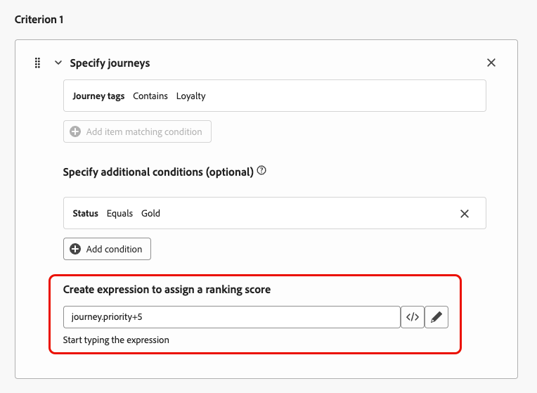
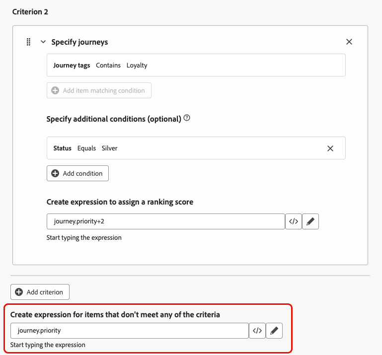

# 使用公式來排名歷程 {#journey-ranking-formulas}

>[!AVAILABILITY]
>
>此功能目前處於「有限可用性」。 請聯絡您的 Adobe 代表以取得存取權。

[!DNL Adobe Journey Optimizer]可協助您控制當設定檔符合超出系統允許範圍的資格時，可輸入哪些歷程。 若要這麼做，您可以使用[規則集](rule-sets.md)來定義歷程專案或並行的最大值。 當設定檔符合的歷程數量超過上限允許時，指派給每個歷程的優先順序將決定選取的歷程。

您也可以使用&#x200B;**排名公式**，以根據歷程屬性、設定檔屬性或AI模型分數來動態調整歷程排名，而不使用優先順序。

公式可提供比靜態優先順序更大的彈性。 例如，您可以促進金級忠誠會員的歷程。

<!--
>[!NOTE]
>
>Journey ranking formulas follow the same guardrails as decisioning ranking formulas (nesting depth, rule string size). [Learn more about Decisioning guardrails & limitations](../experience-decisioning/decisioning-guardrails.md#ranking-formulas).-->

## 建立排名公式 {#create-journey-ranking-formula}

若要建立歷程的排名公式，請遵循下列步驟。

1. 存取&#x200B;**[!UICONTROL 協調流程排名]**&#x200B;區段，然後選取&#x200B;**[!UICONTROL 排名公式]**&#x200B;索引標籤。 此時會顯示先前建立的公式清單。

1. 按一下&#x200B;**[!UICONTROL 建立公式]**。

1. 指定公式名稱，並視需要新增說明。

   {width="80%"}

   >[!NOTE]
   >
   >排名物件是將套用排名公式的實體。 依預設，排名物件設定為&#x200B;**[!UICONTROL 歷程]**。

   <!--
    Selecting a formula entity specifies which type of item—such as journeys or other entities—the ranking formula will apply to. This determines the context in which the formula operates, allowing you to define rules that influence how those items are ranked.-->

1. 或者，按一下&#x200B;**[!UICONTROL 選取AI模型]**&#x200B;以設定模型，此模型將作為建立排名公式的參考。 [了解更多](journey-ai-models.md)

<!--
    >[!NOTE]
    >
    >[Personalized optimization models](../experience-decisioning/ranking/personalized-optimization-model.md) using continuous metrics are not supported with the AI formula builder.

    Every time you refer to a model score when defining your formula below, the AI model that you selected will be used. [Learn more on AI models](../experience-decisioning/ranking/ai-models.md)-->

1. 在&#x200B;**[!UICONTROL 條件1]**&#x200B;區段中，執行下列動作，指定您要套用排名分數的歷程：

   * 選取[歷程屬性](../building-journeys/journey-properties.md) （例如歷程名稱、標籤、優先順序或其他歷程屬性）；
   * 選取邏輯運運算元；
   * 新增符合條件 — 您可以輸入/選取值，或選擇設定檔屬性。

   {width="70%"}

1. 或者，您可以指定其他元素，將條件的符合條件調整為true。

   {width="70%"}

   例如，您已定義&#x200B;*條件1* （例如&#x200B;*歷程標籤*）包含&#x200B;*忠誠度*。 此外，您可以新增其他條件，例如，如果&#x200B;*忠誠度狀態*&#x200B;等於&#x200B;*黃金*，則&#x200B;*條件1*&#x200B;為true。

1. 建立運算式，將排名分數指派給符合上述條件之歷程。 您可以參考下列任一專案：
   * 變數：
      * 歷程優先順序，這是在[建立歷程](../building-journeys/journey-gs.md)時指派給歷程的手動值；
      * 來自於您在上方選擇選取的AI模型分數；
   * 屬性：
      * 可能存在於設定檔上的任何屬性，例如任何外部衍生的傾向分數；
      * 歷程屬性；
   * 能以自由格式指派的靜態值；
   * 以上各項的組合。

   {width="70%"}

1. 按一下[新增條件]&#x200B;**&#x200B;**，視需要多次新增一或多個條件。 邏輯如下：
   * 如果指定決策專案的第一個條件為true，則其優先於下一個條件。
   * 如果不為true，則決策引擎會繼續執行第二個標準，以此類推。

1. 定義所有條件後，在最後一個欄位中，您可以建立運算式，將指派給不符合上述條件的所有歷程。

   不符合任何條件的歷程的{width="70%"}

1. 按一下&#x200B;**[!UICONTROL 建立]**&#x200B;以完成您的排名公式。

您現在可以從清單中選取此公式以檢視其詳細資訊，並編輯或刪除它。 然後，當您設定規則集時即可使用該功能。 [了解作法](#assign-formula-to-ruleset)

### 排名公式範例 {#journey-ranking-formula-example}

請參考下列範例。

+++範例1：根據歷程標籤使用歷程優先順序或AI分數

{width="60%"}

如果歷程有「行銷」標籤，則排名分數是歷程優先順序。

{width="60%"}

如果歷程有「促銷」標籤，則排名分數是AI模型分數。

+++

+++範例2：透過設定檔狀態提升忠誠度歷程

{width="60%"}

如果歷程具有「忠誠度」標籤，且設定檔的忠誠度狀態為「金級」，則使用的排名分數是歷程優先順序加5。

{width="60%"}

如果歷程具有「忠誠度」標籤，且設定檔的忠誠度狀態為「銀級」，則排名分數為歷程優先順序加2。

如果不符合上述任何條件，則使用的排名分數是歷程優先順序。

+++

### 使用程式碼編輯器 {#journey-ranking-formula-code-editor}

若要以&#x200B;**PQL語法**&#x200B;表示排名公式，請使用熒幕右上角的專用按鈕切換至程式碼編輯器。 如需如何使用PQL語法的詳細資訊，請參閱[專屬檔案](https://experienceleague.adobe.com/docs/experience-platform/segmentation/pql/overview.html?lang=zh-Hant)。

>[!CAUTION]
>
>此動作將阻止您返回此公式的預設產生器檢視。

然後，您可以利用歷程屬性、設定檔屬性和靜態值來建立排名公式。

<!--The code editor is similar to the one used in Decisioning ranking formulas. [Learn more](../experience-decisioning/ranking/ranking-formulas.md#ranking-code-editor)-->

## 將公式指派給規則集 {#assign-formula-to-ruleset}

若要使用公式來排名您的歷程，您必須將其指派給規則集。

>[!NOTE]
>
>公式是在規則集層級指派，而不是在個別歷程上指派。

1. 從&#x200B;**[!UICONTROL 商業規則]**&#x200B;功能表，建立您要用於歷程仲裁的規則集。 [了解作法](rule-sets.md#Create)

1. 請務必選取&#x200B;**[!UICONTROL 歷程]**&#x200B;網域。

   {width="60%"}

1. 在規則集屬性中，將&#x200B;**[!UICONTROL 排名方法]**&#x200B;設定為&#x200B;**[!UICONTROL 公式]** （而不是預設的&#x200B;**[!UICONTROL 優先順序]**）。

1. 從下拉式清單中選取您建立的排名公式。

   {width="60%"}

1. 建立您要新增至規則集的歷程上限規則。 [了解作法](journey-capping.md#create-rule)

1. 儲存規則集。

現在，公式已指派給規則集。 然後，您可以將該規則集套用至您的歷程。

## 將規則集套用至歷程 {#assign-rule-set-to-journey}

若要將規則集指派給歷程，請遵循下列步驟。

1. 建立或開啟您要指派規則集的歷程。 [了解如何建立歷程](../building-journeys/journey-gs.md)

1. 在歷程屬性中，從下拉式清單中選取規則集。  [瞭解如何進行](journey-capping.md#apply-capping)。

   >[!NOTE]
   >
   >一次只能將一個規則集套用至歷程。

1. 儲存歷程。

套用上限時，使用此規則集的所有歷程都會依選取的公式排名。

若要監視規則集和排名公式的執行方式，請參閱概述報告中的[歷程上限和衝突](../reports/channel-report-cja.md#rule-sets)區段。

<!--
## Reporting {#reporting}

Reporting for journey arbitration helps you understand how rule sets and ranking formulas perform:

* **Exclusions** – Whether journeys were excluded from users and which rule set (and reason) prevented entry.
* **Rule set performance** – For each rule set, metrics such as journey enters, journey exclusions, journey engagement, and other optimization metrics.
* **Cross-journey view** – Time-based view of profiles across journeys (e.g. journey enters, failures, exclusions) to see the impact of capping and ranking.

Use these reports to validate that your formulas and caps are behaving as intended and to tune ranking logic over time.-->
