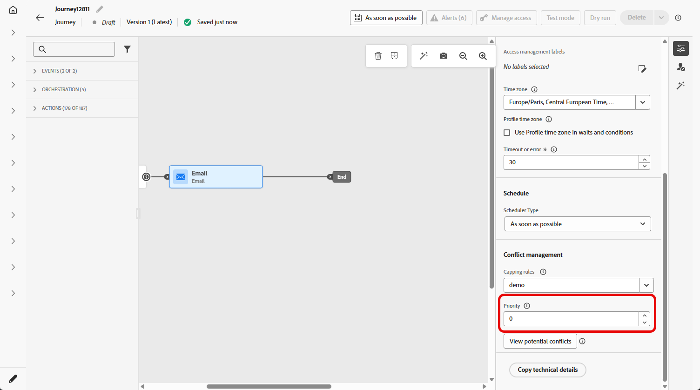
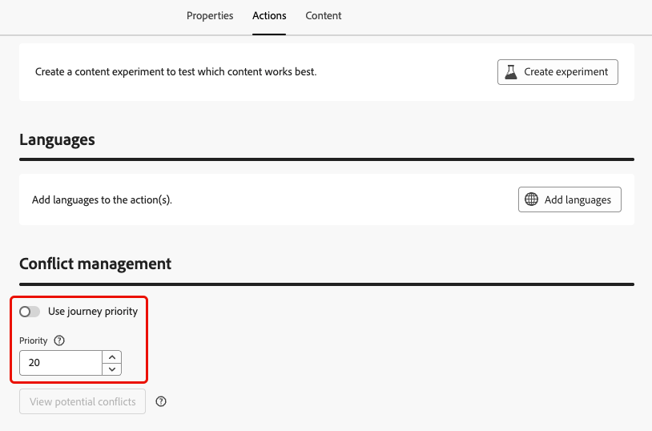

# 指派優先順序分數 {#priority}

Journey Optimizer可讓您指派優先順序分數給歷程、行銷活動或歷程&#x200B;**[!UICONTROL 動作]**&#x200B;活動中的傳入頻道動作。

當有強制的限制（例如頻率上限）時，優先順序對於優先處理歷程、行銷活動或動作至關重要。

如果客戶符合許多歷程、行銷活動或通訊的資格，而您想要選擇他們應該輸入和接收的欄位，則應利用此欄位。

## 指派歷程和行銷活動的優先順序分數 {#priority-journey-campaign}

>[!CONTEXTUALHELP]
>id="ajo_campaigns_campaign_priority"
>title="優先順序"
>abstract="指派行銷活動的優先順序分數。當行銷活動必須遵守強制施加的限制 (例如頻率上限) 時，必須透過優先順序來確定行銷活動的優先次序。 請輸入數值 (從 0 到 100)。請注意，數字越大，表示優先順序越高。若遇到兩項行銷活動的優先順序分數相同的情況，將會顯示先啟動的行銷活動。"

>[!CONTEXTUALHELP]
>id="ajo_journey_priority"
>title="優先順序"
>abstract="指派歷程的優先順序分數。當歷程必須遵守強制施加的限制 (例如頻率上限) 時，必須透過優先順序來確定歷程的優先次序。 請輸入數值 (從 0 到 100)。請注意，數字越大，表示優先順序越高。若遇到兩項歷程的優先順序分數相同的情況，將會顯示先啟動的歷程。"

➡️ [在影片中探索此功能](#video)

指派優先順序分數對於傳入通訊（例如Web、行動和應用程式內）至關重要。 如果您有多個使用相同管道設定的行銷活動（例如網頁頂端的橫幅），可能會造成問題，因為只顯示一個行銷活動的內容是可行的。 當收件者可能有資格參加多個行銷活動時，優先順序分數是您將插入應顯示哪個行銷活動的偏好設定的位置。

>[!NOTE]
>
>在行銷活動中，優先順序分數僅適用於網頁、應用程式內和程式碼型傳入頻道。

若要指派優先順序分數給歷程或行銷活動，請在歷程或行銷活動屬性中的&#x200B;**[!UICONTROL 優先順序分數]**&#x200B;欄位中輸入數值（從0到100）。 數字愈高，優先順序愈高。

如果您創作此行銷活動，且想確定此行銷活動內容已顯示，您可以給予100分。

>[!IMPORTANT]
>
>如果兩個歷程或行銷活動擁有相同的優先順序分數，則系統沒有繫結機制。 確保優先順序分數是唯一的，以避免衝突。

## 將優先順序分數指派給傳入頻道動作 {#priority-action}

>[!CONTEXTUALHELP]
>id="ajo_journey_action_priority"
>title="優先順序"
>abstract="指派歷程動作的優先順序分數。當有多個歷程動作或行銷活動使用相同的通道設定時，必須透過優先順序來確定入站動作的優先次序。 請輸入數值 (從 0 到 100)。請注意，數字越大，表示優先順序越高。預設情況下，動作的優先順序分數會繼承歷程的整體優先順序分數。"

Journey Optimizer也可讓您為&#x200B;**[!UICONTROL 動作]**&#x200B;活動內的傳入頻道動作指派優先順序分數。

這可讓您在有多個歷程動作或行銷活動使用相同管道設定時，優先處理傳入動作。

>[!NOTE]
>
>在&#x200B;**[!UICONTROL 動作]**&#x200B;活動中，優先順序分數僅適用於網頁、應用程式內和程式碼型傳入頻道。

在&#x200B;**[!UICONTROL 衝突管理]**&#x200B;區段中，預設會選取&#x200B;**[!UICONTROL 使用歷程優先順序]**&#x200B;選項，這表示動作的優先順序分數繼承自歷程的整體優先順序分數。

若要將優先順序分數指派給&#x200B;**[!UICONTROL 動作]**&#x200B;活動中定義的輸入動作，請取消選取&#x200B;**[!UICONTROL 使用歷程優先順序]**&#x200B;選項，並在&#x200B;**[!UICONTROL 優先順序]**&#x200B;欄位中輸入數值（從0到100）。 數字愈高，優先順序愈高。

{width=70%}

## 作法影片 {#video}

>[!VIDEO](https://video.tv.adobe.com/v/3445012?quality=12&captions=chi_hant)
