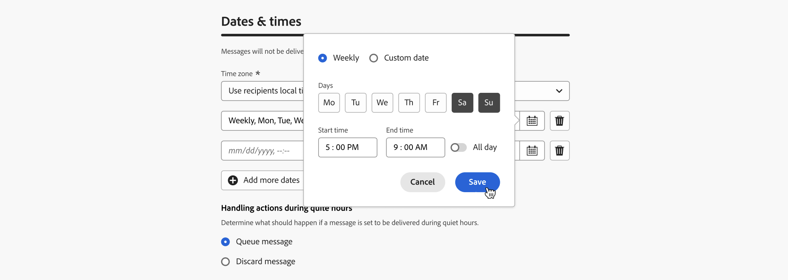
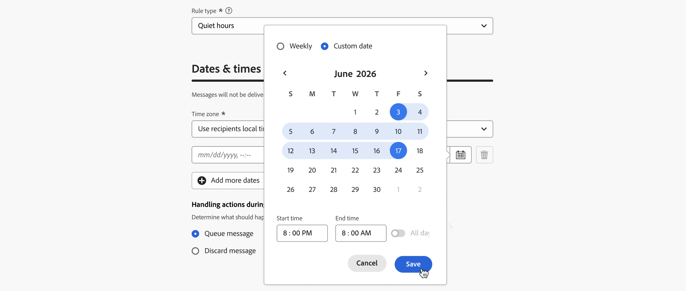
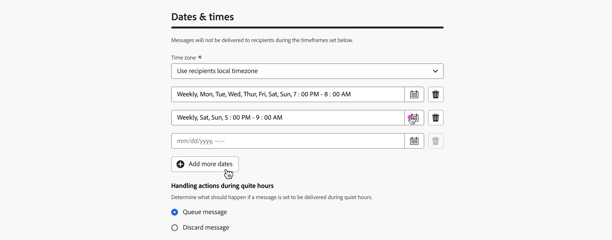
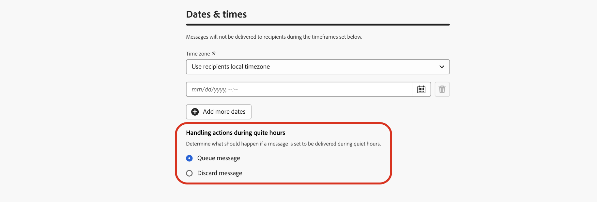
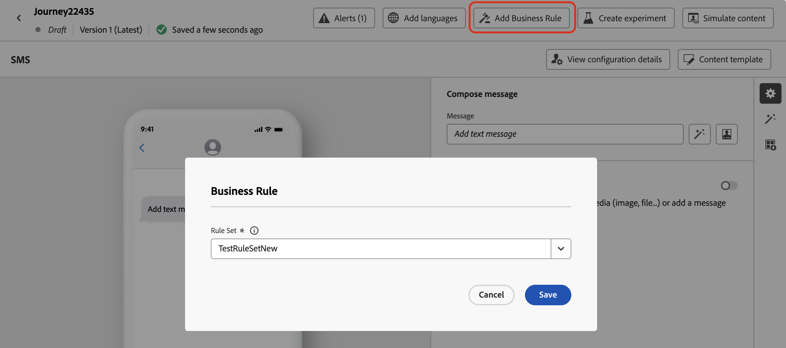
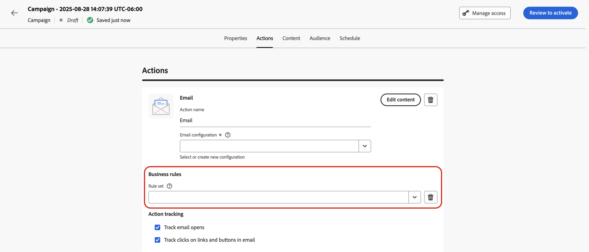
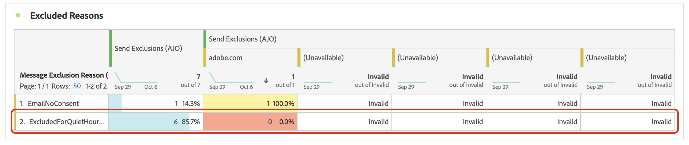
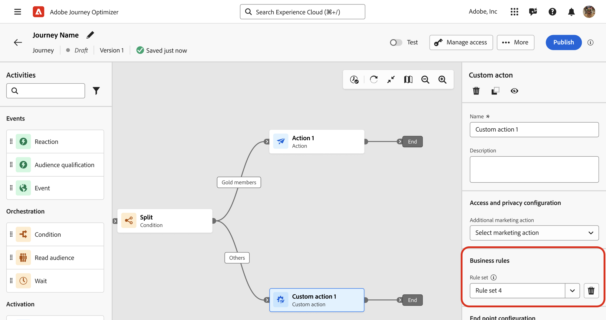

# 設定勿打擾時間 {#quiet-hours}

## 什麼是無訊息時數

**無訊息時數**&#x200B;可讓您定義&#x200B;**電子郵件**、**簡訊**、**推播**&#x200B;及&#x200B;**WhatsApp**&#x200B;管道的時間排除專案。 此功能可確保在特定時段內不會傳送任何訊息，協助您遵守客戶偏好設定和合規性要求。

您可以透過&#x200B;**規則集**&#x200B;套用無訊息時數，這些規則集可指派給行銷活動或歷程中的個別動作，以進行精確控制。

透過簡化這些程式，您可以改善客戶體驗、節省時間，並確保遵守通訊規則：

* **不要喚醒您的客戶** - *正確的客戶、正確的頻道、正確的時間是許多行銷人員的信條*，因此時機是客戶歷程的關鍵部分是很合理的。 透過設定「無訊息時數」規則，品牌更能掌控連絡人何時收到訊息，確保他們在更有可能對您的訊息採取行動時收到訊息。
* **便利性** — 當您需要防止對象收到訊息而不需要停止整個歷程或行銷活動時，可以輕鬆地攔截跨行銷活動和歷程的通訊。
* **省時** — 透過建立&#x200B;**以時間為基礎的規則**&#x200B;在一個位置管理排除專案，而不是透過自訂運算式新增多個條件節點。\
  <!--* **Extra Safeguard** - Benefit from an extra safeguard in case audience criteria or time-window configurations were incorrectly set, ensuring individuals are still excluded when they should be.-->

>[!AVAILABILITY]
>
>目前勿打擾時間規則僅開放給部分組織使用 (有限可用性)。若要新增至輪候表，請聯絡您的 Adobe 代表。

➡️ [在影片中探索此功能](#video)

## 護欄和限制

* **支援的管道** — 電子郵件、簡訊、推播和WhatsApp。
  <!--* **Custom actions** – For custom actions, only quiet hours rules are enforced. If a rule set also includes other rules (e.g., frequency capping), those rules are ignored.-->
* **傳輸延遲** — 無訊息時數規則的更新可能需要最多12小時才能套用至已使用該規則的管道動作。
  <!--* **Pre-suppression window** – The system begins suppressing communications 30 minutes before quiet hours start, ensuring that no messages are delivered once the quiet period begins.-->
* **大量延遲** — 若是大量通訊，系統可能需要額外的時間，才能開始成功強制實施無訊息小時抑制。

## 建立無訊息小時規則

若要設定無訊息時數，請在自訂規則集中建立規則。 請依照下列步驟操作：

1. 導覽至&#x200B;**[!UICONTROL 商業規則]**&#x200B;以存取規則集詳細目錄。

1. 選擇現有的自訂規則集或建立新的自訂規則集：

   +++在現有規則集中建立無訊息時數規則

   從詳細目錄選取規則集。 安靜時間規則只能新增到具有「管道」網域的規則集。 您可以在&#x200B;**[!UICONTROL 網域]**&#x200B;資料行中檢查此資訊。

   

   +++

   +++在新規則集中建立無訊息小時規則

   按一下&#x200B;**[!UICONTROL 建立規則集]**，輸入唯一的名稱，然後從&#x200B;**[!UICONTROL 規則集網域]**&#x200B;下拉式清單中選取「管道」。

   

   +++

   >[!NOTE]
   >
   >安靜時間只能在&#x200B;**自訂規則集**&#x200B;中定義。 全域規則集不支援無訊息時間設定。

1. 在規則集畫面中，按一下&#x200B;**[!UICONTROL 新增規則]**，並為規則提供唯一名稱。

1. **類別**&#x200B;欄位指定規則套用的訊息類別。 目前此欄位為唯讀，預設為&#x200B;**[!UICONTROL 行銷]**。

1. 在&#x200B;**[!UICONTROL 規則型別]**&#x200B;下拉式清單中，選取&#x200B;**[!UICONTROL 無訊息時數]**。

   

1. 在&#x200B;**[!UICONTROL 日期與時間]**&#x200B;區段中，定義何時套用無訊息時數：

   1. 選擇要使用的&#x200B;**[!UICONTROL 時區]**：

      * **[!UICONTROL UTC/GMT]** — 將標準GMT時間範圍套用至對象中的所有收件者，不論其個別時區為何。
      * **[!UICONTROL 使用收件者當地時區]** — 使用每個設定檔的時區欄位。 [進一步瞭解歷程中的時區管理](../building-journeys/timezone-management.md#timezone-from-profiles)

        >[!IMPORTANT]
        >
        >如果設定檔沒有時區值，則不會對該設定檔強制執行無訊息時數。

   1. 指定應套用免打擾時間的時段。

      * **[!UICONTROL 每週]** — 選擇一週中的特定日期和時段。 您也可以強制執行規則&#x200B;**[!UICONTROL 全天]** （此選項最多只能連續3天使用）。

        

      * **[!UICONTROL 自訂日期]** — 選擇行事曆和時程表中的特定日期。 您也可以強制執行規則&#x200B;**[!UICONTROL 全天]** （此選項最多只能連續3天使用）。

        

   1. 按一下「**[!UICONTROL 新增更多日期]**」按鈕，最多可新增5個不同的句號。

      

1. 在&#x200B;**[!UICONTROL 安靜時數期間的處理動作]**&#x200B;區段中，選擇在選取的時段內如何處理訊息：

   

   * **[!UICONTROL 佇列訊息]** — 訊息會在無訊息時段的完成時傳送，除非處於暫停狀態。

     >[!NOTE]
     >
     >此選項僅適用於歷程動作。 如果套用至行銷活動動作，其行為將與選取&#x200B;**[!UICONTROL 捨棄訊息]**&#x200B;選項相同。

   * **[!UICONTROL 捨棄訊息]** — 永不傳送訊息。 如果您希望包含訊息的歷程或行銷活動以取消傳送結束，請選取&#x200B;**[!UICONTROL 捨棄並退出歷程或行銷活動]**。

## 套用無訊息時間至歷程與行銷活動 {#apply}

儲存規則並啟用規則集後，您就可以將其套用至歷程和行銷活動中的動作。 支援的管道： **電子郵件、簡訊、推播、WhatsApp**。 瀏覽以下標籤以取得更多詳細資訊。

>[!BEGINTABS]

>[!TAB 在歷程中套用無訊息時數管道動作]

1. 開啟您的歷程，選取[頻道動作](../building-journeys/journeys-message.md)，並編輯訊息的內容。
1. 按一下&#x200B;**[!UICONTROL 新增商業規則]**&#x200B;按鈕，然後選取包含「無訊息時數」規則的規則集。

   

   >[!NOTE]
   >
   >只有[個已啟動](#activate-rule)的規則集會顯示在清單中。

1. 啟用您的歷程。

>[!TAB 套用無訊息小時至行銷活動動作]

1. 編輯您的行銷活動並存取&#x200B;**[!UICONTROL 動作]**&#x200B;標籤。
1. 在&#x200B;**[!UICONTROL 商業規則]**&#x200B;區段中，選取包含Quiet hours規則的規則集。

   

   >[!NOTE]
   >
   >只有[個已啟動](#activate-rule)的規則集會顯示在清單中。

1. 啟用您的行銷活動。

>[!ENDTABS]

## 後續步驟

一旦您的歷程或行銷活動啟動並執行，您就可以在[Customer Journey Analytics報告](../reports/report-gs-cja.md)和[即時報告](../reports/live-report.md)中檢視從通訊排除的設定檔數目，其中安靜時數規則將會列為使用者被排除傳送的可能原因。

<!--

>[!TAB Apply Quiet hours to custom actions]

1. Open your journey and add or select a custom action in the canvas.

1. In the **[!UICONTROL Business rules]** section, select the rule set containing the Quiet hours rule.

   

   >[!NOTE]
   >
   >Only [activated](#activate-rule) rule sets display in the list.

1. Activate your journey.

-->

## 作法影片 {#video}

瞭解如何使用Adobe Journey Optimizer的安靜時間功能。

>[!VIDEO](https://video.tv.adobe.com/v/3475863?captions=chi_hant&quality=12)
