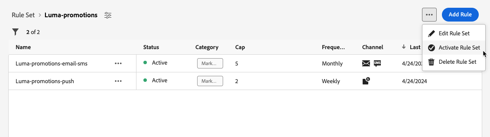

# 使用規則集 {#rule-sets}

>[!CONTEXTUALHELP]
>id="ajo_business_rules_rule_sets"
>title="規則集"
>abstract="使用規則集將頻率上限套用至不同類型的行銷傳播。您也可以建立規則集，依照頻率上限規則，將部分對象排除在歷程以外。"

## 開始使用規則集 {#gs}

### 什麼是規則集？ {#what}

規則集讓您可以&#x200B;**先將許多規則設為群組改成規則集**，再將這些群組套用至選擇的歷程、行銷活動。這提供更明確的精細度，以便限制客戶在特定時段內可以進入的頻率、歷程次數，或可根據通訊類型，控制使用者接收到訊息的頻率。

您可以建立兩種型別的規則集：

* **管道**&#x200B;規則集套用上限規則至通訊管道。 例如，每天傳送的電子郵件或簡訊請勿超過1個。
* **歷程**&#x200B;規則集將專案與並行上限規則套用至歷程。 例如，請勿同時在多個歷程中輸入設定檔。

➡️ [在影片中探索此功能](#video)

### 權限 {#permissions-frequency-rules}

若要使用商業規則，您需要下列許可權：

* **[!UICONTROL 檢影片率規則]**：存取和檢視商業規則。
* **[!UICONTROL 管理頻率規則]**：建立、編輯或刪除商業規則。

若要了解更多關於權限的資訊，請參閱[此區段](../administration/high-low-permissions.md)。

### 全域和自訂規則集 {#global-custom}

第一次從&#x200B;**[!UICONTROL 管理]** > **[!UICONTROL 商業規則]**&#x200B;功能表存取規則集時，預設規則集已預先建立且作用中： **全域預設規則集**。

此規則集包含全域規則，您可以套用這些規則來控制使用者跨一或多個通道接收訊息的頻率。 此規則集中定義的所有規則都適用於所有選取的管道，不論通訊是從歷程或行銷活動傳送。

除了此「全域預設規則集」規則集之外，您還可以建立可套用至任何歷程或促銷活動的&#x200B;**規則集**&#x200B;以套用特定上限規則。 [瞭解如何建立自訂規則集](#create)

## 建立並啟動規則集 {#Create}

>[!CONTEXTUALHELP]
>id="ajo_rule_set_domain"
>title="規則集網域"
>abstract="建立規則集時，您必須指定規則集當中的規則要針對通訊管道或是歷程強制執行頻率上限規則。"

>[!CONTEXTUALHELP]
>id="ajo_rule_sets_category"
>title="選取訊息規則類別"
>abstract="啟動並套用至訊息時，和所選類別相符的所有頻率規則會自動應用至該訊息。目前只有行銷類別可用。"

<!--NOT USED?
[!CONTEXTUALHELP]
>id="ajo_rule_sets_capping"
>title="Set the capping for your rule"
>abstract="Specify the maximum number of messages sent to a customer profile within the chosen time frame. The frequency cap will be based on the selected calendar period and will be reset at the beginning of the corresponding time frame."-->

>[!CONTEXTUALHELP]
>id="ajo_rule_type"
>title="規則類型"
>abstract="為您的管道規則集選取所需的規則型別：使用&#x200B;**頻率上限**&#x200B;型別將上限規則套用至通訊管道。 例如，每天傳送的電子郵件或簡訊請勿超過1個。 選取&#x200B;**無訊息時數** （限時提供）以定義以時間為基礎的排除，以確保在特定時段內不會傳送任何訊息」。"

>[!CONTEXTUALHELP]
>id="ajo_rule_sets_duration"
>title="選取訊息規則類別"
>abstract="啟動並套用至訊息時，和所選類別相符的所有頻率規則會自動應用至該訊息。目前只有行銷類別可用。"

>[!CONTEXTUALHELP]
>id="ajo_rule_set_rule_capping"
>title="規則上限"
>abstract="設定規則的頻率上限。根據規則集網域和「規則類型」欄位中的選擇，此欄位可以定義傳送至輪廓的訊息數量上限，或者輪廓可同時進入或註冊的歷程數量上限。"

>[!CONTEXTUALHELP]
>id="ajo_journey_business_rules"
>title="規則集"
>abstract="選取要套用至自訂動作的規則集。"

若要建立規則集，請遵循下列步驟。

>[!NOTE]
>
>您可以為每個管道網域和歷程網域建立最多10個作用中本機規則集。

1. 存取&#x200B;**[!UICONTROL 規則集]**&#x200B;清單，然後按一下&#x200B;**[!UICONTROL 建立規則集]**。

   

1. 為規則集定義唯一名稱並新增說明。

1. 選取規則集的網域，然後按一下&#x200B;**[!UICONTROL 儲存]**。

   * **管道**&#x200B;網域：為通訊管道套用上限規則。
   * **歷程**&#x200B;網域：將專案與並行上限規則套用至歷程。

   

1. 定義您要新增至此規則集的規則。 若要這麼做，請存取規則集並按一下&#x200B;**[!UICONTROL 新增規則]**。

1. 視需要設定規則引數。 規則可用的引數取決於建立時選取的規則集網域。

   以下章節提供了有關如何設定歷程和管道上限規則的詳細資訊：

   * [歷程上限](../conflict-prioritization/journey-capping.md)
   * [依據頻道、通訊類型，設定頻率上限](../conflict-prioritization/channel-capping.md)

1. 按一下&#x200B;**[!UICONTROL 儲存]**&#x200B;以確認建立規則。 您的訊息已新增至規則集，狀態為&#x200B;**[!UICONTROL 草稿]**。

   

1. 重複上述步驟，視需求將任意數量的規則新增至規則集。

1. 建立時，規則具有&#x200B;**[!UICONTROL 草稿]**&#x200B;狀態，尚未影響任何訊息。 若要啟用此功能，請按一下規則旁的&#x200B;**[!UICONTROL 其他動作]**&#x200B;按鈕，然後選取&#x200B;**[!UICONTROL 啟用]**。

   

1. 啟用規則集，以便將其套用至您的歷程和訊息。

   

   >[!NOTE]
   >
   >完全啟用規則或規則集最多可能需要10分鐘。 您不需要修改訊息或重新發佈歷程，規則就能生效。

<!--Currently, once a rule set is activated, no more rules can be added to that rule set.-->

1. 您可以根據建立規則集時選取的網域，將規則集套用至訊息或歷程。

   以下各節提供如何套用規則集的詳細資訊：

   * [將規則集套用至歷程](../conflict-prioritization/journey-capping.md#apply-capping)
   * [將上限規則套用至訊息](../conflict-prioritization/channel-capping.md#apply)

## 存取及管理規則集 {#access-rule-sets}

所有建立的規則集都會顯示在&#x200B;**[!UICONTROL 管理]** > **[!UICONTROL 商業規則]**&#x200B;功能表中。 它們會依上次修改日期排序。

按一下規則集名稱，即可檢視及編輯其內容。 該規則集中包含的所有規則都會列出。 右上方的內容功能表可讓您編輯規則集的名稱和說明、加以啟動及刪除。

針對規則集中的每個規則，**[!UICONTROL 其他動作]**&#x200B;按鈕可讓您編輯規則、啟動規則及刪除規則。

若要停用規則或規則集，請按一下所要專案旁的&#x200B;**[!UICONTROL 更多動作]**&#x200B;按鈕，並選取&#x200B;**[!UICONTROL 停用]**。

其狀態將變更為&#x200B;**[!UICONTROL 非使用中]**，而且此規則將不會套用至未來的訊息執行。 目前執行中的任何訊息都不會受到影響。

>[!NOTE]
>
>停用規則或規則集不會影響或重設個別設定檔的任何計數。

## 作法影片 {#video}

>[!VIDEO](https://video.tv.adobe.com/v/3444737?quality=12&captions=chi_hant)
