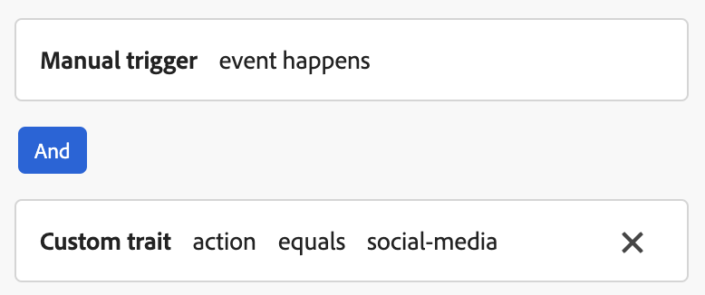

# 在 Web SDK 中設定內容卡支援 {#content-card-configuration-sdk}

此範例示範如何使用Adobe Experience Platform從Adobe Journey Optimizer (AJO)擷取內容卡片。 藉由運用[Adobe Experience Platform Web SDK](https://experienceleague.adobe.com/zh-hant/docs/experience-platform/web-sdk/home)，個人化內容完全在使用者端擷取及呈現。

初次載入頁面時，頁面會顯示其預設狀態。 但是，如果您與&#x200B;**存款基金**&#x200B;或&#x200B;**在社群媒體上分享**&#x200B;按鈕互動，將會顯示其他內容卡。 這些卡片是由使用者端條件觸發，以確保僅在採取特定動作時才會顯示。


## 執行範例 {#run-sample}

>[!PREREQUISITES]
>
>您必須安裝節點和npm。 [請參閱此檔案](https://docs.npmjs.com/downloading-and-installing-node-js-and-npm)


1. 設定HTTPS的本機SSL憑證。 這些範例需要本機簽署的SSL憑證，才能透過HTTPS提供內容：

   1. 在您的電腦上安裝`mkcert`。

   1. 安裝之後，請執行`mkcert -install`以安裝`mkcert root`憑證。

1. 將存放庫複製到本機電腦。

1. 開啟終端機，並導覽至範例的資料夾。

1. 執行`npm install`以安裝必要的相依性。

1. 執行`npm start`以啟動應用程式。

1. 開啟您的網頁瀏覽器，並移至`https://localhost`。

## 運作方式 {#setup}

1. 使用範例資料夾中[檔案的設定，在頁面上包含並設定](https://experienceleague.adobe.com/zh-hant/docs/experience-platform/web-sdk/home)網頁SDK`.env`。

   ```
   <script src="https://cdn1.adoberesources.net/alloy/2.18.0/alloy.min.js" async></script>
   alloy("configure", {
       defaultConsent: "in",
       edgeDomain: "{{edgeDomain}}",
       edgeConfigId: "{{edgeConfigId}}",
       orgId:"{{orgId}}",
       debugEnabled: false,
       personalizationStorageEnabled: true,
       thirdPartyCookiesEnabled: false
   });
   ```

1. 使用`sendEvent`命令擷取個人化內容。

   ```
   alloy("sendEvent", {
       renderDecisions: true,
       personalization: {
           surfaces: ["web://alloy-samples.adobe.com/#content-cards-sample"],
       },
   });
   ```

1. 使用`subscribeRulesetItems`命令訂閱特定介面的內容卡。 每次評估規則集時，都會處理回呼中的結果物件，其中會包含`propositions`與內容卡資料。

   ```
   const contentCardManager = createContentCardManager("content-cards");
   
   alloy("subscribeRulesetItems", {
       surfaces: ["web://alloy-samples.adobe.com/#content-cards-sample"],
       schemas: ["https://ns.adobe.com/personalization/message/content-card"],
       callback: (result, collectEvent) => {
           const { propositions = [] } = result;
           contentCardManager.refresh(propositions, collectEvent);
       },
   });
   ```

1. 使用`interact`中找到的`display`物件管理內容卡片的轉譯，並傳送`contentCardsManager`和`script.js`個事件。 從收到的主張中擷取、排序及處理內容卡片。

   ```
   const createContentCard = (proposition, item) => {
       const { data = {}, id } = item;
       const {
           content = {},
           meta = {},
           publishedDate,
           qualifiedDate,
           displayedDate,
       } = data;
   
       return {
           id,
           ...content,
           meta,
           qualifiedDate,
           displayedDate,
           publishedDate,
           getProposition: () => proposition,
       };
   };
   
   const extractContentCards = (propositions) =>
       propositions
           .reduce((allItems, proposition) => {
           const { items = [] } = proposition;
   
           return [
               ...allItems,
               ...items.map((item) => createContentCard(proposition, item)),
           ];
       }, [])
       .sort(
           (a, b) =>
               b.qualifiedDate - a.qualifiedDate || b.publishedDate - a.publishedDate
       );
   
   const contentCards = extractContentCards(propositions);
   ```

1. 根據為每個行銷活動定義的詳細資料轉譯內容卡片。 每個卡片都包含`title`、`body`、`imageUrl`和其他自訂資料值。

   ```
   const renderContentCards = () => {
       const contentCardsContainer = document.getElementById(containerElementId);
       contentCardsContainer.addEventListener("click", handleContentCardClick);
   
       let contents = "";
   
       contentCards.forEach((card) => {
           const { id, title, body, imageUrl, meta = {} } = card;
           const { buttonLabel = "" } = meta;
   
           contents += `
               <div class="col">
                   <div data-id="${id}" class="card h-100">
                       
                       <div class="card-body d-flex flex-column">
                           <h5 class="card-title">${title}</h5>
                           <p class="card-text">${body}</p>
                           <a href="#" class="mt-auto btn btn-primary">${buttonLabel}</a>
                       </div>
                   </div>
                </div>
            `;
       });
   
       contentCardsContainer.innerHTML = contents;
       collectEvent(
           "display",
           contentCards.map((card) => card.getProposition())
        );
   };
   ```

1. 叫用`subscribeRulesetItems`回呼時，也會提供稱為`collectEvent`的方便函式。 此函式用於傳送Experience Edge事件，以追蹤互動、顯示和其他使用者動作。 在此範例中，collectEvent會追蹤何時點按內容卡片。 此外，如果按一下內容卡上的按鈕，瀏覽器會導向至行銷活動指定的`actionUrl`。

   ```
   const handleContentCardClick = (evt) => {
       const cardEl = evt.target.closest(".card");
   
       if (!cardEl) {
           return;
       }
   
       const isAnchor = evt.target.nodeName === "A";
       const card = contentCards.find((card) => card.id === cardEl.dataset.id);
   
       if (!card) {
           return;
       }
   
       collectEvent("interact", [card.getProposition()]);
   
       if (isAnchor) {
           evt.preventDefault();
           evt.stopImmediatePropagation();
           const { actionUrl } = card;
           if (actionUrl && actionUrl.length > 0) {
               window.location.href = actionUrl;
           }
       }
   };
   ```

## 重要觀察 {#key-observations}

### personalizationStorageEnabled

`personalizationStorageEnabled`命令中的`true`選項設定為`configure`。 這可確保儲存先前限定的內容卡片，並在使用者工作階段間繼續顯示。

### 觸發程序

內容卡支援在使用者端評估的自訂觸發器。 符合觸發規則時，會顯示其他內容卡片。 此範例使用四個不同的行銷活動，每個內容卡一個都共用相同的表面： `web://alloy-samples.adobe.com/#content-cards-sample`。 下表概述每個行銷活動的觸發程式規則以及如何滿足這些規則。

<table>
    <tr>
        <th>觸發程序規則</th>
        <th>卡片</th>
        <th>如何滿足觸發程式規則</th>
    </tr>
    <tr>
        <td>None</td>
        <td></td>
        <td>sendEvent命令。 沒有使用者端規則可滿足。</td>
    </tr>
    <tr>
        <td>None</td>
        <td></td>
        <td>sendEvent命令。 沒有使用者端規則可滿足。</td>
    </tr>
    <tr>
        <td></td>
        <td></td>
        <td></td>
    </tr>
    <tr>
        <td></td>
        <td></td>
        <td></td>
    </tr>
</table>

按一下「存款基金」和「在社群媒體上分享」按鈕時，會觸發`evaluateRulesets`命令。 每個按鈕都指定相關的`decisionContext`，以符合為個別行銷活動定義的規則。

```
document.getElementById("action-button-1").addEventListener("click", () => {
    alloy("evaluateRulesets", {
        renderDecisions: true,
        personalization: {
            decisionContext: {
                action: "deposit-funds",
            },
        },
    });
});

document.getElementById("action-button-2").addEventListener("click", () => {
    alloy("evaluateRulesets", {
        renderDecisions: true,
        personalization: {
            decisionContext: {
                action: "social-media",
            },
        },
    });
});
```
