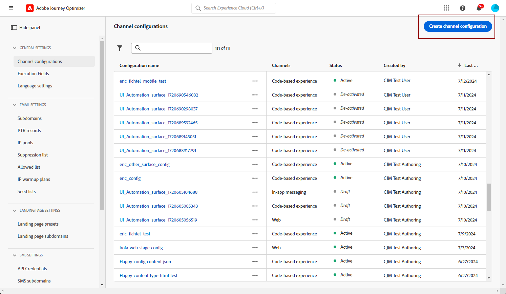
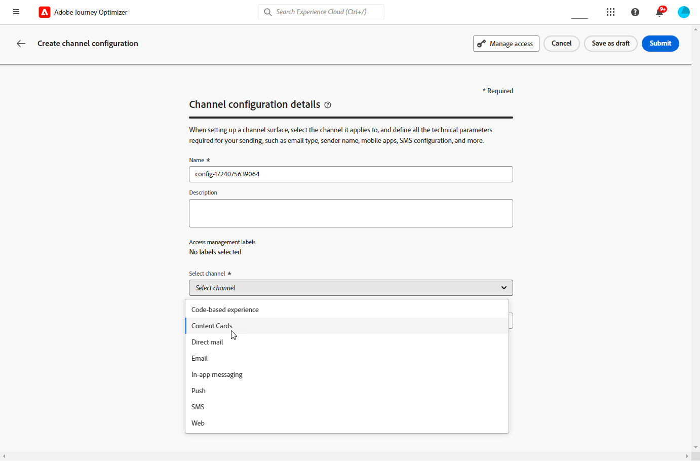
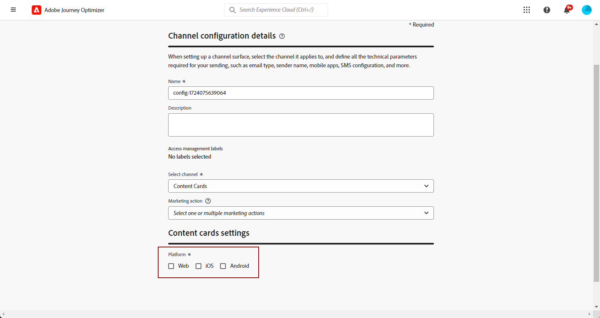

# 設定內容卡 {#content-card-configuration}

## 什麼是設定？ {#surface-definition}

**內容卡體驗組態**&#x200B;是任何專為使用者或系統互動而設計的實體，可由&#x200B;**URI**&#x200B;唯一識別。

換言之，若有任何階層層級具有實體（接觸點）存在，則可將表面視為容器。

* 可以是網頁、行動應用程式、案頭應用程式、大型實體中的特定內容位置（例如`div`），或非標準顯示模式（例如，資訊站或案頭應用程式橫幅）。

* 其也可以延伸至內容容器的特定片段，用於非顯示或抽象顯示目的 (例如，傳遞至服務的 JSON Blob)。

* 其也可以是符合各種用戶端介面定義的萬用字元表面 (例如，網站每個頁面上的主圖影像位置可翻譯為表面URI，例如：web://mydomain.com/*#hero_image)。

基本上，表面 URI 由多個區段組成：

1. **類型**：網頁、行動應用程式、ATM、資訊站、tvcd、服務等
1. **屬性**：頁面 URL 或應用程式套裝
1. **容器**：頁面/應用程式活動上的位置

下表列出各種裝置的一些表面 URI 定義範例。

**網頁與行動裝置**

| 類型 | URI | 說明 |
| --------- | ----------- | ------- | 
| Web | `web://domain.com/path/page.html#element` | 代表特定網域之特定頁面中的個別元素，其中元素可以是標籤，如下列範例中的標籤：hero_banner、top_nav、menu、footer 等。 |
| iOS 應用程式 | `mobileapp://com.vendor.bundle/activity#element` | 代表原生應用程式活動中的特定元素，例如按鈕或其他檢視元素。 |
| Android 應用程式 | `mobileapp://com.vendor.bundle/#element` | 代表原生應用程式中的特定元素。 |

**其他裝置型別**

| 類型 | URI | 說明 |
| --------- | ----------- | ------- | 
| 桌面 | `desktop://com.vendor.bundle/#element` | 代表應用程式中的特定元素，例如按鈕、功能表、主圖橫幅等。 |
| 電視應用程式 | `tvcd://com.vendor.bundle/#element` | 代表智慧型電視或電視連結裝置應用程式的特定元素 - 套裝 ID。 |
| 服務 | `service://servicename/#element` | 代表伺服器端程序或其他手動實體。 |
| 資訊站 | `kiosk://location/screen#element` | 潛在可輕鬆新增的其他表面類型範例。 |
| ATM | `atm://location/screen#element` | 潛在可輕鬆新增的其他表面類型範例。 |

**萬用字元表面**

| 類型 | URI | 說明 |
| --------- | ----------- | ------- | 
| 萬用字元網頁 | `wildcard:web://domain.com/*#element` | 萬用字元表面 - 代表特定網域下每個頁面中的個別元素。 |
| 萬用字元網頁 | `wildcard:web://*domain.com/*#element` | 萬用字元表面 - 代表所有以「domain.com」結尾的網域下每個頁面中的個別元素。 |

## 建立內容卡設定 {#create-config}

1. 存取&#x200B;**[!UICONTROL 管道]** > **[!UICONTROL 品牌]** > **[!UICONTROL 管道設定]**&#x200B;功能表，然後按一下&#x200B;**[!UICONTROL 建立管道設定]**。

   

1. 輸入設定的名稱和說明（選擇性）。

   >[!NOTE]
   >
   > 名稱必須以字母(A-Z)開頭。 它只能包含英數字元。 您也可以使用底線 `_`、點 `.` 和連字號 `-` 字元。

1. 若要將自訂或核心資料使用標籤指派給組態，您可以選取&#x200B;**[!UICONTROL 管理存取權]**。 [進一步瞭解物件層級存取控制(OLAC)](../administration/object-based-access.md)。

1. 選取&#x200B;**[!UICONTROL 內容卡]**&#x200B;頻道。

   

1. 選取&#x200B;**[!UICONTROL 行銷動作]**，以使用此設定將同意原則與訊息相關聯。 系統會運用與行銷動作相關的所有同意政策，以尊重客戶的偏好設定。 [了解更多](../action/consent.md#surface-marketing-actions)

1. 選取將套用內容卡體驗的平台。

   

1. 針對Web：

   * 指定&#x200B;**[!UICONTROL 頁面URL]**，將變更僅套用至單一頁面。

   * 或是建立符合規則&#x200B;**[!UICONTROL 的]**&#x200B;頁面，以鎖定多個符合指定規則的URL。 例如，這可用來在網站上通用套用變更，例如更新所有頁面的主圖橫幅，或新增頂端影像以顯示於每個產品頁面上。 [了解更多](../web/web-configuration.md)

1. 對於iOS和Android：

   * 輸入或選取您的&#x200B;**[!UICONTROL 應用程式ID]**、**[!UICONTROL 應用程式內的位置或路徑]**&#x200B;和&#x200B;**[!UICONTROL 預覽URL]**。

1. 提交變更。

您現在可以在建立內容卡體驗時選取設定。
