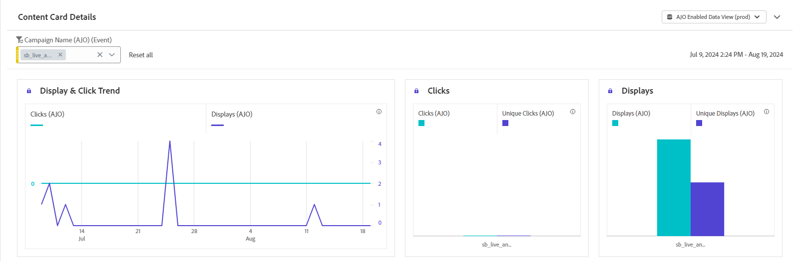
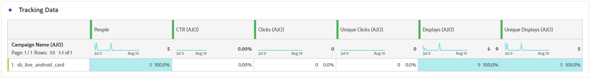

# 內容卡報告 {#content-card-report}

>[!BEGINSHADEBOX]

**目錄**

* [開始使用內容卡](../../rp_landing_pages/content-card-landing-page.md)
* [內容卡的先決條件](content-card-configuration-prereq.md)
* [在 Journey Optimizer 中設定內容卡頻道](content-card-configuration.md)
* [建立內容卡](create-content-card.md)
* [設計內容卡](design-content-card.md)
* **內容卡報告**

>[!ENDSHADEBOX]

**行銷活動報告**&#x200B;可作為完整的儀表板，提供與行銷活動相關之關鍵量度的詳細分析。 其中包含點按計數、傳送的訊息、設定檔編號和所採取的動作等資料。 透過提供行銷活動成效和參與等級的完整概觀，報告可確保全面瞭解行銷活動的整體成效。

可以使用&#x200B;**[!UICONTROL 報告]**&#x200B;按鈕，直接從您的行銷活動存取內容卡片報告。

## 顯示與點選趨勢 {#display-click}

<!--

-->

**[!UICONTROL 顯示和點選趨勢]**&#x200B;圖表可協助您瞭解訊息的整體觸及範圍和與其互動的不重複設定檔數目。

+++ 進一步瞭解「顯示和點按」量度

* **[!UICONTROL 點按]**：內容卡片中的內容點按次數。

* **[!UICONTROL 顯示]**：訊息開啟的次數。

* **[!UICONTROL 不重複顯示]**：訊息開啟的次數，一個設定檔的多個互動未列入考量。

+++

## 追蹤資料 {#tracking-data}

<!--

-->

**[!UICONTROL 追蹤資料]**&#x200B;表格提供繫結至內容卡的設定檔活動詳細快照，提供參與度和內容卡有效性的基本深入分析。

+++ 進一步瞭解追蹤資料量度

* **[!UICONTROL 人員]**：符合內容卡目標設定檔資格的使用者設定檔數目。

* **[!UICONTROL 點進率(CTR)]**：與內容卡互動的使用者百分比。

* **[!UICONTROL 點按次數]**：內容卡中被點按的次數。

* **[!UICONTROL 不重複點按]**：點按內容卡中內容的設定檔數目。

* **[!UICONTROL 顯示]**：訊息開啟的次數。

* **[!UICONTROL 不重複顯示]**：訊息開啟的次數，一個設定檔的多個互動未列入考量。

+++

## 追蹤的標籤 {#tracked-labels}

**[!UICONTROL 追蹤的標籤]**&#x200B;表格提供內容卡中連結標籤的完整概觀，重點說明產生最高訪客流量的連結。 此功能可讓您識別最熱門的連結並加以優先處理。

+++ 進一步瞭解追蹤的標籤量度

* **[!UICONTROL 不重複點按]**：在內容卡片中點按內容的設定檔數目。

* **[!UICONTROL 點按]**：內容卡片中的內容點按次數。

* **[!UICONTROL 顯示]**：訊息開啟的次數。

* **[!UICONTROL 不重複顯示]**：訊息開啟的次數，一個設定檔的多個互動未列入考量。

+++

## 追蹤的連結 URL {#tracked-link-url}

**[!UICONTROL 追蹤的連結URL]**&#x200B;表格提供內容卡中吸引最高訪客流量之URL的完整概觀。 這可讓您識別最熱門的連結並排定其優先順序，進而更瞭解個人資料參與您的「內容」卡片中的特定內容。

+++ 深入瞭解追蹤的連結URL量度

* **[!UICONTROL 不重複點按]**：在內容卡片中點按內容的設定檔數目。

* **[!UICONTROL 點按]**：內容卡片中的內容點按次數。

+++
