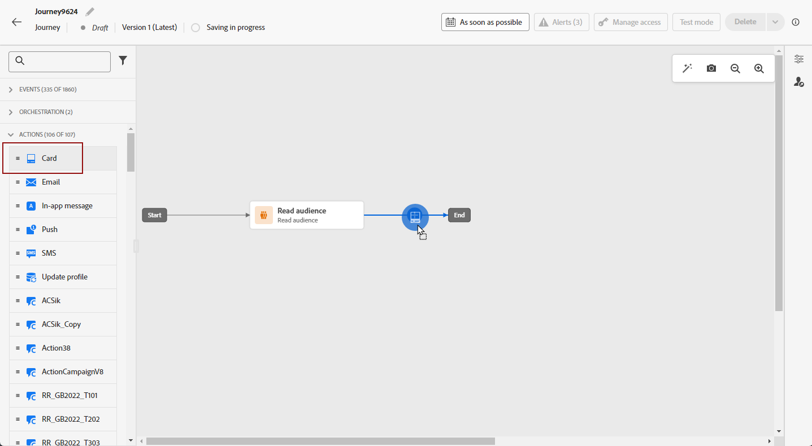
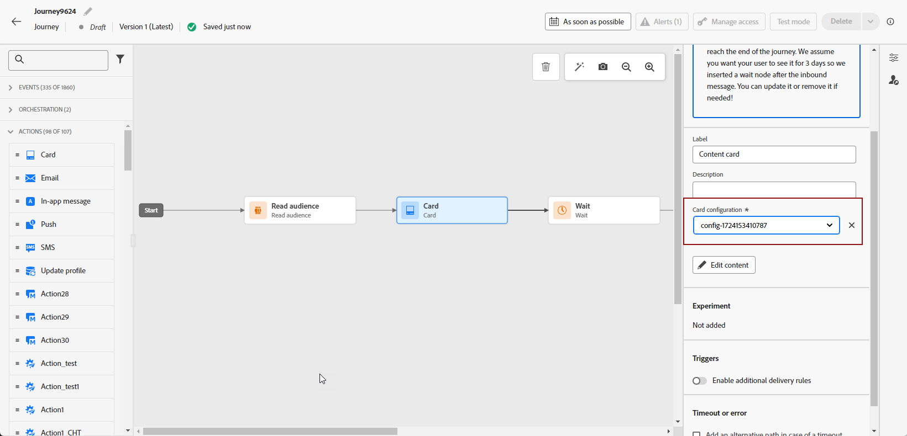
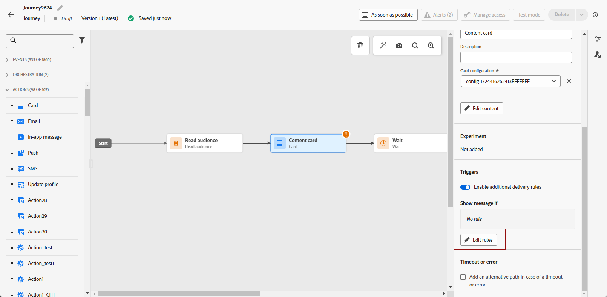
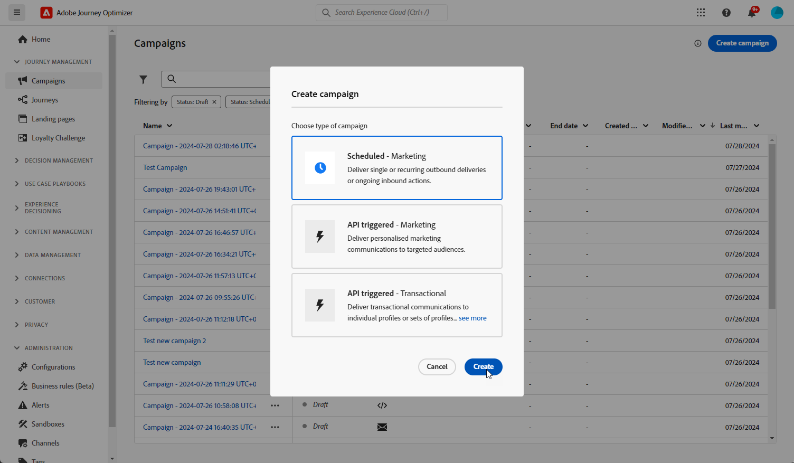
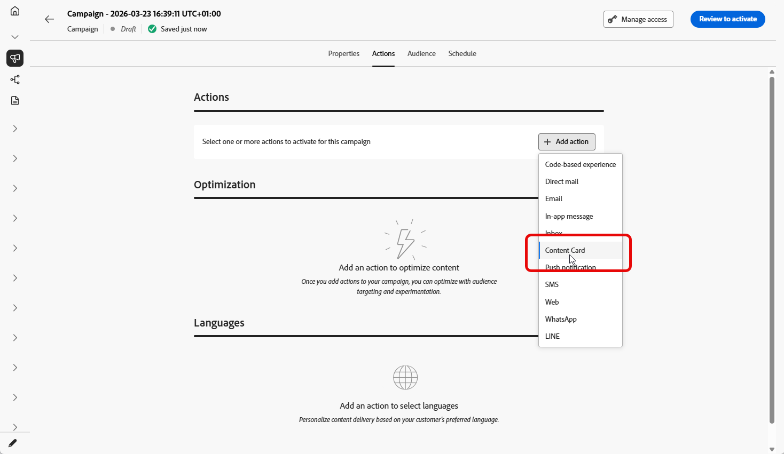
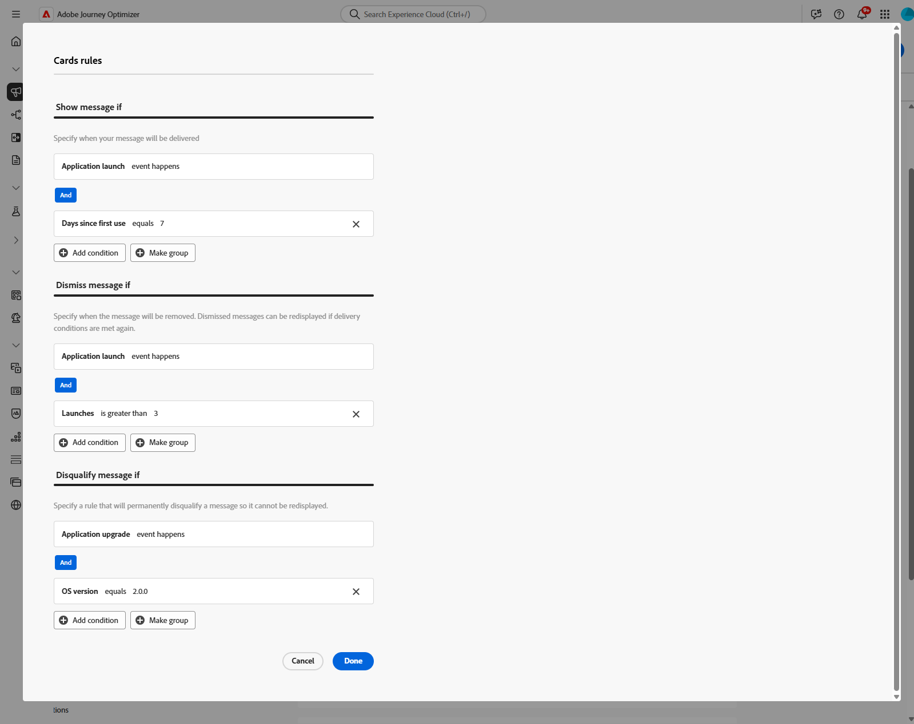
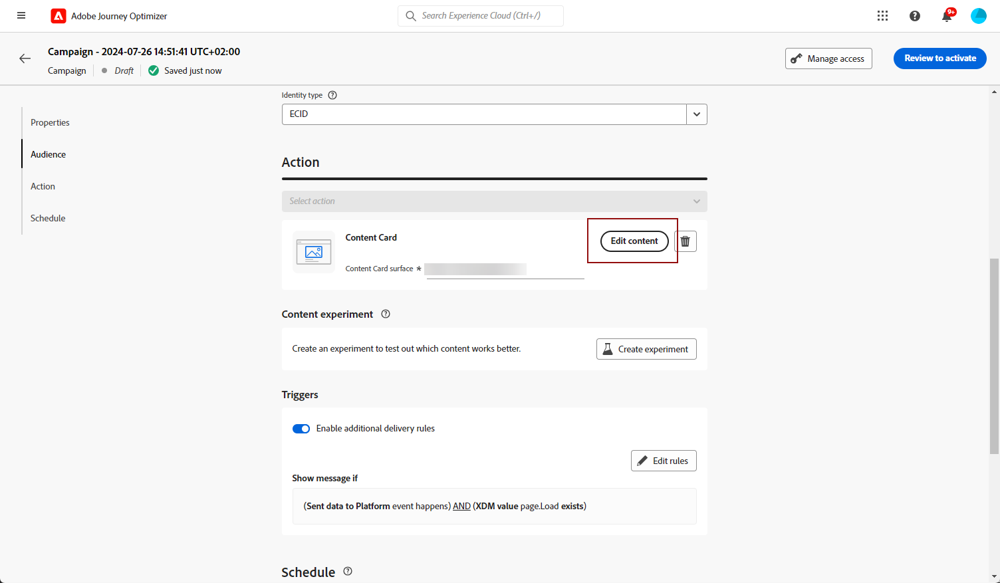

# 建立內容卡片 {#create-content-card}

>[!IMPORTANT]
>
>依預設，關閉按鈕會隱藏卡片。 若要新增更多功能，您可以手動定義解除或取消資格規則。

>[!BEGINTABS]

>[!TAB 將內容卡片新增至歷程]

若要將內容卡新增至歷程，請遵循下列步驟：

1. 開啟您的歷程，然後從浮動視窗的&#x200B;**[!UICONTROL 動作]**&#x200B;區段拖放&#x200B;**[!UICONTROL 卡片]**&#x200B;活動。

   

1. 為您的訊息輸入&#x200B;**[!UICONTROL 標籤]**&#x200B;和&#x200B;**[!UICONTROL 描述]**。

1. 選擇要使用的[內容卡組態](content-card-configuration.md)。

   

1. 您現在可以使用&#x200B;**[!UICONTROL 編輯內容]**&#x200B;按鈕開始設計您的內容。 [了解更多](design-content-card.md)

1. 啟用「**[!UICONTROL 啟用其他傳遞規則]**」選項，然後選取「**[!UICONTROL 編輯規則]**」以定義何時應顯示、解除或永久隱藏您的訊息。

   

   1. 按一下&#x200B;**[!UICONTROL 新增條件]**&#x200B;以選取您的事件。

      +++請參閱可用的事件。

      | 套件 | 觸發 | 定義 |
      |---|---|---|
      | 傳送資料至Platform | 已將資料傳送至Platform | 在行動應用程式發出邊緣體驗事件以將資料傳送至Adobe Experience Platform時觸發。 API通常會從AEP Edge擴充功能呼叫[sendEvent](https://developer.adobe.com/client-sdks/documentation/edge-network/api-reference/#sendevent)。 |
      | 核心追蹤 | 追蹤動作 | 呼叫行動程式碼API [trackAction](https://developer.adobe.com/client-sdks/documentation/mobile-core/api-reference/#trackaction)中提供的舊版功能時觸發。 |
      | 核心追蹤 | 追蹤狀態 | 呼叫行動程式碼API [trackState](https://developer.adobe.com/client-sdks/documentation/mobile-core/api-reference/#trackstate)中提供的舊版功能時觸發。 |
      | 核心追蹤 | 收集PII | 呼叫行動程式碼API [collectPII](https://developer.adobe.com/client-sdks/documentation/mobile-core/api-reference/#collectpii)中提供的舊版功能時觸發。 |
      | 應用程式生命週期 | 應用程式啟動 | 在每次執行時觸發，包括當機和安裝。在超過生命週期工作階段逾時的情況下，也會在從背景恢復時觸發。 |
      | 應用程式生命週期 | 應用程式安裝 | 在安裝或重新安裝後首次執行時觸發。 |
      | 應用程式生命週期 | 應用程式更新 | 在升級或版本編號變更後首次執行時觸發。 |
      | 應用程式生命週期 | 應用程式關閉 | 應用程式關閉時觸發。 |
      | 應用程式生命週期 | 應用程式當機 | 於關閉前，應用程式不在背景執行時觸發。事件會在當機後啟動應用程式時傳送。 Adobe Mobile 當機報告不會實施未攔截之例外狀況的全域處理常式。 |

      +++

   1. 若要新增更多&#x200B;**[!UICONTROL 觸發器]**，請選擇&#x200B;**[!UICONTROL 或]**&#x200B;條件，以進一步展開規則。

   1. 如果您想要新增&#x200B;**[!UICONTROL 特徵]**&#x200B;並更好地微調您的規則，請選擇&#x200B;**[!UICONTROL 和]**&#x200B;條件。

      +++檢視可用的特徵。

      | 套件 | 特徵 | 定義 |
      |---|---|---|
      | 裝置資訊 | 電信業者名稱 | 當符合清單中的其中一個電信業者名稱時觸發。 |
      | 裝置資訊 | 裝置名稱 | 符合其中一個裝置名稱時觸發。 |
      | 裝置資訊 | 地區設定 | 當符合清單中的語言之一時觸發。 |
      | 裝置資訊 | 作業系統版本 | 當符合其中一個指定的作業系統版本時觸發。 |
      | 裝置資訊 | 舊版作業系統 | 符合其中一個指定的先前作業系統版本時觸發。 |
      | 裝置資訊 | 執行模式 | 如果「執行」模式為應用程式或擴充功能，則會觸發。 |
      | 應用程式生命週期 | 應用程式 ID | 符合指定的應用程式ID時觸發。 |
      | 應用程式生命週期 | 星期 | 當符合指定的星期幾時觸發。 |
      | 應用程式生命週期 | 首次使用後間隔天數 | 當符合自首次使用以來的指定天數時觸發。 |
      | 應用程式生命週期 | 上次使用後間隔天數 | 當符合自上次使用以來的指定天數時觸發。 |
      | 應用程式生命週期 | 升級後間隔天數 | 當符合自上次升級以來的指定天數時觸發。 |
      | 應用程式生命週期 | 安裝日期 | 當符合指定的安裝日期時觸發。 |
      | 應用程式生命週期 | 啟動 | 當符合指定的啟動次數時觸發。 |
      | 應用程式生命週期 | 時間 | 符合指定的當日時間時觸發。 |

      +++

   1. 按一下&#x200B;**[!UICONTROL 建立群組]**，將觸發程式群組在一起。

1. 如有必要，請拖放其他動作或事件以完成您的歷程流程。 [了解更多](../building-journeys/about-journey-activities.md)

1. 在內容卡準備好後，完成設定並發佈您的歷程以將其啟用。

如需如何設定歷程的詳細資訊，請參閱[此頁面](../building-journeys/journey-gs.md)。

>[!TAB 新增內容卡片至行銷活動]

若要開始透過行銷活動建置內容卡片，請遵循下列步驟。

1. 建立行銷活動。 [了解更多](../campaigns/create-campaign.md)

1. 選取您要執行的行銷活動型別

   * **[!UICONTROL 已排程 — 行銷]**：立即或在指定日期執行行銷活動。 已排程的行銷活動旨在傳送&#x200B;**行銷**&#x200B;訊息。 可從使用者介面設定及執行。

   * **[!UICONTROL API觸發 — 行銷/異動]**：使用API呼叫執行行銷活動。 API觸發的行銷活動旨在傳送&#x200B;**行銷**&#x200B;或&#x200B;**異動**&#x200B;訊息，即在個人執行動作後傳送的訊息：密碼重設、購物車購買等。 [瞭解如何使用API觸發行銷活動](../campaigns/api-triggered-campaigns.md)

   

1. 在&#x200B;**[!UICONTROL 屬性]**&#x200B;區段中，指定行銷活動的名稱和說明。

1. 在&#x200B;**對象**&#x200B;區段中，按一下&#x200B;**[!UICONTROL 選取對象]**&#x200B;按鈕以顯示可用Adobe Experience Platform對象清單。 [了解更多關於客群](../audience/about-audiences.md)

1. 在&#x200B;**[!UICONTROL 身分識別名稱空間]**&#x200B;欄位中，選擇要使用的名稱空間，以識別所選區段中的個人。 [進一步瞭解名稱空間](../event/about-creating.md#select-the-namespace)

1. 選取&#x200B;**[!UICONTROL 內容卡]**&#x200B;動作。

   

1. 選取或建立新的[內容卡組態](content-card-configuration.md)。

1. 若要測試訊息的內容，請按一下[建立實驗]。**** 這可讓您在範例母體上測試傳送的多個變數，以判斷哪一種處理對目標對象的影響最大。 [進一步瞭解內容實驗](../content-management/content-experiment.md)。

1. 啟用「**[!UICONTROL 啟用其他傳遞規則]**」選項，然後選取「**[!UICONTROL 編輯規則]**」以定義何時應顯示、解除或永久隱藏您的訊息。

   使用規則產生器來設定觸發這些動作的特定條件。

   1. 按一下&#x200B;**[!UICONTROL 新增條件]**&#x200B;以選取您的事件。

      +++請參閱可用的事件。

      | 套件 | 觸發 | 定義 |
      |---|---|---|
      | 傳送資料至Platform | 已將資料傳送至Platform | 在行動應用程式發出邊緣體驗事件以將資料傳送至Adobe Experience Platform時觸發。 API通常會從AEP Edge擴充功能呼叫[sendEvent](https://developer.adobe.com/client-sdks/documentation/edge-network/api-reference/#sendevent)。 |
      | 核心追蹤 | 追蹤動作 | 呼叫行動程式碼API [trackAction](https://developer.adobe.com/client-sdks/documentation/mobile-core/api-reference/#trackaction)中提供的舊版功能時觸發。 |
      | 核心追蹤 | 追蹤狀態 | 呼叫行動程式碼API [trackState](https://developer.adobe.com/client-sdks/documentation/mobile-core/api-reference/#trackstate)中提供的舊版功能時觸發。 |
      | 核心追蹤 | 收集PII | 呼叫行動程式碼API [collectPII](https://developer.adobe.com/client-sdks/documentation/mobile-core/api-reference/#collectpii)中提供的舊版功能時觸發。 |
      | 應用程式生命週期 | 應用程式啟動 | 在每次執行時觸發，包括當機和安裝。在超過生命週期工作階段逾時的情況下，也會在從背景恢復時觸發。 |
      | 應用程式生命週期 | 應用程式安裝 | 在安裝或重新安裝後首次執行時觸發。 |
      | 應用程式生命週期 | 應用程式更新 | 在升級或版本編號變更後首次執行時觸發。 |
      | 應用程式生命週期 | 應用程式關閉 | 應用程式關閉時觸發。 |
      | 應用程式生命週期 | 應用程式當機 | 於關閉前，應用程式不在背景執行時觸發。事件會在當機後啟動應用程式時傳送。 Adobe Mobile 當機報告不會實施未攔截之例外狀況的全域處理常式。 |

      +++

   1. 若要新增更多&#x200B;**[!UICONTROL 觸發器]**，請選擇&#x200B;**[!UICONTROL 或]**&#x200B;條件，以進一步展開規則。

   1. 如果您想要新增&#x200B;**[!UICONTROL 特徵]**&#x200B;並更好地微調您的規則，請選擇&#x200B;**[!UICONTROL 和]**&#x200B;條件。

      +++檢視可用的特徵。

      | 套件 | 特徵 | 定義 |
      |---|---|---|
      | 裝置資訊 | 電信業者名稱 | 當符合清單中的其中一個電信業者名稱時觸發。 |
      | 裝置資訊 | 裝置名稱 | 符合其中一個裝置名稱時觸發。 |
      | 裝置資訊 | 地區設定 | 當符合清單中的語言之一時觸發。 |
      | 裝置資訊 | 作業系統版本 | 當符合其中一個指定的作業系統版本時觸發。 |
      | 裝置資訊 | 舊版作業系統 | 符合其中一個指定的先前作業系統版本時觸發。 |
      | 裝置資訊 | 執行模式 | 如果「執行」模式為應用程式或擴充功能，則會觸發。 |
      | 應用程式生命週期 | 應用程式 ID | 符合指定的應用程式ID時觸發。 |
      | 應用程式生命週期 | 星期 | 當符合指定的星期幾時觸發。 |
      | 應用程式生命週期 | 首次使用後間隔天數 | 當符合自首次使用以來的指定天數時觸發。 |
      | 應用程式生命週期 | 上次使用後間隔天數 | 當符合自上次使用以來的指定天數時觸發。 |
      | 應用程式生命週期 | 升級後間隔天數 | 當符合自上次升級以來的指定天數時觸發。 |
      | 應用程式生命週期 | 安裝日期 | 當符合指定的安裝日期時觸發。 |
      | 應用程式生命週期 | 啟動 | 當符合指定的啟動次數時觸發。 |
      | 應用程式生命週期 | 時間 | 符合指定的當日時間時觸發。 |

      +++

   1. 按一下&#x200B;**[!UICONTROL 建立群組]**，將觸發程式群組在一起。

   

1. 您可以將行銷活動排程至特定日期，或設定為定期重複進行。 [了解更多](../campaigns/create-campaign.md#schedule)

1. 您現在可以使用&#x200B;**[!UICONTROL 編輯內容]**&#x200B;開始設計您的內容。 [了解更多](design-content-card.md)

   

>[!ENDTABS]
