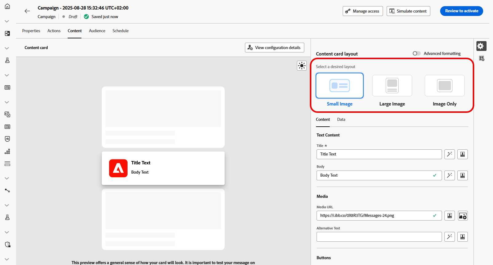
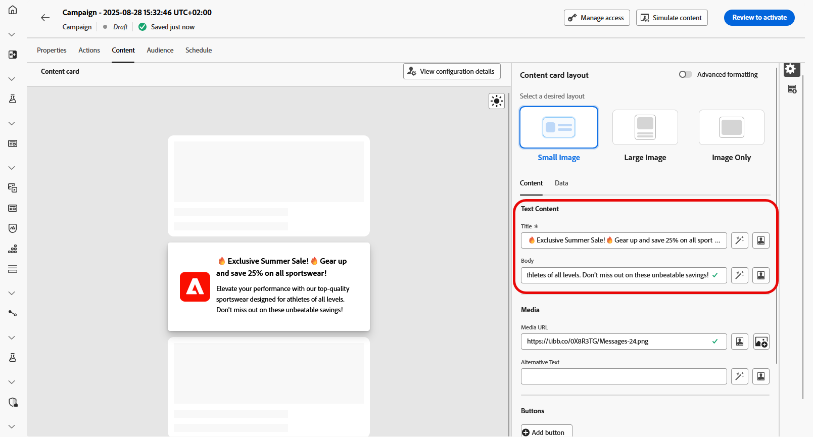
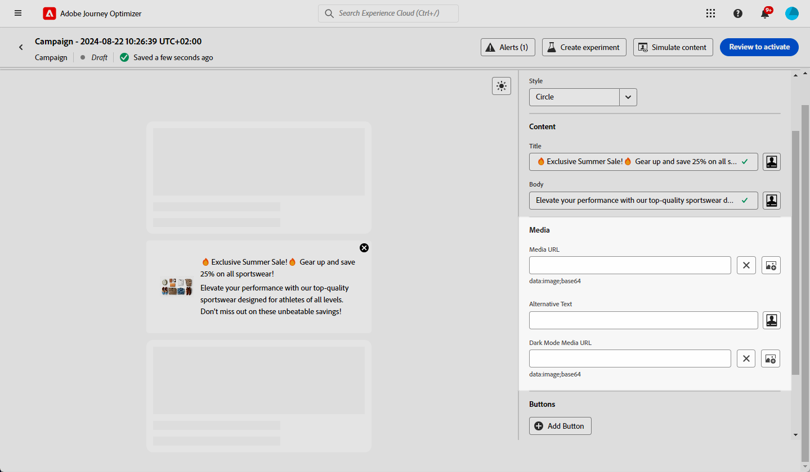
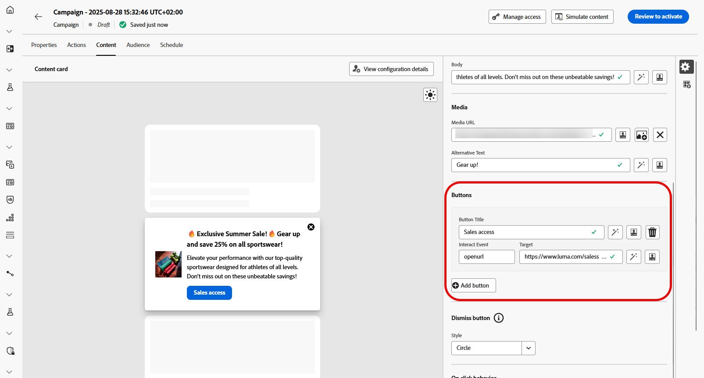
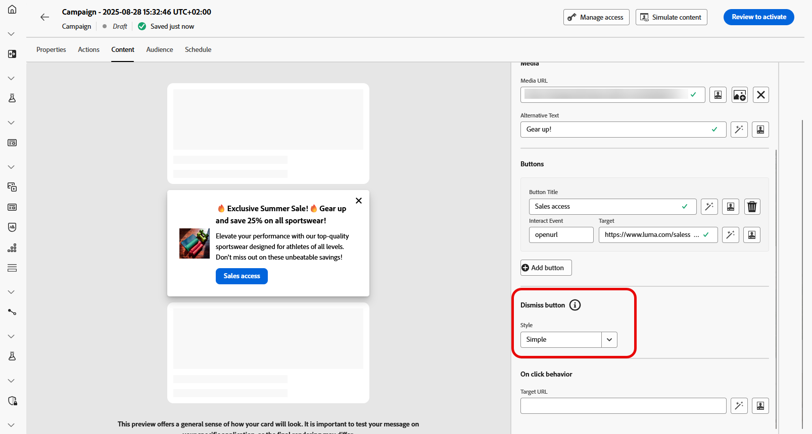
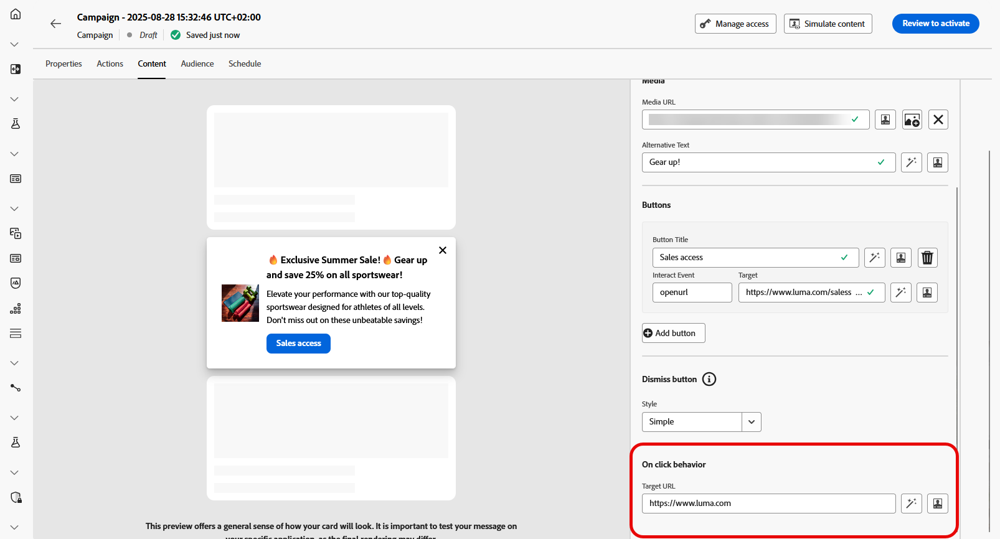
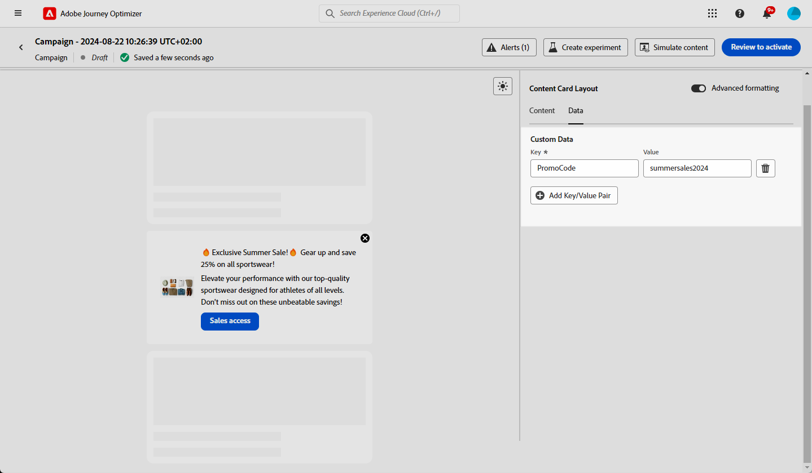

# 設計內容卡內容 {#design-content-card}

卡片的製作結構提供表單式製作體驗，為行銷人員提供開發人員可轉譯的基本輸入。

定義內容並注入個人化後，您就可以檢閱並加以啟用。 將根據設定的排程傳送您的行銷活動。 [在此頁面瞭解更多](../campaigns/review-activate-campaign.md)。

## 內容卡片配置

根據您的傳訊需求，從&#x200B;**[!UICONTROL 內容卡配置]**&#x200B;區段中選擇三個影像配置選項之一。

* **[!UICONTROL 小型影像]**：在文字旁邊顯示精簡的影像，非常適合內容優先於視覺效果的訊息。

  如需瞭解詳細資訊，請參閱iOS的Adobe Developer檔案和Android。

* **[!UICONTROL 大型影像]**：在文字上方或旁顯示顯著的影像，讓視覺效果成為您訊息的主要焦點。

  如需瞭解詳細資訊，請參閱iOS的Adobe Developer檔案和Android。

* **[!UICONTROL 僅限影像]**：顯示不含隨附文字的影像，非常適合視覺化訊息或獨立影像。

  如需瞭解詳細資訊，請參閱iOS的Adobe Developer檔案和Android。

## 內容索引標籤 {#content-tab}

從&#x200B;**[!UICONTROL 內容]**&#x200B;索引標籤，您可以定義內容並直接從此索引標籤新增媒體和動作按鈕，以自訂內容卡片。

### 文字內容 {#title-body}

若要撰寫訊息，請在&#x200B;**[!UICONTROL 標題]**&#x200B;和&#x200B;**[!UICONTROL 內文]**&#x200B;欄位中輸入文字。

如果您想要進一步修改訊息，請使用&#x200B;**[!UICONTROL Personalization]**&#x200B;圖示來新增個人化元素。 如需如何使用個人化功能的詳細說明，請參閱[本節](../personalization/personalize.md)。

### 媒體 {#add-media}

**[!UICONTROL 媒體]**&#x200B;欄位可讓您新增媒體來增強內容卡片，讓您的簡報對一般使用者來說更具吸引力。

若要包含媒體，請輸入您要使用之媒體的URL，或按一下&#x200B;**[!UICONTROL 選取Assets]**&#x200B;圖示以從儲存在Assets媒體櫃中的資產中進行選擇。 [進一步瞭解資產管理](../integrations/assets.md)。

+++更多具有進階格式的選項

如果&#x200B;**[!UICONTROL 進階格式模式]**&#x200B;已開啟，您可以在&#x200B;**[!UICONTROL 深色模式媒體URL]**&#x200B;欄位中新增用於熒幕閱讀應用程式的&#x200B;**[!UICONTROL 替代文字]**&#x200B;和另一個資產。

+++

### 按鈕 {#add-buttons}

新增按鈕讓使用者與您的內容卡片互動。

1. 按一下&#x200B;**[!UICONTROL 新增按鈕]**&#x200B;以建立新的動作按鈕。

1. 編輯按鈕&#x200B;**[!UICONTROL 標題]**&#x200B;欄位，指定按鈕上顯示的標籤。

1. 選取&#x200B;**[!UICONTROL 互動事件]**，以定義使用者按一下按鈕或與按鈕互動時將會觸發的動作。

1. 在&#x200B;**[!UICONTROL Target]**&#x200B;欄位中，輸入網頁URL或深層連結，使用者在與按鈕互動後會導向該連結。

<!--
+++More options with advanced formatting

If the **[!UICONTROL Advanced formatting mode]** is switched on, you can choose for your **[!UICONTROL Buttons]**:

* the **[!UICONTROL Font]**
* the **[!UICONTROL Pt size]**
* the **[!UICONTROL Font Color]**
* the **[!UICONTROL Alignment]**

+++
-->

### 關閉按鈕 {#close-button}

選擇&#x200B;**[!UICONTROL 解除按鈕]**&#x200B;的&#x200B;**[!UICONTROL 樣式]**&#x200B;以自訂其外觀。

您可以從下列樣式中選取：

* **[!UICONTROL 無]**
* **[!UICONTROL 簡單]**
* **[!UICONTROL 圓]**

<!--
+++More options with advanced formatting

If the **[!UICONTROL Advanced formatting mode]** is switched on, you can choose for your **[!UICONTROL Header]** and **[!UICONTROL Body]**:

* the **[!UICONTROL Font]**
* the **[!UICONTROL Pt size]**
* the **[!UICONTROL Font Color]**
* the **[!UICONTROL Alignment]**
+++
-->

### 點按時的行為

在&#x200B;**[!UICONTROL 目標URL]**&#x200B;欄位中，輸入網頁URL或深層連結，將使用者在與您的內容卡互動後，導向至所需的目的地。 這可能是外部網站、應用程式內的特定頁面，或任何其他您希望根據使用者的互動帶其前往的位置。

## 資料標籤

## 自訂資料 {#custom-data}

在&#x200B;**[!UICONTROL 自訂資料]**&#x200B;區段中，按一下&#x200B;**[!UICONTROL 新增索引鍵/值組]**&#x200B;以在承載中包含自訂變數。 這些索引鍵/值配對可讓您根據特定設定傳遞其他資料。 這可讓您新增個人化或動態內容、追蹤資訊，或與設定相關的任何其他資料。
