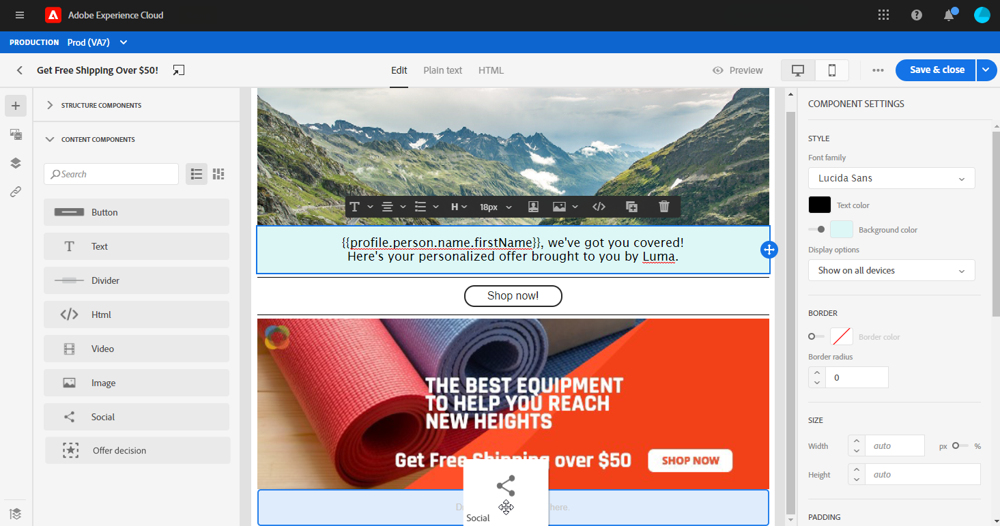

# 使用電子郵件設計工具內容元件{#content-components}

>[!CONTEXTUALHELP]
>id="ac_content_components"
>title="關於內容元件"
>abstract="內容元件是空白的內容預留位置，可用來建立電子郵件版面。"

從草稿開始建立電子郵件內容時，**[!UICONTROL Content components]**可讓您使用原始的空白元件進一步個人化您的電子郵件，一旦放入電子郵件，即可使用這些元件。
您可以在定義電子郵件版面的**[!UICONTROL Structure component]**&#x200B;內新增所需數量的&#x200B;**[!UICONTROL Content components]**。

## 按鈕 {#buttons}

使用&#x200B;**[!UICONTROL Button]**&#x200B;元件，在電子郵件中插入多個按鈕，並將您的電子郵件對象重新導向至其他頁面。

1. 從&#x200B;**[!UICONTROL Content components]**，將&#x200B;**[!UICONTROL Button]**&#x200B;拖放到&#x200B;**[!UICONTROL Structure component]**&#x200B;中。

   

1. 按一下新添加的按鈕以個性化文本並訪問電子郵件設計器右窗格中的&#x200B;**[!UICONTROL Components Settings]**。

   

1. 在&#x200B;**[!UICONTROL Components Settings]**&#x200B;的&#x200B;**[!UICONTROL Link]**&#x200B;欄位中，新增您希望對象在按一下按鈕時重新導向的URL。

1. 選擇透過&#x200B;**[!UICONTROL Target]**&#x200B;下拉式清單重新導向對象的方式：

   * **[!UICONTROL None]**:在與點按連結相同的時間格中開啟連結（預設）。
   * **[!UICONTROL Blank]**:在新視窗或索引標籤中開啟連結。
   * **[!UICONTROL Self]**:在按一下連結時的同一幀中開啟連結。
   * **[!UICONTROL Parent]**:開啟父框架中的連結。
   * **[!UICONTROL Top]**:在窗口的正文中開啟連結。

   

1. 您現在可以透過變更&#x200B;**[!UICONTROL Style]**、**[!UICONTROL Margin]**&#x200B;和&#x200B;**[!UICONTROL Border]**&#x200B;等方式，進一步個人化您的按鈕。

## 文字 {#text}

使用&#x200B;**[!UICONTROL Text]**&#x200B;元件在電子郵件中插入文字。 您可以調整&#x200B;**[!UICONTROL Component Settings]**&#x200B;中文本的顏色、樣式和大小。

1. 在&#x200B;**[!UICONTROL Content Components]**&#x200B;中，將&#x200B;**[!UICONTROL Text]**&#x200B;拖放到&#x200B;**[!UICONTROL Structure component]**&#x200B;中。

   

1. 按一下新增的元件，以個人化文字並存取電子郵件設計工具右窗格中的&#x200B;**[!UICONTROL Components Settings]**。

1. 使用工具列中的下列選項變更文字：

   

   * **[!UICONTROL Change text style]**:將粗體、斜體、底線或直線套用至您的文字。
   * **更改對齊方式**:在文本的左對齊、右對齊、居中對齊或對齊對齊對齊之間進行選擇。
   * **[!UICONTROL Create list]**:將項目符號或數字清單新增至您的文字。
   * **[!UICONTROL Set heading]**:在文字中加上最多六個標題層。
   * **字型大小**:選取文字的字型大小（像素）。
   * **[!UICONTROL Edit image]**:新增影像或資產至文字元件。[深入了解資產管理](assets-essentials.md)。
   * **[!UICONTROL Show the source code]**:顯示文本的原始碼。無法修改。
   * **[!UICONTROL Duplicate]**:新增文字元件的復本。
   * **[!UICONTROL Delete]**:從電子郵件中刪除選取的文字元件。
   * **[!UICONTROL Add personalization]**:新增個人化欄位以自訂來自您設定檔資料的內容。[深入了解內容個人化](personalization/personalize.md)。

1. 為獲得更好的使用者體驗，您可以新增個人化欄位以鎖定您的對象。 如需詳細資訊，請參閱本[區段](personalization/personalize.md)。

1. 調整&#x200B;**[!UICONTROL Components Settings]**&#x200B;中的&#x200B;**[!UICONTROL Text color]**、**[!UICONTROL Font family]**&#x200B;和&#x200B;**[!UICONTROL Size]**。

   

## 除法器 {#divider}

使用&#x200B;**[!UICONTROL Divider]**元件插入分隔線，以組織電子郵件的版面和內容。
您可以在**[!UICONTROL Component Settings]**&#x200B;中選擇斷行的顏色、樣式和大小。

## HTML {#HTML}

使用&#x200B;**[!UICONTROL HTML]**&#x200B;複製並貼上現有HTML的不同部分。 這可讓您建立免費的模組化HTML元件。

為了讓外部內容與電子郵件設計工具相容，Adobe建議從草稿開始建立訊息，並將內容從您現有的電子郵件複製到元件中。

1. 在&#x200B;**[!UICONTROL Content Components]**&#x200B;中，將&#x200B;**[!UICONTROL HTML]**&#x200B;拖放到&#x200B;**[!UICONTROL Structure component]**&#x200B;中。

   

1. 按一下新增的元件，然後按&#x200B;**[!UICONTROL Show the source code]**&#x200B;以新增HTML。

   

1. 複製並貼上您要新增至電子郵件的HTML程式碼，然後按一下&#x200B;**[!UICONTROL Save]**。

1. 您現在可以透過變更&#x200B;**[!UICONTROL Style]**、**[!UICONTROL Margin]**&#x200B;和&#x200B;**[!UICONTROL Border]**&#x200B;等方式，或新增連結，將您的對象重新導向至其他內容，進一步個人化您的HTML。

## 影像 {#image}

使用&#x200B;**[!UICONTROL Image]**&#x200B;元件，在電子郵件中插入來自電腦的影像檔案。

1. 在&#x200B;**[!UICONTROL Content Components]**&#x200B;中，將&#x200B;**[!UICONTROL Image]**&#x200B;拖放到&#x200B;**[!UICONTROL Structure component]**&#x200B;中。

   

1. 按一下&#x200B;**[!UICONTROL Browse]**&#x200B;從資產中選擇影像檔案。

   若要深入了解[!DNL Assets Essentials]，請參閱[Adobe Experience Manager Assets Essentials檔案](https://experienceleague.adobe.com/docs/experience-manager-assets-essentials/help/introduction.html)。

1. 按一下新添加的元件以開始配置&#x200B;**[!UICONTROL Content Components]**&#x200B;並訪問電子郵件設計器右窗格中的&#x200B;**[!UICONTROL Components Settings]**。

1. 設定影像屬性：

   * **[!UICONTROL Image Title]** 可讓您定義影像的標題。
   * **[!UICONTROL Alt text]** 可讓您定義連結至影像的註解。這對應至替代HTML屬性。

   

1. 您現在可以透過變更&#x200B;**[!UICONTROL Style]**、**[!UICONTROL Margin]**&#x200B;和&#x200B;**[!UICONTROL Border]**&#x200B;等動作，或新增連結，將您的對象重新導向至其他內容，進一步個人化您的影像。

## 影片 {#Video}

>[!CONTEXTUALHELP]
>id="ac_edition_video"
>title="視訊設定"
>abstract="使用此元件在電子郵件中插入視訊。 請注意，視訊無法用於所有電子郵件用戶端。 建議設定後援影像。"
>additional-url="https://www.emailonacid.com/blog/article/email-development/a_how_to_guide_to_embedding_html5_video_in_email/" text="其他資訊"

使用&#x200B;**[!UICONTROL Video]**&#x200B;元件，透過URL連結在電子郵件中插入視訊。

1. 在&#x200B;**[!UICONTROL Content Components]**&#x200B;中，將&#x200B;**[!UICONTROL Video]**&#x200B;拖放到&#x200B;**[!UICONTROL Structure component]**&#x200B;中。

   

1. 按一下新添加的元件以開始配置&#x200B;**[!UICONTROL Content Components]**&#x200B;並訪問電子郵件設計器右窗格中的&#x200B;**[!UICONTROL Components Settings]**。

1. 在&#x200B;**[!UICONTROL Components Settings]**&#x200B;的&#x200B;**[!UICONTROL Video link]**&#x200B;欄位中，新增您的視訊URL。

   

1. 您可以新增&#x200B;**[!UICONTROL Poster image]**&#x200B;至您的視訊，以指定要顯示的影像，直到對象按一下播放按鈕為止。

1. 您現在可以透過變更&#x200B;**[!UICONTROL Style]**、**[!UICONTROL Margin]**&#x200B;和&#x200B;**[!UICONTROL Border]**&#x200B;等方式，進一步個人化您的影像。

## 社交 {#social}

使用&#x200B;**[!UICONTROL Social]**&#x200B;元件，在電子郵件中插入社交媒體頁面的連結。

1. 在&#x200B;**[!UICONTROL Content Components]**&#x200B;中，將&#x200B;**[!UICONTROL Social]**&#x200B;拖放到&#x200B;**[!UICONTROL Structure component]**&#x200B;中。

   

1. 按一下新添加的元件以開始配置&#x200B;**[!UICONTROL Content Components]**&#x200B;並訪問電子郵件設計器右窗格中的&#x200B;**[!UICONTROL Components Settings]**。

1. 在&#x200B;**[!UICONTROL Components Settings]**&#x200B;的&#x200B;**[!UICONTROL Social]**&#x200B;欄位中，選擇要新增或移除的社交媒體。

   

1. 在&#x200B;**[!UICONTROL Size of images]**&#x200B;欄位中選擇表徵圖的大小。

1. 按一下您的每個社交媒體圖示，以設定將您的對象重新導向的&#x200B;**[!UICONTROL URL]**。

   

1. 如有需要，您也可以在&#x200B;**[!UICONTROL Image]**&#x200B;欄位中變更每個社交媒體的圖示。

1. 您現在可以透過變更&#x200B;**[!UICONTROL Style]**、**[!UICONTROL Margin]**&#x200B;和&#x200B;**[!UICONTROL Border]**，進一步個人化您的社交媒體圖示。

## 優惠方案決定{#offer-decision}

使用&#x200B;**[!UICONTROL Offer decision]**&#x200B;元件將決策（先前稱為優惠方案活動）插入訊息中。 決策會利用決策管理來挑選最適合提供給客戶的優惠方案。

相關主題：

* [開始使用決定管理](offers/get-started/starting-offer-decisioning.md).
* [將個人化優惠方案新增至訊息](deliver-personalized-offers.md)。

