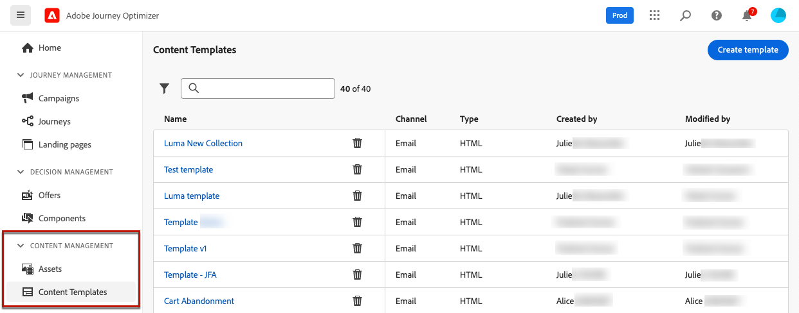
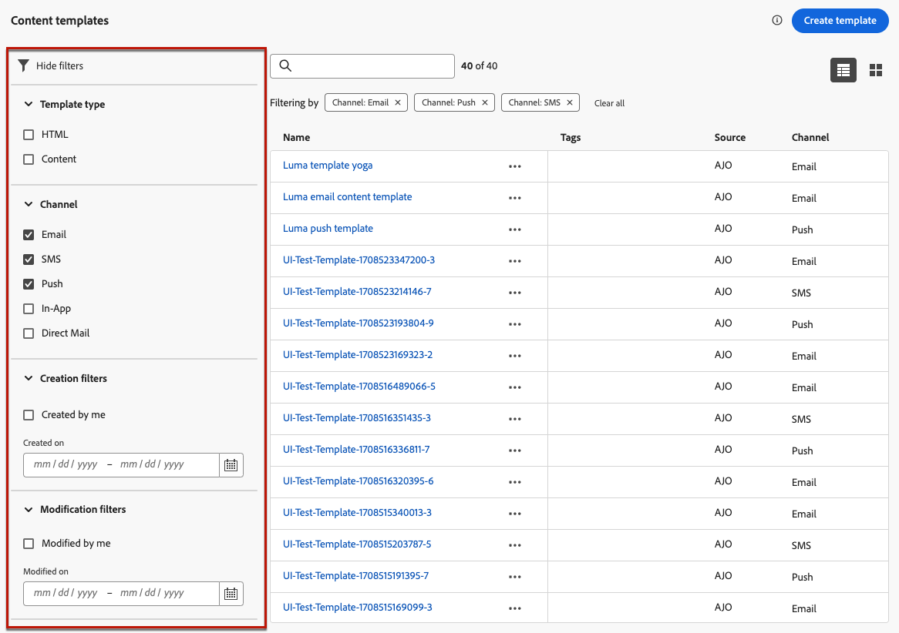
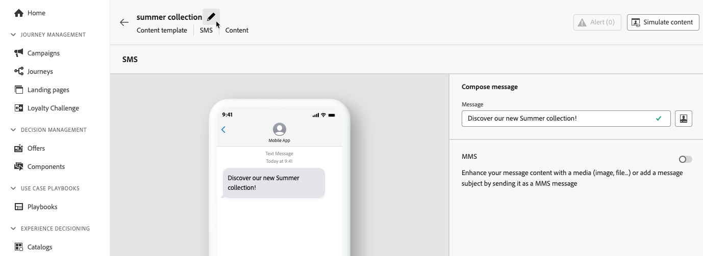
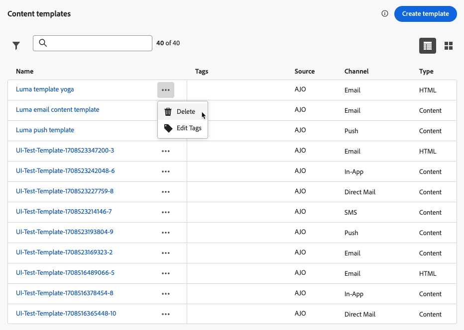
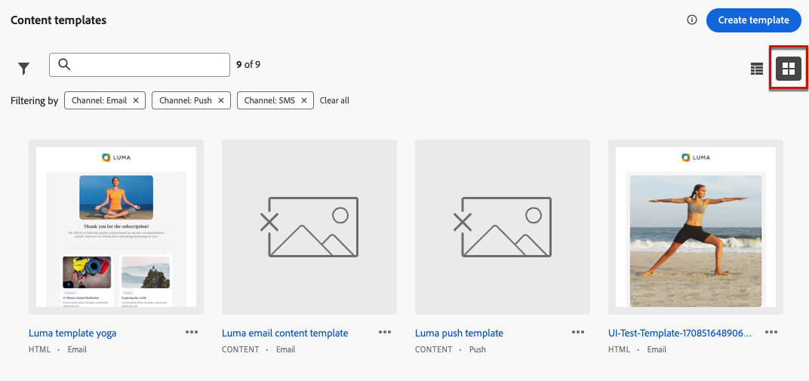

# 存取及管理內容範本 {#access-manage-templates}

## Access 內容範本 {#access}

若要存取內容範本清單，請從左側功能表選取&#x200B;**[!UICONTROL 內容管理]** > **[!UICONTROL 內容範本]**。

所有在目前沙箱上建立的範本(來自歷程或使用&#x200B;**[!UICONTROL 另存為範本]**&#x200B;選項（來自&#x200B;**[!UICONTROL 內容範本]**&#x200B;功能表）的行銷活動)都會顯示。 [瞭解如何建立範本](#create-content-templates)

您可以依下列方式排序內容範本：
* 類型
* Channel
* 建立或修改日期
* 標籤 — [進一步瞭解標籤](../start/search-filter-categorize.md#tags)

您也可以選擇只顯示您自己建立或修改的專案。

## 編輯和刪除內容範本 {#edit}

* 若要編輯範本內容，請從清單中按一下所需的專案，然後進行所需的變更。 您也可以按一下範本名稱旁邊的編輯按鈕，以編輯內容範本屬性。

  

* 若要刪除範本，請選取所要範本旁的&#x200B;**[!UICONTROL 更多動作]**&#x200B;按鈕，並選取&#x200B;**[!UICONTROL 刪除]**。

  

>[!NOTE]
>
>編輯或刪除範本時，使用此範本建立的行銷活動或歷程（包括內容）不受影響。

## 將範本顯示為縮圖 {#template-thumbnails}

選取&#x200B;**[!UICONTROL 格線檢視]**&#x200B;模式，將每個範本顯示為縮圖。

>[!AVAILABILITY]
>
>此功能以有限可用性 (LA) 形式向一小部分客戶發布。

>[!NOTE]
>
>目前只能為HTML型別的電子郵件內容範本產生適當的縮圖。

更新內容時，您可能需要等候幾秒鐘，變更才會反映在縮圖中。
