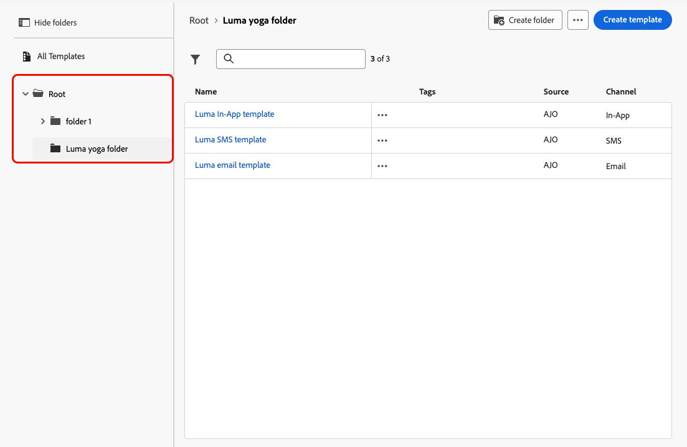
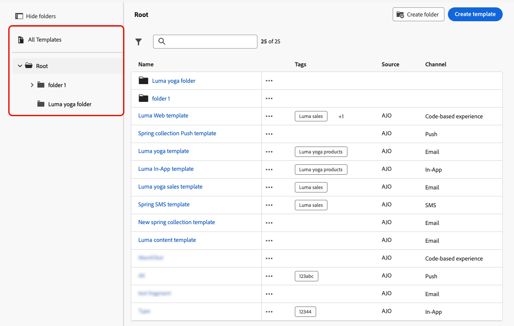
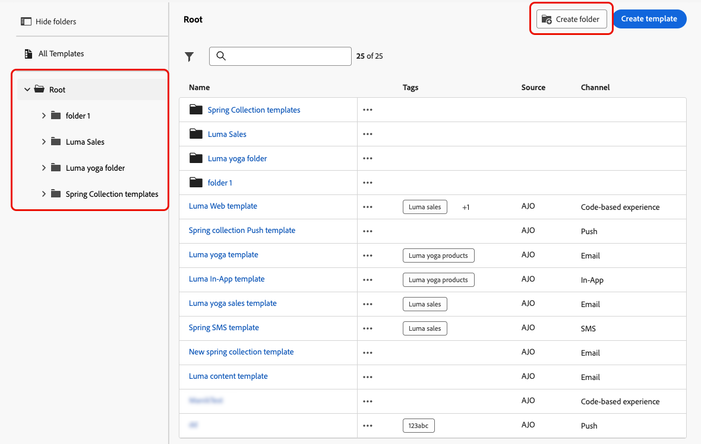
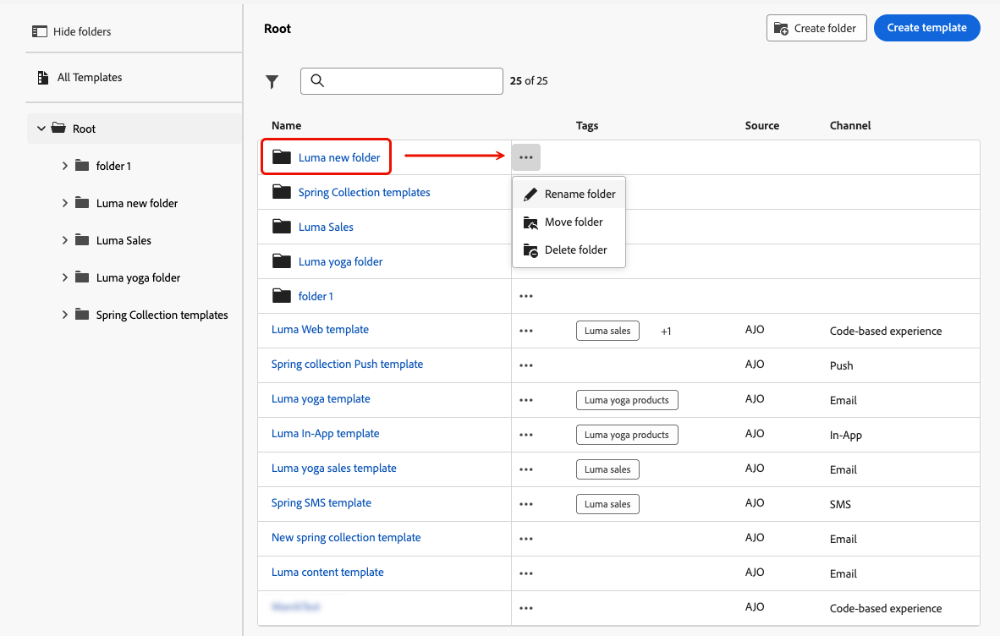
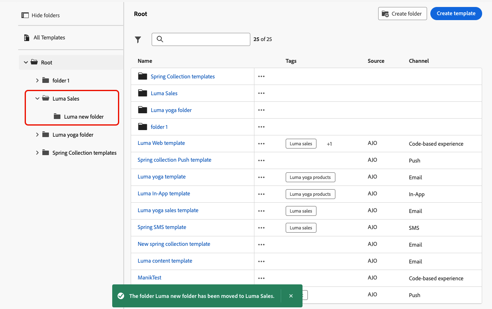
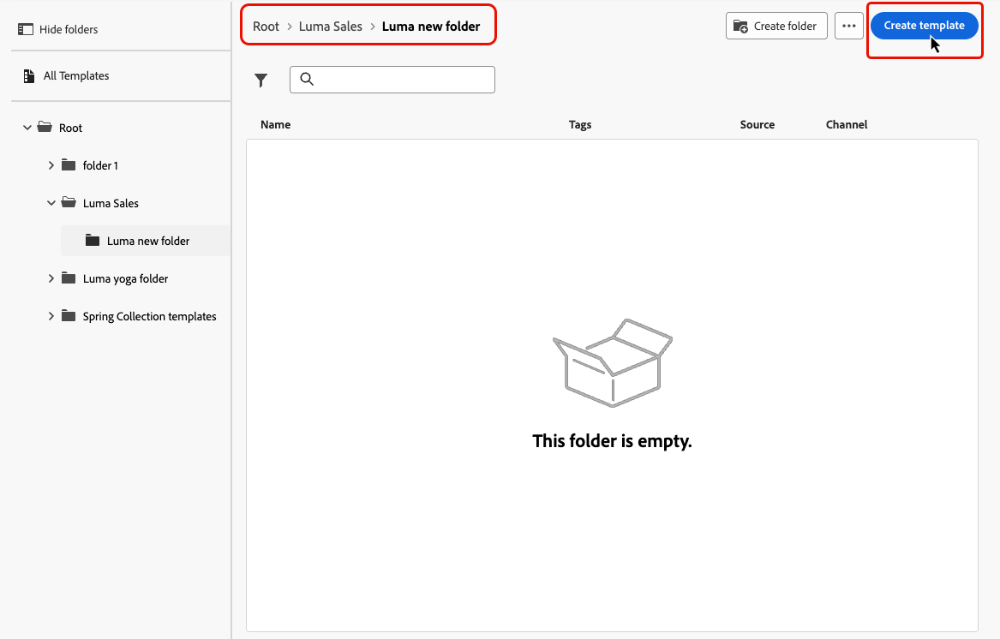

# 存取及管理內容範本 {#access-manage-templates}

## Access 內容範本 {#access}

若要存取內容範本清單，請從左側功能表選取&#x200B;**[!UICONTROL 內容管理]** > **[!UICONTROL 內容範本]**。

所有在目前沙箱上建立的範本(來自歷程或使用&#x200B;**[!UICONTROL 另存為範本]**&#x200B;選項（來自&#x200B;**[!UICONTROL 內容範本]**&#x200B;功能表）的行銷活動)都會顯示。 [瞭解如何建立範本](#create-content-templates)

左側的窗格可讓您將內容範本整理到資料夾中。 依預設，會顯示所有範本。 選取資料夾時，只會顯示所選資料夾中包含的範本和資料夾。 [了解更多](#folders)

>[!NOTE]
>
>內容範本資料夾僅適用於一組組織（可用性限制），並將逐步推出給更多使用者。

若要尋找特定專案，請在搜尋欄位中開始輸入名稱。 選取[資料夾](#folders)時，搜尋會套用至該資料夾<!--(not nested items)-->階層第一層級中的所有內容範本或資料夾。

您可以依下列方式排序內容範本：
* 類型
* Channel
* 建立或修改日期
* 標籤 — [進一步瞭解標籤](../start/search-filter-categorize.md#tags)

您也可以選擇只顯示您自己建立或修改的專案。

>[!NOTE]
>
>自2025年3月起，HTML型別內容範本已棄用。 您仍可存取先前在[!DNL Journey Optimizer]中建立的現有HTML內容範本。

## 使用資料夾管理內容範本 {#folders}

>[!AVAILABILITY]
>
>內容範本資料夾僅適用於一組組織（可用性限制），並將逐步推出給更多使用者。

若要輕鬆導覽您的內容範本，您可以使用資料夾來更有效地將其組織到結構化階層中。 這可讓您根據組織需求將專案分類和管理。

1. 按一下&#x200B;**[!UICONTROL 所有內容範本]**&#x200B;按鈕，以顯示先前建立的所有專案，但不包含資料夾群組。

1. 按一下&#x200B;**[!UICONTROL Root]**&#x200B;資料夾以顯示所有已建立的資料夾。

   >[!NOTE]
   >
   >如果您尚未建立資料夾，則會顯示所有內容範本。

1. 按一下&#x200B;**[!UICONTROL 根]**&#x200B;資料夾內的任何資料夾以顯示其內容。

1. 按一下&#x200B;**[!UICONTROL 根]**&#x200B;資料夾或任何其他資料夾後，**[!DNL Create folder]**&#x200B;按鈕就會顯示。 選取它。

   

1. 輸入新資料夾的名稱，然後按一下[儲存]。**** 新資料夾會顯示在&#x200B;**[!UICONTROL Root]**&#x200B;資料夾內內容範本清單的頂端，或顯示在目前選取的資料夾內。

1. 您可以按一下&#x200B;**[!UICONTROL 其他動作]**&#x200B;按鈕，重新命名或刪除資料夾。

   

1. 使用&#x200B;**[!UICONTROL 更多動作]**&#x200B;按鈕，您也可以將內容範本移至其他現有資料夾。

   

1. 現在您可以導覽至您剛建立的資料夾。 您[從此處](create-content-templates.md)建立的每個新內容範本都會儲存到目前的資料夾中。

   

## 編輯和刪除內容範本 {#edit}

* 若要編輯範本內容，請從清單中按一下所需的專案，然後進行所需的變更。 您也可以按一下範本名稱旁邊的編輯按鈕，以編輯內容範本屬性。

  

* 若要刪除範本，請選取所要範本旁的&#x200B;**[!UICONTROL 更多動作]**&#x200B;按鈕，並選取&#x200B;**[!UICONTROL 刪除]**。

  

>[!NOTE]
>
>編輯或刪除範本時，使用此範本建立的行銷活動或歷程（包括內容）不受影響。

## [!BADGE 有限可用性]{type=Informative}將範本顯示為縮圖 {#template-thumbnails}

選取&#x200B;**[!UICONTROL 格線檢視]**&#x200B;模式，將每個範本顯示為縮圖。

>[!AVAILABILITY]
>
>此功能以可用性限制 (LA) 形式向一小部分客戶發行。

>[!NOTE]
>
>目前只能為HTML型別的電子郵件內容範本產生適當的縮圖。

更新內容時，您可能需要等候幾秒鐘，變更才會反映在縮圖中。

## 將內容範本匯出至另一個沙箱 {#export}

Journey Optimizer可讓您將內容範本從一個沙箱複製到另一個沙箱。 例如，您可以將範本從中繼沙箱環境複製到生產沙箱。

復製程式是透過來源與目標沙箱之間的&#x200B;**封裝匯出和匯入**&#x200B;進行。 本節提供如何匯出物件並將其匯入目標沙箱的詳細資訊： [將物件複製到另一個沙箱](../configuration/copy-objects-to-sandbox.md)
