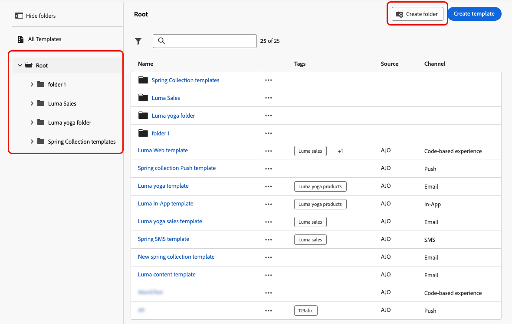
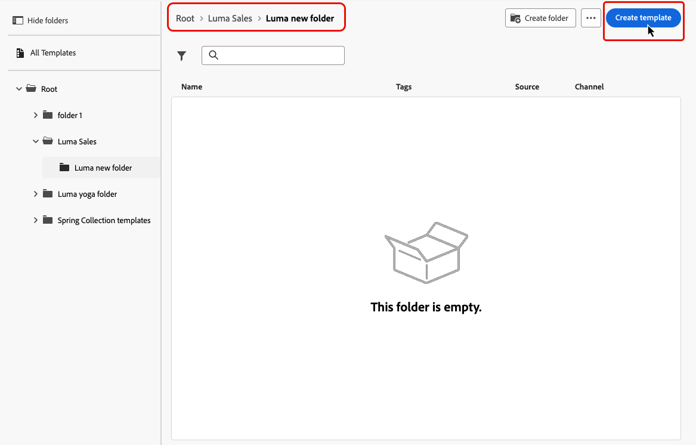
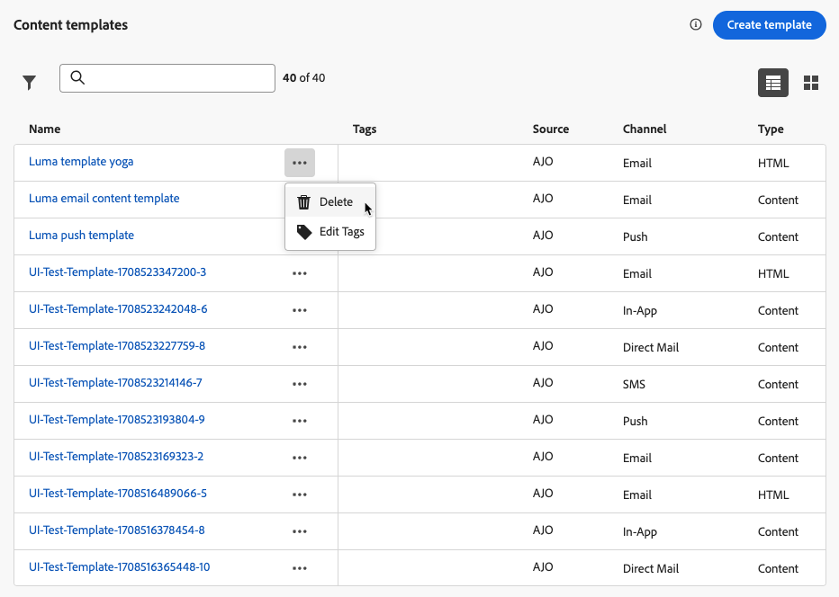

# 存取及管理內容範本 {#access-manage-templates}

## 先決條件 {#prerequisites}

若要存取和管理內容範本，請確定以下事項：

* **內容範本許可權** — 您的角色必須包含&#x200B;**[!UICONTROL 管理內容範本]**&#x200B;許可權（在&#x200B;**內容管理**&#x200B;資源下）。 如果沒有它，左側導覽中就不會顯示&#x200B;**內容範本**&#x200B;功能表。 [瞭解如何管理許可權](../administration/permissions.md)
* **沙箱範圍** — 內容範本是沙箱專屬的。 在一個沙箱中建立的範本無法用於另一個沙箱。 搜尋範本之前，請確定您位於正確的沙箱中。
* **HTML範本（已棄用）** — 自2025年3月起，將棄用HTML型別的內容範本。 現有的HTML範本仍可存取，但無法建立新的範本。

## Access 內容範本 {#access}

若要存取內容範本清單，請從左側功能表選取&#x200B;**[!UICONTROL 內容管理]** > **[!UICONTROL 內容範本]**。

所有在目前沙箱上建立的範本（無論是來自使用&#x200B;**[!UICONTROL 另存為範本]**&#x200B;選項的歷程或行銷活動，或來自&#x200B;**[!UICONTROL 內容範本]**&#x200B;選單）都會顯示。 [瞭解如何建立範本](#create-content-templates)

左側的窗格可讓您將內容範本整理到資料夾中。 依預設，會顯示所有範本。 選取資料夾時，只會顯示所選資料夾中包含的範本和資料夾。 [了解更多](#folders)

若要尋找特定專案，請在搜尋欄位中開始輸入名稱。 選取[資料夾](#folders)時，搜尋會套用至該資料夾<!--(not nested items)-->階層第一層級中的所有內容範本或資料夾。

您可以依下列方式排序內容範本：

* 類型
* 頻道
* 建立或修改日期
* 標籤 — [進一步瞭解標籤](../start/search-filter-categorize.md#tags)

您也可以選擇只顯示您建立或修改的專案。

>[!NOTE]
>
>自2025年3月起，不再使用HTML型別的內容範本。 您仍可存取先前在[!DNL Journey Optimizer]中建立的現有HTML內容範本。

## 使用資料夾管理內容範本 {#folders}

若要輕鬆導覽您的內容範本，請使用資料夾以更有效地將其組織到結構化階層中。 這可讓您根據組織的需求來分類和管理專案。

1. 按一下&#x200B;**[!UICONTROL 所有內容範本]**&#x200B;按鈕，以顯示先前建立的所有專案，而不使用資料夾分組。

1. 按一下&#x200B;**[!UICONTROL Root]**&#x200B;資料夾以顯示所有已建立的資料夾。

   >[!NOTE]
   >
   >如果您尚未建立資料夾，則會顯示所有內容範本。

1. 按一下&#x200B;**[!UICONTROL 根]**&#x200B;資料夾內的任何資料夾以顯示其內容。

1. 按一下&#x200B;**[!UICONTROL 根]**&#x200B;資料夾或任何其他資料夾後，**[!DNL Create folder]**&#x200B;按鈕就會顯示。 選取它。

   

1. 輸入新資料夾的名稱，然後按一下[儲存]。**&#x200B;** 新資料夾會顯示在&#x200B;**[!UICONTROL Root]**&#x200B;資料夾內內容範本清單的頂端，或顯示在目前選取的資料夾內。

1. 您可以按一下&#x200B;**[!UICONTROL 其他動作]**&#x200B;按鈕，重新命名或刪除資料夾。

   

1. 使用&#x200B;**[!UICONTROL 更多動作]**&#x200B;按鈕，您也可以將內容範本移至其他現有資料夾。

   

1. 導覽至您剛建立的資料夾。 您[從此處](create-content-templates.md)建立的每個新內容範本都會儲存到目前的資料夾中。

   

## 編輯和刪除內容範本 {#edit}

* 若要編輯範本內容，請從清單中按一下所需的專案，然後進行所需的變更。 您也可以按一下範本名稱旁邊的編輯按鈕，以編輯內容範本屬性。

  

* 若要刪除範本，請選取所要範本旁的&#x200B;**[!UICONTROL 更多動作]**&#x200B;按鈕，並選取&#x200B;**[!UICONTROL 刪除]**。

  

>[!NOTE]
>
>編輯或刪除範本時，使用此範本建立的行銷活動或歷程（包括內容）不受影響。

## [!BADGE 有限可用性]{type=Informative}將範本顯示為縮圖 {#template-thumbnails}

選取&#x200B;**[!UICONTROL 格線檢視]**&#x200B;模式，將每個範本顯示為縮圖。

>[!AVAILABILITY]
>
>此功能以可用性限制 (LA) 形式向一小部分客戶發行。

>[!NOTE]
>
>只能為HTML型別的電子郵件內容範本產生適當的縮圖。

更新內容時，請等候數秒鐘，讓變更反映在縮圖中。

## 疑難排解 {#troubleshooting}

+++我在左側導覽中看不到「內容範本」功能表

您的角色缺少&#x200B;**管理內容範本**&#x200B;許可權。 請要求您的系統管理員將具有&#x200B;**管理內容範本**&#x200B;許可權的&#x200B;**內容管理**&#x200B;資源新增到您的角色。 [了解更多](../administration/permissions.md)

+++

+++我建立的範本未顯示在清單中

檢查您是否在正確的沙箱中 — 範本是沙箱專屬的。 同時確認是否在左窗格中選取資料夾；選取資料夾時，只會顯示該資料夾中的範本。 按一下「所有內容範本&#x200B;**[!UICONTROL 」，以顯示所有範本（無論資料夾為何）。]**

+++

+++我編輯了範本，但我的行銷活動或歷程內容沒有更新

編輯或刪除範本並不會回溯更新使用範本建立的行銷活動或歷程。 內容會在使用時複製。 若要更新現有內容，請直接編輯行銷活動或歷程。

+++

## 將內容範本匯出至另一個沙箱 {#export}

Journey Optimizer可讓您將內容範本從一個沙箱複製到另一個沙箱。 例如，您可以將範本從中繼沙箱環境複製到生產沙箱。

復製程式是透過來源和目標沙箱之間的&#x200B;**封裝匯出和匯入**&#x200B;來執行。 本節提供如何匯出物件並將其匯入目標沙箱的詳細資訊： [將物件複製到另一個沙箱](../configuration/copy-objects-to-sandbox.md)

