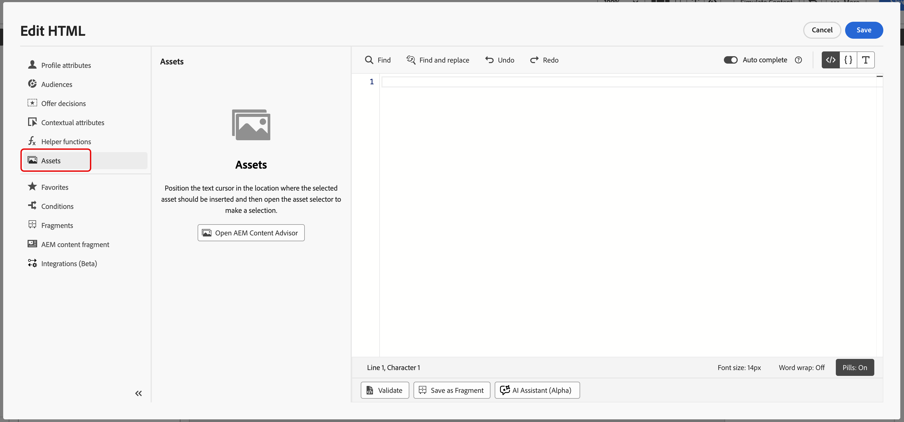

# 使用Adobe Experience Manager內容顧問 {#aem-content-advisor}

>[!AVAILABILITY]
>
>Adobe Experience Manager內容警告器僅適用於通道編寫工作流程。

Adobe Experience Manager Content Advisor以標準化意圖驅動的統一介面探索取代確定性探索。 它可直接在Journey Optimizer製作工作流程中，使用AI支援的統一探索Assets和內容片段，改善行銷人員生產力和行銷活動效率。

## 可用的功能

### 適用於Assets {#asset-features}

Adobe Experience Manager內容警告器提供下列資產功能：

* &#x200B;
  +++ AI語意搜尋

  使用自然語言（而非精確的關鍵字或檔案名稱）搜尋資產。 以純文字描述您需要的內容，例如「山中的咖啡」，AI會根據含義和內容尋找內容相關的資產，而不只是文字相符。

  {zoomable="yes"}

  +++

* &#x200B;
  +++ 最近的搜尋歷史記錄

  存取您最近的搜尋，以快速重複使用關鍵字與內容。 這可在處理類似的行銷活動或需要縮小先前的搜尋範圍時節省時間。

  {zoomable="yes"}

  +++ 

* &#x200B;
  +++ 上傳簡報

  上傳行銷簡報檔案，以自動顯示與行銷活動內容一致的資產。 AI會根據檔案中描述的內容和需求，分析您的摘要並提出相關資產的建議。

  {zoomable="yes"}

  +++

* &#x200B;
  +++ 資產資訊面板

  使用&#x200B;**資訊**&#x200B;圖示檢視任何資產的詳細中繼資料和屬性。 這包括資產維度、檔案大小、建立日期、標籤，以及其他相關資訊，以協助您做出明智的決策。

  {zoomable="yes"}

  +++

* &#x200B;
  +++ Dynamic Media面板

  根據存放庫設定，存取動態轉譯、智慧型裁切和即時修改。

  {zoomable="yes"}

  「動態媒體」面板可讓您存取動態轉譯、智慧型裁切和即時修改。 您可以直接在面板中輸入修飾元來建立自訂轉譯。

  **可用性**

  Dynamic Media的可用性取決於您的存放庫設定：

   * **Scene7**：可用於已發佈的資產(視訊和PDF除外)。 [進一步瞭解Dynamic Media Scene7修飾元](https://experienceleague.adobe.com/docs/dynamic-media-developer-resources/image-serving-api/image-serving-api/http-protocol-reference/command-reference/r-is-http-modifiers.html){target="_blank"}

   * **OpenAPI**：可用於核准的資產（視訊除外）。 [進一步瞭解具有OpenAPI修飾元的Dynamic Media](https://experienceleague.adobe.com/docs/experience-manager-cloud-service/content/assets/dynamicmedia/image-profiles.html){target="_blank"}

   * **Scene7和OpenAPI**：當兩個設定都存在且資產符合條件時，即可使用。

  **棧疊選取專案**

  您看到的按鈕取決於您的存放庫設定：

   * **僅限Scene7按鈕**：存放庫有Scene7設定，且資產已發佈至Dynamic Media。
   * **僅限OpenAPI按鈕**：存放庫具有OpenAPI設定，且資產已核准。
   * **兩個按鈕**：存放庫同時具有設定和資產，而且已發佈和核准。
  +++

### 針對內容片段 {#content-fragment-features}

Adobe Experience Manager內容警告器提供下列內容片段功能：

* &#x200B;
  +++ 範本檢視清單 

  在縮圖和表格檢視之間切換，以最適合您工作流程的格式瀏覽內容片段。 縮圖檢視提供視覺化內容，而表格檢視則以結構化格式顯示詳細資訊。

  {zoomable="yes"}

  +++

* &#x200B;
  +++ 資訊面板 

  按一下&#x200B;**[!UICONTROL 資訊]**&#x200B;圖示以開啟右側面板，其中顯示片段變數、屬性和&#x200B;**[!UICONTROL 參考者]**&#x200B;詳細資料。 **[!UICONTROL 參考者]**&#x200B;區段會顯示使用該片段的所有Adobe Experience Manager實體，以及直接在Adobe Experience Manager中檢視這些參考的連結。

  {zoomable="yes"}

  +++

* &#x200B;
  +++ 在Adobe Experience Manager中開啟

  直接在Adobe Experience Manager中快速開啟任何內容片段，使用標題旁的圖示進行編輯。 這項緊密整合可讓您在Journey Optimizer與Adobe Experience Manager之間切換，而不會失去內容。

  {zoomable="yes"}

  +++

* &#x200B;
  +++ JSON預覽

  以簡潔而有組織的表格格式預覽內容片段的JSON結構。 這有助於您瞭解片段的資料結構，並在將其用於行銷活動之前驗證內容。

  {zoomable="yes"}

  +++

## 存取Adobe Experience Manager內容顧問 {#access}

若要在Journey Optimizer中存取Adobe Experience Manager內容建議程式，請遵循下列步驟：

1. 在Adobe Journey Optimizer中建立行銷活動，並新增頻道動作，例如電子郵件。

1. 按一下&#x200B;**[!UICONTROL 編輯內容]**，然後按一下&#x200B;**[!UICONTROL 編輯電子郵件內文]**&#x200B;以開啟內容編輯器。

1. 將HTML或文字元件拖放至電子郵件內容中。

1. 將游標暫留在元件上，然後按一下&#x200B;**[!UICONTROL 顯示原始程式碼]** (適用於HTML元件)或&#x200B;**[!UICONTROL 新增Personalization]** （適用於Text元件）。

1. 在Personalization編輯器中，選擇您的內容進入點：

   * 若要新增資產，請按一下&#x200B;**[!UICONTROL Assets]**，然後&#x200B;**[!UICONTROL 開啟AEM內容警告器]**。

     {zoomable="yes"}

   * 若要新增Adobe Experience Manager內容片段，請按一下&#x200B;**[!UICONTROL AEM內容片段]**，然後&#x200B;**[!UICONTROL 開啟AEM內容警告器]**。

     {zoomable="yes"}

1. 選取您的Adobe Experience Manager存放庫。

   {zoomable="yes"}

1. 瀏覽並選取您要使用的資產或內容片段，然後將其插入您的內容。
