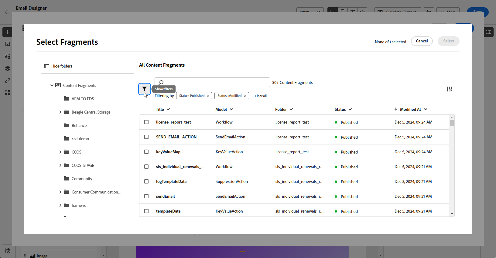
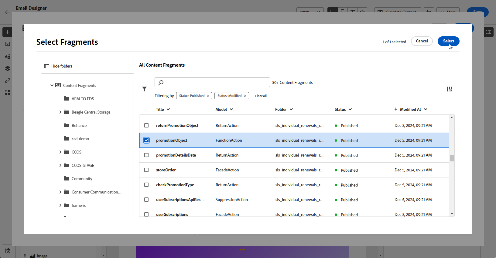

# Adobe Experience Manager 內容片段 {#aem-fragments}

透過將Adobe Experience Manager與Adobe Journey Optimizer整合，您現在可以將AEM內容片段順暢地整合到Journey Optimizer電子郵件內容中。 此簡化的連線可簡化存取及運用AEM內容的程式，讓您建立個人化和動態的行銷活動和歷程。

若要深入瞭解AEM內容片段，請參閱[Experience Manager檔案](https://experienceleague.adobe.com/en/docs/experience-manager-cloud-service/content/sites/authoring/fragments/content-fragments)。

## 限制 {#limitations}

* 僅適用於電子郵件頻道。

* 使用者目前無法切換他們連線到的AEM執行個體，因為每個沙箱僅限於單一執行個體。

* 建議限制有權存取發佈內容片段的使用者人數，以降低電子郵件中意外錯誤的風險。

* 對於多語言內容，僅支援手動流程。

* 目前不支援變體。

* 您需要建立Journey Optimizer專屬的標籤。

+++ 瞭解如何建立Journey Optimizer標籤

   1. 存取您的&#x200B;**Experience Manager**&#x200B;環境。

   1. 從&#x200B;**工具**&#x200B;功能表，瀏覽至&#x200B;**一般**&#x200B;標籤，並選取&#x200B;**標籤**。

   1. 按一下&#x200B;**建立新標籤**。

   1. 確定ID遵循下列語法： `ajo-enabled:{AJO-OrgId}/{AJO-SandboxName}`。

   1. 按一下&#x200B;**建立**。

  您現在可以將此Journey Optimizer標籤指派給您的內容片段。
+++

## 新增AEM內容片段 {#aem-add}

建立並個人化您的[AEM內容片段](https://experienceleague.adobe.com/en/docs/experience-manager-cloud-service/content/sites/authoring/fragments/content-fragments)後，您現在可以將其匯入您的Journey Optimizer行銷活動或歷程。

1. 使用電子郵件動作建立您的[行銷活動](../email/create-email.md)或[歷程](../email/create-email.md)後，請存取電子郵件設計工具以設定電子郵件內容。 [了解更多](../email/get-started-email-design.md)

1. 按一下文字區塊內部或主旨列，然後從內容工具列選取&#x200B;**[!UICONTROL 新增Personalization]**。

   

1. 從左窗格中的&#x200B;**[!UICONTROL AEM內容片段]**&#x200B;功能表，按一下&#x200B;**[!UICONTROL 開啟AEM CF選取器]**。

   

1. 從可用的清單中選取&#x200B;**[!UICONTROL 內容片段]**，以匯入您的Journey Optimizer內容。

   >[!IMPORTANT]
   >
   >只能使用已發佈的&#x200B;**[!UICONTROL 內容片段]**。

1. 按一下「**[!UICONTROL 顯示篩選器]**」以微調您的內容片段清單。

   內容片段選擇器包含預先設定的篩選器：

   * **[!UICONTROL 狀態]**：已發佈，已修改
   * **[!UICONTROL 標籤]**：根據您的Journey Optimizer環境（組織ID和沙箱）自動定義

   

1. 選取您的&#x200B;**[!UICONTROL 內容片段]**&#x200B;後，按一下&#x200B;**[!UICONTROL 選取]**&#x200B;以開啟。

   

1. 從您的&#x200B;**[!UICONTROL 內容片段]**&#x200B;中選擇所需的欄位以新增至您的內容。

   

1. 按一下&#x200B;**[!UICONTROL 儲存]**，然後在預覽中檢查您的訊息。 您現在可以測試並檢查您的訊息內容，如[本節](preview.md)所詳述。

執行測試並驗證內容後，您就可以使用[行銷活動](../campaigns/review-activate-campaign.md)或[歷程](../building-journeys/publishing-the-journey.md)，將電子郵件傳送給您的對象。
