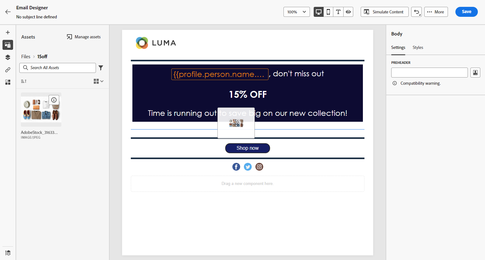
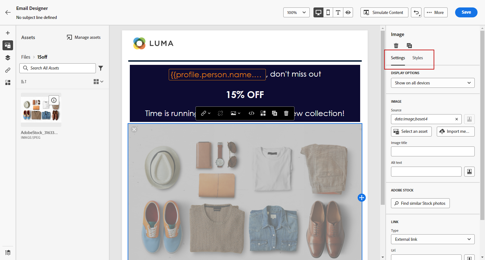

# 透過建立和管理資產 [!DNL Assets Essentials]{#experience-manager-assets}

## 開始使用 [!DNL Assets Essentials] {#get-started-assets-essentials}

利用 [!DNL Adobe Experience Manager Assets Essentials] 將行銷與創意內容工作流程結合在一起。與 [!DNL Adobe Journey Optimizer] 進行本機整合，存取 [!DNL Assets Essentials] 來儲存、管理、探索及分發數位資產。提供了可用於填入訊息的單一、集中式資產存放庫。

[!DNL Adobe Experience Manager Assets Essentials] 是合作和集中式資產工作區，可擴充您的創意系統並統一數位資產以進行體驗交付。 您可以輕鬆組織、標籤和尋找核准的生產資產，以確保跨團隊的品牌一致性。 透過其直覺式使用者體驗，存取 [!DNL Assets Essentials] 立即在您的Adobe創意和Experience Cloud應用程式中共用資產。

進一步瞭解 [Adobe Experience Manager Assets Essentials檔案](https://experienceleague.adobe.com/docs/experience-manager-assets-essentials/help/introduction.html){target="_blank"}.

可以透過左側選單 [!DNL Adobe Experience Manager Assets Essentials]Assets[!DNL Adobe Journey Optimizer] 區段直接從 **[!UICONTROL 存取]**。您也可以在下列情況下存取資產和資料夾： [設計電子郵件內容](../email/get-started-email-design.md).

## 先決條件{#assets-prerequisites}

使用前 [!DNL Adobe Experience Manager Assets Essentials]，您必須將使用者新增至 **Assets Essentials消費者使用者** 或/和 **Assets Essentials使用者** 產品設定檔。 詳細內容： [Assets Essentials檔案](https://experienceleague.adobe.com/docs/experience-manager-assets-essentials/help/deploy-administer.html?lang=zh-Hant){target="_blank"}.

>[!NOTE]
>針對 2022 年 1 月 6 日之前取得的 Journey Optimizer 產品，您必須為貴組織部署 [!DNL Adobe Experience Manager Assets Essentials] 。 在[部署 Assets Essentials](https://experienceleague.adobe.com/docs/experience-manager-assets-essentials/help/deploy-administer.html?lang=zh-Hant){target="_blank"} 一節中了解更多。

## 上傳和插入資產{#add-asset}

將檔案匯入 [!DNL Assets Essentials]，您必須先瀏覽或建立要儲存的資料夾。 然後，您就可以將它們插入您的電子郵件內容。

有關如何上傳資產的詳細資訊，請參閱 [Adobe Experience Manager Assets Essentials檔案](https://experienceleague.adobe.com/docs/experience-manager-assets-essentials/help/add-delete.html){target="_blank"}.

1. 從 [!DNL Adobe Journey Optimizer] 首頁，選取 **[!UICONTROL 資產]** 標籤下的 **[!UICONTROL 內容管理]** 功能表以存取 [!DNL Assets Essentials].

   

1. 在Journey Optimizer中選擇資產的存放庫。 如果您擁有此解決方案，您可以選擇使用Assets Essentials存放庫或Assetsas a Cloud Service存放庫。

   

+++
瞭解如何切換資產存放庫。

   若要變更您的資產存放庫，請選取右上角的「帳戶」圖示，然後按一下 **[!UICONTROL 選取存放庫]**.

   

+++

1. 在中央區段或樹狀檢視中連按兩下資料夾以開啟它。

   您也可以按一下 **[!UICONTROL 建立資料夾]** 以建立新資料夾。

   

1. 一旦進入選取或建立的資料夾，按一下 **[!UICONTROL 新增資產]** 將新資產上傳至資料夾。

   

1. 從 **[!UICONTROL 上傳檔案]**，按一下 **[!UICONTROL 瀏覽]** 並選擇是否要 **[!UICONTROL 瀏覽檔案]** 或 **[!UICONTROL 瀏覽資料夾]**.

1. 選取您要上傳的檔案。 完成後，按一下 **[!UICONTROL 上傳]**. 要瞭解有關如何管理資產的詳細資訊，請參閱本 [頁面](https://experienceleague.adobe.com/docs/experience-manager-assets-essentials/help/manage-organize.html).

1. 若要使用Adobe Photoshop Express進一步編輯您的資產，請連按兩下資產。 然後，從右側功能表中選取 **[!UICONTROL 編輯模式]** 圖示。 [了解更多](https://experienceleague.adobe.com/docs/experience-manager-assets-essentials/help/edit-images.html){target="_blank"}.

   

1. 從 [!DNL Adobe Journey Optimizer]，選取 **[!UICONTROL 資產選取器]** 電子郵件設計工具左窗格中的功能表。

   

1. 選取您先前建立的 **[!UICONTROL 資產]** 資料夾。 您也可以在搜尋列中搜尋資產或資料夾。

1. 將您的資產拖放到電子郵件內容中。

   

1. 您可以進一步自訂資產，例如使用新增外部連結或文字 **[!UICONTROL 設定]** 和 **[!UICONTROL 樣式]** 索引標籤。 [深入瞭解元件設定](../email/content-components.md)

   

   <!--
    After adding your asset to your email, use the **[!UICONTROL Find similar Stock photos]** option to locate Stock photos that match the content, color, and composition of your image. [Learn more about Adobe Stock](stock.md).

    Note that this option is available for licensed/unlicensed Stock images and images from your Assets folder. 

    
    -->