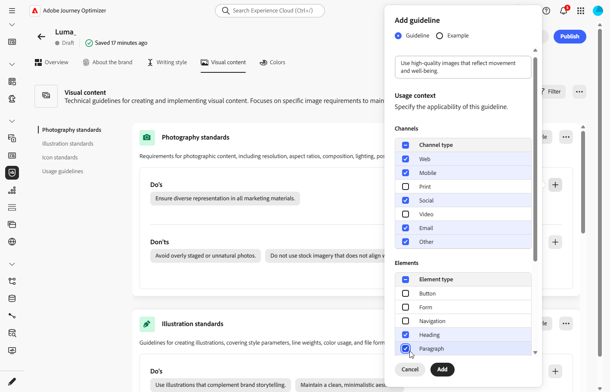
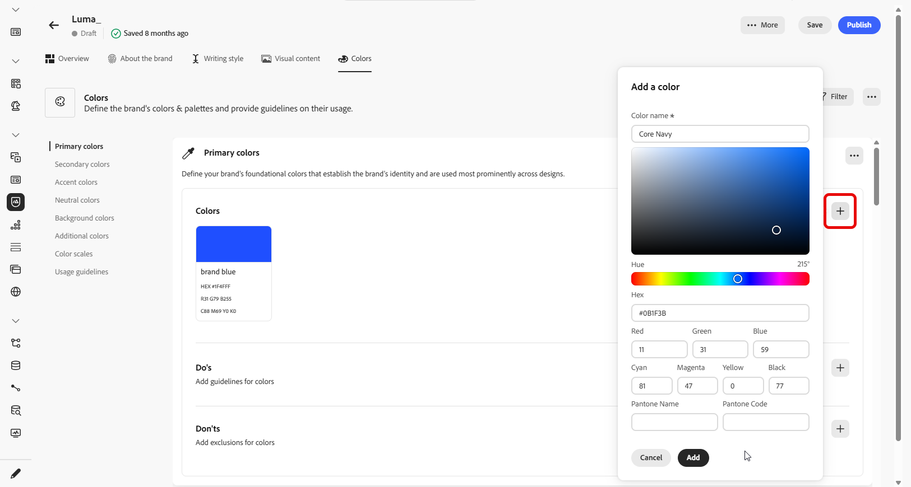
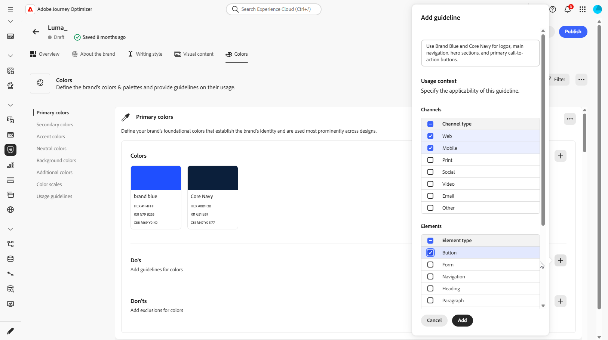
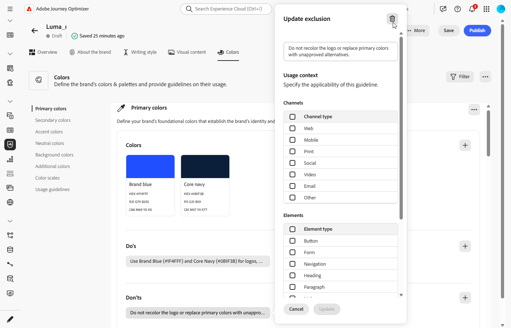

# 個人化您的品牌 {#brands-personalize}

## 關於品牌 {#about-brand}

使用「**[!UICONTROL 關於品牌]**」標籤來建立品牌的核心識別，概述其用途、個性、標語和其他定義屬性。

1. 首先，在&#x200B;**[!UICONTROL 重要詳細資料]**&#x200B;類別中填寫品牌的基本資訊：

   * **[!UICONTROL 品牌套件名稱]**：輸入您的品牌套件名稱。

   * **[!UICONTROL 何時使用]**：指定應套用此品牌套件的案例或內容。

   * **[!UICONTROL 品牌名稱]**：輸入品牌的正式名稱。

   * **[!UICONTROL 品牌說明]**：提供此品牌代表的概觀。

   * **[!UICONTROL 預設標語]**：新增與品牌關聯的主要標語。

     

1. 在&#x200B;**[!UICONTROL 指導原則]**&#x200B;類別中，請釐清品牌的核心方向與理念：

   * **[!UICONTROL 使命]**：詳細說明您品牌的用途。

   * **[!UICONTROL 願景]**：說明您的長期目標或想要的未來狀態。

   * **[!UICONTROL 市場定位]**：說明您的品牌在市場中的定位。

     

1. 在&#x200B;**[!UICONTROL 核心品牌值]**&#x200B;類別中，按一下以新增品牌的核心值並填入詳細資料：

   * **[!UICONTROL 值]**：命名核心品牌值。

   * **[!UICONTROL 描述]**：說明這個值對您品牌的意義。

   * **[!UICONTROL 行為]**：概述實際中反映此值的動作或態度。

   * **[!UICONTROL 表現]**：提供這個值在真實世界品牌中如何表示的範例。

     

1. 如有需要，請按一下圖示以更新或刪除您的核心品牌價值。

   

您現在可以進一步個人化您的品牌，或[發佈您的品牌](brands.md#create-brand-kit)。

## 寫作風格 {#writing-style}

>[!CONTEXTUALHELP]
>id="ajo_brand_writing_style"
>title="寫作風格一致性分數"
>abstract="寫作風格區段會定義語言、格式及結構的標準，以確保內容清晰且一致。一致性分數從高至低評分，會顯示您的內容對這些準則的遵循程度，並醒目提示需要改善的區域。"

**[!UICONTROL 撰寫樣式]**&#x200B;區段概述撰寫內容的標準，詳述如何使用語言、格式和結構來維持所有資料的清晰度、一致性和一致性。

+++ 可用的類別和範例

<table>
  <thead>
    <tr>
      <th>類別</th>
      <th>子類別</th>
      <th>指引範例</th>
      <th>排除專案範例</th>
    </tr>
  </thead>
  <tbody>
    <tr>
      <td rowspan="4">內容建立標準</td>
      <td>品牌訊息標準</td>
      <td>強調創新和客戶至上的訊息。</td>
      <td>請勿過度承諾產品功能。</td>
    </tr>
    <tr>
      <td>標語使用方式</td>
      <td>在所有數位行銷資產的標誌下方放置標語。</td>
      <td>請勿修改或翻譯標語。</td>
    </tr>
    <tr>
      <td>核心訊息</td>
      <td>強調主要優勢陳述，例如提高生產力。</td>
      <td>請勿使用不相關的值主張。</td>
    </tr>
    <tr>
      <td>命名標準</td>
      <td>使用簡單的描述性名稱，例如「ProScheduler」。</td>
      <td>請勿使用複雜字元或特殊字元。</td>
    </tr>
    <tr>
      <td rowspan="5">品牌溝通風格</td>
      <td>品牌人格特徵</td>
      <td>親切易懂。</td>
      <td>不要失敗。</td>
    </tr>
    <tr>
      <td>書寫力學</td>
      <td>讓句子儘量簡短並有影響力。</td>
      <td>不要使用過多的行話。</td>
    </tr>
    <tr>
      <td>情境色調</td>
      <td>維持危機溝通的專業語調。</td>
      <td>支援通訊時請勿不屑一顧。</td>
    </tr>
    <tr>
      <td>Word選擇指南</td>
      <td>使用「創新」和「智慧」等字眼。</td>
      <td>避免使用「便宜」或「駭客」等字眼。</td>
    </tr>
    <tr>
      <td>語言標準</td>
      <td>遵循美式英文慣例。</td>
      <td>請勿混合使用英式及美式拼字。</td>
    </tr>
    <tr>
      <td rowspan="3">法規遵循標準</td>
      <td>商標標準</td>
      <td>請一律使用™或®符號。</td>
      <td>必要時，請勿省略法定符號。</td>
    </tr>
    <tr>
      <td>版權標準</td>
      <td>在行銷資料中加入版權注意事項。</td>
      <td>未經許可請勿使用協力廠商內容。</td>
    </tr>
    <tr>
      <td>免責宣告標準</td>
      <td>在數位資產上清楚顯示免責宣告。</td>
      <td>請勿隱藏隱藏隱藏隱藏隱藏區域的免責宣告。</td>
    </tr>
</table>

+++

 

若要個人化您的&#x200B;**[!UICONTROL 撰寫樣式]**：

1. 從&#x200B;**[!UICONTROL 寫入樣式]**&#x200B;索引標籤，按一下以新增建議、例外或排除專案。

1. 輸入您的指引、例外或排除。 您也可以加入&#x200B;**[!UICONTROL 範例]**，以更好地說明應如何套用它。

   

1. 針對您的指引、例外或排除指定&#x200B;**使用內容**：

   * **[!UICONTROL 管道型別]**：選擇此建議、例外或排除的適用位置。 例如，您可能希望特定的書寫樣式僅顯示在電子郵件、行動裝置、列印或其他通訊通道中。

   * **[!UICONTROL 專案型別]**：指定規則套用的內容專案。 這可能包括標題、按鈕、連結或內容中的其他元件等元素。

     

1. 一旦您的指引、例外或排除設定完成後，請按一下[新增]。****

1. 如有需要，請選取其中一個准則或排除專案來更新或刪除。

1. 按一下以編輯您的範例，或按一下圖示以刪除範例。

   

您現在可以進一步個人化您的品牌，或[發佈您的品牌](#create-brand-kit)。

## 視覺內容 {#visual-content}

>[!CONTEXTUALHELP]
>id="ajo_brand_imagery"
>title="視覺內容一致性分數"
>abstract="視覺內容一致性分數表示您的內容與設定之品牌準則的符合程度。從高至低的評分可協助您總覽評估一致性。探索不同的類別可找出需要改善的區域，並找出可能不符合品牌的元素。"

**[!UICONTROL 視覺內容]**&#x200B;區段定義影像和設計的標準，詳細說明維持統一一致的品牌外觀所需的規格。

+++ 可用的類別和範例

<table>
  <thead>
    <tr>
      <th>類別</th>
      <th>指引範例</th>
      <th>排除專案範例</th>
    </tr>
  </thead>
  <tbody>
    <tr>
      <td>攝影標準</td>
      <td>戶外鏡頭使用自然光線。</td>
      <td>避免過度編輯或畫素化的影像。</td>
    </tr>
    <tr>
      <td>插圖示準</td>
      <td>使用簡潔的極簡風格。</td>
      <td>避免過於複雜。</td>
    </tr>
    <tr>
      <td>圖示標準</td>
      <td>使用一致的24px格線系統。</td>
      <td>請勿混合圖示尺寸、使用不一致的線條粗細，或偏離格線規則。</td>
    </tr>
    <tr>
      <td>使用指南</td>
      <td>選擇反映真實客戶在專業環境中使用該產品的生活方式影像。</td>
      <td>請勿使用與品牌色調相抵觸或看起來與內容不符的影像。</td>
    </tr>
</table>

+++

 

若要個人化您的&#x200B;**[!UICONTROL 視覺內容]**：

1. 從&#x200B;**[!UICONTROL 視覺內容]**&#x200B;索引標籤，按一下以新增指引、排除專案或範例。

1. 輸入您的指引、排除專案或範例。

   

1. 針對您的指引或排除專案指定&#x200B;**使用內容**：

   * **[!UICONTROL 管道型別]**：選擇此建議、例外或排除的適用位置。 例如，您可能希望特定的書寫樣式僅顯示在電子郵件、行動裝置、列印或其他通訊通道中。

   * **[!UICONTROL 專案型別]**：指定規則套用的內容專案。 這可能包括標題、按鈕、連結或內容中的其他元件等元素。

     

1. 一旦您的指引、例外或排除設定完成後，請按一下[新增]。****

1. 若要新增顯示正確使用方式的影像，請選取&#x200B;**[!UICONTROL 範例]**，然後按一下&#x200B;**[!UICONTROL 選取影像]**。 您也可以新增使用方式不正確的影像，作為排除範例。

   

1. 如有需要，請選取其中一個准則或排除專案來更新或刪除。

1. 選取您的範例以更新它、取代影像或按一下圖示以刪除它。

   

您現在可以進一步個人化您的品牌，或[發佈您的品牌](brands.md#create-brand-kit)。

<!--
## Colors {#colors}

The **[!UICONTROL Colors]** section the standards for your brand's color system, outlining how colors are selected, organized, and applied across experiences. It ensures consistent use of primary, secondary, accent, and neutral colors to maintain a cohesive, accessible, and recognizable brand identity.

+++ Available categories and examples

<table>
  <thead>
    <tr>
      <th>Category</th>
      <th>Guidelines Example</th>
      <th>Exclusions Example</th>
    </tr>
  </thead>
  <tbody>
    <tr>
      <td>Primary colors</td>
      <td>Use primary brand colors for logos, headers, and main call-to-action elements.</td>
      <td>Do not substitute or modify primary brand colors.</td>
    </tr>
    <tr>
      <td>Secondary colors</td>
      <td>Use secondary colors to support layouts, illustrations, and UI components.</td>
      <td>Do not let secondary colors overpower primary brand colors.</td>
    </tr>
    <tr>
      <td>Accent colors</td>
      <td>Use accent colors sparingly for buttons, links, and alerts.</td>
      <td>Do not use accent colors for large background areas.</td>
    </tr>
    <tr>
      <td>Neutral colors</td>
      <td>Use neutral colors for text, dividers, borders, and subtle UI elements.</td>
      <td>Avoid using neutrals with poor contrast or heavy color casts.</td>
    </tr>
    <tr>
      <td>Background colors</td>
      <td>Use light or neutral backgrounds to ensure readability and visual clarity.</td>
      <td>Do not place text or logos on low-contrast backgrounds.</td>
    </tr>
    <tr>
      <td>Additional colors</td>
      <td>Use additional colors only for data visualization or approved campaigns.</td>
      <td>Do not introduce unapproved or off-brand colors.</td>
    </tr>
    <tr>
      <td>Color scales</td>
      <td>Use approved tints and shades for UI states such as hover, active, and disabled.</td>
      <td>Do not create unofficial shades or gradients.</td>
    </tr>
    <tr>
      <td>Usage guidelines</td>
      <td>Maintain consistent color usage and accessible contrast across all assets.</td>
      <td>Do not mix conflicting palettes or apply colors inconsistently.</td>
    </tr>
</table>

+++

 

To personalize your **[!UICONTROL Colors]**:

1. From the **[!UICONTROL Colors]** tab, click  to add a color, guideline or exclusion. 

1. Enter your color information to define it accurately:

    * **Color name**: Provide a clear, descriptive name to identify the color within your brand system.

    * **Color value**: Choose your color using the hue picker or enter precise values using RGB, HEX, or Pantone name/code to ensure consistency across digital and print assets.

    

1. Review your selection to confirm accuracy and visual consistency and click **[!UICONTROL Add]** to save your color.

1. Then, enter your guideline or exclusion.

1. Specify the Usage context for your guideline or exclusion:

    * **[!UICONTROL Channel type]**: Choose where this guideline, exception, or exclusion should apply. For example, you may want a specific writing style to appear only in Email, Mobile, Prints, or other communication channels.

    * **[!UICONTROL Element type]**: Specify which content element the rule applies to. This could include elements such as Headings, Buttons, Links, or other components within your content.

      
  
1. Once your guideline, exception, or exclusion is set up, click **[!UICONTROL Add]**. 

1. If needed, select one of your guideline or exclusion to update or delete.

1. Select one your guideline or exclusion to update it. Click the icon to delete it. 

    

1. Click **[!UICONTROL Add group]** to define additional colors for your brand or to add a color scale group.

You can now further personalize your brand or [publish your brand](brands.md#create-brand-kit).

-->