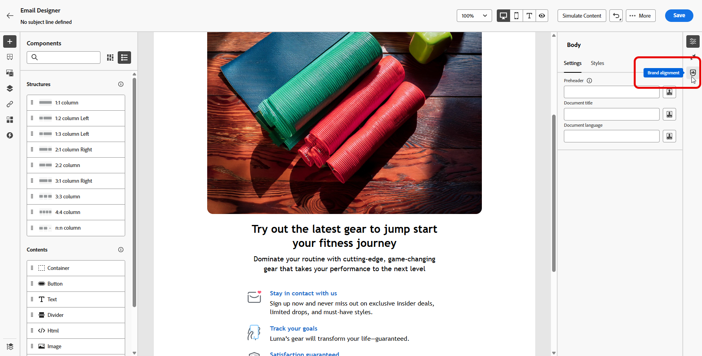
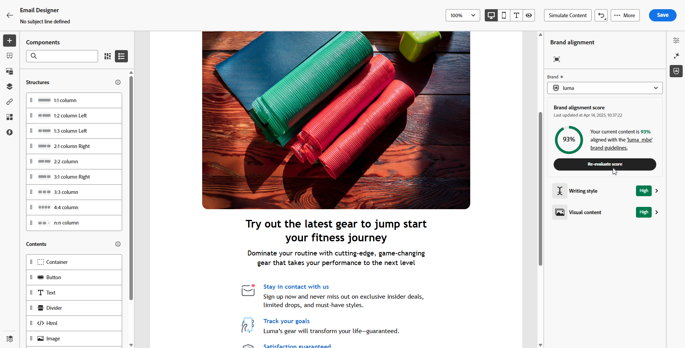
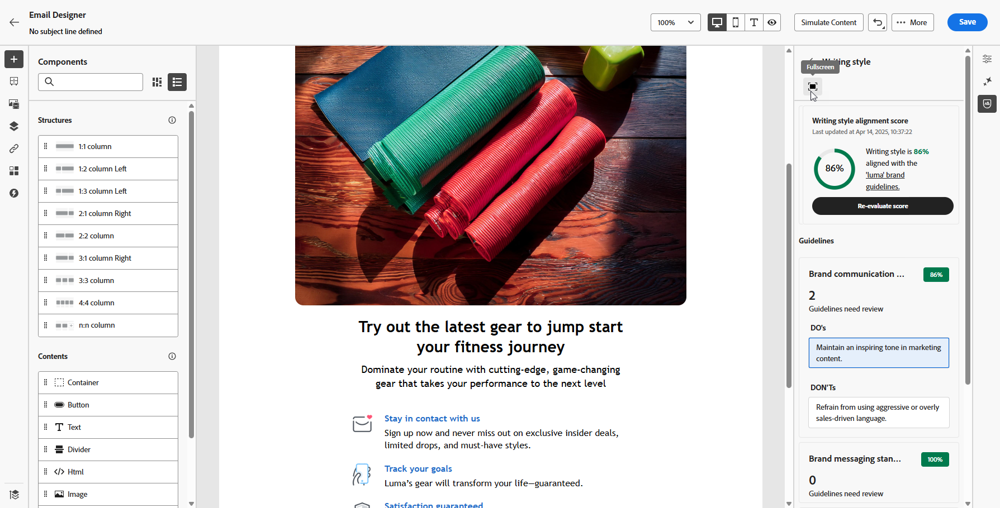
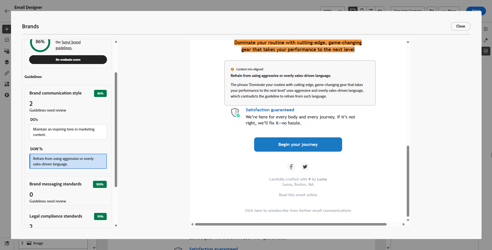

# 品牌一致性 {#brands-score}

>[!CONTEXTUALHELP]
>id="ajo_brand_score"
>title="品牌一致性分數"
>abstract="您的品牌一致性分數會衡量您的內容對品牌準則的遵循程度，確保顏色、字體、標誌、影像及寫作風格的一致性。"

>[!CONTEXTUALHELP]
>id="ajo_brand_colors"
>title="色彩分數"
>abstract="色彩分數"

>[!CONTEXTUALHELP]
>id="ajo_brand_fonts"
>title="字體分數"
>abstract="字體分數"

>[!CONTEXTUALHELP]
>id="ajo_brand_logos"
>title="標誌分數"
>abstract="標誌分數"

>[!AVAILABILITY]
>
>您必須同意[使用者合約](https://www.adobe.com/legal/licenses-terms/adobe-dx-gen-ai-user-guidelines.html){target="_blank"}，才能在Adobe Journey Optimizer中使用AI小幫手。 如需詳細資訊，請聯絡您的 Adobe 代表。

「品牌一致性」功能可協助您建立、檢閱和管理符合品牌指引的內容。 它可確保您的電子郵件行銷活動的語調、訊息和視覺身分的一致性，同時在內容上線之前作為品質檢查。

## 透過品牌一致性驗證您的內容 {#validate-content}

設定並發佈[您的品牌後](brands.md)，請直接在電子郵件行銷活動中評估您的品牌一致性分數，以確保您的內容符合您的品牌准則：

1. 建立您的[電子郵件行銷活動](../campaigns/create-campaign.md)。

1. 開啟[電子郵件Designer]中的&#x200B;**[!UICONTROL 品牌一致性]**&#x200B;功能表。

   您的內容會自動根據預設品牌進行評估。 [瞭解如何指派預設品牌](brands.md)。

   

1. 若要使用其他品牌進行評估，請從&#x200B;**[!UICONTROL 品牌]**&#x200B;下拉式功能表中選取該品牌，然後按一下&#x200B;**[!UICONTROL 重新評估分數]**。

   

1. 瀏覽&#x200B;**品牌一致性分數** (高、Medium、低)並檢閱詳細的意見反應。

1. 按一下圖示，以檢視更多有關您評分的深入分析。

   

1. 選取任何已標幟的指引以檢視特定意見和建議。

   

1. 根據建議編輯您的內容，以改善品牌一致性。

1. 進行變更後手動重新評估內容，以重新整理對齊分數。

## 作法影片 {#video}

以下影片說明如何建立和自訂您自己的品牌，以清楚定義跨通訊的視覺和口頭身分。

+++ 請觀看影片

>[!VIDEO](https://video.tv.adobe.com/v/3470557/?learn=on&captions=chi_hant)

+++
