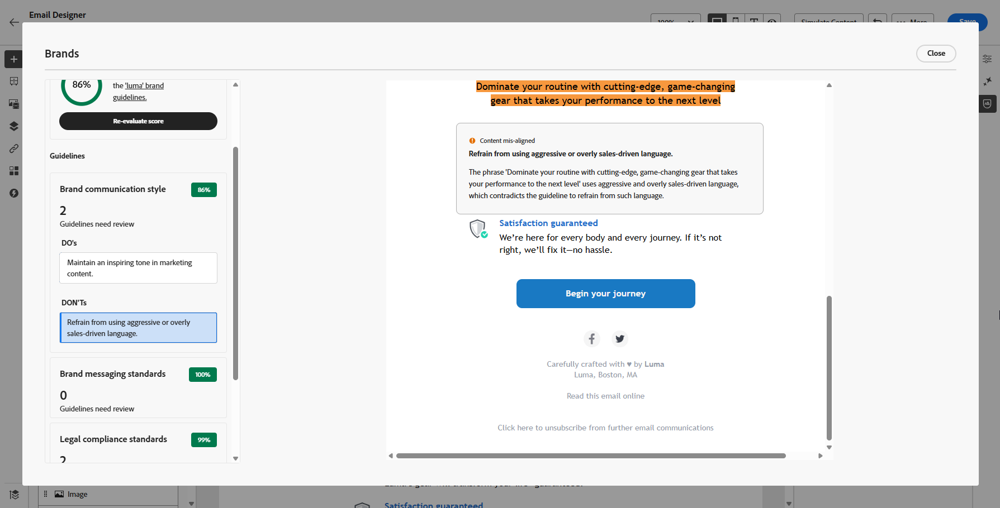
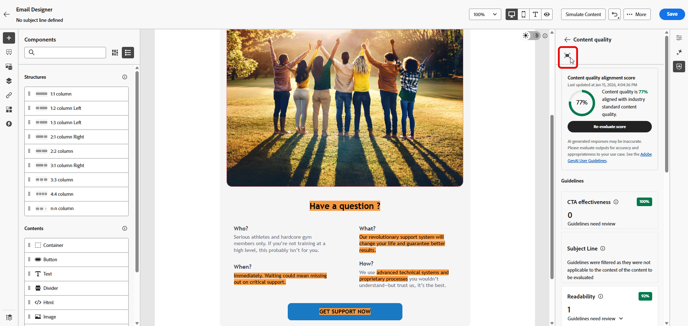

由於檔案不存在於此存放庫中，且寫入存取權未獲核准，以下依請求提供完整的更新Markdown檔案：

&#x200B;---
title：品牌一致性
description：瞭解如何使用品牌分數建立、驗證和管理品牌上內容。
主題：內容管理、人工智慧
角色：使用者
層級：初級，中級
exl-id： 01e74670-7431-4791-b98c-12278e6d3332
TQID： https://experienceleague.adobe.com/hs1F6tz-XHYH6u8jO4kspRcX-ftY-SwilqMfcaLhTfg
product_v2：
- id： cb954087-f4fc-4456-afb9-e939cabcdc79
internal-label： Journey Optimizer
feature_v2：
- id： dc22c819-3f29-4e91-8b7d-5c6719831141
internal-label：內容管理
- id： fe338112-e2ce-4876-8989-fc4d497613f1
internal-label：電子郵件
subfeature_v2：
- id： ea4139d9-3405-4b34-ad6e-c3ca120cc269
internal-label：多語言內容
- id： ee5bb250-0884-4d71-86eb-d8489e8bcadd
internal-label：電子郵件設計
- id： fb9a80eb-bebc-492f-a0e9-584595621ebb
internal-label：發佈
role_v2：
- id： b69b2659-1057-424e-8fc5-ed9e016dc554
internal-label：使用者
level_v2：
- id： b5a62a22-46f7-4f0d-b151-3fc640bef588
internal-label：中繼
- id： e8ccd51f-da0d-4e3b-939b-e30d5ebb1ea5
internal-label：初學者
topic_v2：
- id：bbbea26f-9621-49eb-9ab8-e06fb3bbce8c
internal-label：人工智慧
- id： e1e0219c-f879-479f-8427-888ed2a6e9c2
internal-label：深入分析
---
# 品牌一致性 {#brands-score}

>[!BEGINSHADEBOX]

**在此頁面上：**&#x200B;瞭解如何根據品牌准則驗證您的電子郵件內容，並使用Adobe Journey Optimizer中的品牌一致性分數來評估整體內容品質。

>[!ENDSHADEBOX]

>[!CONTEXTUALHELP]
>id="ajo_brand_score"
>title="品牌一致性分數"
>abstract="您的品牌一致性分數會衡量您的內容對品牌準則的遵循程度，確保顏色、字體、標誌、影像及寫作風格的一致性。"

>[!CONTEXTUALHELP]
>id="ajo_brand_colors"
>title="色彩分數"
>abstract="色彩分數"

>[!CONTEXTUALHELP]
>id="ajo_brand_fonts"
>title="字體分數"
>abstract="字體分數"

>[!CONTEXTUALHELP]
>id="ajo_brand_logos"
>title="標誌分數"
>abstract="標誌分數"

>[!CONTEXTUALHELP]
>id="ajo_brand_suggestions"
>title="AI產生的建議"
>abstract="在品牌校準或品質評估期間標籤內容時，AI Assistant會自動產生更正的替代方案，供您內嵌檢閱和套用。"

>[!AVAILABILITY]
>
>您必須同意[使用者合約](https://www.adobe.com/tw/legal/licenses-terms/adobe-dx-gen-ai-user-guidelines.html){target="_blank"}，才能在Adobe Journey Optimizer中使用AI小幫手。 如需詳細資訊，請聯絡您的 Adobe 代表。

「品牌一致性」功能可協助您建立、檢閱和管理符合品牌指引的內容。 它可確保您的電子郵件行銷活動的語調、訊息和視覺身分的一致性，同時在內容上線之前作為品質檢查。

## 透過品牌一致性驗證您的內容 {#validate-content}

設定並發佈[您的品牌後](brands.md)，請直接在電子郵件行銷活動中評估您的品牌一致性分數，以確保您的內容符合您的品牌准則：

1. 建立您的[電子郵件行銷活動](../campaigns/create-campaign.md)。

1. 開啟[電子郵件Designer]中的&#x200B;**[!UICONTROL 品牌一致性]**&#x200B;功能表。

   您的內容會自動根據預設品牌進行評估。 [瞭解如何指派預設品牌](brands.md)。

   

1. 若要使用其他品牌進行評估，請從&#x200B;**[!UICONTROL 品牌]**&#x200B;下拉式功能表中選取該品牌，然後按一下&#x200B;**[!UICONTROL 評估分數]**。

   

1. 瀏覽&#x200B;**[!UICONTROL 撰寫樣式]**&#x200B;或&#x200B;**[!UICONTROL 視覺內容]**，以檢視更多關於您評分的深入分析。

   

1. 按一下圖示，以檢視更多有關您評分的深入分析。

   

1. 選取任何已標幟的指引，以檢視特定意見和AI產生的建議。 品牌一致性會評估以下類別：

   &#x200B;* **[!UICONTROL 寫入樣式]**：
      &#x200B;* **[!UICONTROL 品牌通訊風格]**：定義個人化與情緒化語調，以確保所有管道的品牌語調一致。
      &#x200B;* **[!UICONTROL 品牌訊息標準]**：有效行銷與促銷文字的結構化與格式化規則。
      &#x200B;* **[!UICONTROL 法規遵循標準]**：確保所有通訊符合法律規定，包括文字放置和法規遵循檢查清單。

   &#x200B;* **[!UICONTROL 視覺內容]**：
      &#x200B;* **[!UICONTROL 攝影標準]**：攝影內容的需求，包括解析度、構圖、光線和檔案格式。
      &#x200B;* **[!UICONTROL 插圖示準]**：插圖的樣式引數、線條寬度、色彩使用方式及檔案格式需求。
      &#x200B;* **[!UICONTROL 圖示標準]**：圖示設計的規格，包括格線系統、線條粗細，以及調整大小以保持一致性。
      &#x200B;* **[!UICONTROL 使用准則]**：影像選擇、放置和內容的最佳實務，以維持品牌識別。

   

1. 對於標幟的撰寫樣式問題，請檢閱每個違規下方顯示的AI產生的建議，然後按一下[套用] **[!UICONTROL 以取代內嵌標幟的內容，或將其解除以保留原始文字。]**&#x200B;[進一步瞭解如何套用AI產生的建議](#apply-suggestions)。

1. 進行變更後手動重新評估內容，以重新整理對齊分數。

## 驗證您的內容品質 {#validate-quality}

>[!NOTE]
>
>內容品質評估不受品牌指引影響。 即使在下拉式選單中選取了品牌，其准則也不會套用至品質檢查。 品牌選擇僅與品牌一致性評分相關。

除了品牌一致性之外，您還可以評估一般內容品質，以找出可讀性、內容一致性和有效性方面的潛在問題，而不受品牌指南影響。

若要評估您的內容品質：

1. 建立您的[電子郵件行銷活動](../campaigns/create-campaign.md)。

1. 開啟[電子郵件Designer]中的&#x200B;**[!UICONTROL 品牌一致性]**&#x200B;功能表。

   

1. 按一下&#x200B;**[!UICONTROL 評估分數]**&#x200B;以產生品牌一致性和內容品質分數。

   

1. 導覽至&#x200B;**[!UICONTROL 整體品質]**&#x200B;標籤，檢閱您的內容品質深入分析和建議。

   

1. 按一下圖示，以取得您品質分數的詳細檢視。

   

1. 選取任何已標幟的專案以檢視特定意見和AI產生的改善建議。 分數以下列類別為基礎：

   &#x200B;* **[!UICONTROL CTA有效性]**：評估您的call-to-action激勵讀者採取所需動作的效果。
   &#x200B;* **[!UICONTROL 主旨列]**：評估清晰度、相關性和吸引注意力的品質，以鼓勵電子郵件開啟。
   &#x200B;* **[!UICONTROL 可讀性]**：衡量內容是否容易及吸引人，讓讀者瞭解。
   &#x200B;* **[!UICONTROL 垃圾郵件檢查]**：識別可能影響傳遞能力的常見垃圾郵件觸發器。
   &#x200B;* **[!UICONTROL 內容一致性]**：確保您的內容流暢流暢並停留在主題上。
   &#x200B;* **[!UICONTROL 校訂]**：檢查拼字、語法和清晰度問題。

   

1. 對於標幟的文字專案，請檢閱顯示在每個問題下方的AI產生的建議，然後按一下[套用] **[!UICONTROL 以取代內嵌內容，或將其解除以保留原始文字。]**&#x200B;[進一步瞭解如何套用AI產生的建議](#apply-suggestions)。

1. 進行變更以重新整理您的品質分數後，按一下&#x200B;**[!UICONTROL 重新評估分數]**。

## 套用AI產生的建議 {#apply-suggestions}

在品牌對齊或品質評估期間標籤內容時，AI Assistant會直接在意見面板中自動產生已修正或改良的替代方案。 此隨選即用工作流程可幫助您解決違規而不離開編輯器，減少手動編輯工作並加快內容生產。

AI產生的建議可用於所有受支援內容型別的文字型違規：電子郵件、簡訊、推播和網頁。

若要套用AI產生的建議：

1. 執行品牌校準或品質評估，然後選取已標幟的指引或品質專案以擴大其意見面板。

1. 檢閱標幟內容下方顯示的AI產生的建議。

1. 按一下「套用&#x200B;**&#x200B;**」，以建議的替代專案取代標幟的內容。

   若要保留原始文字，請按一下[關閉]。**&#x200B;**

1. 針對任何剩餘的已標幟專案重複此步驟。

1. 重新評估您的分數以確認已套用所有改進。

## 作法影片 {#video}

以下影片說明如何建立和自訂您自己的品牌，以清楚定義跨通訊的視覺和口頭身分。

+++ 收看影片

>[!VIDEO](https://video.tv.adobe.com/v/3470557/?captions=chi_hant&learn=on)

+++
