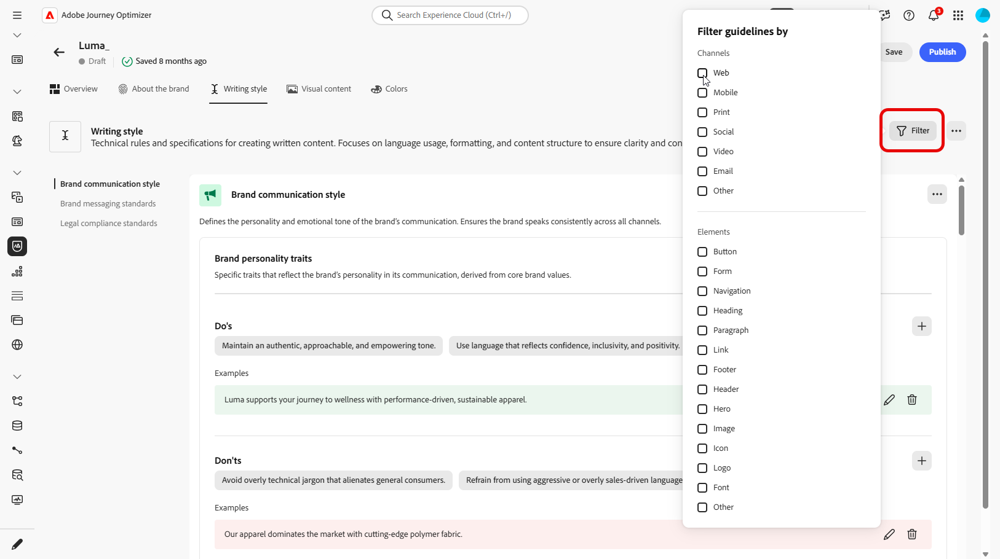

# 建立和管理您的品牌 {#brands}

>[!CONTEXTUALHELP]
>id="ajo_brand_overview"
>title="開始使用品牌"
>abstract="建立和自訂自己的品牌，以定義您唯一的視覺和語言識別，同時更輕鬆地產生符合您品牌風格和語調的內容。"

>[!CONTEXTUALHELP]
>id="ajo_brand_ai_menu"
>title="選取您的品牌"
>abstract="選擇您的品牌，以確保所有 AI 生成內容都是量身打造，符合您品牌的規格和準則。"

>[!CONTEXTUALHELP]
>id="ajo_brand_score_overview"
>title="品牌選取項目"
>abstract="選取您的品牌以確保您的內容製作符合其特定的準則、標準和識別，從而維持一致性和品牌完整性。"

品牌指引是一組詳細的規則和標準，可建立品牌的視覺和口頭識別。 這些可作為參考，以在所有行銷和通訊平台上維持一致的品牌代表性。

在[!DNL Journey Optimizer]中，您現在可以選擇手動輸入及組織您的品牌詳細資料，或上傳品牌指引檔案以進行自動資訊擷取。

>[!AVAILABILITY]
>
>您必須同意[使用者合約](https://www.adobe.com/tw/legal/licenses-terms/adobe-dx-gen-ai-user-guidelines.html){target="_blank"}，才能在Adobe Journey Optimizer中使用AI小幫手。 如需詳細資訊，請聯絡您的 Adobe 代表。

## 存取品牌 {#generative-access}

若要存取&#x200B;**[!UICONTROL 中的]**&#x200B;品牌[!DNL Adobe Journey Optimizer]功能表，使用者必須被授與&#x200B;**[!UICONTROL 管理品牌套件]**&#x200B;或&#x200B;**[!UICONTROL 啟用AI小幫手]**&#x200B;許可權。 [了解更多](../administration/permissions.md)

+++  瞭解如何指派品牌相關許可權

若要指派品牌的許可權，請遵循下列步驟：

1. 在&#x200B;**權限**&#x200B;產品中，前往&#x200B;**角色**&#x200B;標籤，然後選取所需的&#x200B;**角色**。

1. 按一下&#x200B;**編輯**&#x200B;以修改權限。

1. 新增&#x200B;**AI小幫手**&#x200B;資源，然後從下拉式功能表中選取&#x200B;**管理品牌套件**&#x200B;或&#x200B;**[!UICONTROL 啟用AI小幫手]**。

   請注意，**[!UICONTROL 啟用Ai小幫手]**&#x200B;許可權僅提供&#x200B;**[!UICONTROL 品牌]**&#x200B;功能表的唯讀存取權。

   {zoomable="yes"}

1. 按一下&#x200B;**儲存**，以套用所做的變更。

   任何已指派給此角色的使用者都會自動更新其權限。

1. 若要將此角色指派給新使用者，請瀏覽至&#x200B;**角色**&#x200B;儀表板中的&#x200B;**使用者**&#x200B;標籤，然後按一下&#x200B;**新增使用者**。

1. 輸入使用者的名稱、電子郵件地址，或從清單當中選擇，然後按一下&#x200B;**儲存**。

1. 如果之前未建立使用者，請參閱[此文件](https://experienceleague.adobe.com/zh-hant/docs/experience-platform/access-control/abac/permissions-ui/users)。

+++

## 建立和管理您的品牌 {#create-brand-kit}

>[!CONTEXTUALHELP]
>id="ajo_brands_create"
>title="建立您的品牌"
>abstract="輸入您的品牌名稱，並上傳您的品牌準則檔案。此工具將自動擷取關鍵詳細資訊，讓您更輕鬆維持品牌識別。"

若要建立和管理您的品牌指引，您可以自行輸入詳細資料，或上傳品牌指引檔案以自動擷取資訊：

1. 在&#x200B;**[!UICONTROL 品牌]**&#x200B;功能表中，按一下&#x200B;**[!UICONTROL 建立品牌]**。

   

1. 輸入您品牌的&#x200B;**[!UICONTROL 名稱]**。

1. 拖放或選取您的檔案，以上傳您的品牌指引，並自動擷取相關的品牌資訊。 按一下&#x200B;**[!UICONTROL 建立品牌]**。

   資訊擷取程式現在開始。 請注意，可能需要幾分鐘才能完成。

   

1. 系統現在會自動填入您的內容和視覺化建立標準。 瀏覽不同的標籤，視需要調整資訊。 [了解更多](#personalize)

1. 您可以從每個區段或類別中的進階功能表新增參照，以自動擷取相關品牌資訊，或重新執行擷取以更新現有准則。

   若要移除現有內容，請使用&#x200B;**[!UICONTROL 清除區段]**&#x200B;或&#x200B;**[!UICONTROL 清除類別]**&#x200B;選項。

   

1. 按一下&#x200B;**[!UICONTROL 篩選器]**，依管道或元素型別篩選准則。

   

1. 設定之後，按一下&#x200B;**[!UICONTROL 儲存]**，然後按一下&#x200B;**[!UICONTROL 發佈]**，讓您的品牌指引可在AI助理中取得。

1. 若要修改您發佈的品牌，請按一下[編輯品牌]。**&#x200B;**

   >[!NOTE]
   >
   >這會在編輯模式中建立臨時副本，並在發佈後取代即時版本。

   

1. 從您的&#x200B;**[!UICONTROL 品牌]**&#x200B;儀表板，按一下圖示以開啟進階功能表：

   * 檢視品牌
   * 在新標籤中開啟
   * 編輯
   * 標籤為預設品牌
   * 複製
   * 發佈
   * 取消發佈
   * 刪除

   

您現在可以從AI Assistant功能表的&#x200B;**[!UICONTROL 品牌]**&#x200B;下拉式清單存取品牌指南，使其產生符合您規格的內容和資產。 [進一步瞭解AI小幫手](gs-generative.md)

### 設定預設品牌 {#default-brand}

您可以指定預設品牌，在建立行銷活動期間產生內容及計算一致性分數時自動套用。

若要設定預設品牌，請移至您的&#x200B;**[!UICONTROL 品牌]**&#x200B;儀表板。 按一下圖示並選取&#x200B;**[!UICONTROL 標籤為預設品牌]**，以開啟進階功能表。

