# 建立和管理您的品牌 {#brands}

>[!CONTEXTUALHELP]
>id="ajo_brand_overview"
>title="開始使用品牌"
>abstract="建立和自訂自己的品牌，以定義您唯一的視覺和語言識別，同時更輕鬆地產生符合您品牌風格和語調的內容。"

>[!CONTEXTUALHELP]
>id="ajo_brand_ai_menu"
>title="選取您的品牌"
>abstract="選擇您的品牌，以確保所有 AI 生成內容都是量身打造，符合您品牌的規格和準則。"

>[!CONTEXTUALHELP]
>id="ajo_brand_score_overview"
>title="品牌選取項目"
>abstract="選取您的品牌以確保您的內容製作符合其特定的準則、標準和識別，從而維持一致性和品牌完整性。"

品牌指引是一組詳細的規則和標準，可建立品牌的視覺和口頭識別。 這些可作為參考，以在所有行銷和通訊平台上維持一致的品牌代表性。

在[!DNL Journey Optimizer]中，您現在可以選擇手動輸入及組織您的品牌詳細資料，或上傳品牌指引檔案以進行自動資訊擷取。

>[!AVAILABILITY]
>
>您必須同意[使用者合約](https://www.adobe.com/legal/licenses-terms/adobe-dx-gen-ai-user-guidelines.html){target="_blank"}，才能在Adobe Journey Optimizer中使用AI小幫手。 如需詳細資訊，請聯絡您的 Adobe 代表。

## 存取品牌 {#generative-access}

若要存取&#x200B;**[!UICONTROL 中的]**&#x200B;品牌[!DNL Adobe Journey Optimizer]功能表，使用者必須被授與&#x200B;**[!UICONTROL 管理品牌套件]**&#x200B;或&#x200B;**[!UICONTROL 啟用AI小幫手]**&#x200B;許可權。 [了解更多](../administration/permissions.md)

+++  瞭解如何指派品牌相關許可權

若要指派品牌的許可權，請遵循下列步驟：

1. 在&#x200B;**權限**&#x200B;產品中，前往&#x200B;**角色**&#x200B;標籤，然後選取所需的&#x200B;**角色**。

1. 按一下&#x200B;**編輯**&#x200B;以修改權限。

1. 新增&#x200B;**AI小幫手**&#x200B;資源，然後從下拉式功能表中選取&#x200B;**管理品牌套件**&#x200B;或&#x200B;**[!UICONTROL 啟用AI小幫手]**。

   請注意，**[!UICONTROL 啟用Ai小幫手]**&#x200B;許可權僅提供&#x200B;**[!UICONTROL 品牌]**&#x200B;功能表的唯讀存取權。

   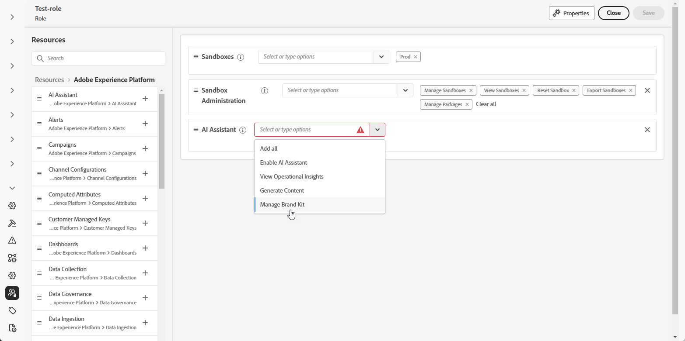{zoomable="yes"}

1. 按一下&#x200B;**儲存**，以套用所做的變更。

   任何已指派給此角色的使用者都會自動更新其權限。

1. 若要將此角色指派給新使用者，請瀏覽至&#x200B;**角色**&#x200B;儀表板中的&#x200B;**使用者**&#x200B;標籤，然後按一下&#x200B;**新增使用者**。

1. 輸入使用者的名稱、電子郵件地址，或從清單當中選擇，然後按一下&#x200B;**儲存**。

1. 如果之前未建立使用者，請參閱[此文件](https://experienceleague.adobe.com/zh-hant/docs/experience-platform/access-control/abac/permissions-ui/users)。

+++

## 建立和管理您的品牌 {#create-brand-kit}

>[!CONTEXTUALHELP]
>id="ajo_brands_create"
>title="建立您的品牌"
>abstract="輸入您的品牌名稱，並上傳您的品牌準則檔案。此工具將自動擷取關鍵詳細資訊，讓您更輕鬆維持品牌識別。"

若要建立和管理您的品牌指引，您可以自行輸入詳細資料，或上傳品牌指引檔案以自動擷取資訊：

1. 在&#x200B;**[!UICONTROL 品牌]**&#x200B;功能表中，按一下&#x200B;**[!UICONTROL 建立品牌]**。

   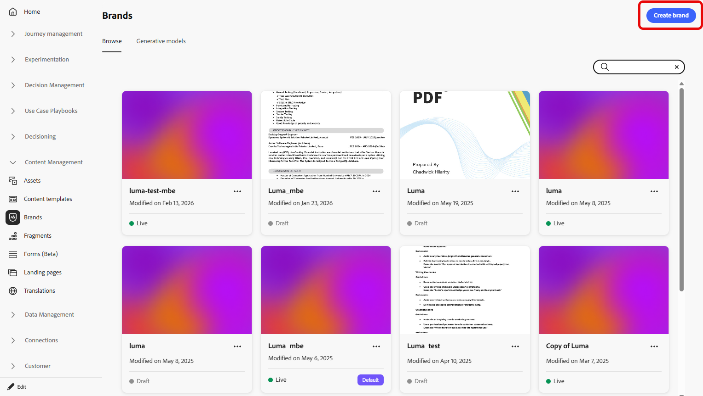

1. 輸入您品牌的&#x200B;**[!UICONTROL 名稱]**。

1. 拖放或選取您的檔案，以上傳您的品牌指引，並自動擷取相關的品牌資訊。 按一下&#x200B;**[!UICONTROL 建立品牌]**。

   資訊擷取程式現在開始。 請注意，可能需要幾分鐘才能完成。

   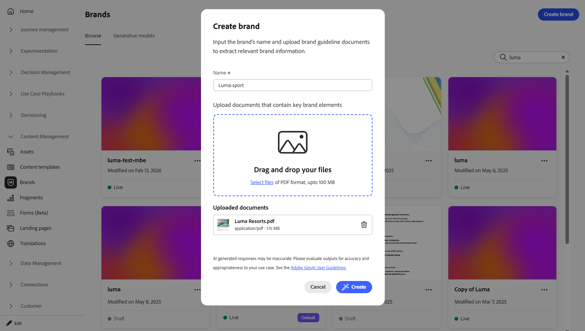

1. 系統現在會自動填入您的內容和視覺化建立標準。 瀏覽不同的標籤，視需要調整資訊。 [了解更多](#personalize)

1. 從每個區段或類別的進階功能表中，您可以新增參照以自動擷取相關品牌資訊。

   若要移除現有內容，請使用&#x200B;**[!UICONTROL 清除區段]**&#x200B;或&#x200B;**[!UICONTROL 清除類別]**&#x200B;選項。

   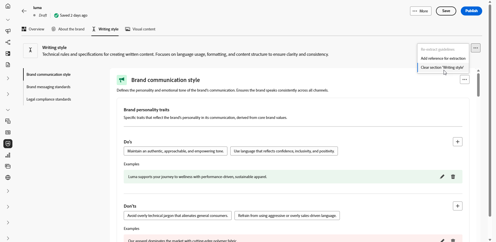

1. 設定之後，按一下&#x200B;**[!UICONTROL 儲存]**，然後按一下&#x200B;**[!UICONTROL 發佈]**，讓您的品牌指引可在AI助理中取得。

1. 若要修改您發佈的品牌，請按一下[編輯品牌]。**&#x200B;**

   >[!NOTE]
   >
   >這會在編輯模式中建立臨時副本，並在發佈後取代即時版本。

   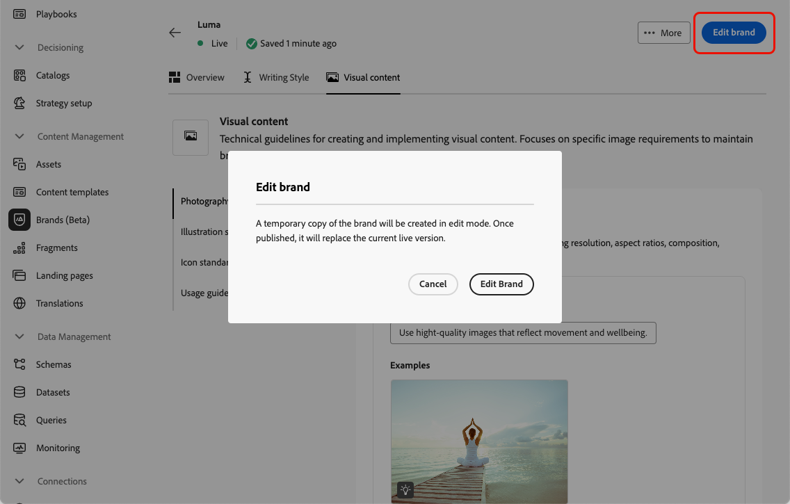

1. 從您的&#x200B;**[!UICONTROL 品牌]**&#x200B;儀表板，按一下圖示以開啟進階功能表：

   * 檢視品牌
   * 編輯
   * 複製
   * 發佈
   * 取消發佈
   * 刪除

   

您現在可以從AI Assistant功能表的&#x200B;**[!UICONTROL 品牌]**&#x200B;下拉式清單存取品牌指南，使其產生符合您規格的內容和資產。 [進一步瞭解AI小幫手](gs-generative.md)

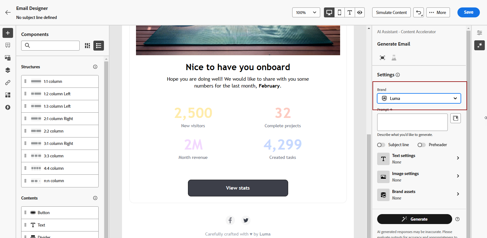

### 設定預設品牌 {#default-brand}

您可以指定預設品牌，在建立行銷活動期間產生內容及計算一致性分數時自動套用。

若要設定預設品牌，請移至您的&#x200B;**[!UICONTROL 品牌]**&#x200B;儀表板。 按一下圖示並選取&#x200B;**[!UICONTROL 標籤為預設品牌]**，以開啟進階功能表。

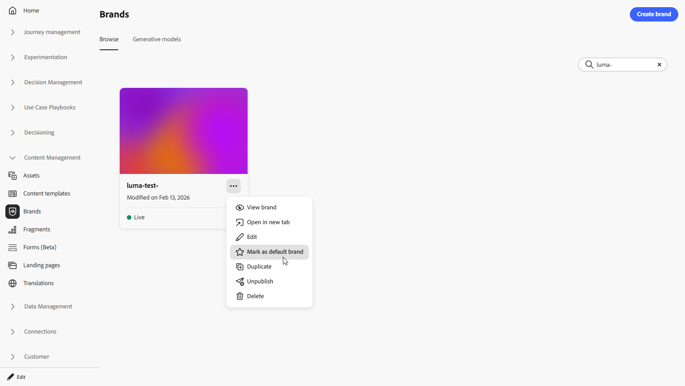

## 個人化您的品牌 {#personalize}

### 關於品牌 {#about-brand}

使用「**[!UICONTROL 關於品牌]**」標籤來建立品牌的核心識別，概述其用途、個性、標語和其他定義屬性。

1. 首先，在&#x200B;**[!UICONTROL 重要詳細資料]**&#x200B;類別中填寫品牌的基本資訊：

   * **[!UICONTROL 品牌套件名稱]**：輸入您的品牌套件名稱。

   * **[!UICONTROL 何時使用]**：指定應套用此品牌套件的案例或內容。

   * **[!UICONTROL 品牌名稱]**：輸入品牌的正式名稱。

   * **[!UICONTROL 品牌說明]**：提供此品牌代表的概觀。

   * **[!UICONTROL 預設標語]**：新增與品牌關聯的主要標語。

     

1. 在&#x200B;**[!UICONTROL 指導原則]**&#x200B;類別中，請釐清品牌的核心方向與理念：

   * **[!UICONTROL 使命]**：詳細說明您品牌的用途。

   * **[!UICONTROL 願景]**：說明您的長期目標或想要的未來狀態。

   * **[!UICONTROL 市場定位]**：說明您的品牌在市場中的定位。

     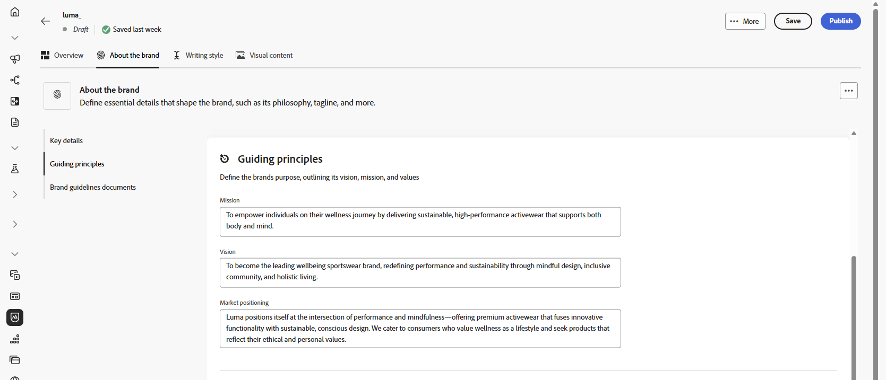

1. 在&#x200B;**[!UICONTROL 核心品牌值]**&#x200B;類別中，按一下以新增品牌的核心值並填入詳細資料：

   * **[!UICONTROL 值]**：命名核心品牌值。

   * **[!UICONTROL 描述]**：說明這個值對您品牌的意義。

   * **[!UICONTROL 行為]**：概述實際中反映此值的動作或態度。

   * **[!UICONTROL 表現]**：提供這個值在真實世界品牌中如何表示的範例。

     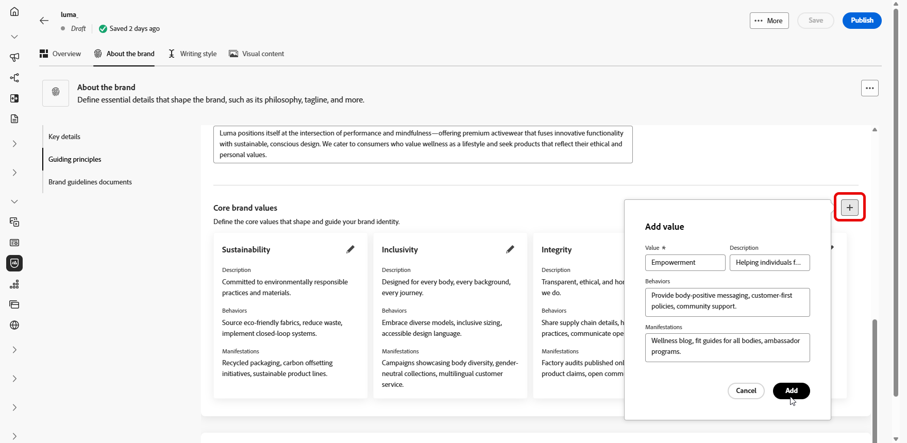

1. 如有需要，請按一下圖示以更新或刪除您的核心品牌價值。

   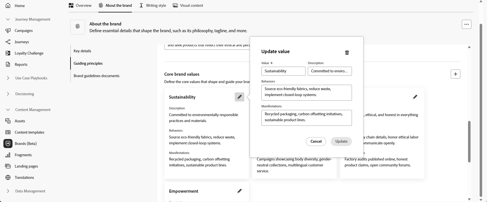

您現在可以進一步個人化您的品牌，或[發佈您的品牌](#create-brand-kit)。

### 寫作風格 {#writing-style}

>[!CONTEXTUALHELP]
>id="ajo_brand_writing_style"
>title="寫作風格一致性分數"
>abstract="寫作風格區段會定義語言、格式及結構的標準，以確保內容清晰且一致。一致性分數從高至低評分，會顯示您的內容對這些準則的遵循程度，並醒目提示需要改善的區域。"

**[!UICONTROL 撰寫樣式]**&#x200B;區段概述撰寫內容的標準，詳述如何使用語言、格式和結構來維持所有資料的清晰度、一致性和一致性。

+++ 可用的類別和範例

<table>
  <thead>
    <tr>
      <th>類別</th>
      <th>子類別</th>
      <th>指引範例</th>
      <th>排除專案範例</th>
    </tr>
  </thead>
  <tbody>
    <tr>
      <td rowspan="4">內容建立標準</td>
      <td>品牌訊息標準</td>
      <td>強調創新和客戶至上的訊息。</td>
      <td>請勿過度承諾產品功能。</td>
    </tr>
    <tr>
      <td>標語使用方式</td>
      <td>在所有數位行銷資產的標誌下方放置標語。</td>
      <td>請勿修改或翻譯標語。</td>
    </tr>
    <tr>
      <td>核心訊息</td>
      <td>強調主要優勢陳述，例如提高生產力。</td>
      <td>請勿使用不相關的值主張。</td>
    </tr>
    <tr>
      <td>命名標準</td>
      <td>使用簡單的描述性名稱，例如「ProScheduler」。</td>
      <td>請勿使用複雜字元或特殊字元。</td>
    </tr>
    <tr>
      <td rowspan="5">品牌溝通風格</td>
      <td>品牌人格特徵</td>
      <td>親切易懂。</td>
      <td>不要失敗。</td>
    </tr>
    <tr>
      <td>書寫力學</td>
      <td>讓句子儘量簡短並有影響力。</td>
      <td>不要使用過多的行話。</td>
    </tr>
    <tr>
      <td>情境色調</td>
      <td>維持危機溝通的專業語調。</td>
      <td>支援通訊時請勿不屑一顧。</td>
    </tr>
    <tr>
      <td>Word選擇指南</td>
      <td>使用「創新」和「智慧」等字眼。</td>
      <td>避免使用「便宜」或「駭客」等字眼。</td>
    </tr>
    <tr>
      <td>語言標準</td>
      <td>遵循美式英文慣例。</td>
      <td>請勿混合使用英式及美式拼字。</td>
    </tr>
    <tr>
      <td rowspan="3">法規遵循標準</td>
      <td>商標標準</td>
      <td>請一律使用™或®符號。</td>
      <td>必要時，請勿省略法定符號。</td>
    </tr>
    <tr>
      <td>版權標準</td>
      <td>在行銷資料中加入版權注意事項。</td>
      <td>未經許可請勿使用協力廠商內容。</td>
    </tr>
    <tr>
      <td>免責宣告標準</td>
      <td>在數位資產上清楚顯示免責宣告。</td>
      <td>請勿隱藏隱藏隱藏隱藏隱藏區域的免責宣告。</td>
    </tr>
</table>

+++

 

若要個人化您的&#x200B;**[!UICONTROL 撰寫樣式]**：

1. 從&#x200B;**[!UICONTROL 寫入樣式]**&#x200B;索引標籤，按一下以新增建議、例外或排除專案。

1. 輸入您的建議、例外或排除專案，然後按一下[新增]。**&#x200B;**

   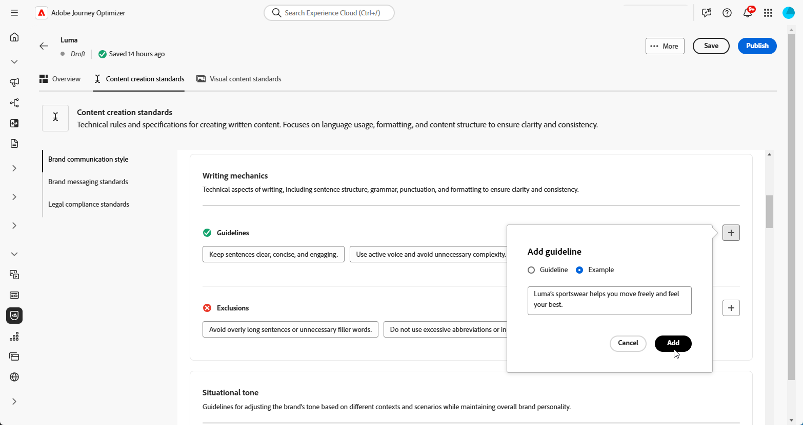

1. 選取您要更新或刪除的其中一個准則或排除專案。

1. 按一下以編輯您的範例，或按一下圖示以刪除範例。

   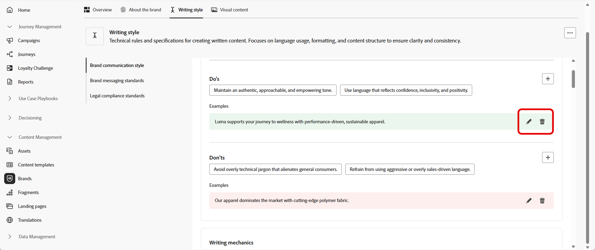

您現在可以進一步個人化您的品牌，或[發佈您的品牌](#create-brand-kit)。

### 視覺內容 {#visual-content}

>[!CONTEXTUALHELP]
>id="ajo_brand_imagery"
>title="視覺內容一致性分數"
>abstract="視覺內容一致性分數表示您的內容與設定之品牌準則的符合程度。從高至低的評分可協助您總覽評估一致性。探索不同的類別可找出需要改善的區域，並找出可能不符合品牌的元素。"

**[!UICONTROL 視覺內容]**&#x200B;區段定義影像和設計的標準，詳細說明維持統一一致的品牌外觀所需的規格。

+++ 可用的類別和範例

<table>
  <thead>
    <tr>
      <th>類別</th>
      <th>指引範例</th>
      <th>排除專案範例</th>
    </tr>
  </thead>
  <tbody>
    <tr>
      <td>攝影標準</td>
      <td>戶外鏡頭使用自然光線。</td>
      <td>避免過度編輯或畫素化的影像。</td>
    </tr>
    <tr>
      <td>插圖示準</td>
      <td>使用簡潔的極簡風格。</td>
      <td>避免過於複雜。</td>
    </tr>
    <tr>
      <td>圖示標準</td>
      <td>使用一致的24px格線系統。</td>
      <td>請勿混合圖示尺寸、使用不一致的線條粗細，或偏離格線規則。</td>
    </tr>
    <tr>
      <td>使用方針</td>
      <td>選擇反映真實客戶在專業環境中使用該產品的生活方式影像。</td>
      <td>請勿使用與品牌色調相抵觸或看起來與內容不符的影像。</td>
    </tr>
</table>

+++

 

若要個人化您的&#x200B;**[!UICONTROL 視覺內容]**：

1. 從&#x200B;**[!UICONTROL 視覺內容]**&#x200B;索引標籤，按一下以新增指引、排除專案或範例。

1. 輸入您的建議、排除專案或範例，然後按一下[新增]。**&#x200B;**

   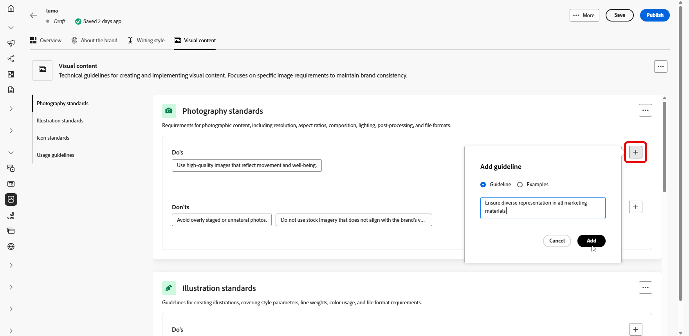

1. 若要新增顯示正確使用方式的影像，請選取&#x200B;**[!UICONTROL 範例]**，然後按一下&#x200B;**[!UICONTROL 選取影像]**。 您也可以新增使用方式不正確的影像，作為排除範例。

   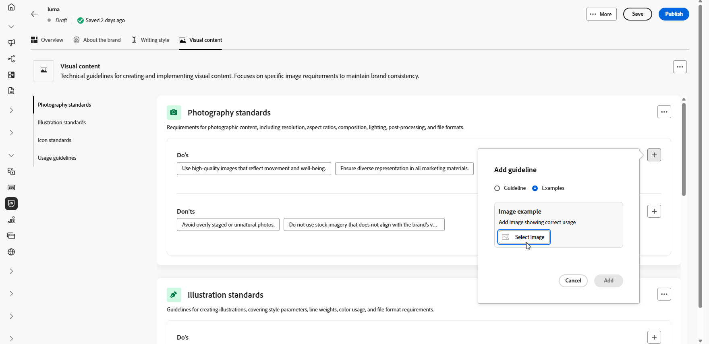

1. 選取您要更新或刪除的其中一個准則或排除專案。

1. 選取您的指引或排除專案以更新它。 按一下圖示以刪除它。

   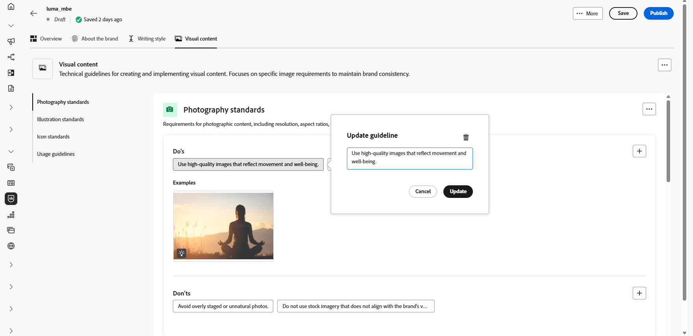

您現在可以進一步個人化您的品牌，或[發佈您的品牌](#create-brand-kit)。
