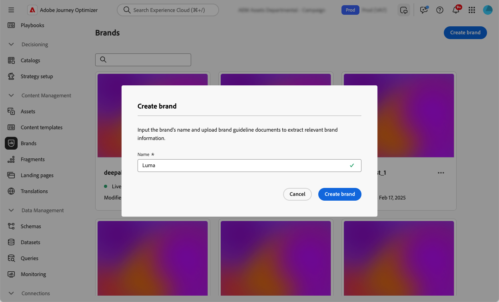

# 建立並管理您的品牌 {#brands}

>[!AVAILABILITY]
>
>此功能已發佈私人測試版。 未來版本將逐步開放所有客戶使用。

品牌指引是一組詳細的規則和標準，可建立品牌的視覺和口頭識別。 這些可作為參考，以在所有行銷和通訊平台上維持一致的品牌代表性。

在[!DNL Journey Optimizer]中，您現在可以選擇手動輸入及組織您的品牌詳細資料，或上傳品牌指引檔案以進行自動資訊擷取。

## 存取品牌 {#generative-access}

若要存取[!DNL Adobe Journey Optimizer]中的&#x200B;**[!UICONTROL 品牌]**&#x200B;功能表，使用者必須被授與&#x200B;**[!UICONTROL 受管理的品牌套件]**&#x200B;或&#x200B;**[!UICONTROL 啟用AI小幫手]**&#x200B;許可權。 [了解更多](../administration/permissions.md)

+++  瞭解如何指派品牌相關許可權

1. 在&#x200B;**權限**&#x200B;產品中，前往&#x200B;**角色**&#x200B;標籤，然後選取所需的&#x200B;**角色**。

1. 按一下&#x200B;**編輯**&#x200B;以修改權限。

1. 新增&#x200B;**AI小幫手**&#x200B;資源，然後從下拉式功能表中選取&#x200B;**受管理的品牌套件**&#x200B;或&#x200B;**[!UICONTROL 啟用AI小幫手]**。

   請注意，**[!UICONTROL 啟用Ai助理]**&#x200B;許可權僅提供對[品牌]功能表的唯讀存取權。

   {zoomable="yes"}

1. 按一下&#x200B;**儲存**，以套用所做的變更。

   任何已指派給此角色的使用者都會自動更新其權限。

1. 若要將此角色指派給新使用者，請瀏覽至&#x200B;**角色**&#x200B;儀表板中的&#x200B;**使用者**&#x200B;標籤，然後按一下&#x200B;**新增使用者**。

1. 輸入使用者的名稱、電子郵件地址，或從清單當中選擇，然後按一下&#x200B;**儲存**。

1. 如果之前未建立使用者，請參閱[此文件](https://experienceleague.adobe.com/zh-hant/docs/experience-platform/access-control/abac/permissions-ui/users)。

+++

## 建立您的品牌 {#create-brand-kit}

若要建立和管理您的品牌指引，您可以自行輸入詳細資料，或上傳品牌指引檔案以自動擷取資訊：

1. 在&#x200B;**[!UICONTROL 品牌]**&#x200B;功能表中，按一下&#x200B;**[!UICONTROL 建立品牌]**。

   

1. 輸入您品牌<!--and a **[!UICONTROL Description]** to your brand guideline-->的&#x200B;**[!UICONTROL 名稱]**。

   

<!--

[Upload feature currently behind feature flag so hidden from doc - should be available again by EOM (Feb)]

1. Drag and drop or select your file to upload your brand guidelines and extract automatically relevant brand information. Click **[!UICONTROL Create brand]**.

    The information extraction process now begins. Note that it may take several minutes to complete.

    

1. Your Content and visual creation standards are now automatically populated. Browse through the different tabs to adapt the information as needed.

-->

1. 從&#x200B;**[!UICONTROL 撰寫樣式]**&#x200B;索引標籤，按一下以新增指引或排除專案。 您也可以新增範例。

   

1. 從&#x200B;**[!UICONTROL 視覺內容]**&#x200B;索引標籤，按一下以新增其他准則或排除專案。

1. 若要新增影像範例，請按一下&#x200B;**[!UICONTROL 選取影像]**。 您也可以新增使用方式不正確的影像，作為排除範例。

   

1. 設定之後，按一下&#x200B;**[!UICONTROL 儲存]**&#x200B;然後&#x200B;**[!UICONTROL 發佈]**，讓您的Brands准則可在AI助理中取得。

1. 若要修改您發佈的品牌，請按一下[編輯品牌]。**** 請注意，這會在編輯模式中建立暫時副本，並在發佈後取代即時版本。

   

1. 從您的&#x200B;**[!UICONTROL 品牌]**&#x200B;儀表板，按一下圖示以開啟進階功能表：

   * 檢視品牌
   * 編輯
   * 複製
   * 發佈
   * 取消發佈
   * 刪除

   

您的品牌指南現在可從AI助理功能表中的「品牌」下拉式清單存取，使其產生符合您規格的內容和資產。 [進一步瞭解AI助理](gs-generative.md)

