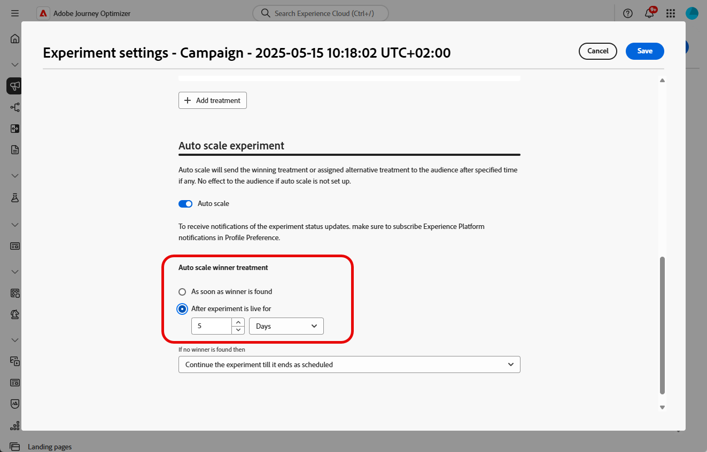

# 建立內容實驗 {#content-experiment}

>[!CONTEXTUALHELP]
>id="ajo_campaigns_content_experiment"
>title="內容實驗"
>abstract="您可以選擇改變訊息內容或主旨，以便定義多種處理方式並確定最適合您的客群的組合。"

>[!NOTE]
>
>開始內容實驗之前，請確定您的報告設定已針對自訂資料集設定。 請參閱[此章節](../reports/reporting-configuration.md)深入瞭解。

Journey Optimizer內容實驗可讓您定義多種傳送處理方式，以衡量哪種方式最適合您的目標對象。 您可以選擇變更傳送內容或主旨。 感興趣的對象會隨機分配給每個處理，以決定哪個處理在指定量度方面效果最佳。

在下列範例中，傳遞目標已分割為兩個群組，分別代表目標人口的45%，以及不會收到傳遞的保留群組10%。

目標對象中的每個人都會收到一個版本的電子郵件，主旨列是以下兩個版本之一：

* 直接促銷新系列和影像的10%優惠方案。
* 另一個則只會宣傳特殊優惠方案，未指定任何影像的10%優惠。

此處的目標是檢視收件者是否會根據收到的實驗與電子郵件互動。 因此，我們將選擇&#x200B;**[!UICONTROL 電子郵件開啟次數]**&#x200B;作為此內容實驗中的主要目標量度。

➡️瞭解如何在[此使用案例](../experience-decisioning/experience-decisioning-uc.md)中使用內容實驗，將決定與程式碼型體驗管道進行比較。

## 建立您的內容 {#campaign-experiment}

1. 首先，根據您的需求建立和設定您的[行銷活動](../campaigns/create-campaign.md)或[歷程](../building-journeys/journeys-message.md)。

1. 從&#x200B;**[!UICONTROL 編輯內容]**&#x200B;視窗，開始個人化處理A。

   針對此處理方式，我們將直接在主旨行中指定特殊優惠方案，並新增個人化。

   

1. 建立或匯入原始內容，並視需要加以個人化。

## 設定您的內容實驗 {#configure-experiment}

>[!CONTEXTUALHELP]
>id="ajo_campaigns_content_experiment_dimension"
>title="維度"
>abstract="選擇用於追蹤實驗的特定維度，例如特定頁面的特定點擊數或瀏覽數。"

>[!CONTEXTUALHELP]
>id="ajo_campaigns_content_experiment_success_metric"
>title="成功量度"
>abstract="成功量度是用於追蹤和評估實驗中表現最佳的處理。在使用之前，請務必為某些量度設定資料集。"

1. 當您的訊息已個人化時，從行銷活動摘要頁面，按一下&#x200B;**[!UICONTROL 建立實驗]**&#x200B;以開始設定您的內容實驗。

   

1. 選取您想要為實驗設定的&#x200B;**[!UICONTROL 成功量度]**。

   在此範例中，選取&#x200B;**[!UICONTROL 電子郵件開啟]**&#x200B;以測試設定檔是否會開啟其電子郵件（如果促銷代碼在主旨行中）。

   

1. 使用應用程式內或Web頻道設定實驗，並選擇&#x200B;**[!UICONTROL 傳入點按]**、**[!UICONTROL 不重複傳入點按]**、**[!UICONTROL 頁面檢視]**&#x200B;或&#x200B;**[!UICONTROL 不重複頁面檢視量度]**&#x200B;時，**[!UICONTROL 點選動作]**&#x200B;下拉式清單可讓您精確追蹤和監視特定頁面上的點按和檢視。

   

1. 按一下&#x200B;**[!UICONTROL 新增處理]**&#x200B;以建立所需數量的新處理。

   

1. 變更您處理方式的&#x200B;**[!UICONTROL 標題]**，以便更佳地區分它們。

1. 選擇將&#x200B;**[!UICONTROL 保留]**&#x200B;群組新增至您的傳遞。 此群組將不會收到來自此行銷活動的任何內容。

   切換列會自動取得母體的10%，您可以視需要調整此百分比。

   >[!IMPORTANT]
   >
   >當在動作中使用保留群組進行內容實驗時，保留指派僅適用於該特定動作。 動作完成後，保留群組中的設定檔將繼續沿歷程路徑前進，並可接收其他動作的訊息。 因此，請確保任何後續的訊息不依賴可能位於保留群組內的設定檔所接收的訊息。 如果是，您可能需要移除保留組指派。

   

1. 然後，您可以選擇為每個&#x200B;**[!UICONTROL 處理]**&#x200B;分配精確百分比，或直接開啟&#x200B;**[!UICONTROL 平均分配]**&#x200B;切換列。

   

1. 啟用自動縮放實驗以自動轉出實驗的成功變數。 [進一步瞭解如何縮放成功者](#scale-winner)

1. 設定您的組態時，按一下&#x200B;**[!UICONTROL 建立]**。

## 設計您的處理方式 {#treatment-experiment}

1. 從&#x200B;**[!UICONTROL 編輯內容]**&#x200B;視窗中，選取您的處理B以變更內容。

   在此處，我們選擇不在&#x200B;**[!UICONTROL 主旨列]**&#x200B;中指定選件。

   

1. 按一下&#x200B;**[!UICONTROL 編輯電子郵件內文]**，進一步個人化您的處理B。

   

1. 設計處理之後，按一下&#x200B;**[!UICONTROL 更多動作]**&#x200B;以存取與處理相關的選項： **[!UICONTROL 重新命名]**、**[!UICONTROL 複製]**&#x200B;以及&#x200B;**[!UICONTROL 刪除]**。

   

1. 如有需要，請存取&#x200B;**[!UICONTROL 實驗設定]**&#x200B;功能表以變更您的處理組態。

   

1. 定義訊息內容後，按一下&#x200B;**[!UICONTROL 模擬內容]**&#x200B;按鈕以控制傳遞的呈現，並使用測試設定檔檢查個人化設定。 [了解更多](../content-management/preview-test.md)

設定實驗後，您可以在報表中追蹤傳送成功。 [了解更多](../reports/campaign-global-report-cja-experimentation.md)

## 縮放成功者 {#scale-winner}

>[!AVAILABILITY]
>
>下列管道目前支援「縮放成功者」功能：
>
>* 任何歷程或行銷活動中的傳入頻道（例如網頁、應用程式內訊息、程式碼型體驗）。
>* API觸發的交易式行銷活動中的傳出頻道（例如電子郵件、推播通知、簡訊）。

Scale the Winner 讓您能透過自動或手動方式，將實驗的獲勝變化版本推廣給所有受眾。此功能可確保一旦確定獲勝者後，您就可以擴大其觸及範圍和有效性，而無需持續監控實驗。

您可以在兩種模式之間進行選擇：

* **自動縮放**：選擇縮放成功處理的時間與條件，或在沒有贏家出現時選擇遞補選項，在建立實驗時設定自動縮放設定。

* **手動縮放**：手動檢閱實驗結果，並啟動成功處理的轉出，以完整控制時間與決定。

### 自動縮放 {#autoscaling}

自動縮放可讓您根據實驗結果，設定何時推出成功處理或遞補專案的預先定義規則。

請注意，自動縮放一經發生，便無法再使用手動縮放。

若要在實驗中啟用自動縮放：

1. 設定您的行銷活動或歷程，並視需要設定您的實驗。 [了解更多](#configure-experiment)

1. 設定實驗時啟用自動縮放選項。

   

1. 選取縮放成功者的時間：

   * 找到獲勝者之後。
   * 實驗在所選的時間內上線後。

     自動縮放時間必須排程在實驗的結束日期之前。 如果設定的時間晚於結束日期，則會出現驗證警告，且不會發佈行銷活動或歷程。

   

1. 如果依時間比例找不到任何獲勝者，請選擇遞補行為：

   * 繼續實驗，直到其依排程結束。
   * 在指定時間後縮放替代處理。

在符合所有引數後，您的成功或替代處理方式就會傳送給您的對象。

### 手動縮放 {#manual-scaling}

手動縮放讓您能夠檢閱實驗結果，並決定何時根據自己的排程推出成功處理。

請注意，如果您在排程的自動縮放時間之前手動縮放成功者，則會取消自動縮放。

若要手動縮放實驗的獲勝者：

1. 設定您的行銷活動或歷程，並視需要設定您的實驗。 [了解更多](#configure-experiment)

1. 讓實驗執行，直到識別出獲勝者或達到統計顯著性為止。

1. 開啟您的行銷活動控制面板，或在您的歷程中選取您的頻道活動。

   檢閱&#x200B;**[!UICONTROL 內容實驗]**&#x200B;功能表的結果，以識別表現最佳的處理。

   

1. 按一下&#x200B;**[!UICONTROL 縮放處理]**，將成功處理推送給其他對象。

   

1. 從下拉式選單中選取您要縮放的處理方式，然後按一下&#x200B;**[!UICONTROL 縮放]**。

   

請注意，縮放處理可能需要長達一小時的時間。 手動縮放程式完成後，您將會收到通知。

