# 鎖定電子郵件範本中的內容 {#lock-content-email-templates}

>[!CONTEXTUALHELP]
>id="ajo_locking_governance"
>title="治理"
>abstract="透過鎖定整個範本或特定結構和元件，切換治理以鎖定範本內容。這樣做讓您可以防止無意間不小心編輯內容，或將內容刪除，讓您更能掌控範本自訂，進而提高電子郵件行銷活動的效率和可靠性。"

>[!CONTEXTUALHELP]
>id="ajo_locking_mode"
>title="模式"
>abstract="為範本選取所需的鎖定模式。**內容鎖定**&#x200B;可讓您鎖定範本內容的特定區段。**唯讀**&#x200B;可讓您鎖定範本的全部內容，以防止任何修改。"

>[!CONTEXTUALHELP]
>id="ajo_locking_content_addition"
>title="啟用內容添加部分"
>abstract="切換此選項以進一步定義使用者如何與範本互動。選取「**允許結構和內容新增**」，以允許使用者在現有結構間新增結構，並在可編輯結構中新增內容元件或片段。**僅允許新增內容**&#x200B;允許使用者在可編輯結構內新增內容元件或片段，但無法新增或重複結構。"

>[!CONTEXTUALHELP]
>id="ajo_email_locking_activated"
>title="已啟用治理"
>abstract="內容鎖定已啟用並防止修改。"

>[!CONTEXTUALHELP]
>id="ajo_email_locking_read_only"
>title="唯讀"
>abstract="此內容為唯讀模式且無法修改。"

Journey Optimizer可讓您鎖定電子郵件範本中的內容，鎖定整個範本或特定結構和元件。 這可防止無意編輯或刪除，讓您更能掌控範本自訂，並改善電子郵件行銷活動的效率和可靠性。

>[!IMPORTANT]
>
>內容鎖定是作者適用的編輯器層級功能，無法保證透過API匯入或建立內容時，內容仍會保持未編輯狀態。

可在&#x200B;**結構**&#x200B;層級或&#x200B;**元件**&#x200B;層級套用內容鎖定。 以下是鎖定範本中的內容時，在結構和元件層級套用的主要原則：

* 鎖定結構時：

   * 依預設，該結構內的所有內容也會鎖定。
   * 無法新增任何內容至結構。
   * 依預設，您無法刪除結構。 您可以啟用「允許刪除」選項來覆寫此限制。
   * 可將鎖定結構內的個別內容元件設定為可編輯。

* 當結構可編輯（結構未鎖定）時：

   * 個別內容元件可鎖定在該結構內。
   * 依預設，如果元件已鎖定，或選取「僅可編輯的內容鎖定」，則無法刪除元件。 您可以啟用「允許刪除」選項來覆寫此限制。

>[!AVAILABILITY]
>
>擁有建立內容範本許可權的使用者可以啟用內容鎖定。

➡️ [在影片中探索此功能](#video)

## 鎖定電子郵件範本 {#define}

### 啟用內容鎖定 {#enable}

無論您是要建立新範本或編輯現有範本，都可直接在電子郵件Designer中啟用電子郵件範本的內容鎖定。 請依照下列步驟操作：

1. 開啟或建立電子郵件範本，並存取電子郵件Designer中的內容編輯畫面。

1. 在右側的&#x200B;**[!UICONTROL 內文]**&#x200B;窗格中，開啟&#x200B;**[!UICONTROL 治理]**&#x200B;選項。

1. 從&#x200B;**[!UICONTROL 模式]**&#x200B;下拉式清單中，選取範本所需的鎖定模式：

   * **[!UICONTROL 內容鎖定]**：鎖定範本中內容的特定區段。 依預設，所有結構和元件都可編輯。 然後，您可以選擇鎖定個別元素。
   * **[!UICONTROL 唯讀]**：鎖定範本的整個內容，防止任何修改。

   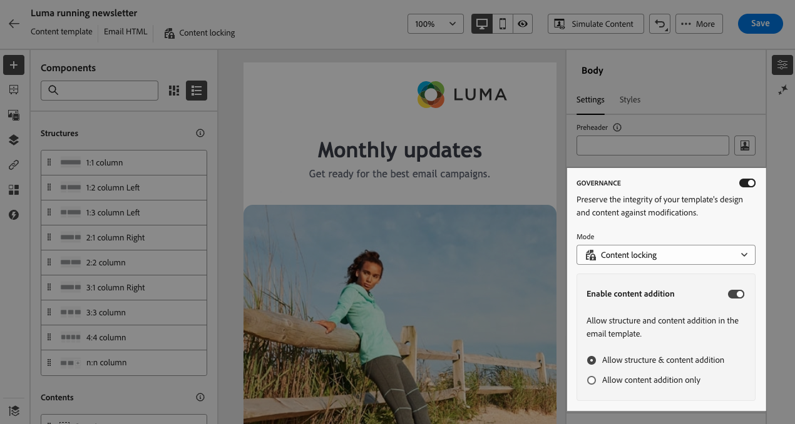

1. 如果您選取&#x200B;**[!UICONTROL 內容鎖定]**&#x200B;模式，您可以進一步定義使用者如何與範本互動。 開啟&#x200B;**[!UICONTROL 啟用內容新增]**&#x200B;選項，並選擇下列其中一項：

   * **[!UICONTROL 允許結構和內容新增]**：使用者可以在現有結構之間新增結構，並在可編輯的結構中新增內容元件或片段。

   * **[!UICONTROL 僅允許新增內容]**：使用者可以在可編輯的結構中新增內容元件或片段，但無法新增或重複結構。

1. 選取鎖定模式後，您可以定義哪些結構和/或元件要鎖定（如果您已選取&#x200B;**[!UICONTROL 內容鎖定]**&#x200B;模式）：

   * [瞭解如何鎖定結構](#lock-structures)
   * [瞭解如何鎖定元件](#lock-components)

   如果您選擇&#x200B;**[!UICONTROL 唯讀]**&#x200B;模式，請照常完成並儲存範本。

您可以在設計範本時，透過選取範本主體隨時調整&#x200B;**[!UICONTROL 治理]**&#x200B;設定。 若要這麼做，請按一下位於右側窗格頂端的導覽邊欄中的&#x200B;**[!UICONTROL 內文]**&#x200B;連結。

### 鎖定結構 {#lock-structures}

>[!CONTEXTUALHELP]
>id="ajo_locking_structure"
>title="結構下的內容鎖定機制"
>abstract="若要鎖定範本中的結構，請在&#x200B;**鎖定類型**&#x200B;下拉式選單中選取「**鎖定**」。依預設，使用者無法刪除已鎖定的結構。您可以透過啟用「**[!UICONTROL 允許刪除]**」選項來覆寫此限制。"

若要鎖定範本中的結構：

1. 選取要鎖定的結構。

1. 在&#x200B;**[!UICONTROL 鎖定型別]**&#x200B;下拉式清單中，選擇&#x200B;**[!UICONTROL 鎖定]**。

   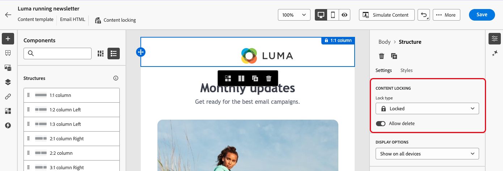

   >[!NOTE]
   >
   >依預設，使用者無法刪除已鎖定的結構。您可以透過啟用「**[!UICONTROL 允許刪除]**」選項來覆寫此限制。

鎖定結構後，無法複製或新增其他內容元件或片段。 依照預設，鎖定結構內的所有元件也會鎖定。 若要讓元件在鎖定的結構中可編輯：

1. 選取您要解除鎖定的元件。

1. 開啟&#x200B;**[!UICONTROL 使用特定鎖定]**&#x200B;選項。

1. 在&#x200B;**[!UICONTROL 鎖定型別]**&#x200B;下拉式清單中，選擇&#x200B;**[!UICONTROL 可編輯]**。 若要在鎖定樣式時允許編輯內容，請選取&#x200B;**[!UICONTROL 僅可編輯的內容]**。 [瞭解如何鎖定元件](#lock-components)

   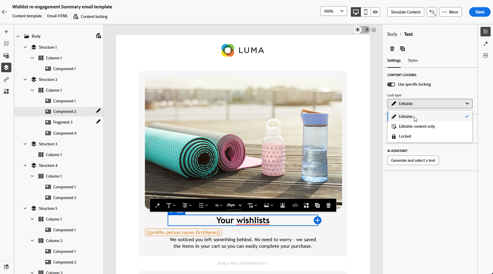

### 鎖定元件 {#lock-components}

>[!CONTEXTUALHELP]
>id="ajo_locking_component"
>title="請在元件中使用特定鎖定機制"
>abstract="若要鎖定範本中的元件，請切換「**使用特定鎖定**」選項。從「**[!UICONTROL 鎖定類型]**」下拉式清單中，選取您的偏好鎖定選項：「**僅鎖定可編輯內容**」，允許您鎖定元件的樣式，但允許內容編輯，而「**鎖定**」則完全鎖定元件的內容和樣式。"

若要鎖定結構內的特定元件：

1. 選取元件並啟用右窗格中的&#x200B;**[!UICONTROL 使用特定鎖定]**&#x200B;選項。

1. 從&#x200B;**[!UICONTROL 鎖定型別]**&#x200B;下拉式清單中，選取您偏好的鎖定選項：

   

   * **[!UICONTROL 僅可編輯的內容]**：鎖定元件的樣式，但允許編輯內容。
   * **[!UICONTROL 已鎖定]**：已完全鎖定元件的內容和樣式。

   >[!NOTE]
   >
   >**[!UICONTROL 可編輯的]**&#x200B;鎖定型別可讓使用者編輯元件，即使是在鎖定的結構內。 [瞭解如何鎖定結構](#lock-structures)

1. 依預設，使用者無法刪除鎖定的元件。 您可以啟用&#x200B;**[!UICONTROL 允許刪除]**&#x200B;選項來啟用刪除。

### 識別鎖定的內容 {#identify}

若要輕鬆識別範本中鎖定的結構和元件，請使用左側功能表中的&#x200B;**[!UICONTROL 導覽樹狀結構]**。 此選單提供所有範本元素的視覺化概觀，以鎖定圖示醒目提示鎖定的專案，並以鉛筆圖示醒目提示可編輯的專案。

在下列範例中，已針對範本本文啟用治理。 *結構2*&#x200B;已鎖定，*元件1*&#x200B;可編輯，而&#x200B;*結構3*&#x200B;已完全鎖定。

## 使用具鎖定內容的範本 {#use}

>[!CONTEXTUALHELP]
>id="ajo_email_editable_areas"
>title="強調可編輯區域"
>abstract="根據套用於範本的鎖定類型，您可以在範本的結構和元件執行不同的動作。若要迅速識別範本中的所有可編輯區域，請切換「**[!UICONTROL 醒目標示可編輯區域]**」選項。"

使用包含鎖定內容的範本時，右側窗格中會顯示訊息。

根據套用於範本的鎖定類型，您可以在範本的結構和元件執行不同的動作。若要迅速識別範本中的所有可編輯區域，請切換「**[!UICONTROL 醒目標示可編輯區域]**」選項。

例如，在下方的範本中，除了已鎖定的頂端影像之外，所有區域都是可編輯的，這表示您無法編輯或移除它。

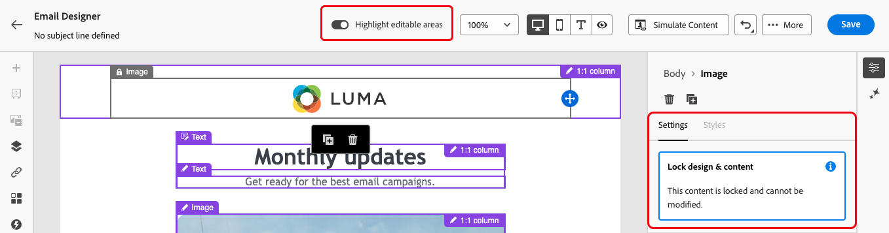

有關可套用的不同鎖定型別的詳細資訊，請參閱以下章節：

* [鎖定結構](#lock-structures)
* [鎖定元件](#lock-components)

以下是一些已設定的電子郵件版本和相關內容鎖定設定的範例：

| 內容鎖定型別 | 範本設定 | 電子郵件版本 |
| ------- | ------- | ------- |
| 唯讀內容範本 | 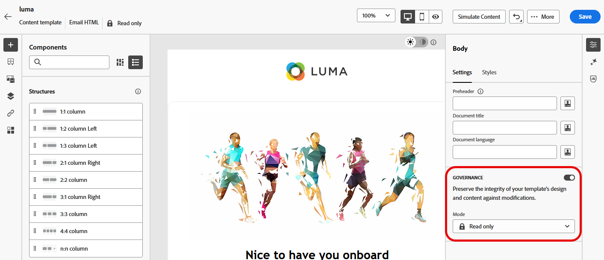{zoomable="yes"} | 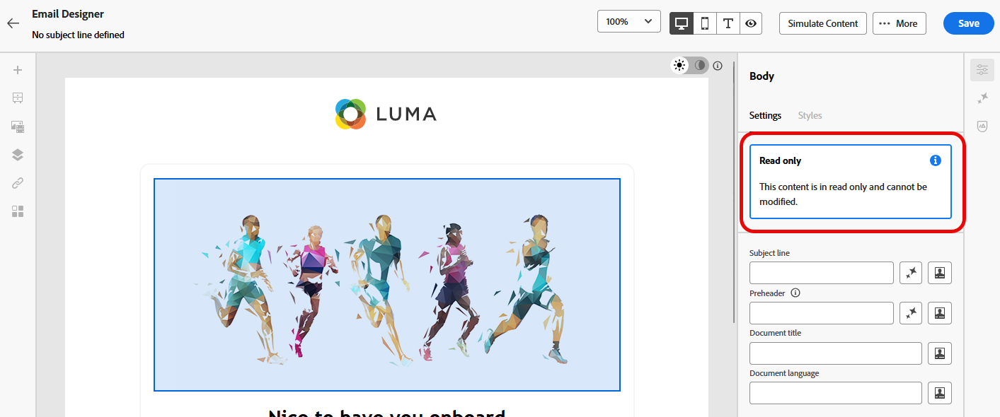{zoomable="yes"} |
| 完整內容可編輯，但使用者無法新增任何結構或元件 | 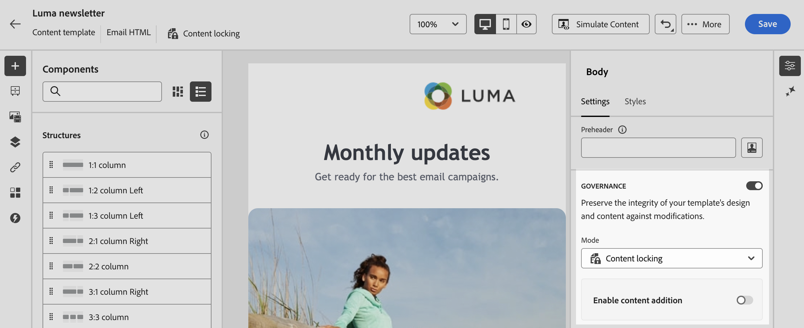{zoomable="yes"} | 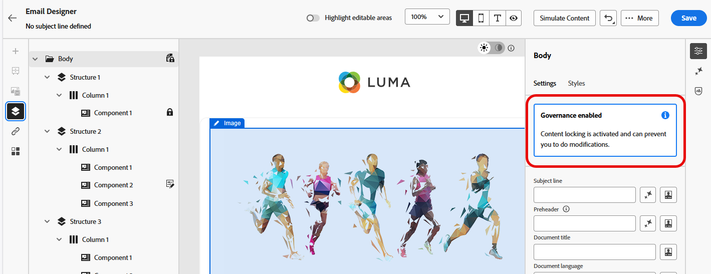{zoomable="yes"} |
| 無法刪除的鎖定結構 | 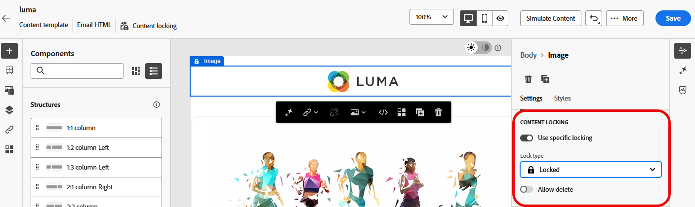{zoomable="yes"} | 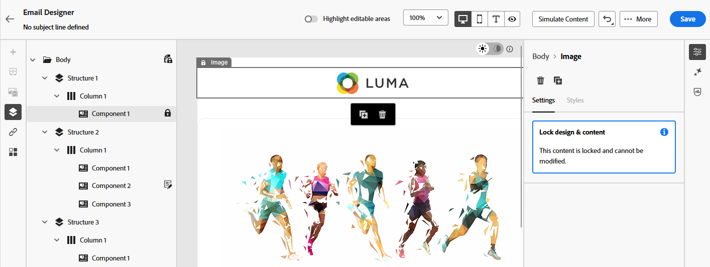{zoomable="yes"} |
| 具有鎖定樣式且無法刪除的元件。 使用者只能修改內容。 | 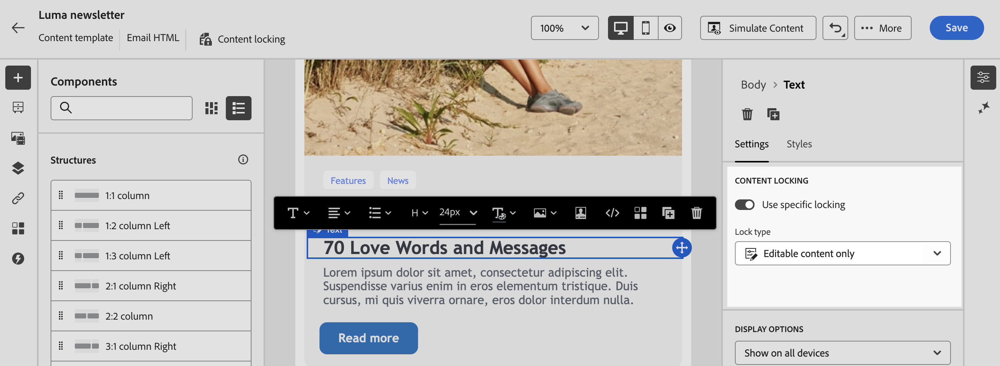{zoomable="yes"} | 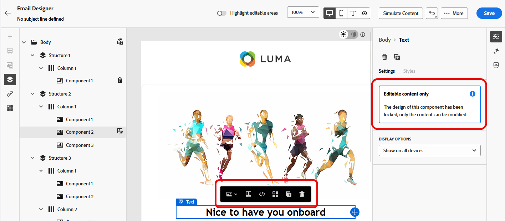{zoomable="yes"} |
| 鎖定結構內的可編輯元件。 | {zoomable="yes"} | {zoomable="yes"} |

## 作法影片 {#video}

瞭解如何鎖定電子郵件範本中的內容。

>[!VIDEO](https://video.tv.adobe.com/v/3451618?quality=12&captions=chi_hant)
