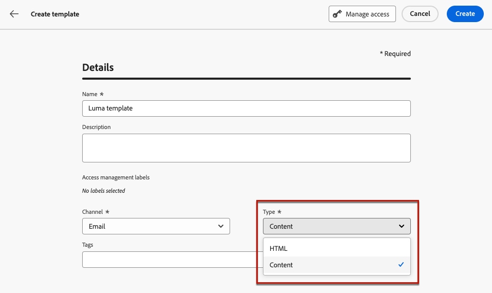

# 使用內容範本 {#content-templates}

為了加快和改進設計流程，您可以建立獨立的範本，以輕鬆地重複使用中的自訂內容 [!DNL Journey Optimizer] 行銷活動和歷程。

此功能可讓內容導向的使用者使用行銷活動或歷程以外的範本。 行銷使用者可在自己的歷程或行銷活動中重複使用並調整這些獨立內容範本。

<!---->

>[!NOTE]
>
>目前內容範本無法用於Web Channel。

例如，您公司內的使用者只負責內容，因此無權存取行銷活動或歷程。 不過，這類使用者可建立電子郵件範本，組織的行銷人員可選取該範本以用於所有電子郵件作為起點。

您也可以使用API建立和管理內容範本。 有關詳細資訊，請參閱 [Journey Optimizer API檔案](https://developer.adobe.com/journey-optimizer-apis/references/content/){target="_blank"}.

➡️ [透過此影片瞭解如何建立和使用範本](#video-templates)

>[!CAUTION]
>
>若要建立、編輯和刪除內容範本，您必須擁有 **[!DNL Manage library items]** 許可權包含在 **[!DNL Content Library Manager]** 產品設定檔。 [了解更多](../administration/ootb-product-profiles.md#content-library-manager)

## 存取並管理範本 {#access-manage-templates}

若要存取內容範本清單，請選取 **[!UICONTROL 內容管理]** > **[!UICONTROL 內容範本]** 從左側功能表。

在目前沙箱上建立的所有範本 — 來自使用下列範本的歷程或行銷活動： **[!UICONTROL 另存為範本]** 選項，選自 **[!UICONTROL 內容範本]** 功能表 — 顯示。 [瞭解如何建立範本](#create-content-templates)

您可以依下列方式排序內容範本：
* 類型
* Channel
* 建立或修改日期
* 標籤 —  [進一步瞭解標籤](../start/search-filter-categorize.md#tags)

您也可以選擇只顯示您自己建立或修改的專案。

* 若要編輯範本內容，請從清單中按一下所需的專案並選取 **[!UICONTROL 編輯內容]**.

  

* 若要刪除範本，請選取 **[!UICONTROL 更多動作]** 按鈕並選取 **[!UICONTROL 刪除]**.

  

>[!NOTE]
>
>編輯或刪除範本時，使用此範本建立的行銷活動或歷程（包括內容）不受影響。

### 將範本顯示為縮圖 {#template-thumbnails}

選取 **[!UICONTROL 格點檢視]** 模式，將每個範本顯示為縮圖。

>[!AVAILABILITY]
>
>此功能以有限可用性 (LA) 形式向一小部分客戶發布。

>[!NOTE]
>
>目前只能為HTML型別的電子郵件內容範本產生適當的縮圖。

更新內容時，您可能需要等候幾秒鐘，變更才會反映在縮圖中。

## 建立內容範本 {#create-content-templates}

>[!CONTEXTUALHELP]
>id="ajo_create_template"
>title="定義您自己的內容範本"
>abstract="從頭開始建立獨立的自訂範本，使得您的內容可在多個歷程和行銷活動中重複使用。"

建立內容範本的方式有兩種：

* 使用左側邊欄，從頭開始建立內容範本 **[!UICONTROL 內容範本]** 功能表。 [了解作法](#create-template-from-scratch)

* 在行銷活動或歷程中設計內容時，請將其儲存為範本。 [了解作法](#save-as-template)

儲存後，您的內容範本即可用於行銷活動或歷程中。 無論是從頭開始建立還是從先前內容建立，您現在都可以在中建立任何內容時使用此範本 [!DNL Journey Optimizer]. [了解作法](#use-content-templates)

>[!NOTE]
>
>* 對內容範本所做的變更不會傳播至行銷活動或歷程，無論其為即時或草稿。
>
>* 同樣地，當行銷活動或歷程中使用範本時，您對行銷活動和歷程內容所做的任何編輯都不會影響先前使用的內容範本。

### 從頭開始建立範本 {#create-template-from-scratch}

若要從頭開始建立內容範本，請遵循下列步驟。

1. 透過存取內容範本清單 **[!UICONTROL 內容管理]** > **[!UICONTROL 內容範本]** 左側功能表。

1. 選取 **[!UICONTROL 建立範本]**.

1. 填寫範本詳細資料並選取所需的通道。

   

   >[!NOTE]
   >
   >目前除了Web之外，所有管道皆可使用。

1. 選擇 **[!UICONTROL 型別]** 所選管道的預設值。

   

   * 的 **[!UICONTROL 電子郵件]**，如果您選取 **[!UICONTROL 內容]**，您可以定義 [主旨列](../email/create-email.md#define-email-content) 當作範本的一部分。 如果您選取 **[!UICONTROL HTML]**，您只能定義電子郵件內文的內容。

   * 的 **[!UICONTROL 簡訊]**， **[!UICONTROL 推播]**， **[!UICONTROL 應用程式內]** 和 **[!UICONTROL 直接郵件]**，目前頻道僅可使用預設型別。 您仍需要選取它。

1. 選擇或建立Adobe Experience Platform標籤，從 **[!UICONTROL 標籤]** 將範本分類以改善搜尋的欄位。 [了解更多](../start/search-filter-categorize.md#tags)

1. 若要將自訂或核心資料使用標籤指派給範本，您可以選取 **[!UICONTROL 管理存取權]**. [深入瞭解物件層級存取控制(OLAC)](../administration/object-based-access.md).

1. 按一下 **[!UICONTROL 建立]** 並視需要設計您的內容，就像您對歷程或行銷活動中的任何內容所做的一樣 — 根據您選取的頻道。

   

   在以下章節中瞭解如何建立不同管道的內容：
   * [定義電子郵件內容](../email/get-started-email-design.md)
   * [定義推播內容](../push/design-push.md)
   * [定義簡訊內容](../sms/create-sms.md#sms-content)
   * [定義直接郵件內容](../direct-mail/create-direct-mail.md)
   * [定義應用程式內內容](../in-app/design-in-app.md)

1. 如果您要建立 **[!UICONTROL 電子郵件]** 範本與 **[!UICONTROL HTML]** 型別，您可以測試您的內容。 [了解作法](#test-template)

1. 範本準備就緒後，按一下 **[!UICONTROL 儲存]**.

1. 按一下範本名稱旁的箭頭，返回 **[!UICONTROL 詳細資料]** 畫面。

   

現在，在內建置任何內容時，即可使用此範本 [!DNL Journey Optimizer]. [了解作法](#use-content-templates)

### 另存為範本 {#save-as-template}

>[!CONTEXTUALHELP]
>id="ajo_messages_depecrated_inventory"
>title="了解如何移轉訊息"
>abstract="在 2022 年 7 月 25 日，「訊息」選單已消失，現在會直接從歷程編寫訊息。如果您要在歷程中重複使用舊訊息，則需要將它們另存為範本。"

在行銷活動或歷程中設計任何內容時，您可以儲存以供日後重複使用。 請依照下列步驟以執行此操作。

1. 從訊息 **[!UICONTROL 編輯內容]** 熒幕，按一下 **[!UICONTROL 內容範本]** 按鈕。

1. 選取 **[!UICONTROL 另存為內容範本]** （從下拉式功能表）。

   

   如果您在 [電子郵件設計工具](../email/get-started-email-design.md)，您也可以從 **[!UICONTROL 更多]** 下拉式清單（位於畫面右上方）。

   

1. 新增此範本的名稱和說明。

   

   >[!NOTE]
   >
   >目前的管道和型別會自動填入，且無法編輯。 針對從建立的電子郵件範本 [電子郵件設計工具](../email/get-started-email-design.md)，則 **[!UICONTROL HTML]** 型別會自動選取。

1. 選擇或建立Adobe Experience Platform標籤，從 **標籤** 將範本分類的欄位。 [了解更多](../start/search-filter-categorize.md#tags)

1. 若要將自訂或核心資料使用標籤指派給範本，您可以選取 **[!UICONTROL 管理存取權]**. [了解更多](../administration/object-based-access.md)。

1. 按一下&#x200B;**[!UICONTROL 儲存]**。

1. 範本會儲存至 **[!UICONTROL 內容範本]** 清單，可從存取 [!DNL Journey Optimizer] 專用功能表。 它會變成獨立的內容範本，可以像該清單上的任何其他專案一樣加以存取、編輯及刪除。 [了解更多](#access-manage-templates)

您現在可以在中建置任何內容時使用此範本 [!DNL Journey Optimizer]. [了解作法](#use-content-templates)

>[!NOTE]
>
>對該新範本所做的任何變更都不會傳播至其來源內容。 同樣地，在該內容中編輯原始內容時，不會修改新範本。

## 測試電子郵件內容範本 {#test-template}

您可以測試部分電子郵件範本的轉譯，無論是從草稿建立還是從現有內容建立。 若要執行此操作，請遵循下列步驟。

1. 透過存取內容範本清單 **[!UICONTROL 內容管理]** > **[!UICONTROL 內容範本]** 功能表並選取任何電子郵件範本。

1. 按一下 **[!UICONTROL 編輯內容]** 從 **[!UICONTROL 範本屬性]**.

1. 按一下 **[!UICONTROL 模擬內容]** 並選取測試設定檔以檢查您的演算。 [了解更多](../content-management/preview-test.md)

   

1. 您可以傳送校樣以測試您的內容，並在將其用於歷程或行銷活動之前，先由內部使用者核准。

   * 若要這麼做，請按一下 **[!UICONTROL 傳送證明]** 按鈕並遵循中所述的步驟 [本節](../content-management/proofs.md).

   * 在傳送校樣之前，您必須選取 [電子郵件表面](../configuration/channel-surfaces.md) 這些將用於測試您的內容。

     

>[!CAUTION]
>
>測試電子郵件內容範本時目前不支援追蹤，這表示追蹤事件、UTM引數和登入頁面連結將在從範本傳送的校樣中無效。 若要測試追蹤， [使用內容範本](../email/use-email-templates.md) 在電子郵件和 [傳送證明](../content-management/preview-test.md#send-proofs).

## 使用內容範本 {#use-content-templates}

在中建立任何管道的內容（網頁除外）時 [!DNL Journey Optimizer]，您可以使用自訂範本，並執行以下其中一項作業：

* 使用從頭開始建立 **[!UICONTROL 內容範本]** 功能表。 [了解更多](#create-template-from-scratch)

* 使用從歷程或行銷活動中的現有內容儲存 **[!UICONTROL 另存為內容範本]** 選項。 [了解更多](#save-as-template)

若要使用其中一個範本開始建立您的內容，請遵循下列步驟。

1. 無論是在行銷活動或歷程中，在選取後 **[!UICONTROL 編輯內容]**，按一下 **[!UICONTROL 內容範本]** 按鈕。

1. 選取 **[!UICONTROL 套用內容範本]**.

   

1. 從清單中選取您選擇的範本。 僅顯示與所選管道和/或型別相容的範本。

   

   >[!NOTE]
   >
   >在此畫面中，您也可以使用專用按鈕建立新範本，以開啟新標籤。

1. 按一下 **[!UICONTROL 確認]**. 範本會套用至您的內容。

1. 視需要繼續編輯您的內容。

>[!NOTE]
>
>若要開始從內容範本設計電子郵件，請使用 [電子郵件設計工具](../email/get-started-email-design.md)，請依照中所述的步驟操作 [本節](../email/use-email-templates.md).

## 操作說明影片 {#video-templates}

瞭解如何在中建立、編輯及使用內容範本 [!DNL Journey Optimizer].

>[!VIDEO](https://video.tv.adobe.com/v/3413743/?quality=12)
