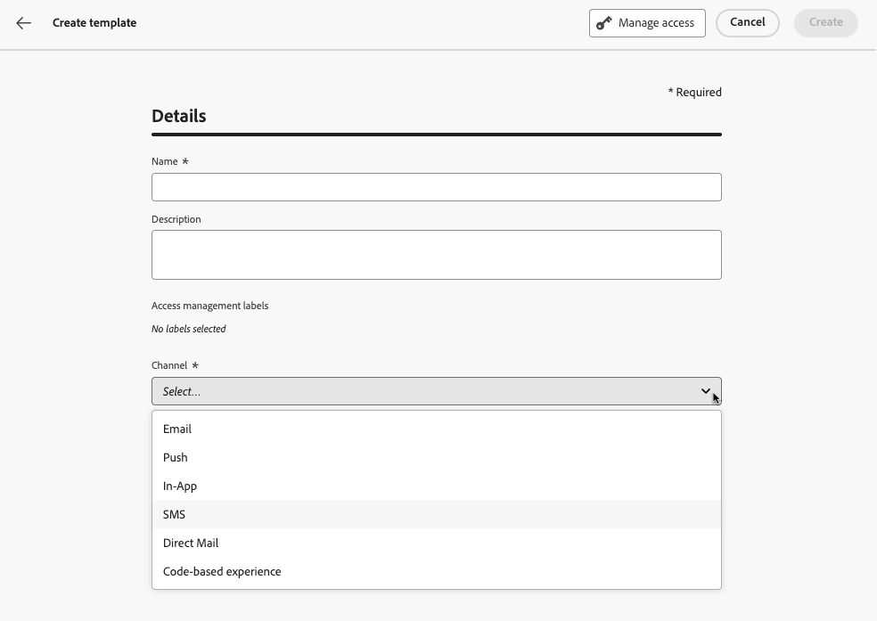
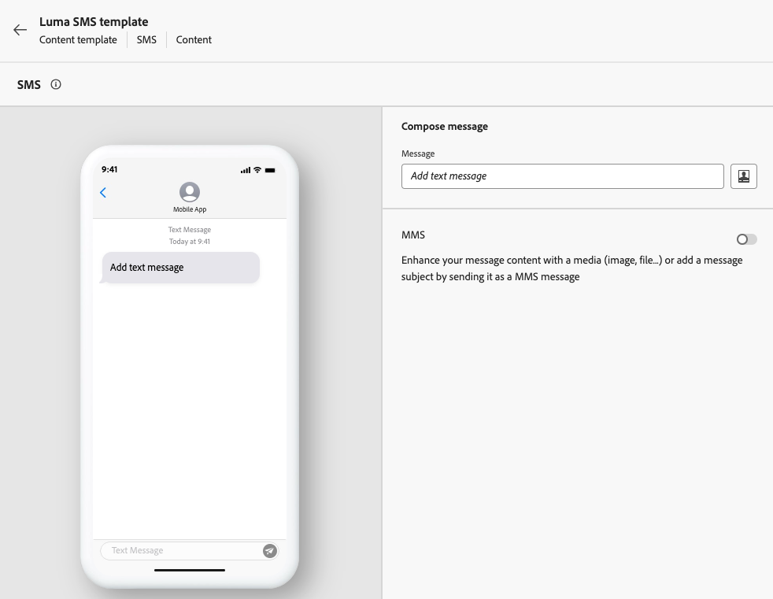
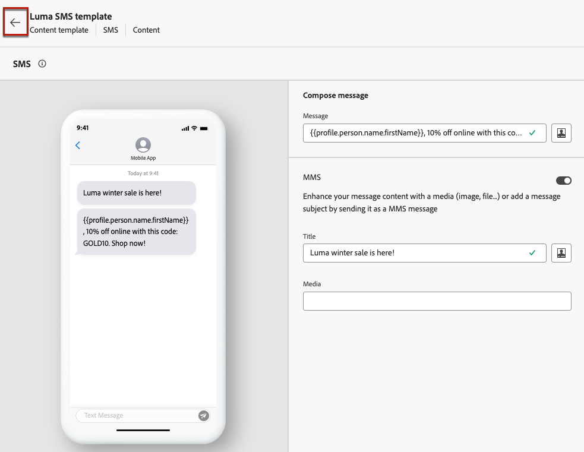
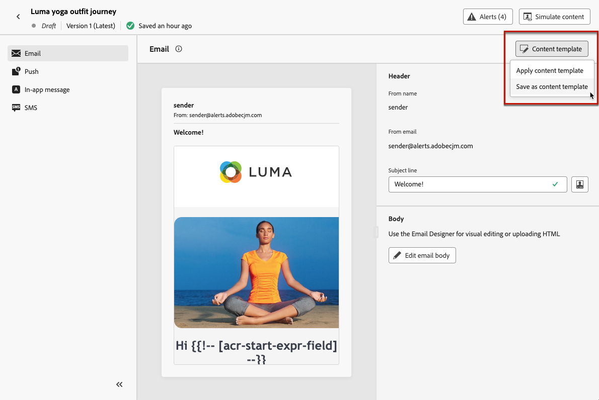
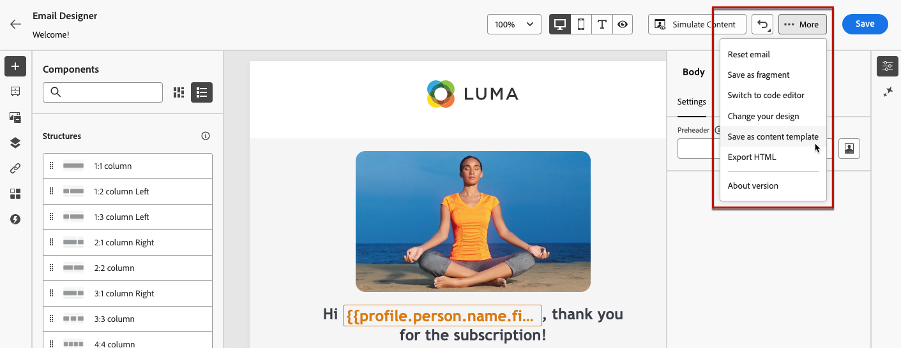
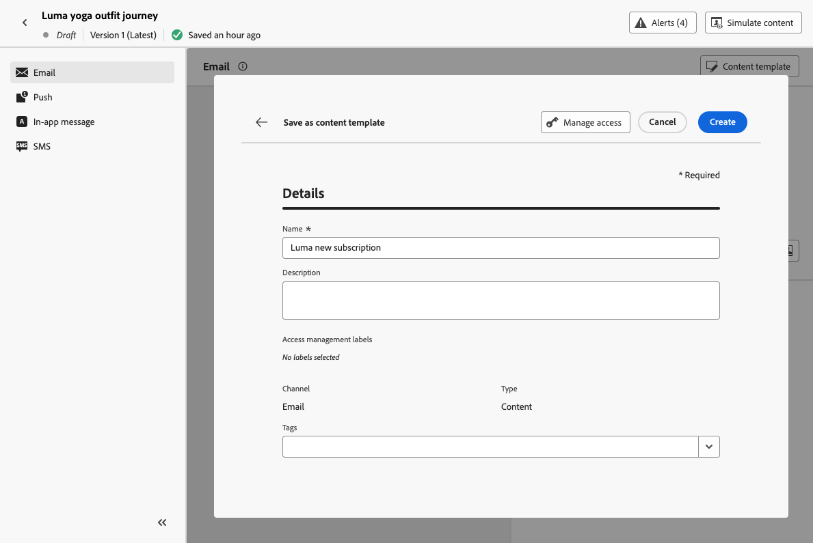

# 建立內容範本 {#create-content-templates}

>[!CONTEXTUALHELP]
>id="ajo_create_template"
>title="定義您自己的內容範本"
>abstract="從頭開始建立獨立的自訂範本，使得您的內容可在多個歷程和行銷活動中重複使用。"

建立內容範本的方式有兩種：

* 使用左側邊欄&#x200B;**[!UICONTROL 內容範本]**&#x200B;功能表，從頭開始建立內容範本。 [了解作法](#create-template-from-scratch)

* 在行銷活動或歷程中設計內容時，請將其儲存為範本。 [了解作法](#save-as-template)

儲存後，您的內容範本即可用於行銷活動或歷程中。 無論是從草稿建立還是從先前內容建立，您都可以在[!DNL Journey Optimizer]中建立任何內容時使用此範本。 [了解作法](#use-content-templates)

>[!NOTE]
>
>* 對內容範本所做的變更不會傳播至行銷活動或歷程，無論其為即時或草稿。
>
>* 同樣地，當行銷活動或歷程中使用範本時，對行銷活動和歷程內容所做的任何編輯都不會影響先前使用的內容範本。

## 從頭開始建立範本 {#create-template-from-scratch}

>[!NOTE]
>
>自2025年3月起，不再使用HTML型別的內容範本。 先前在[!DNL Journey Optimizer]中建立的現有HTML內容範本仍可使用。

若要從頭開始建立內容範本，請遵循下列步驟。

1. 透過&#x200B;**[!UICONTROL 內容管理]** > **[!UICONTROL 內容範本]**&#x200B;左側功能表存取內容範本清單。

1. 選取&#x200B;**[!UICONTROL 建立範本]**。

1. 填寫範本詳細資料並選取所需的通道。

   

   >[!NOTE]
   >
   >目前除了Web之外，所有管道皆可使用。

1. 從&#x200B;**[!UICONTROL 標籤]**&#x200B;欄位選取或建立Adobe Experience Platform標籤，將範本分類以改善搜尋。 [了解更多](../start/search-filter-categorize.md#tags)

1. 若要指派自訂或核心資料使用標籤給範本，請選取&#x200B;**[!UICONTROL 管理存取權]**。 [進一步瞭解物件層級存取控制(OLAC)](../administration/object-based-access.md)。

1. 按一下「**[!UICONTROL 建立]**」，並視需要設計您的內容，就像根據您選取的管道設計歷程或行銷活動中的任何內容一樣。

   

   在以下章節中瞭解如何建立不同管道的內容：
   * [定義電子郵件內容](../email/get-started-email-design.md)
   * [定義推播內容](../push/design-push.md)
   * [定義簡訊內容](../sms/create-sms.md#sms-content)
   * [定義直接郵件內容](../direct-mail/create-direct-mail.md)
   * [定義應用程式內內容](../in-app/design-in-app.md)
   * [定義網頁內容](../web/create-web.md#edit-web-content)
   * [定義程式碼型體驗內容](../code-based/create-code-based.md)

     >[!NOTE]
     >
     >您可以將決定原則新增至程式碼型體驗內容範本。 [了解更多](../experience-decisioning/create-decision.md#create-decision)

1. 您可以測試內容。 [了解作法](#test-template)

1. 範本準備就緒後，請按一下[儲存]。****

1. 按一下範本名稱旁的箭頭，返回&#x200B;**[!UICONTROL 詳細資料]**&#x200B;畫面。

   

此範本現在已準備好在[!DNL Journey Optimizer]內建置任何內容時使用。 [了解作法](#use-content-templates)

>[!NOTE]
>
>建立電子郵件內容範本時，您可以套用主題至內容，快速套用適合您的品牌和設計的特定樣式。 [了解更多](../email/apply-email-themes.md)

## 將內容儲存為內容範本 {#save-as-template}

在行銷活動或歷程中設計任何內容時，您可以儲存以供日後重複使用。 請依照下列步驟以執行此操作。

1. 在訊息&#x200B;**[!UICONTROL 編輯內容]**&#x200B;畫面中，按一下&#x200B;**[!UICONTROL 內容範本]**&#x200B;按鈕。

1. 從下拉式功能表中選取&#x200B;**[!UICONTROL 另存為內容範本]**。

   

   如果您在[電子郵件Designer](../email/get-started-email-design.md)，您也可以從畫面右上角的&#x200B;**[!UICONTROL 更多]**&#x200B;下拉式清單中選取此選項。

   

1. 新增此範本的名稱和說明。

   

   >[!NOTE]
   >
   >目前的管道會自動填入，且無法編輯。

1. 從&#x200B;**標籤**&#x200B;欄位選取或建立Adobe Experience Platform標籤，以將您的範本分類。 [了解更多](../start/search-filter-categorize.md#tags)

1. 若要指派自訂或核心資料使用標籤給範本，請選取&#x200B;**[!UICONTROL 管理存取權]**。 [了解更多](../administration/object-based-access.md)。

1. 按一下&#x200B;**[!UICONTROL 儲存]**。

1. 範本已儲存至&#x200B;**[!UICONTROL 內容範本]**&#x200B;清單，可從[!DNL Journey Optimizer]專用功能表存取。 它會變成獨立的內容範本，可以像該清單上的任何其他專案一樣加以存取、編輯及刪除。 [了解更多](#access-manage-templates)

您現在可以在[!DNL Journey Optimizer]內建置任何內容時使用此範本。 [了解作法](#use-content-templates)

>[!NOTE]
>
>對新範本所做的任何變更都不會傳播至其來源的內容。 同樣地，編輯原始內容時，不會修改新範本。

