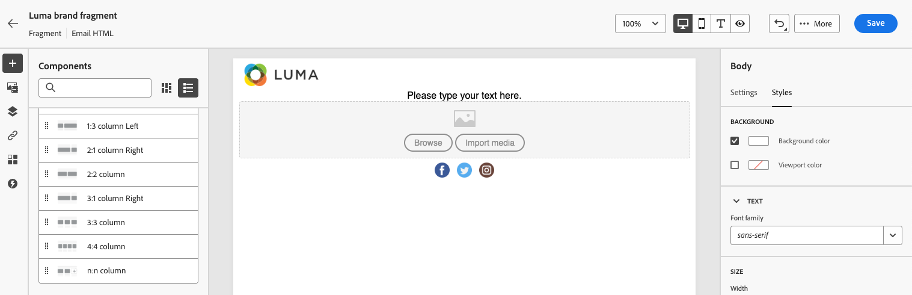
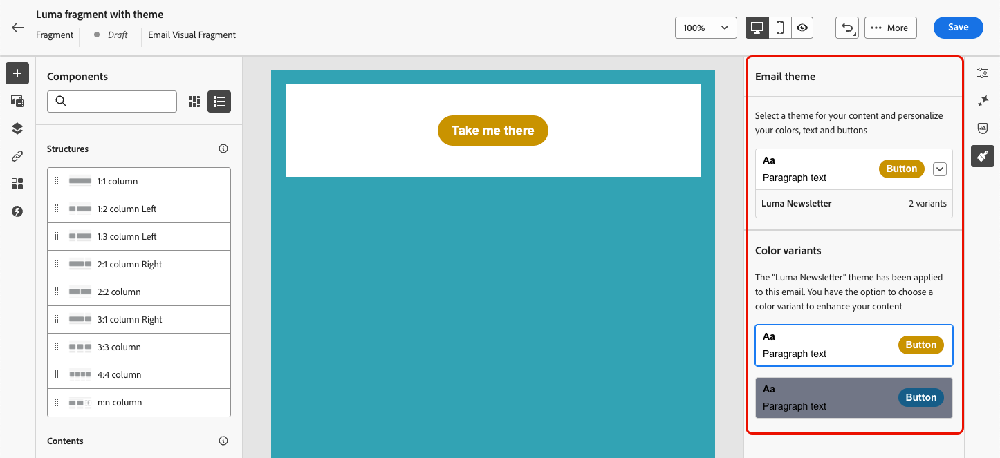
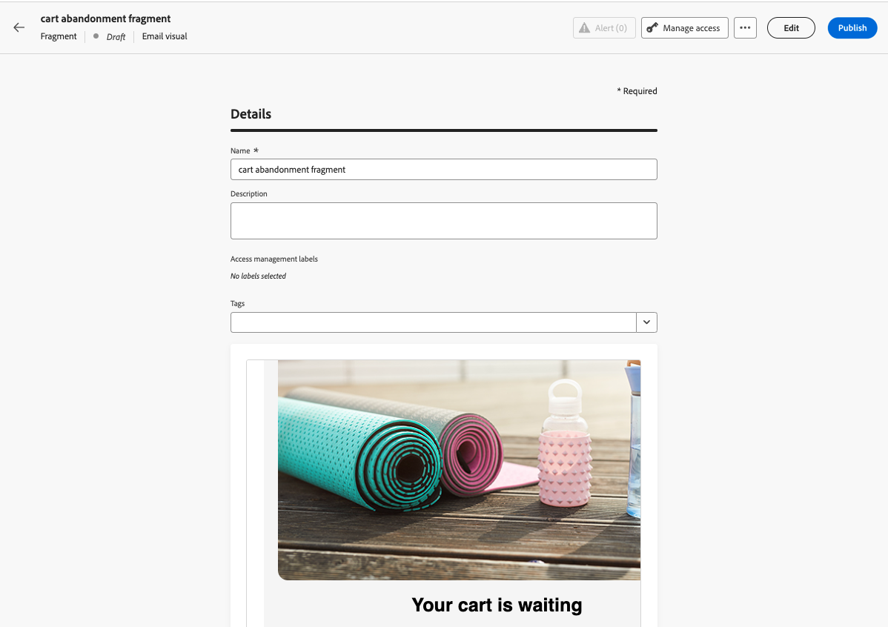
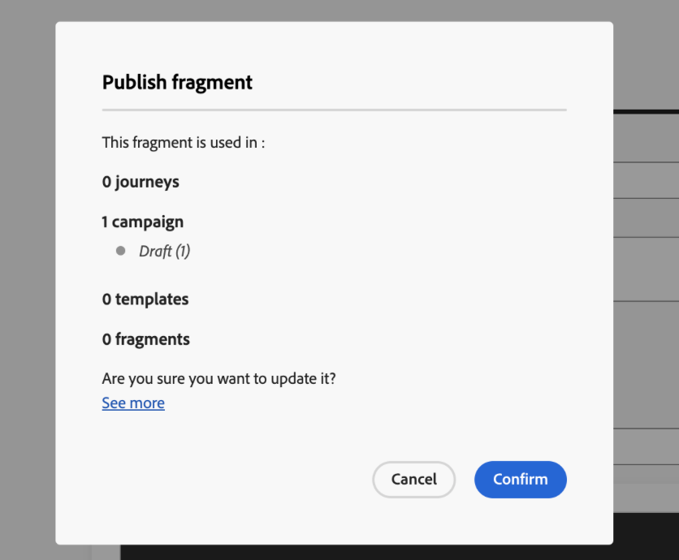

# 建立片段 {#create-fragments}

>[!CONTEXTUALHELP]
>id="ajo_create_visual_fragment"
>title="選取視覺內容類型"
>abstract="建立獨立的視覺內容片段，以便在某個歷程或行銷活動的電子郵件中，或是某個內容範本中可以重複使用你的內容。"
>additional-url="https://experienceleague.adobe.com/zh-hant/docs/journey-optimizer/using/channels/email/design-email/add-content/use-visual-fragments" text="在您的電子郵件中新增視覺片段"

>[!CONTEXTUALHELP]
>id="ajo_create_expression_fragment"
>title="選取運算式類型"
>abstract="建立獨立的運算式片段，以便在多個歷程和行銷活動中可重複使用你的內容。使用個人化編輯器時，您可以利用在目前沙箱上建立的所有運算式片段。"
>additional-url="https://experienceleague.adobe.com/zh-hant/docs/journey-optimizer/using/content-management/personalization/personalization-build-expressions" text="使用個人化編輯器"

片段可從左側&#x200B;**[!UICONTROL 片段]**&#x200B;功能表從頭建立。 此外，您也可以在設計內容時，將現有內容的一部分儲存為片段。 [了解作法](save-fragments.md#)

儲存後，您的片段即可用於歷程、行銷活動或範本。 在歷程和行銷活動中建置任何內容時，可以使用此片段。 請參閱[新增視覺化片段](../email/use-visual-fragments.md)和[運用運算式片段](../personalization/use-expression-fragments.md)。

若要建立片段，請遵循以下步驟。

## 定義片段的屬性 {#properties}

1. 透過&#x200B;**[!UICONTROL 內容管理]** > **[!UICONTROL 片段]**&#x200B;左側功能表存取片段清單。

1. 選取&#x200B;**[!UICONTROL 建立片段]**&#x200B;並填入片段名稱和說明（如有需要）。

   

1. 從&#x200B;**[!UICONTROL 標籤]**&#x200B;欄位選取或建立Adobe Experience Platform標籤，將您的片段分類，以改善搜尋。 [瞭解如何使用統一標籤](../start/search-filter-categorize.md#tags)

1. 選取片段型別： **視覺片段**&#x200B;或&#x200B;**運算式片段**。 [了解更多](../content-management/fragments.md#visual-expression)

   >[!NOTE]
   >
   >目前，視覺片段僅適用於&#x200B;**電子郵件**&#x200B;頻道。

1. 如果您正在建立運算式片段，請選取您要使用的程式碼型別： **[!UICONTROL HTML]**、**[!UICONTROL JSON]**&#x200B;或&#x200B;**[!UICONTROL 文字]**。

   

1. 若要指派自訂或核心資料使用標籤給片段，請按一下畫面上方的&#x200B;**[!UICONTROL 管理存取權]**&#x200B;按鈕。 [進一步瞭解物件層級存取控制(OLAC)](../administration/object-based-access.md)。

1. 按一下「建立&#x200B;**[!UICONTROL 」]**&#x200B;來設計片段的內容。

## 設計片段內容 {#content}

在您設定了片段的屬性後，電子郵件Designer或個人化編輯器會根據您建立的片段型別開啟。

>[!NOTE]
>
>片段中不支援[內容屬性](../personalization/personalization-build-expressions.md)。
>
>在歷程或行銷活動中啟用追蹤時，如果您將連結新增至片段，且此片段用於訊息中，則會追蹤這些連結，例如訊息中包含的所有其他連結。[進一步了解連結和追蹤](../email/message-tracking.md)

* 針對視覺片段，視需要編輯您的內容，就像處理歷程或行銷活動中的任何電子郵件一樣。 [了解更多](../email/get-started-email-design.md)

  

  若要快速套用符合您的品牌和設計的特定樣式，您可以將[佈景主題](../email/apply-email-themes.md)套用至您的片段。

  

  >[!CAUTION]
  >
  >片段在使用主題和手動樣式模式之間不相容。 在電子郵件內容中使用片段時，請務必套用您為此片段定義的主題。 [了解更多](../email/apply-email-themes.md#leverage-themes-fragment)

* 針對運算式片段，利用[!DNL Journey Optimizer]個人化編輯器及其所有個人化和編寫功能，建置您的片段內容。 [了解更多](../personalization/personalization-build-expressions.md)

  

當您的內容準備就緒時，請按一下&#x200B;**[!UICONTROL 儲存]**&#x200B;按鈕。

>[!NOTE]
>
>視覺化片段不能超過 100KB。運算式片段不能超過 200KB。

已建立片段並新增至具有&#x200B;**[!UICONTROL 草稿]**&#x200B;狀態的片段清單。 您可以預覽並發佈它，使其可在歷程和行銷活動中使用。

## 預覽和發佈片段 {#publish}

>[!NOTE]
>
>若要發佈片段，您必須擁有[發佈片段](../administration/ootb-product-profiles.md#content-library-manager)使用者許可權。

如果您的片段已準備好上線，您可以預覽和發佈它以使其可在您的歷程和行銷活動中使用。 若要執行此操作，請遵循下列步驟。

1. 在設計其內容後返回片段建立畫面，或從片段清單中開啟。

1. 在&#x200B;**[!UICONTROL 標籤]**&#x200B;欄位下有片段的預覽可供使用，以檢查其轉譯。 如果您需要進行任何變更，請按一下畫面上方的&#x200B;**[!UICONTROL 編輯]**&#x200B;按鈕，根據片段型別開啟電子郵件Designer或個人化編輯器。 [了解更多](manage-fragments.md#edit-fragments)

   

1. 按一下右上角的&#x200B;**[!UICONTROL 發佈]**&#x200B;按鈕以發佈片段。

1. 如果片段用於即時歷程或行銷活動中，則會開啟訊息以通知您。 按一下&#x200B;**[!UICONTROL 檢視更多]**&#x200B;連結可存取參考它的歷程及/或行銷活動清單。 [瞭解如何探索片段的參考](../content-management/manage-fragments.md#explore-references)

   {width="70%" align="center"}

   按一下&#x200B;**[!UICONTROL 確認]**&#x200B;以發佈片段，並在使用它的即時歷程/行銷活動中更新。

片段現在是&#x200B;**[!UICONTROL 即時]**，並在[!DNL Journey Optimizer]電子郵件Designer或個人化編輯器中建立任何內容時可供使用。

* [瞭解如何使用視覺化片段](../email/use-visual-fragments.md)
* [瞭解如何使用運算式片段](../personalization/use-expression-fragments.md)
