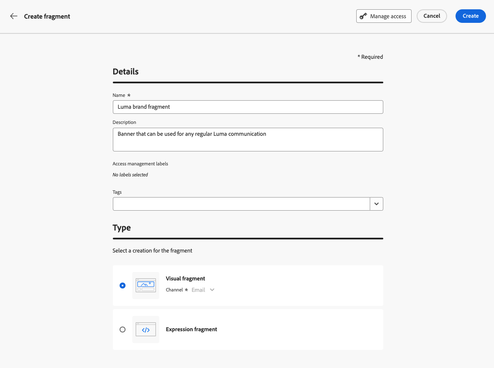
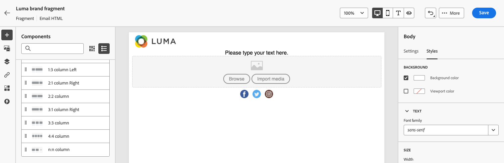
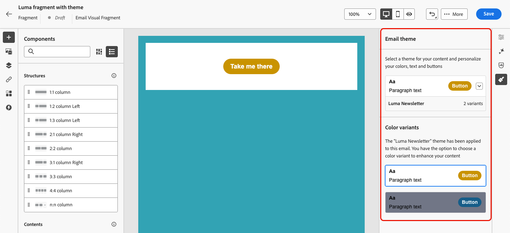
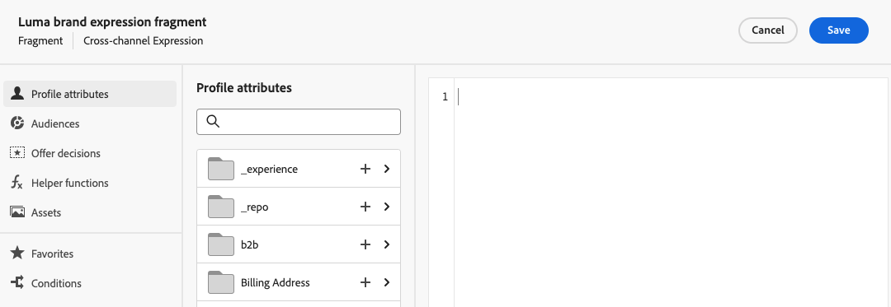

# 建立片段 {#create-fragments}

>[!CONTEXTUALHELP]
>id="ajo_create_visual_fragment"
>title="選取視覺內容類型"
>abstract="建立獨立的視覺內容片段，以便在某個歷程或行銷活動的電子郵件中，或是某個內容範本中可以重複使用你的內容。"
>additional-url="https://experienceleague.adobe.com/zh-hant/docs/journey-optimizer/using/channels/email/design-email/add-content/use-visual-fragments" text="在您的電子郵件中新增視覺片段"

>[!CONTEXTUALHELP]
>id="ajo_create_expression_fragment"
>title="選取運算式類型"
>abstract="建立獨立的運算式片段，以便在多個歷程和行銷活動中可重複使用你的內容。使用個人化編輯器時，您可以利用在目前沙箱上建立的所有運算式片段。"
>additional-url="https://experienceleague.adobe.com/zh-hant/docs/journey-optimizer/using/content-management/personalization/personalization-build-expressions" text="使用個人化編輯器"

可從&#x200B;**[!UICONTROL 片段]**&#x200B;左菜單從頭開始建立片段。 此外，在設計內容時，還可以將一部分現有內容保存為片段。 [了解作法](save-fragments.md#)

保存後，您的片段可用於行程、市場活動或模板。 在構建行程和市場活動中的任何內容時，可以使用此片段。 請參閱[添加可視片段](../email/use-visual-fragments.md)和[利用表達式片段](../personalization/use-expression-fragments.md)。

要建立片段，請執行以下步驟。

## 定義片段的屬性 {#properties}

1. 通過&#x200B;**[!UICONTROL 內容管理]** > **[!UICONTROL 片段]**&#x200B;左菜單訪問片段清單。

1. 選擇&#x200B;**[!UICONTROL 建立片段]**&#x200B;並填寫片段名稱和說明（如果需要）。

   

1. 從&#x200B;**[!UICONTROL 標籤]**&#x200B;欄位中選擇或建立Adobe Experience Platform標籤，以對片段進行分類以改進搜索。 [瞭解如何使用統一標籤](../start/search-filter-categorize.md#tags)

1. 選擇片段類型： **可視片段**&#x200B;或&#x200B;**表達式片段**。 [了解更多](../content-management/fragments.md#visual-expression)

   >[!NOTE]
   >
   >當前，僅&#x200B;**電子郵件**&#x200B;通道可用的可視片段。

1. 如果正在建立表達式片段，請選擇要使用的代碼類型： **[!UICONTROL HTML]**、**[!UICONTROL JSON]**&#x200B;或&#x200B;**[!UICONTROL 文本]**。

   

1. 要為片段分配自定義或核心資料使用標籤，請按一下螢幕上半部分的&#x200B;**[!UICONTROL 管理訪問]**&#x200B;按鈕。 [瞭解有關對象級別訪問控制(OLAC)的詳細資訊](../administration/object-based-access.md)。

1. 按一下&#x200B;**[!UICONTROL 建立]**&#x200B;以設計片段的內容。

## 設計片段內容 {#content}

配置了片段的屬性後，將開啟「電子郵件」「Designer」或「個性化」編輯器，具體取決於您正在建立的片段的類型。

>[!NOTE]
>
>片段中不支援[內容屬性](../personalization/personalization-build-expressions.md)。
>
>在歷程或行銷活動中啟用追蹤時，如果您將連結新增至片段，且此片段用於訊息中，則會追蹤這些連結，例如訊息中包含的所有其他連結。[進一步了解連結和追蹤](../email/message-tracking.md)

* 對於可視片段，請根據需要編輯內容，就像您對行程或市場活動中的任何電子郵件所做的那樣。 [了解更多](../email/get-started-email-design.md)

  

  若要快速應用適合您品牌和設計的特定樣式，您可以將[主題](../email/apply-email-themes.md)應用於您的片段。

  

  >[!CAUTION]
  >
  >「使用主題」和「手動樣式」模式之間的片段不交叉相容。 在電子郵件內容中使用片段時，請確保您正在應用為此片段定義的主題。 [了解更多](../email/apply-email-themes.md#leverage-themes-fragment)

* 對於表達式片段，請利用[!DNL Journey Optimizer]個性化編輯器及其所有個性化和創作功能來構建片段內容。 [了解更多](../personalization/personalization-build-expressions.md)

  

  >[!NOTE]
  >
  >JSON類型表達式片段在保存時會進行語法驗證，所有錯誤都顯示為警告警報。

內容準備好後，按一下&#x200B;**[!UICONTROL 保存]**&#x200B;按鈕。

>[!NOTE]
>
>視覺化片段不能超過 100KB。運算式片段不能超過 200KB。

該片段已建立並添加到&#x200B;**[!UICONTROL 草稿]**&#x200B;狀態的片段清單。 您可以預覽並發佈它，以便在旅程和市場活動中提供它。

## 預覽並發佈片段 {#publish}

>[!NOTE]
>
>若要發佈片段，您必須具有[Publish片段](../administration/ootb-product-profiles.md#content-library-manager)用戶權限。

如果您的片段已準備好投入使用，您可以預覽並發佈它，以便在您的行程和市場活動中提供它。 若要執行此操作，請遵循下列步驟。

1. 在設計其內容後返回到片段建立螢幕，或從片段清單中開啟它。

1. 在&#x200B;**[!UICONTROL 標籤]**&#x200B;欄位下提供片段預覽，允許檢查其呈現。 如果需要進行任何更改，請按一下螢幕上部分的&#x200B;**[!UICONTROL 編輯]**&#x200B;按鈕以開啟電子郵件Designer或個性化編輯器，具體取決於片段類型。 [了解更多](manage-fragments.md#edit-fragments)

   

1. 按一下右上角的&#x200B;**[!UICONTROL Publish]**&#x200B;按鈕以發佈片段。

1. 如果在實況旅行或市場活動中使用該片段，則會開啟一條消息來通知您。 按一下&#x200B;**[!UICONTROL 查看更多]**&#x200B;連結，以訪問引用該連結的旅程和/或市場活動清單。 [瞭解如何瀏覽片段的引用](../content-management/manage-fragments.md#explore-references)

   {width="70%" align="center"}

   按一下&#x200B;**[!UICONTROL 確認]**&#x200B;以發佈該片段，並在使用該片段的即時旅程/市場活動中更新它。

該片段現在為&#x200B;**[!UICONTROL Live]**，在[!DNL Journey Optimizer]電子郵件Designer或個性化編輯器中生成任何內容時可用。

* [瞭解如何使用可視片段](../email/use-visual-fragments.md)
* [瞭解如何使用表達式片段](../personalization/use-expression-fragments.md)

>[!CAUTION]
>
>一旦發佈，您就不能將新的個性化屬性添加到即時片段。 如果要添加個性化屬性，則必須復製片段。 [了解更多](manage-fragments.md#adding-new-attributes)