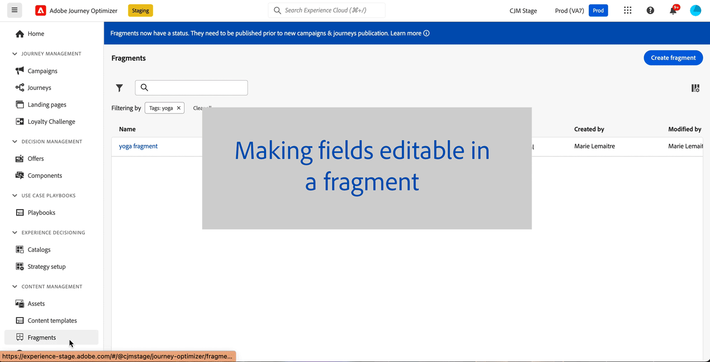
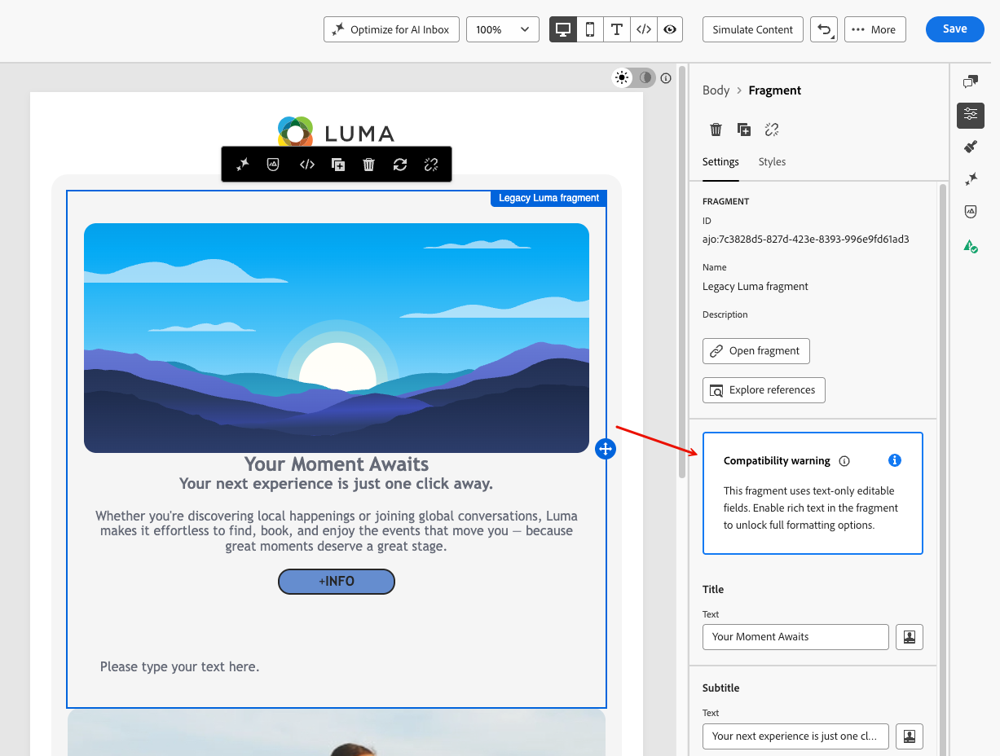
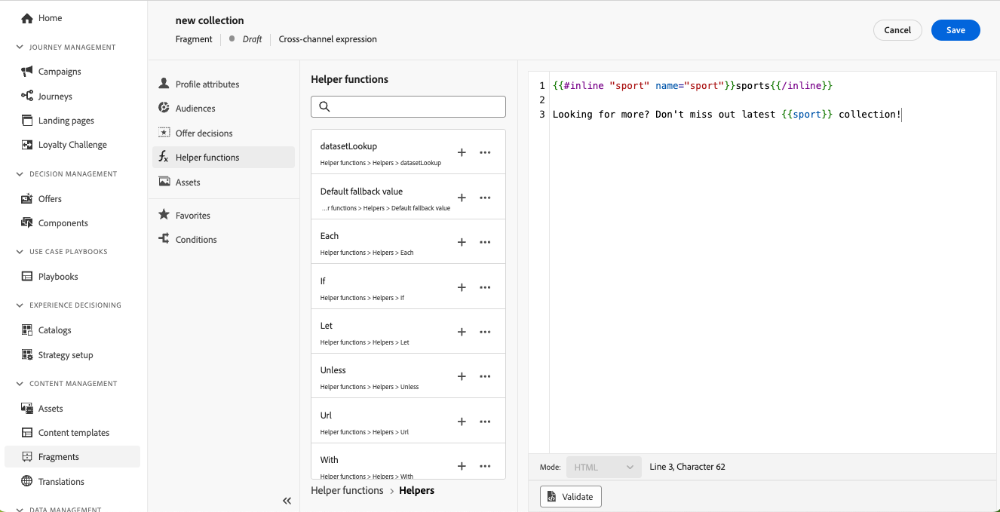
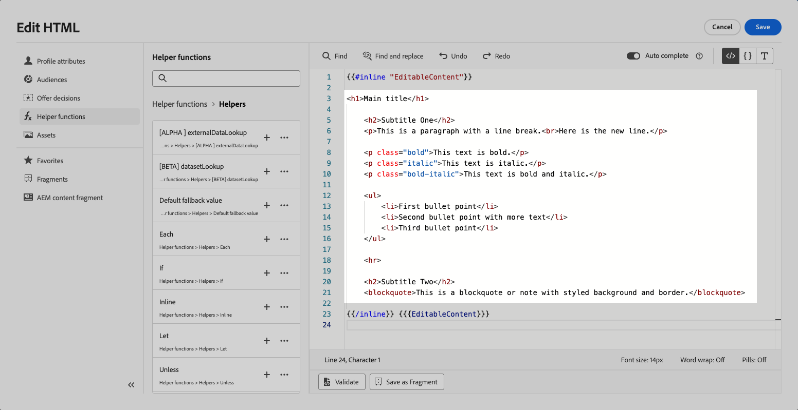
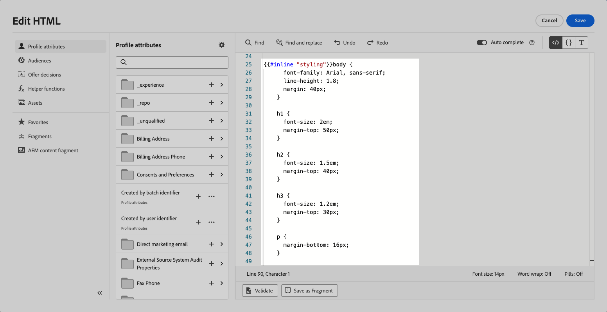
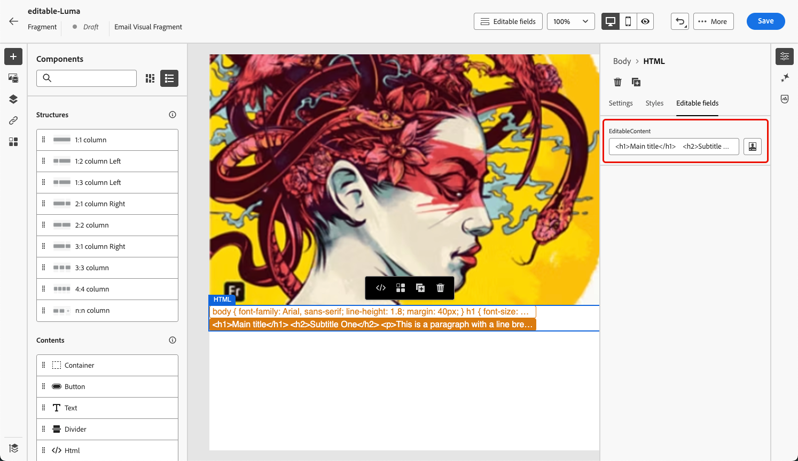

# 可自訂的片段 {#customizable-fragments}

>[!BEGINSHADEBOX]

**在此頁面上：**&#x200B;瞭解如何讓視覺效果和運算式片段中的特定欄位可編輯，以便使用者在將片段新增至行銷活動或歷程時能夠自訂它們，而不會中斷原始片段的繼承。

>[!ENDSHADEBOX]

在行銷活動或歷程動作中使用片段時，由於繼承，預設情況下這些片段會鎖定。 這表示對片段所做的任何變更都會自動傳播至使用片段的所有行銷活動和歷程。

透過&#x200B;**可自訂的片段**，當片段新增至行銷活動或歷程動作時，片段內的特定欄位可以定義為可編輯。 例如，假設您有一個片段包含橫幅、一些文字和按鈕。 您可以將某些欄位（例如影像或按鈕目標URL）指定為可編輯。 這可讓使用者在將片段納入其行銷活動或歷程時修改這些元素，提供量身打造的體驗，而不會影響原始片段。

可自訂的片段不需要中斷片段繼承，這之前已停止將片段層級的集中式變更傳播至行銷活動和歷程。 此方法可在使用時調整內容部分，靈活地以內容特定的詳細資料覆寫預設值。

運用可自訂的片段，您可以有效地管理和個人化您的內容，而不需要建立全新的內容區塊或中斷原始片段的繼承。 這可確保在片段層級進行的變更仍會傳播，同時允許在行銷活動或歷程層級進行必要的自訂。

視覺效果和運算式片段都可以標示為可自訂。 有關如何繼續處理每種型別片段的詳細說明，請參閱以下章節。

## 將可編輯欄位新增至視覺片段 {#visual}

若要讓視覺化片段的某些部分可編輯，請遵循下列步驟：

>[!NOTE]
>
>可編輯的欄位可新增至&#x200B;**影像**、**文字**&#x200B;和&#x200B;**按鈕**&#x200B;元件。 針對&#x200B;**HTML**&#x200B;元件，使用個人化編輯器新增可編輯的欄位，類似於運算式片段。 [瞭解如何在HTML元件和運算式片段中新增可編輯的欄位](#expression)

1. 開啟片段內容版本畫面。

1. 選取片段中要設定可編輯欄位的元件。

1. 元件屬性窗格會在右側開啟。 選取&#x200B;**可編輯欄位**&#x200B;標籤，然後切換&#x200B;**啟用版本**&#x200B;選項。

1. 窗格中會列出所有可編輯所選元件的欄位。 可編輯的欄位取決於所選的元件型別。

   在以下範例中，我們允許編輯「按一下這裡」按鈕URL。

   

1. 按一下&#x200B;**總覽**&#x200B;以檢查所有可編輯的欄位及其預設值。

   在此範例中，按鈕URL欄位會以元件中定義的預設值顯示。 使用者將片段新增至內容後，即可自訂此值。

   

1. 準備就緒後，儲存您的變更以更新片段。

1. 將片段新增到電子郵件後，使用者將能夠自訂片段中設定的所有可編輯欄位。 [瞭解如何自訂視覺片段中的可編輯欄位](../email/use-visual-fragments.md#customize-fields)

>[!CAUTION]
>
>當按鈕元件的&#x200B;**標籤**&#x200B;和&#x200B;**URL**&#x200B;在片段中都可以編輯時，追蹤報告會顯示URL而非按鈕標籤。 [進一步瞭解追蹤](../email/message-tracking.md)

## 在可自訂的視覺片段中啟用RTF編輯 {#rich-text-visual}

>[!CONTEXTUALHELP]
>id="ajo_editable_fragment_compatibility"
>title="舊版片段"
>abstract="此片段中的可編輯欄位處於純文字模式。 這表示您在電子郵件中編輯此片段時只能輸入純文字，不支援完整格式選項，例如粗體、斜體、超連結和分行符號。 在電子郵件中使用片段時，按一下「啟用<b></b>」以允許可編輯欄位中的RTF文字。"

>[!CONTEXTUALHELP]
>id="ajo_editable_field_compatibility"
>title="舊版片段"
>abstract="這個可編輯欄位為僅限文字模式。 完整的格式選項（粗體、斜體、超連結、分行符號等） 在片段升級為RTF模式之前無法使用。 前往片段內文設定，然後按一下<b>啟用</b>以解除鎖定可編輯欄位中的RTF文字。"
>additional-url="https://experienceleague.adobe.com/zh-hant/docs/journey-optimizer/using/channels/email/design-email/add-content/use-visual-fragments#customize-fields" text="在片段中自訂可編輯欄位"

>[!CONTEXTUALHELP]
>id="ac_editable_fragment_compatibility"
>title="舊版片段"
>abstract="此片段中的可編輯欄位處於純文字模式。 完整的格式選項（粗體、斜體、超連結、分行符號等） 在片段升級為RTF模式之前無法使用。 若要解除鎖定此模式，請開啟片段編輯器並按一下[啟用]。<b></b>"
>additional-url="https://experienceleague.adobe.com/zh-hant/docs/journey-optimizer/using/channels/email/design-email/add-content/use-visual-fragments#customize-fields" text="在片段中自訂可編輯欄位"

可自訂的視覺化片段現在原生支援RTF文字<!--— including bold, italic, line breaks, and hyperlinks —-->。

當電子郵件中使用可自訂的視覺片段時，您可以直接在片段的&#x200B;**[!UICONTROL 文字]**、**[!UICONTROL 按鈕]**&#x200B;和&#x200B;**[!UICONTROL Html]**&#x200B;元件的任何可編輯欄位中，運用完整的格式選項，例如粗體、斜體、分行符號、專案符號清單和超連結。 [瞭解如何自訂可編輯的欄位](../email/use-visual-fragments.md#customize-fields)

不過，如果您在引進RTF功能之前已建立片段並定義可編輯欄位，可編輯欄位預設會設為純文字模式。

* 片段編輯器中會顯示相容性警告。

  

  若要在電子郵件中使用片段時，為這些可編輯欄位解鎖RTF模式，請按一下&#x200B;**啟用**&#x200B;按鈕並儲存片段。

* 將片段新增至電子郵件後，在電子郵件Designer中選取片段時也會顯示相容性警告。

  

  若要將片段升級為RTF模式，請使用&#x200B;**開啟片段**&#x200B;按鈕來存取片段編輯器，然後按一下&#x200B;**啟用**&#x200B;按鈕並儲存片段。

在RTF模式解除鎖定之前，舊版可自訂的視覺片段仍僅支援純文字。 使用者無法在這些片段的可編輯欄位中輸入RTF文字。

## 將可編輯的欄位新增至HTML元件和運算式片段 {#expression}

若要讓HTML元件或運算式片段的某些部分可編輯，您必須在運算式編輯器中使用特定語法。 這涉及宣告具有預設值的&#x200B;**變數**，使用者在將片段新增至其內容後可以覆寫該變數。

例如，假設您要建立片段以新增至您的電子郵件，並允許使用者自訂用於不同位置的特定顏色，例如框架或按鈕的背景顏色。 建立片段時，您必須使用&#x200B;**唯一識別碼**&#x200B;宣告變數（例如&quot;color&quot;），並在片段內容中要套用此顏色的所需位置呼叫它。 將片段新增至其內容時，使用者將能夠自訂在任何參考變數的地方使用的顏色。

針對HTML元件，只有特定元素才能變成可編輯的欄位。 展開以下區段以取得詳細資訊。

+++HTML元件中的可編輯元素：

下列元素可成為HTML元件中的可編輯欄位：

* 部分文字
* 連結或影像的完整URL （不適用於URL的一部分）
* 整個CSS屬性（無法搭配部分屬性使用）

例如，在下列程式碼中，每個以紅色反白顯示的元素都可以成為屬性：

{width="70%"}

+++

若要宣告變數並將其用於片段中，請遵循下列步驟：

1. 開啟您的運算式片段，然後在個人化編輯器中編輯其內容。

   

   針對HTML元件，選取片段中的元件，然後按一下&#x200B;**顯示原始程式碼**&#x200B;按鈕。

1. 宣告您要讓使用者編輯的變數。 導覽至左側導覽窗格中的&#x200B;**協助程式功能**&#x200B;功能表，然後新增&#x200B;**內嵌**&#x200B;協助程式功能。 宣告及呼叫變數的語法會自動新增至內容中。

   

1. 以唯一ID取代`"name"`以識別可編輯的欄位。

   >[!NOTE]
   >
   >欄位ID必須是唯一的，而且不能有空格。 此ID應在您的內容中要顯示變數值的任何位置使用。

1. 新增下表詳述的引數，調整語法以符合您的需求：

   | 動作 | 參數 | 範例 |
   | ------- | ------- | ------- |
   | 宣告具有&#x200B;**預設值**&#x200B;的可編輯欄位。 將片段新增至內容時，如果您未自訂該片段，將會使用此預設值。 | 在內嵌標籤之間新增預設值。 | `{{#inline "editableFieldID"}}default_value{{/inline}}` |
   | 為可編輯欄位定義&#x200B;**標籤**。 編輯片段的欄位時，此標籤將顯示在電子郵件Designer中。 | `name="title"` | `{{#inline "editableFieldID" name="title"}}default_value{{/inline}}` |
   | 宣告包含需要發佈的&#x200B;**影像來源**&#x200B;的可編輯欄位。 | `assetType="image"` | `{{#inline "editableFieldID" assetType="image"}}default_value{{/inline}}` |
   | 宣告包含需要追蹤之&#x200B;**URL**&#x200B;的可編輯欄位。 請注意，現成的「映象頁面URL」和「取消訂閱連結」預先定義區塊無法成為可編輯的欄位。 | `assetType="url"` | `{{#inline "editableFieldID" assetType="url"}}default_value{{/inline}}` |

1. 在您要顯示可編輯欄位值的每個位置，使用程式碼中的`{{{name}}}`語法。 將`name`取代為先前定義之欄位的唯一識別碼。

   

1. 儲存並發佈您的片段。

將片段新增至其電子郵件內容時，使用者現在可以使用其選擇的值覆寫變數的預設值：

* 對於運算式片段，會使用特定語法來覆寫變數值。 [瞭解如何自訂運算式片段中的可編輯欄位](../personalization/use-expression-fragments.md#customize-fields)

* 對於HTML元件，變數會顯示在電子郵件Designer的可編輯欄位清單中。 [瞭解如何自訂視覺片段中的可編輯欄位](../email/use-visual-fragments.md#customize-fields)

### 範例：可自訂的運算式片段 {#example}

在以下範例中，我們正在建立呈現新運動集合的運算式片段。 依預設，片段會顯示此內容： *要尋找更多嗎？ 不要錯過我們最新的運動系列！*

我們希望讓使用者能夠使用自己選擇的運動來取代本內容中的「運動」。 例如：*正在尋找更多嗎？ 不要錯過我們最新的瑜伽系列！*

若要這麼做：

1. 以ID &quot;sport&quot;宣告&quot;sport&quot;變數。

   根據預設，如果使用者在其內容中新增片段後未變更變數的值，它將顯示`{{#inline}}`和`{{/inline}}`標籤之間定義的值，即「sports」。

1. 在您想要顯示變數值（即預設為「sports」）或使用者選擇的值的片段內容中新增``{{{sport}}}``語法。

   

1. 將運算式片段新增至其內容時，使用者可以直接從運算式編輯器中選擇變更變數值。 [瞭解如何自訂運算式片段中的可編輯欄位](../personalization/use-expression-fragments.md#customize-fields)

   

<!--
## Add rich text to a customizable fragment {#rich-text}

Rich text such as line breaks, bold, italics etc., can be added to a customizable fragment by using HTML components. To do so, follow the steps below.

➡️ [Learn how to add and use rich text in a customizable fragment in this video](#video)

### Create a fragment including rich text {#add-rich-text}

The approach below (using HTML components with inline variables) remains fully supported for advanced HTML-based scenarios??

1. Create a visual [fragment](create-fragments.md) and start adding components.

1. Add an [HTML component](../email/content-components.md#HTML) and open the HTML editor.

1. Navigate to the **[!UICONTROL Helper functions]** menu in the left navigation pane and add the **inline** helper function.

1. Replace `"name"` with the ID you want to use for your editable content, for example "EditableContent".

1. Replace `render_content` with the HTML code corresponding to the default rich content you want. You can add bold, italic, line breaks, bulleted lists, etc.

    

1. Within the same HTML component, add another **inline** helper function for your styling elements.

1. Replace `"name"` and `render_content` with the ID and HTML code corresponding to the default styling you want.

    

1. Save your content. The selected editable fields are displayed on the right-hand side.

    

1. Save and [publish](create-fragments.md#publish) the fragment.

### Use rich text in customizable fragments {#use-rich-text}

When adding the fragment to your email, you can now edit the rich text content and styling that you created. As a marketer, follow the steps below.

1. [Create an email](../email/create-email.md) in a campaign or a journey, then add the fragment with rich text that was [created](#add-rich-text).

    You can see the two editable fields that were created on the right-hand side.

    

1. Use either simulation method to see how the editable content and styling render: click **[!UICONTROL Simulate content]** to test content variations with sample input data or AI auto-generation, or click **[!UICONTROL Simulate content]**, then select **[!UICONTROL Simulate content (AEP profiles)]** from the dropdown to preview with test profiles. [Learn more on previewing content](preview-test.md)

1. Select the **[!UICONTROL Add personalization]** icon next to one of the editable fields.

1. In the personalization editor that opens, update the styling and/or content as wanted by adding or removing elements of the editable field.

    

## How-to video {#video}

This video shows how to make HTML components within a fragment editable, allowing for dynamic updates to both content and styling.

>[!VIDEO](https://video.tv.adobe.com/v/3464363/?learn=on&#x26;enablevpops)
-->