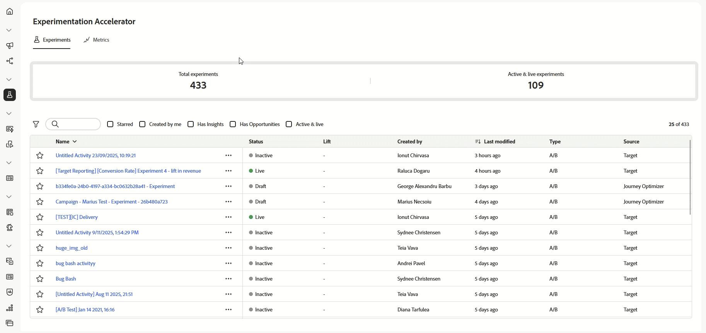

# 開始使用Journey Optimizer Experimentation Accelerator {#content-experiment}

>[!AVAILABILITY]
>
>**Journey Optimizer Experimentation Accelerator**&#x200B;需要客戶的付費授權，並且可與Adobe Target或Adobe Journey Optimizer緊密整合。

**Journey Optimizer Experimentation Accelerator**&#x200B;是功能強大的工具，專為簡化和增強實驗程式而設計。 透過與Adobe Target和Adobe Journey Optimizer整合，它提供管理、分析和最佳化實驗的集中平台。 Journey Optimizer Experimentation Accelerator可善用AI驅動的深入分析和適應性測試，協助您作出資料導向式決策、改善行銷策略及取得可衡量的結果。

主要優點包括：

* **更快速的實驗**：使用隨時間調整的模型執行最適化、永遠啟動的測試。

* **Unified Platform**：在一個位置管理Adobe Target和Journey Optimizer的所有實驗。

* **AI導向的深入分析**：自動呈現關鍵發現、效能驅動程式和新商機。

* **更聰明的鎖定目標**：使用行為和內容資料來排定高影響力實驗的優先順序。

* **KPI監控**：追蹤跨實驗的提升度和信賴度等量度。

* **順暢的Collaboration**：輕鬆分享結果，並透過即時警示管理團隊角色。

➡️ [存取Journey Optimizer Experimentation Accelerator檔案](https://experienceleague.adobe.com/zh-hant/docs/experimentation-accelerator/using/overview)
