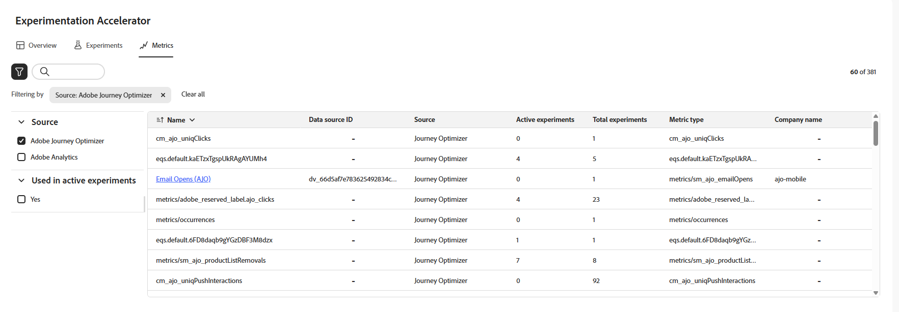
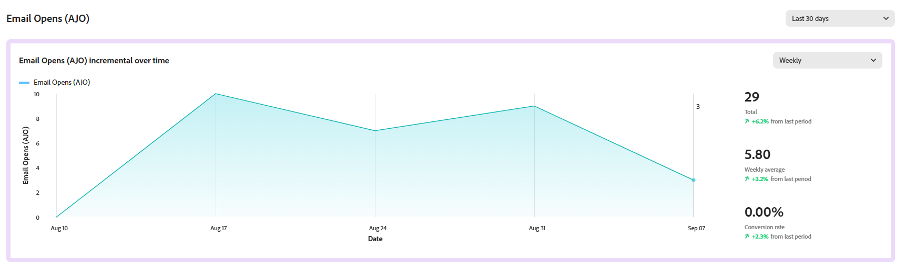
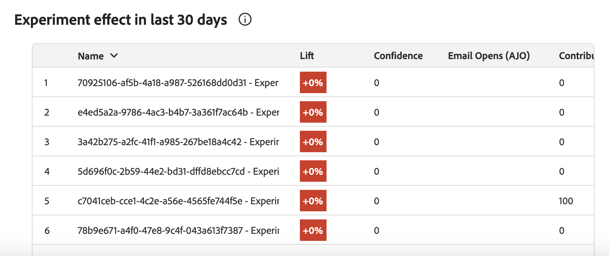

# 量度 {#experiment-accelerator-metrics}

**[!UICONTROL 量度]**&#x200B;頁面可在一個位置顯示Journey Optimizer和Target實驗中的成功量度，以便監控效能、比較和深入分析。

## 控制面板 {#dashboard}

存取&#x200B;**[!UICONTROL 量度]**&#x200B;標籤時，Journey Optimizer和Adobe Target的所有可用成功量度都會列在合併的檢視中，以協助您追蹤各方案的效能、比較結果，並快速找出需要注意的領域。

按一下存取篩選器，它提供內容特定的選項，例如，由&#x200B;**[!UICONTROL Source]**&#x200B;或&#x200B;**[!UICONTROL 用於作用中實驗]**&#x200B;的篩選。

或者，您可以在搜尋列中鍵入量度的名稱，以快速找到該量度。

## 量度詳細資料 {#metric-details}

### 一段時間的增量

**[!UICONTROL 隨著時間累加]**&#x200B;圖表提供所選量度在選定時間範圍內趨勢的視覺劃分。 使用下拉式功能表在每日或每週檢視之間切換，以調整詳細程度。

下列摘要值可供快速參考：

* **[!UICONTROL 總計]**：報告期間所選量度的累積值。

* **[!UICONTROL 平均]**：在選取的時間範圍內計算的量度一般值。 藉由平衡每日或每週的波動，它可提供更清楚的正常績效狀況，並可用作為比較基準。

* **[!UICONTROL 轉換率]**：在檢視處理之後完成所需動作（例如，購買、註冊）的設定檔百分比。

每個值都包含上一個時段的百分比變化，可讓您輕鬆檢視效能是否正在改善、下降或保持穩定。

### 實驗效果

此區段顯示所選時間範圍內（過去90天、過去30天或過去7天）的所有作用中實驗，並反白顯示其對量度的貢獻。

可使用下列量度：

* **[!UICONTROL 提升度]**：測量指定處理的轉換率相對於基準的提升百分比。

* **[!UICONTROL 信賴度]**：指定處理與基準處理相同的證據。 [了解更多](../content-management/experiment-calculations.md#understand-confidence)

* **[!UICONTROL 貢獻]**：量度中可歸因於特定實驗或處理的整體變更比例，可識別產生最大相對影響的方案。
