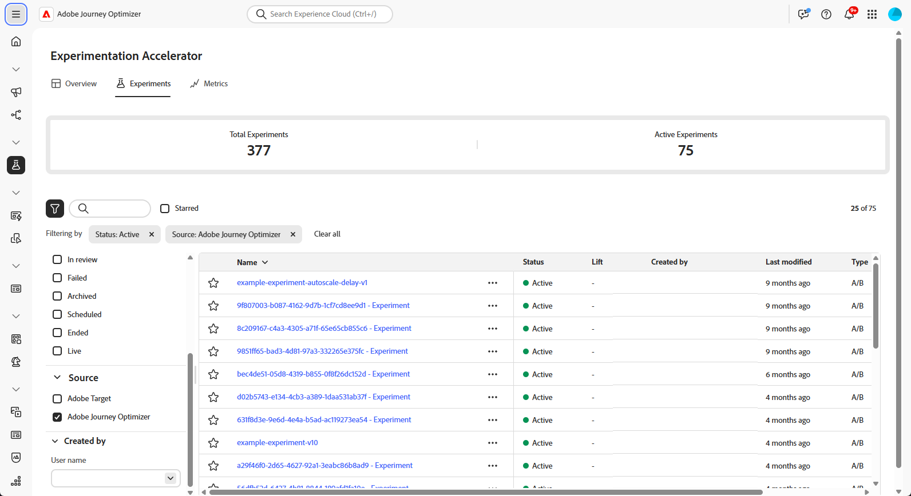
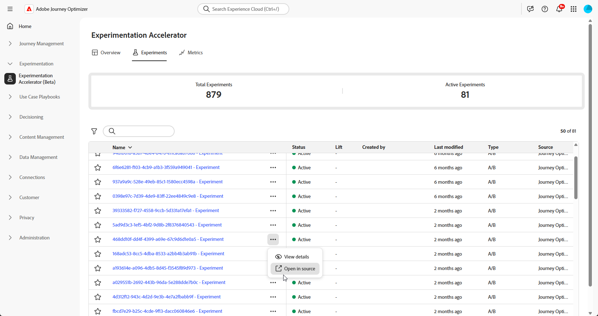
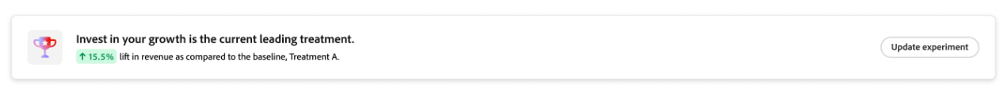
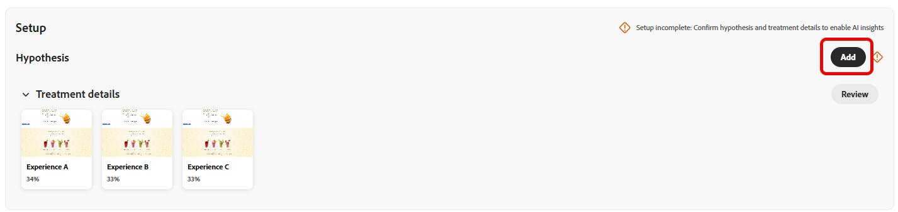
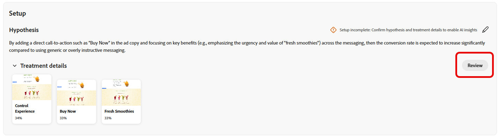
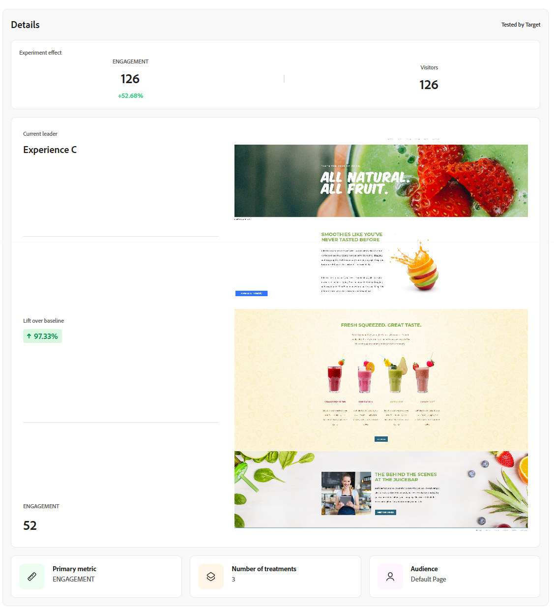
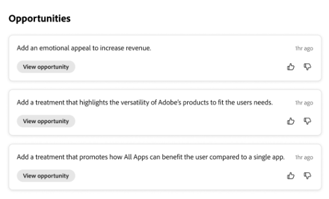
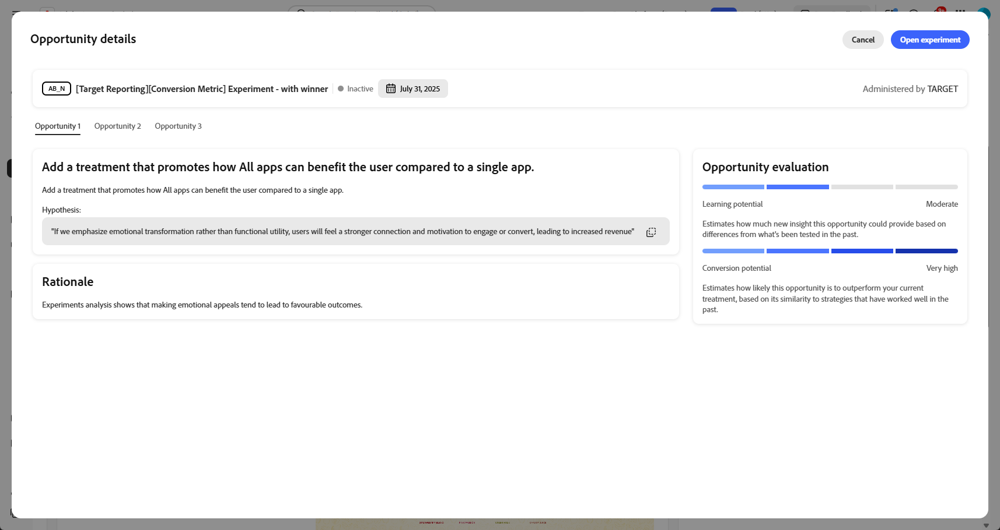
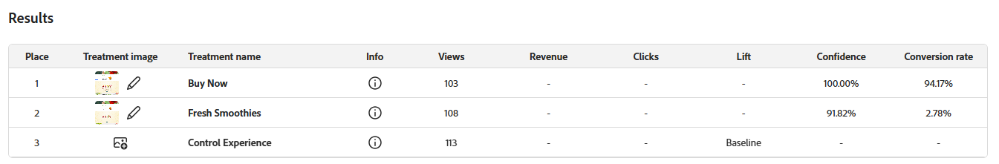
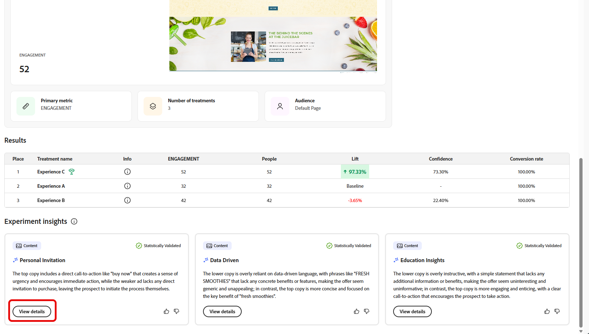

# 追蹤您的實驗 {#monitor}

**[!UICONTROL Experiments]**&#x200B;索引標籤集中了來自Adobe Journey Optimizer和Adobe Target的測試的追蹤和分析。 您可以檢視所有實驗、審查KPI，以及篩選或搜尋以找出特定測試。

## 控制面板 {#dashboard}

存取實驗索引標籤時，Journey Optimizer和Adobe Target中所有可用的實驗都會列在合併檢視中。 這可讓您在一個位置快速檢閱和比較兩個平台的實驗。
實驗清單包括：

* 在行銷活動或歷程中建立的Journey Optimizer實驗。

* 連結至相同IMS組織的Adobe Target生產預設沙箱中可用的Journey Optimizer實驗。

KPI區段提供關鍵量度，包括已建立實驗總數和目前進行中的數量，提供整體實驗活動的快照

按一下存取篩選器，它提供內容特定的選項，例如，依&#x200B;**[!UICONTROL Type]**、**[!UICONTROL Starred]**、**[!UICONTROL Status]**&#x200B;或&#x200B;**[!UICONTROL Source]**&#x200B;篩選。 例如，您可以篩選以僅顯示Journey Optimizer中的作用中實驗。

或者，您可以在搜尋列中鍵入實驗名稱，以快速找到實驗。

## 監視您的實驗 {#monitor-page}

若要存取和監視您的實驗，請從&#x200B;**[!UICONTROL 實驗]**&#x200B;索引標籤中的實驗清單選取您先前設定的實驗，或使用進階功能表來&#x200B;**[!UICONTROL 檢視詳細資料]**&#x200B;或&#x200B;**[!UICONTROL 在來源中開啟]**。

實驗詳細資訊頁面分成以下區段：

* [實驗結果](#experiment-outcome)
* [假設](#hypothesis)
* [詳細資料](#details)
* [機會](#opportunities)
* [結果](#results)
* [實驗中的深入分析](#insights)

### 實驗結果 {#experiment-outcome}

**[!UICONTROL 實驗結果]**&#x200B;可讓您快速檢視實驗中的成功變數。

### 設定 {#set-up}

**[!UICONTROL 假設]**&#x200B;擷取要測試的計畫變更，並記錄對主要量度的預期影響。 定義明確的&#x200B;**[!UICONTROL 假設]**&#x200B;可確保每個實驗都有可測量的目標，更易於評估結果並判斷變更是否帶來有意義的改善。

請注意，若要產生[實驗深入分析](#insights)，您必須確認假設和處理詳細資料，以及要達到的統計顯著性。

1. 按一下「**[!UICONTROL 新增]**」為您的實驗建立&#x200B;**[!UICONTROL 假設]**。

   

1. 輸入您的&#x200B;**[!UICONTROL 假設]**，詳述已進行的變更以及變更將如何影響主要量度。

   按一下&#x200B;**[!UICONTROL 儲存]**。

1. 按一下&#x200B;**[!UICONTROL 檢閱]**&#x200B;以新增或取代每個處理的影像。

   

1. 治療影像會自動產生，但如有需要，您可以選取&#x200B;**[!UICONTROL 新增影像]**&#x200B;或&#x200B;**[!UICONTROL 取代影像]**，以從您的本機檔案上傳您偏好的熒幕擷取畫面以供您的&#x200B;**[!UICONTROL 治療]**&#x200B;使用。

   請注意，熒幕擷圖應該擷取整個頁面。

1. 視需要按一下圖示以更新您的&#x200B;**[!UICONTROL 假設]**。

完成設定&#x200B;**[!UICONTROL 假設]**&#x200B;後，您將獲得寶貴的[見解](#insights)和[機會](#opportunities)。

### 詳細資料 {#details}

**[!UICONTROL 實驗效果]** Widget提供您實驗如何影響目標受眾區段的詳細檢視。 它提供關鍵績效指標，可幫助您評估參與和行為，包括：

* 根據實驗建立期間的設定，Journey Optimizer的&#x200B;**[!UICONTROL 成功量度]**&#x200B;或Adobe Target的&#x200B;**[!UICONTROL 主要量度]**。

* **[!UICONTROL 訪客]**：公開給實驗的不重複訪客總數。

您也可以透過下列量度，檢視領先處理方式的即時快照：

* **[!UICONTROL 目前的領導者]**：識別目前提供最佳效能的處理。

* **[!UICONTROL 提升基線]**：測量前置處理與控制項或基線相比的百分比改善。

* 根據實驗建立期間的設定，Journey Optimizer的&#x200B;**[!UICONTROL 成功量度]**&#x200B;或Adobe Target的&#x200B;**[!UICONTROL 主要量度]**。

在Widget底部，您可以找到實驗設定的簡短摘要，包括：

* 根據實驗建立期間的設定，Journey Optimizer的&#x200B;**[!UICONTROL 成功量度]**&#x200B;或Adobe Target的&#x200B;**[!UICONTROL 主要量度]**。

* **[!UICONTROL 處理數目]**：測試的變異總數。

* **[!UICONTROL 對象]**：實驗期間鎖定的已定義使用者區段。

### 機會 {#opportunities}

>[!AVAILABILITY]
>
>機會功能僅限於文字型變更的實驗。

**[!UICONTROL 機會]**&#x200B;面板會顯示AI產生的建議，這些建議旨在提升測試效能，並符合更廣泛的業務目標和KPI。

請注意，若要產生實驗機會，您首先需要[確認假設和處理詳細資料](#set-up)。

1. 瀏覽建議的機會，然後按一下&#x200B;**[!UICONTROL 檢視機會]**。

   

1. 選取機會會開啟&#x200B;**機會詳細資料**&#x200B;視窗，其中概述Journey Optimizer Experimentation Accelerator建議的特定處理方式或變數。 此檢視包括：

   * **[!UICONTROL 假設]**： AI產生的假設，可說明建議處理的預期結果。

   * **[!UICONTROL 理由]**：說明Journey Optimizer Experimentation Accelerator建議這個機會的原因。

   * **[!UICONTROL 機會評估]**：建議的雙重評估依據：

      * **[!UICONTROL 學習潛力]**：根據和之前測試專案的差異，預估此機會可提供多少新的insight。

      * **[!UICONTROL 轉換潛力]**：根據與過去運作良好的策略的相似性，預估機會勝過目前治療的可能性。
   <!--
   * **[!UICONTROL New text treatment example]**: Words or phrases that demonstrate the style the AI recommends using.
   -->

   

1. 然後，您可以選取&#x200B;**[!UICONTROL 開啟實驗]**，將其直接新增到您的實驗。

1. 如果原始實驗是在Adobe Journey Optimizer中建立和管理的，此動作將會在該行銷活動中開啟&#x200B;**[!UICONTROL 內容實驗面板]**。

   對於源自&#x200B;**[!DNL Adobe Target]**&#x200B;的實驗，建議的變更將載入到&#x200B;**[!DNL Adobe Target]**&#x200B;的實驗工作流程中。

   ➡️ [在Adobe Target檔案中進一步瞭解](https://experienceleague.adobe.com/zh-hant/docs/target/using/activities/abtest/test-ab)

1. 在實驗檢視中，可存取Journey Optimizer Experimentation Accelerator所顯示的相同AI **[!UICONTROL 實驗機會]**。

   選取&#x200B;**[!UICONTROL 檢視]**&#x200B;以開啟商機詳細資料。

1. 若要套用建議的變更，選取&#x200B;**[!UICONTROL 修改實驗]**&#x200B;即可直接編輯現有的實驗。

### 結果 {#results}

**[!UICONTROL 結果]**&#x200B;表格提供實驗內每個處理的詳細效能劃分。 這些指標有助於評估成效、使用者參與度，以及對關鍵業務結果的整體影響：

* **[!UICONTROL 位置]**：根據績效來排名處理的位置，該績效指出處理與其他處理的比較方式。

* 根據實驗建立期間的設定，Journey Optimizer的&#x200B;**[!UICONTROL 成功量度]**&#x200B;或Adobe Target的&#x200B;**[!UICONTROL 主要量度]**。

* **[!UICONTROL 人員]**：符合訊息目標設定檔資格的使用者設定檔數目。

* **[!UICONTROL 提升度]**：測量指定處理的轉換率相對於基準的提升百分比。

* **[!UICONTROL 信賴度]**：指定處理與基準處理相同的證據。 [了解更多](../content-management/experiment-calculations.md#understand-confidence)

* **[!UICONTROL 轉換率]**：在檢視處理之後完成所需動作（例如，購買、註冊）的設定檔百分比。

### 實驗洞察 {#insights}

>[!AVAILABILITY]
>
>Experimentation Insights功能僅限於文字型變更的實驗。

**[!UICONTROL 實驗深入分析]**&#x200B;是從此實驗衍生的AI產生的學習。 當實驗達到統計顯著性並提供促使其成功的內容理解時，這些見解將變為可用。 它們會醒目提示成功處理中呈現的關鍵屬性（與控制項不同），而可能影響結果。

請注意，若要產生實驗深入分析，您首先需要[確認假設和處理詳細資料](#set-up)以及要達到的統計顯著性。

按一下「**[!UICONTROL 檢視詳細資料]**」以進一步瞭解每個深入分析。

 

