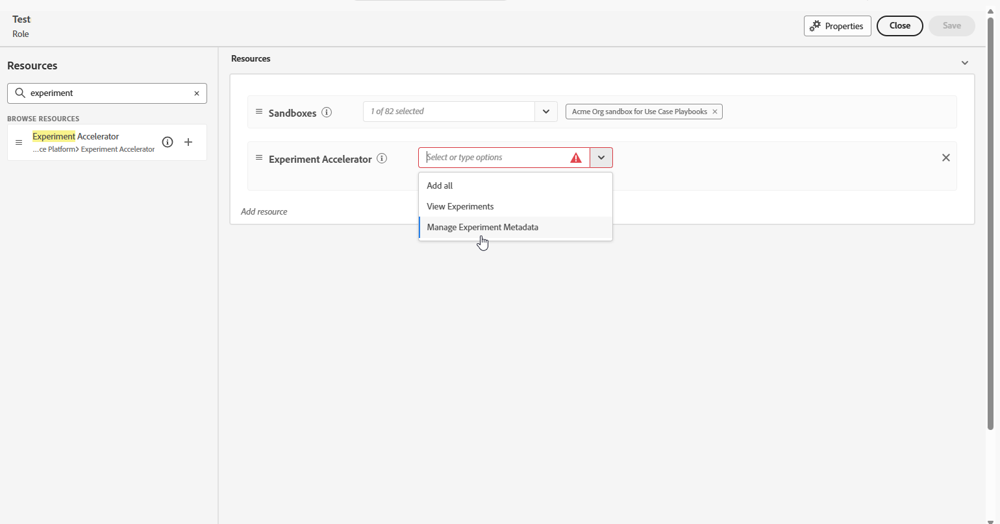

# 開始使用Journey Optimizer Experimentation Accelerator {#content-experiment}

>[!AVAILABILITY]
>
>**Journey Optimizer Experimentation Accelerator**&#x200B;需要付費授權，並且可搭配Adobe Target或Adobe Journey Optimizer使用。

**Journey Optimizer Experimentation Accelerator**&#x200B;是功能強大的工具，專為簡化和增強實驗程式而設計。 透過與Adobe Target和Adobe Journey Optimizer整合，它提供管理、分析和最佳化實驗的集中平台。 Journey Optimizer Experimentation Accelerator可善用AI驅動的深入分析和適應性測試，協助您作出資料導向式決策、改善行銷策略及取得可衡量的結果。

主要優點包括：

* **更快速的實驗**：使用隨時間調整的模型執行最適化、永遠啟動的測試。

* **Unified Platform**：在一個位置管理Adobe Target和Journey Optimizer的所有實驗。

* **AI導向的深入分析**：自動呈現關鍵發現、效能驅動程式和新商機。

* **更聰明的鎖定目標**：使用行為和內容資料來排定高影響力實驗的優先順序。

* **KPI監控**：追蹤跨實驗的提升度和信賴度等量度。

* **順暢的Collaboration**：輕鬆分享結果，並透過即時警示管理團隊角色。

## 存取Journey Optimizer Experimentation Accelerator

在[建立並設定您的實驗](content-experiment.md)並將您的行銷活動或歷程傳送至您的設定檔後，您可以存取&#x200B;**[!UICONTROL Journey Optimizer Experimentation Accelerator]**，以深入瞭解您的實驗如何執行。

您可以從&#x200B;**[!UICONTROL Experimentation]**&#x200B;下拉式清單的左側功能表，或透過Apps切換器存取[!UICONTROL Journey Optimizer Experimentation Accelerator]。 請注意，只有Target授權的使用者只能透過應用程式切換器存取。

可用的實驗取決於您的設定：

* **若為Adobe Journey Optimizer使用者**：在您已啟用組織的沙箱中設定的實驗會自動包含在內。

* **對於具有Journey Optimizer的Adobe Target使用者**： Target中的任何A/B活動都會出現在Journey Optimizer的生產沙箱中的&#x200B;**[!UICONTROL Journey Optimizer Experimentation Accelerator]**。

* **僅適用於Adobe Target使用者**：您Target組織中的所有A/B活動都包含在Journey Optimizer的生產沙箱中。

若要使用&#x200B;**[!UICONTROL Journey Optimizer Experimentation Accelerator]**，您需要存取沙箱以及下列相關許可權：

* **[!UICONTROL 檢視實驗]**
* **[!UICONTROL 管理實驗中繼資料]**

+++ 瞭解如何指派實驗相關許可權

1. 在&#x200B;**[!DNL Permissions]**&#x200B;產品中，移至&#x200B;**[!UICONTROL 角色]**&#x200B;標籤，並選取所需的&#x200B;**[!UICONTROL 角色]**。

1. 按一下&#x200B;**[!UICONTROL 編輯]**&#x200B;以修改權限。

1. 新增&#x200B;**[!UICONTROL 實驗加速器]**&#x200B;資源，然後從下拉式功能表中選取&#x200B;**[!UICONTROL 檢視實驗]**&#x200B;和/或&#x200B;**[!UICONTROL 管理實驗中繼資料]**。

   

1. 按一下&#x200B;**[!UICONTROL 儲存]**，以套用所做的變更。

任何已指派給此角色的使用者都會自動更新其權限。

若要將此角色指派給新使用者：

1. 導覽至[角色]儀表板中的[使用者]索引標籤&#x200B;**&#x200B;**，然後按一下[新增使用者]&#x200B;**&#x200B;**。

1. 輸入使用者的名稱、電子郵件地址，或從清單當中選擇，然後按一下&#x200B;**[!UICONTROL 儲存]**。

   如果之前未建立使用者，請參閱[此文件](https://experienceleague.adobe.com/zh-hant/docs/experience-platform/access-control/abac/permissions-ui/users)。

使用者將會收到一封電子郵件，提供存取執行個體的指示。

+++

<!--table style="table-layout:fixed"><tr style="border: 0;">
<td>

<strong><a href="experiment-accelerator-overview.md">Overview</a></strong>

</td>
<td>

<strong><a href="experiment-accelerator-monitor.md">Experiments</a></strong>

</td>
<td>

<strong><a href="experiment-accelerator-metrics.md">Metrics</a></strong>

</td>
</tr></table-->
